# 交互功能实现

<cite>
**本文档引用的文件**
- [js/main.js](file://js/main.js)
- [js/data.js](file://js/data.js)
- [index.html](file://index.html)
- [category.html](file://category.html)
- [article.html](file://article.html)
- [css/style.css](file://css/style.css)
</cite>

## 目录
1. [简介](#简介)
2. [项目结构](#项目结构)
3. [核心组件](#核心组件)
4. [架构总览](#架构总览)
5. [详细组件分析](#详细组件分析)
6. [依赖关系分析](#依赖关系分析)
7. [性能考虑](#性能考虑)
8. [故障排除指南](#故障排除指南)
9. [结论](#结论)
10. [附录](#附录)

## 简介
本文件面向Hot-Site项目的交互功能实现，聚焦于JavaScript业务逻辑的细节，包括导航栏控制、页面渲染、图片查看器（Lightbox）和滚动处理；同时深入解析搜索功能的算法实现（全文搜索、关键词匹配与结果排序），阐述防抖优化技术的应用，解释事件驱动架构的设计模式（DOM事件监听、状态管理与页面更新机制），说明键盘导航与无障碍访问的实现方法，并提供调试技巧与性能优化建议。文档以循序渐进的方式呈现，既适合初学者理解，也便于有经验的开发者快速定位关键实现点。

## 项目结构
Hot-Site采用“静态HTML + JavaScript模块化”的轻量架构：
- HTML页面负责结构与语义标记，通过data-page属性标识当前页面类型
- js/main.js集中处理页面初始化、事件绑定、UI交互与页面更新
- js/data.js提供数据模型与查询函数（文章、分类、搜索）
- css/style.css提供样式与动画，配合JS实现视觉反馈

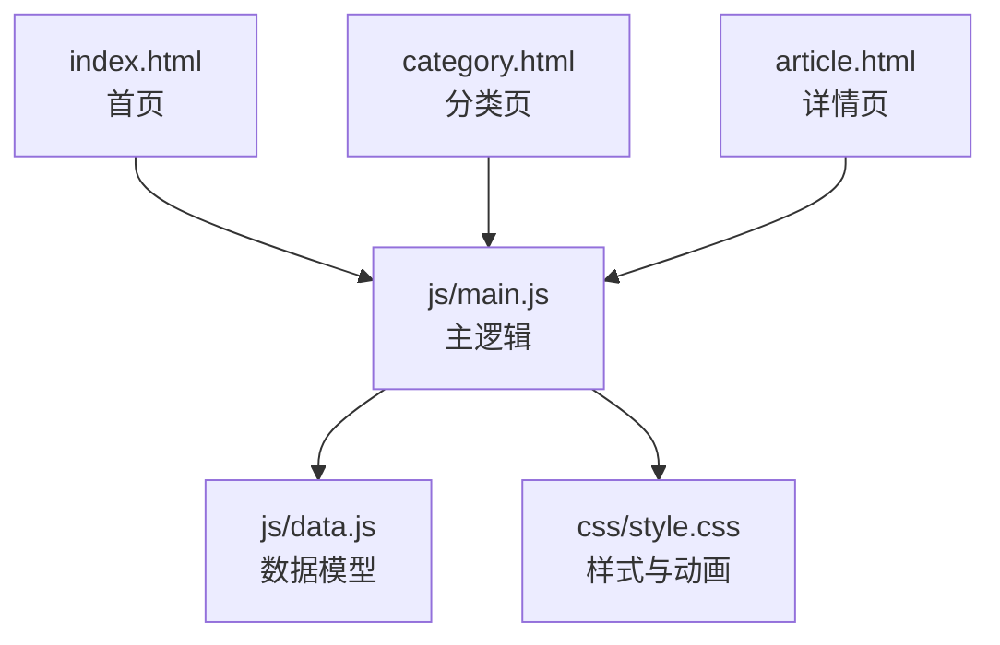

图表来源
- [index.html:29](file://index.html#L29)
- [category.html:27](file://category.html#L27)
- [article.html:27](file://article.html#L27)
- [js/main.js:436-460](file://js/main.js#L436-L460)
- [js/data.js:1-158](file://js/data.js#L1-L158)
- [css/style.css:1-1166](file://css/style.css#L1-L1166)

章节来源
- [index.html:1-190](file://index.html#L1-L190)
- [category.html:1-103](file://category.html#L1-L103)
- [article.html:1-107](file://article.html#L1-L107)
- [js/main.js:1-461](file://js/main.js#L1-L461)
- [js/data.js:1-158](file://js/data.js#L1-L158)
- [css/style.css:1-1166](file://css/style.css#L1-L1166)

## 核心组件
- 全局状态管理：保存当前页面、当前分类、导航栏滚动状态
- 导航栏控制：滚动样式切换、移动端汉堡菜单、菜单项点击关闭
- 页面渲染：文章网格渲染、空状态展示、页面标题与描述动态更新
- 图片查看器（Lightbox）：图片点击放大、ESC关闭、背景遮罩
- 滚动处理：返回顶部按钮显示/隐藏、平滑滚动
- 错误处理：统一错误状态展示与回退
- 页面过渡动画：页面进入动画、卸载淡出
- 数据层：文章元数据、分类配置、搜索算法

章节来源
- [js/main.js:6-11](file://js/main.js#L6-L11)
- [js/main.js:44-77](file://js/main.js#L44-L77)
- [js/main.js:119-146](file://js/main.js#L119-L146)
- [js/main.js:222-243](file://js/main.js#L222-L243)
- [js/main.js:318-371](file://js/main.js#L318-L371)
- [js/main.js:375-403](file://js/main.js#L375-L403)
- [js/main.js:407-420](file://js/main.js#L407-L420)
- [js/main.js:424-432](file://js/main.js#L424-L432)
- [js/data.js:6-37](file://js/data.js#L6-L37)
- [js/data.js:115-145](file://js/data.js#L115-L145)

## 架构总览
Hot-Site采用事件驱动的单页交互模式：
- DOMContentLoaded触发初始化
- 不同页面根据data-page执行对应初始化逻辑
- 事件监听器响应用户操作（点击、滚动、键盘）
- 状态对象驱动UI更新（导航栏样式、按钮可见性、页面标题）
- 数据层提供查询与过滤能力

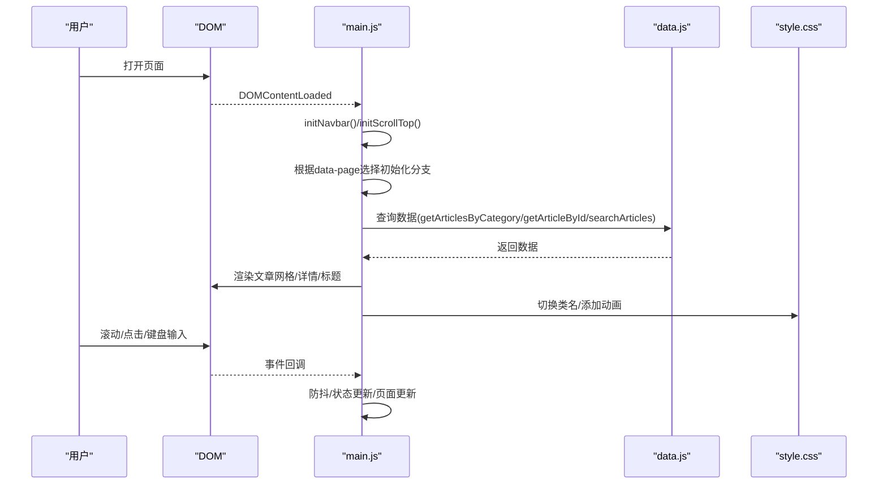

图表来源
- [js/main.js:436-460](file://js/main.js#L436-L460)
- [js/main.js:44-77](file://js/main.js#L44-L77)
- [js/main.js:375-403](file://js/main.js#L375-L403)
- [js/data.js:115-145](file://js/data.js#L115-L145)
- [css/style.css:130-138](file://css/style.css#L130-L138)

## 详细组件分析

### 导航栏控制
- 滚动监听：使用防抖函数在滚动事件中判断是否超过阈值，切换导航栏样式类
- 移动端汉堡菜单：切换菜单展开状态，锁定/释放body滚动
- 菜单项点击：自动收起菜单并恢复body滚动

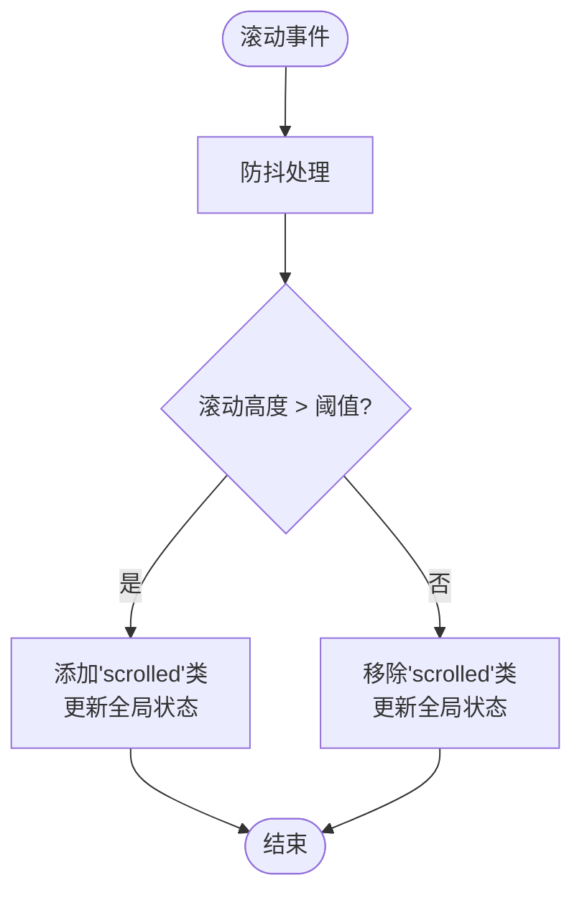

图表来源
- [js/main.js:44-77](file://js/main.js#L44-L77)
- [js/main.js:28-39](file://js/main.js#L28-L39)

章节来源
- [js/main.js:44-77](file://js/main.js#L44-L77)
- [css/style.css:148-165](file://css/style.css#L148-L165)

### 页面渲染与网格布局
- 文章卡片创建：动态生成DOM节点，设置角色、可访问属性、点击跳转
- 文章网格渲染：遍历文章数组，逐个创建卡片并设置入场动画延迟
- 空状态：当无数据时展示占位符
- 键盘支持：卡片可聚焦，Enter/Space键触发跳转

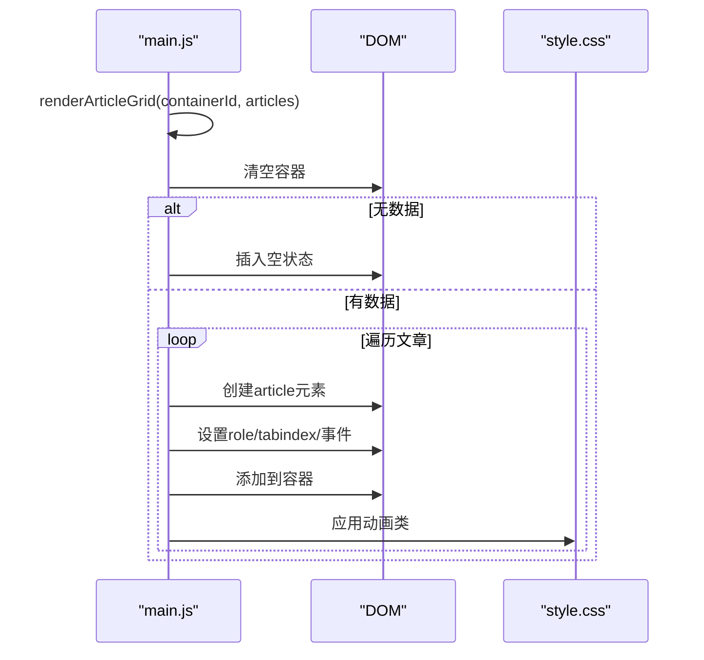

图表来源
- [js/main.js:119-146](file://js/main.js#L119-L146)
- [js/main.js:82-116](file://js/main.js#L82-L116)
- [css/style.css:130-138](file://css/style.css#L130-L138)

章节来源
- [js/main.js:82-116](file://js/main.js#L82-L116)
- [js/main.js:119-146](file://js/main.js#L119-L146)
- [css/style.css:432-548](file://css/style.css#L432-L548)

### 分类筛选与URL同步
- 初始化筛选按钮：基于CATEGORIES配置动态生成按钮
- 点击筛选：更新URL（pushState）、激活按钮、更新页面标题与描述、重新渲染文章网格
- 支持“全部”分类与具体分类

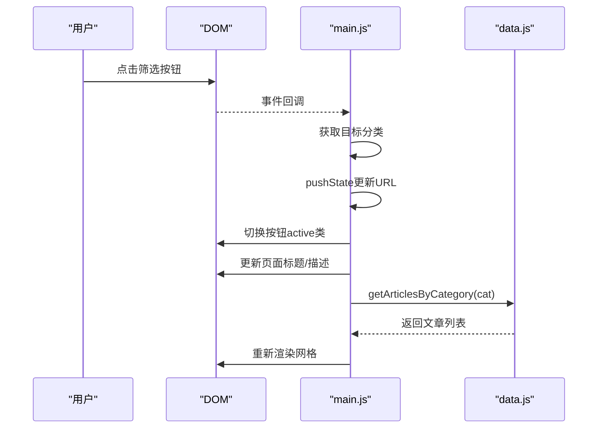

图表来源
- [js/main.js:179-218](file://js/main.js#L179-L218)
- [js/data.js:120-126](file://js/data.js#L120-L126)

章节来源
- [js/main.js:179-218](file://js/main.js#L179-L218)
- [js/data.js:6-37](file://js/data.js#L6-L37)
- [js/data.js:120-126](file://js/data.js#L120-L126)

### 文章详情页与Markdown渲染
- 详情页初始化：读取URL参数、校验文章存在性、更新标题
- 渲染头部与封面：动态插入分类徽章与日期
- Markdown加载：异步fetch内容，使用marked渲染，初始化Lightbox
- 错误处理：网络异常或文件不存在时展示错误状态

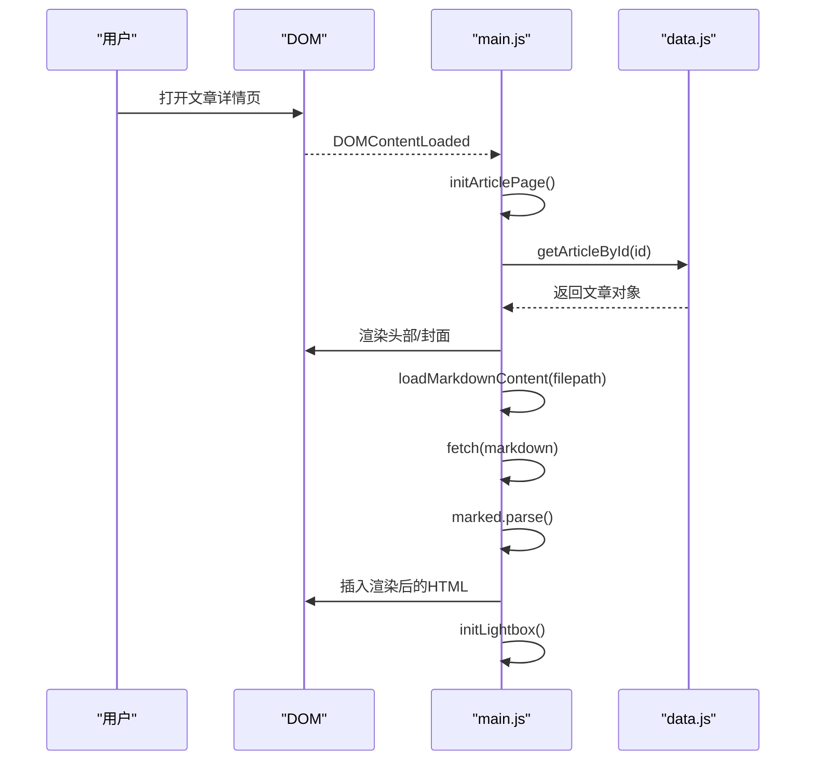

图表来源
- [js/main.js:222-243](file://js/main.js#L222-L243)
- [js/main.js:246-269](file://js/main.js#L246-L269)
- [js/main.js:272-314](file://js/main.js#L272-L314)
- [js/data.js:115-118](file://js/data.js#L115-L118)

章节来源
- [js/main.js:222-243](file://js/main.js#L222-L243)
- [js/main.js:246-269](file://js/main.js#L246-L269)
- [js/main.js:272-314](file://js/main.js#L272-L314)
- [js/data.js:115-118](file://js/data.js#L115-L118)

### 图片查看器（Lightbox）
- 图片点击：为页面内所有图片绑定点击事件，触发放大
- Lightbox创建：首次打开时动态创建遮罩层与图片元素
- 关闭机制：点击遮罩或按ESC键关闭
- 视觉反馈：使用requestAnimationFrame确保动画流畅，锁定body滚动

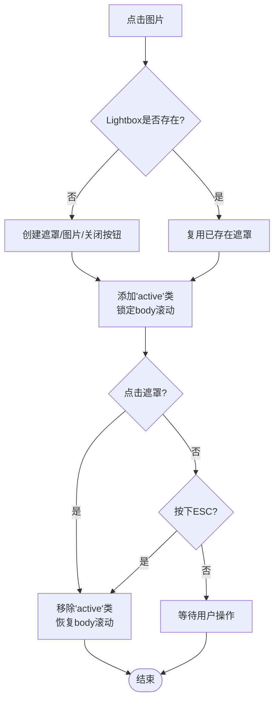

图表来源
- [js/main.js:318-371](file://js/main.js#L318-L371)
- [css/style.css:881-932](file://css/style.css#L881-L932)

章节来源
- [js/main.js:318-371](file://js/main.js#L318-L371)
- [css/style.css:881-932](file://css/style.css#L881-L932)

### 滚动处理与返回顶部
- 返回顶部按钮：动态创建，滚动超过阈值显示，点击平滑滚动至顶部
- 滚动监听：使用防抖减少高频事件对性能的影响

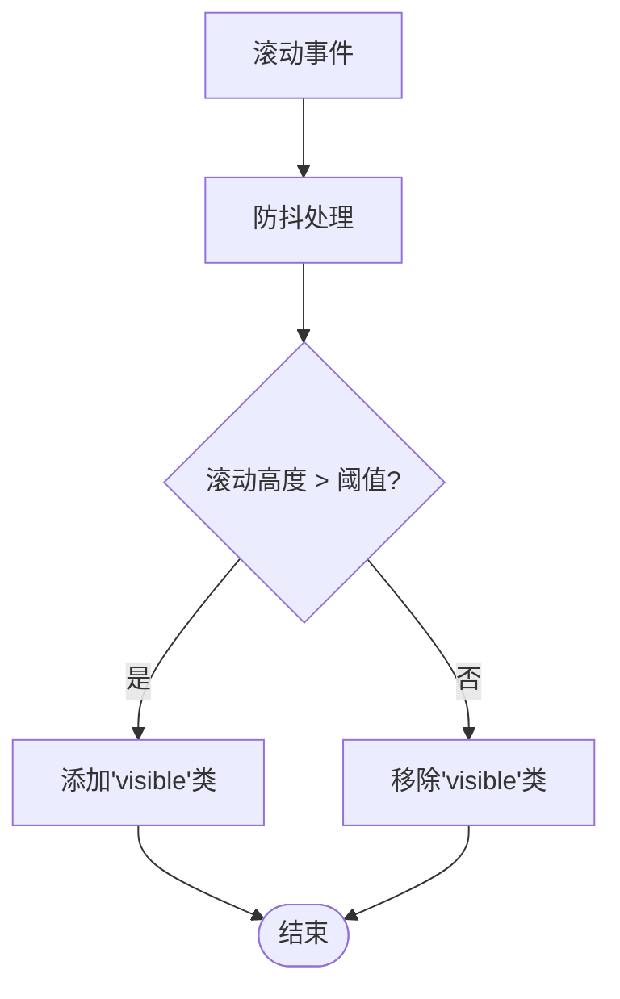

图表来源
- [js/main.js:375-403](file://js/main.js#L375-L403)
- [js/main.js:28-39](file://js/main.js#L28-L39)
- [css/style.css:1122-1153](file://css/style.css#L1122-L1153)

章节来源
- [js/main.js:375-403](file://js/main.js#L375-L403)
- [css/style.css:1122-1153](file://css/style.css#L1122-L1153)

### 搜索功能算法实现
- 全文搜索：对标题与摘要进行小写化比较
- 关键词匹配：使用字符串包含判断
- 结果排序：当前实现为线性过滤，未引入评分排序
- 性能建议：可引入前缀索引、分词与TF-IDF评分

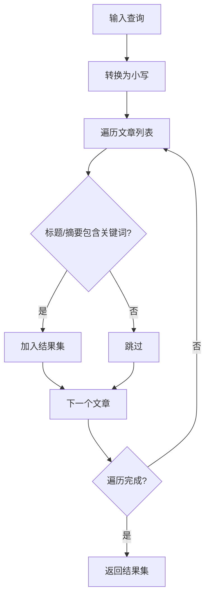

图表来源
- [js/data.js:139-145](file://js/data.js#L139-L145)

章节来源
- [js/data.js:139-145](file://js/data.js#L139-L145)

### 防抖优化技术
- 防抖函数：在指定时间窗口内仅执行最后一次调用
- 应用场景：滚动事件（导航栏样式切换、返回顶部按钮显示）、窗口大小变化
- 性能收益：显著降低事件回调频率，避免频繁DOM操作与重绘

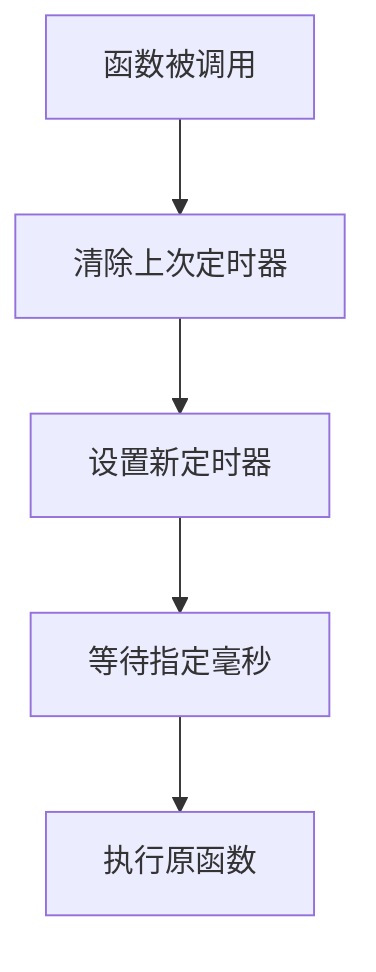

图表来源
- [js/main.js:28-39](file://js/main.js#L28-L39)
- [js/main.js:50-58](file://js/main.js#L50-L58)
- [js/main.js:388-394](file://js/main.js#L388-L394)

章节来源
- [js/main.js:28-39](file://js/main.js#L28-L39)
- [js/main.js:50-58](file://js/main.js#L50-L58)
- [js/main.js:388-394](file://js/main.js#L388-L394)

### 事件驱动架构与状态管理
- 事件监听：DOM事件（点击、滚动、键盘）与浏览器事件（beforeunload）
- 状态管理：全局state对象存储当前页面、分类、导航栏滚动状态
- 页面更新：根据状态与数据层结果更新DOM与类名

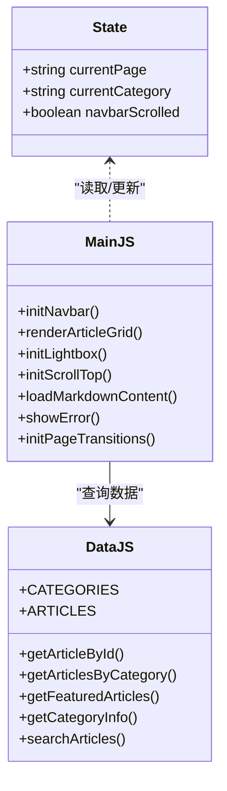

图表来源
- [js/main.js:6-11](file://js/main.js#L6-L11)
- [js/main.js:436-460](file://js/main.js#L436-L460)
- [js/data.js:6-37](file://js/data.js#L6-L37)

章节来源
- [js/main.js:6-11](file://js/main.js#L6-L11)
- [js/main.js:436-460](file://js/main.js#L436-L460)
- [js/data.js:6-37](file://js/data.js#L6-L37)

### 键盘导航与无障碍访问
- 文章卡片：设置tabindex=0，支持Enter/Space触发跳转
- 导航栏：使用ARIA标签（role、aria-label、aria-expanded）
- 页面结构：使用语义化标签（nav、main、footer、section、header）

章节来源
- [js/main.js:106-113](file://js/main.js#L106-L113)
- [index.html:31-51](file://index.html#L31-L51)
- [category.html:29-50](file://category.html#L29-L50)
- [article.html:29-50](file://article.html#L29-L50)

## 依赖关系分析
- 页面到逻辑：各HTML页面通过data-page属性与main.js建立映射
- 逻辑到数据：main.js依赖data.js提供的查询与配置
- 样式到交互：CSS类名与JS类名切换相互配合，实现视觉反馈

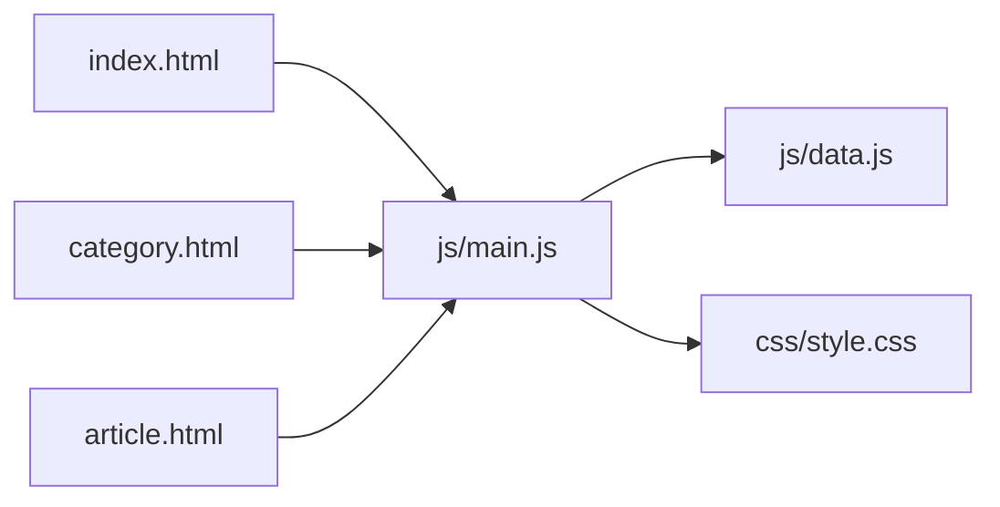

图表来源
- [index.html:29](file://index.html#L29)
- [category.html:27](file://category.html#L27)
- [article.html:27](file://article.html#L27)
- [js/main.js:436-460](file://js/main.js#L436-L460)
- [js/data.js:1-158](file://js/data.js#L1-L158)
- [css/style.css:1-1166](file://css/style.css#L1-L1166)

章节来源
- [index.html:29](file://index.html#L29)
- [category.html:27](file://category.html#L27)
- [article.html:27](file://article.html#L27)
- [js/main.js:436-460](file://js/main.js#L436-L460)
- [js/data.js:1-158](file://js/data.js#L1-L158)
- [css/style.css:1-1166](file://css/style.css#L1-L1166)

## 性能考虑
- 防抖与节流：在滚动、窗口变化等高频事件中使用防抖，减少回调次数
- 请求动画帧：Lightbox显示使用requestAnimationFrame确保动画流畅
- 懒加载与占位：图片使用loading="lazy/eager"，Skeleton占位可进一步优化
- DOM最小化：批量更新DOM，避免重复查询与多次重排
- 资源加载：Markdown渲染器marked.js使用CDN异步加载，不影响首屏

章节来源
- [js/main.js:28-39](file://js/main.js#L28-L39)
- [js/main.js:359-361](file://js/main.js#L359-L361)
- [article.html:22](file://article.html#L22)

## 故障排除指南
- 文章未找到：检查URL参数id与数据层getArticleById返回值
- Markdown加载失败：确认文件路径正确、marked可用、网络请求成功
- Lightbox无法关闭：检查事件监听是否绑定、ESC键监听是否生效
- 分类筛选无效：确认pushState更新URL、按钮active类切换、文章列表重新渲染
- 键盘导航失效：检查tabindex与keydown事件绑定

章节来源
- [js/main.js:222-243](file://js/main.js#L222-L243)
- [js/main.js:272-314](file://js/main.js#L272-L314)
- [js/main.js:349-353](file://js/main.js#L349-L353)
- [js/main.js:194-217](file://js/main.js#L194-L217)
- [js/main.js:106-113](file://js/main.js#L106-L113)

## 结论
Hot-Site的交互功能以简洁的事件驱动架构为核心，结合防抖优化与无障碍设计，提供了流畅且可访问的用户体验。数据层与视图层分离清晰，便于扩展与维护。未来可在搜索算法、图片懒加载与性能监控方面进一步优化，以提升复杂场景下的表现。

## 附录
- 使用场景示例
  - 首页：渲染精选文章，支持滚动导航栏样式切换与返回顶部
  - 分类页：按分类筛选文章，动态更新页面标题与URL
  - 详情页：加载Markdown内容，支持图片Lightbox与返回顶部
- 调试技巧
  - 使用浏览器开发者工具观察事件绑定与类名切换
  - 在滚动事件中打断点验证防抖效果
  - 检查网络面板确认Markdown文件加载状态
  - 使用ARIA工具验证可访问性标签