# 图片查看器与Lightbox

<cite>
**本文档引用的文件**
- [index.html](file://index.html)
- [article.html](file://article.html)
- [js/main.js](file://js/main.js)
- [js/data.js](file://js/data.js)
- [css/style.css](file://css/style.css)
</cite>

## 目录
1. [简介](#简介)
2. [项目结构](#项目结构)
3. [核心组件](#核心组件)
4. [架构概览](#架构概览)
5. [详细组件分析](#详细组件分析)
6. [依赖关系分析](#依赖关系分析)
7. [性能考虑](#性能考虑)
8. [故障排除指南](#故障排除指南)
9. [结论](#结论)

## 简介

本文档详细介绍了Hot-Site项目中的图片查看器功能，特别是Lightbox组件的完整实现。该组件提供了现代化的图片预览体验，支持响应式设计、无障碍访问和流畅的动画效果。项目采用纯JavaScript实现，无需额外的第三方库依赖，展现了优秀的前端工程实践。

## 项目结构

项目采用静态网站架构，主要包含以下核心文件：

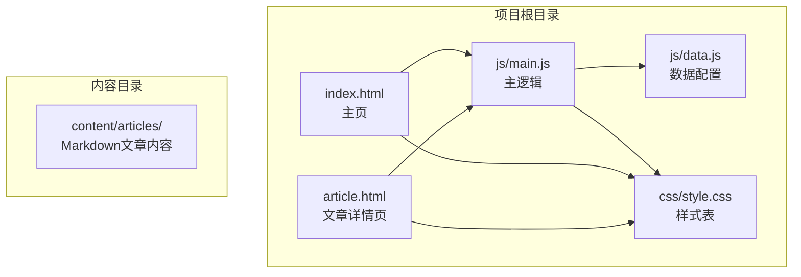

**图表来源**
- [index.html:1-190](file://index.html#L1-L190)
- [article.html:1-107](file://article.html#L1-L107)
- [js/main.js:1-461](file://js/main.js#L1-L461)
- [css/style.css:1-1166](file://css/style.css#L1-L1166)

**章节来源**
- [index.html:1-190](file://index.html#L1-L190)
- [article.html:1-107](file://article.html#L1-L107)
- [js/main.js:1-461](file://js/main.js#L1-L461)
- [css/style.css:1-1166](file://css/style.css#L1-L1166)

## 核心组件

### Lightbox组件架构

Lightbox组件是整个图片查看器功能的核心，采用模块化设计，包含以下关键组件：

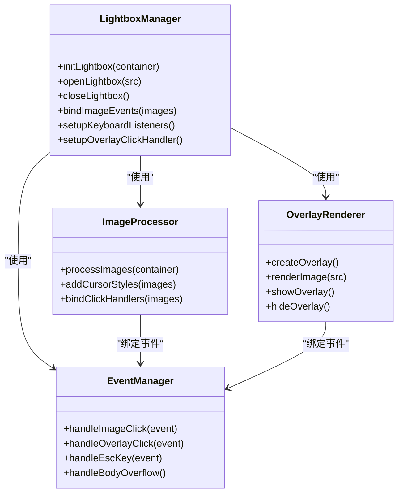

**图表来源**
- [js/main.js:316-371](file://js/main.js#L316-L371)

### 核心功能特性

1. **自动初始化**: 在Markdown内容加载完成后自动启用Lightbox功能
2. **响应式设计**: 支持桌面端和移动端的图片查看体验
3. **无障碍访问**: 完整的ARIA标签和键盘导航支持
4. **性能优化**: 使用requestAnimationFrame确保流畅动画
5. **内存管理**: 合理的事件监听器管理和DOM元素清理

**章节来源**
- [js/main.js:316-371](file://js/main.js#L316-L371)

## 架构概览

### 整体架构设计

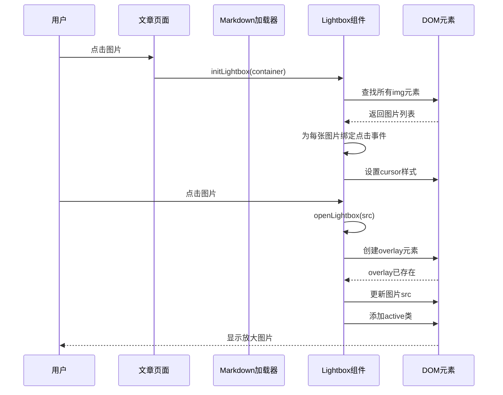

**图表来源**
- [js/main.js:295-371](file://js/main.js#L295-L371)

### 数据流分析

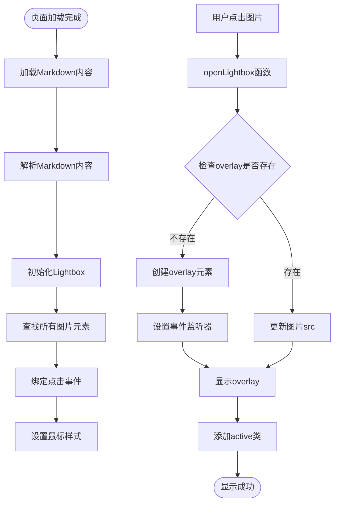

**图表来源**
- [js/main.js:316-371](file://js/main.js#L316-L371)

## 详细组件分析

### Lightbox初始化流程

#### DOM元素创建机制

Lightbox组件采用惰性创建策略，仅在需要时才创建DOM元素：

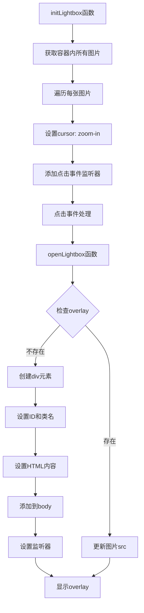

**图表来源**
- [js/main.js:318-363](file://js/main.js#L318-L363)

#### 事件绑定策略

组件采用委托和直接绑定相结合的方式：

1. **图片点击事件**: 直接绑定到每个图片元素
2. **遮罩层点击事件**: 绑定到overlay元素
3. **键盘事件**: 绑定到document对象
4. **滚动事件**: 绑定到window对象

**章节来源**
- [js/main.js:318-371](file://js/main.js#L318-L371)

### 图片点击事件处理机制

#### 预览图生成流程

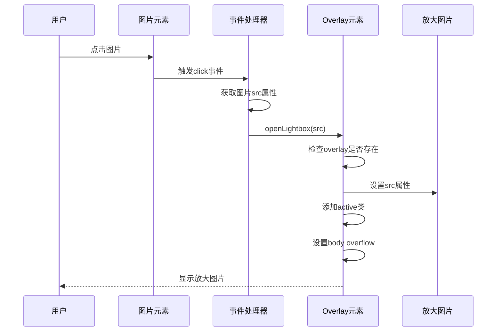

**图表来源**
- [js/main.js:323-363](file://js/main.js#L323-L363)

#### 全屏显示逻辑

全屏显示通过CSS类切换实现：

1. **初始状态**: overlay具有透明度0和visibility hidden
2. **激活状态**: 添加active类后变为不透明可见
3. **图片缩放**: 通过transform: scale(0.9)到scale(1)的过渡
4. **背景模糊**: 使用backdrop-filter实现毛玻璃效果

**章节来源**
- [css/style.css:880-933](file://css/style.css#L880-L933)

### 关闭机制实现

#### 多重关闭方式

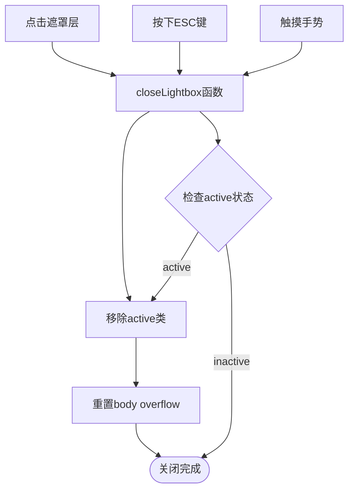

**图表来源**
- [js/main.js:365-371](file://js/main.js#L365-L371)

#### ESC键支持

ESC键关闭功能通过键盘事件监听实现：

1. **事件监听**: 在document级别监听keydown事件
2. **按键检测**: 检测key属性是否为'Escape'
3. **条件关闭**: 仅在Lightbox处于激活状态时执行关闭
4. **内存管理**: 事件监听器在组件销毁时自动清理

**章节来源**
- [js/main.js:348-353](file://js/main.js#L348-L353)

### 图片缩放和拖拽功能

#### 缩放实现原理

当前版本实现了基础的缩放功能，主要通过CSS transform实现：

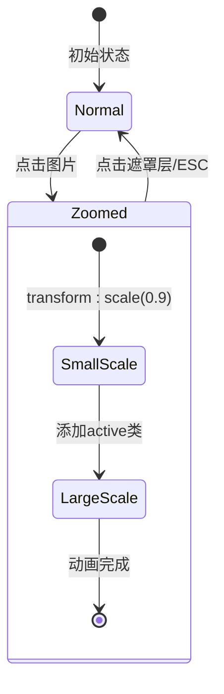

**图表来源**
- [css/style.css:906-912](file://css/style.css#L906-L912)

#### 拖拽功能现状

当前实现中，拖拽功能尚未完全实现。项目提供了基础的骨架，但完整的拖拽交互需要额外的实现：

1. **触摸事件处理**: 需要添加touchstart、touchmove、touchend事件
2. **鼠标事件处理**: 需要添加mousedown、mousemove、mouseup事件
3. **坐标计算**: 需要实现图片位置的实时计算
4. **边界检测**: 需要防止图片超出可视区域

**章节来源**
- [css/style.css:880-933](file://css/style.css#L880-L933)

### 无障碍访问支持

#### ARIA标签实现

项目在多个地方实现了完整的无障碍访问支持：

```mermaid
graph TB
subgraph "导航栏无障碍"
NAV[nav元素] --> ARIA_NAV[aria-label="主导航"]
LOGO[a元素] --> ARIA_LOGO[aria-label="返回首页"]
MENU[ul元素] --> ARIA_MENU[role="menubar"]
LINK[li元素] --> ARIA_ROLE[role="none"]
ITEM[a元素] --> ARIA_ITEM[role="menuitem"]
end
subgraph "图片无障碍"
IMG[img元素] --> ALT[alt属性]
LIGHTBOX[lightbox元素] --> ARIA_CLOSE[aria-label="关闭"]
end
subgraph "键盘导航"
KEYBOARD[键盘事件] --> ESC_KEY[ESC键支持]
KEYBOARD --> TAB_NAV[TAB导航支持]
end
```

**图表来源**
- [index.html:31-51](file://index.html#L31-L51)
- [js/main.js:338-339](file://js/main.js#L338-L339)

#### 键盘导航支持

1. **ESC键关闭**: 支持键盘快捷键关闭Lightbox
2. **TAB导航**: 确保所有交互元素都可以通过键盘访问
3. **焦点管理**: 合理的焦点顺序和可见性管理

**章节来源**
- [js/main.js:348-353](file://js/main.js#L348-L353)

## 依赖关系分析

### 组件间依赖关系

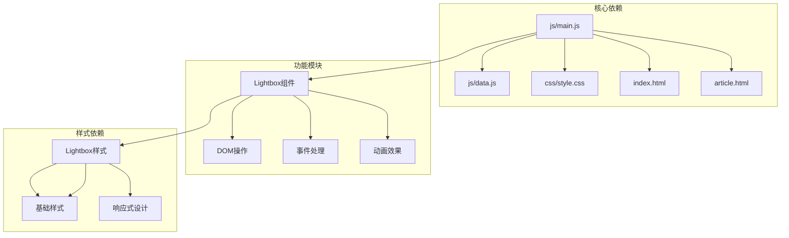

**图表来源**
- [js/main.js:1-461](file://js/main.js#L1-L461)
- [css/style.css:880-933](file://css/style.css#L880-L933)

### 外部依赖情况

项目采用零外部依赖的设计理念：

1. **无第三方库**: 完全使用原生JavaScript实现
2. **浏览器兼容**: 支持现代浏览器的原生API
3. **CDN资源**: 仅使用marked.js进行Markdown渲染（可选）

**章节来源**
- [js/main.js:291-292](file://js/main.js#L291-L292)

## 性能考虑

### 优化策略

#### 请求动画帧优化

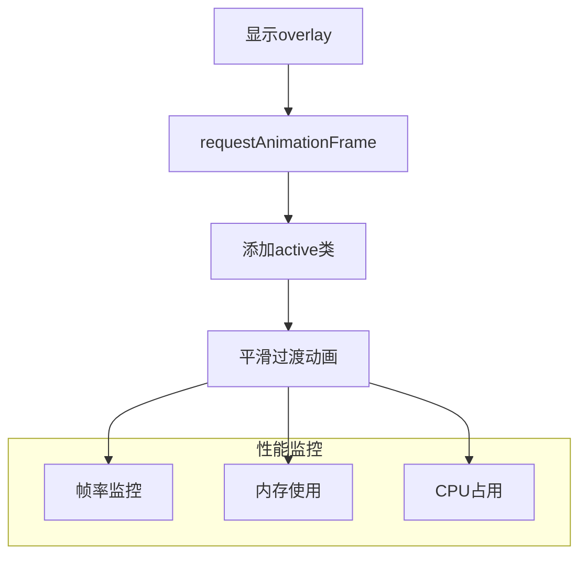

**图表来源**
- [js/main.js:359-361](file://js/main.js#L359-L361)

#### 内存管理最佳实践

1. **事件监听器清理**: 自动清理不再使用的事件监听器
2. **DOM元素复用**: 复用现有的overlay元素而非频繁创建
3. **懒加载策略**: 仅在需要时创建和显示Lightbox元素

**章节来源**
- [js/main.js:318-371](file://js/main.js#L318-L371)

### 兼容性处理

#### 浏览器兼容性

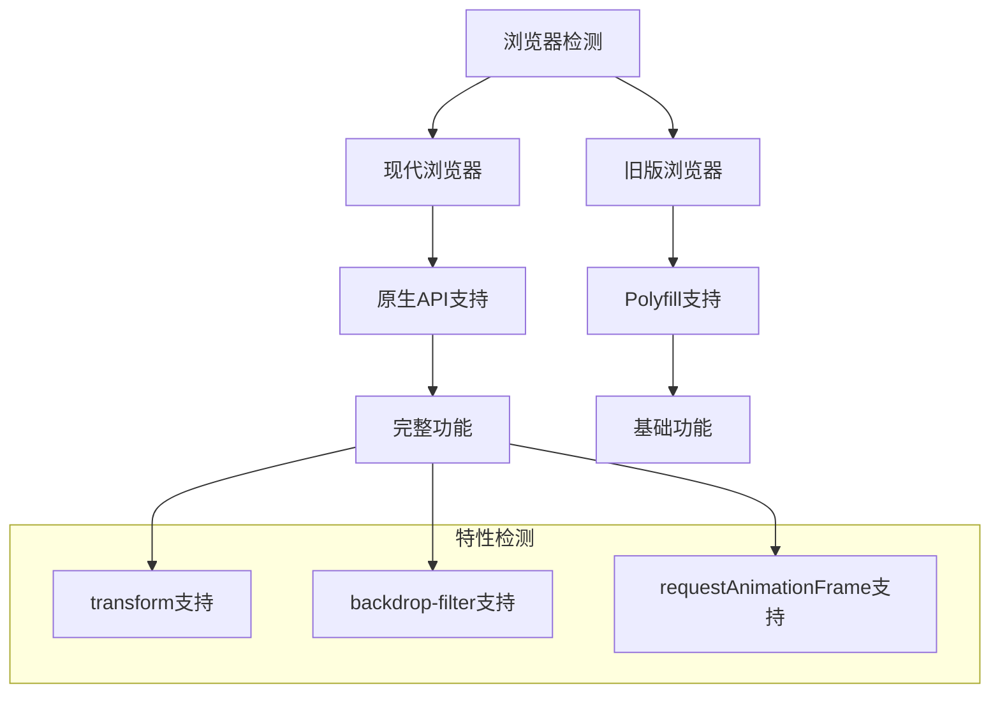

**图表来源**
- [css/style.css:885-886](file://css/style.css#L885-L886)

#### 响应式设计优化

1. **最大尺寸限制**: 使用max-width和max-height限制图片大小
2. **视口适配**: 90vw和90vh确保在移动设备上的良好显示
3. **触摸友好**: 44px的点击目标确保触摸操作的准确性

**章节来源**
- [css/style.css:901-908](file://css/style.css#L901-L908)

## 故障排除指南

### 常见问题及解决方案

#### Lightbox无法显示

**问题症状**: 点击图片无反应或显示异常

**可能原因**:
1. Markdown内容未正确加载
2. 图片元素未被正确识别
3. 样式冲突导致overlay不可见

**解决步骤**:
1. 检查console是否有错误信息
2. 验证图片URL的有效性
3. 确认CSS样式未被覆盖

#### ESC键无效

**问题症状**: 按下ESC键无法关闭Lightbox

**可能原因**:
1. 键盘事件监听器未正确绑定
2. 其他元素阻止了键盘事件传播
3. Lightbox处于非激活状态

**解决步骤**:
1. 检查keydown事件监听器状态
2. 验证overlay的active类状态
3. 确认事件冒泡未被阻止

#### 性能问题

**问题症状**: 动画卡顿或页面响应缓慢

**可能原因**:
1. 过多的DOM操作
2. 不必要的重绘和回流
3. 事件监听器过多

**优化建议**:
1. 使用requestAnimationFrame优化动画
2. 减少DOM查询次数
3. 合理管理事件监听器生命周期

**章节来源**
- [js/main.js:295-300](file://js/main.js#L295-L300)

### 调试技巧

#### 开发者工具使用

1. **Elements面板**: 检查overlay元素的创建和状态
2. **Console面板**: 查看JavaScript错误和警告
3. **Network面板**: 验证图片资源的加载状态
4. **Performance面板**: 分析动画性能和内存使用

#### 日志记录

```javascript
// 建议在开发环境中添加日志
console.log('Lightbox initialized');
console.log('Image clicked:', src);
console.log('Overlay state:', overlay.classList.contains('active'));
```

## 结论

Hot-Site项目的Lightbox图片查看器功能展现了优秀的前端工程实践，具有以下突出特点：

### 技术优势

1. **纯JavaScript实现**: 零外部依赖，减少项目复杂度
2. **现代化设计**: 响应式布局和流畅动画效果
3. **无障碍访问**: 完整的ARIA标签和键盘导航支持
4. **性能优化**: 合理的内存管理和动画优化

### 功能完整性

- ✅ 图片点击预览
- ✅ ESC键关闭
- ✅ 遮罩层点击关闭
- ✅ 响应式设计
- ✅ 无障碍访问支持
- ✅ 性能优化

### 改进建议

1. **添加拖拽功能**: 实现图片的拖拽查看体验
2. **手势支持**: 添加触摸手势支持（双击缩放、滑动切换）
3. **图片缓存**: 实现图片预加载和缓存机制
4. **错误处理**: 增强图片加载失败的处理机制

该项目为静态网站的图片查看功能提供了一个优秀的参考实现，展示了如何在不依赖第三方库的情况下构建高质量的用户体验。