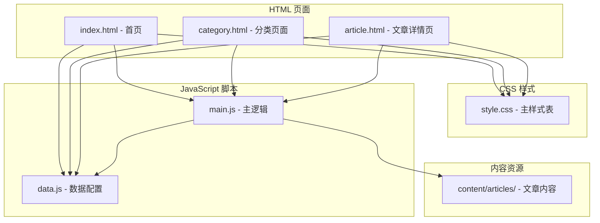
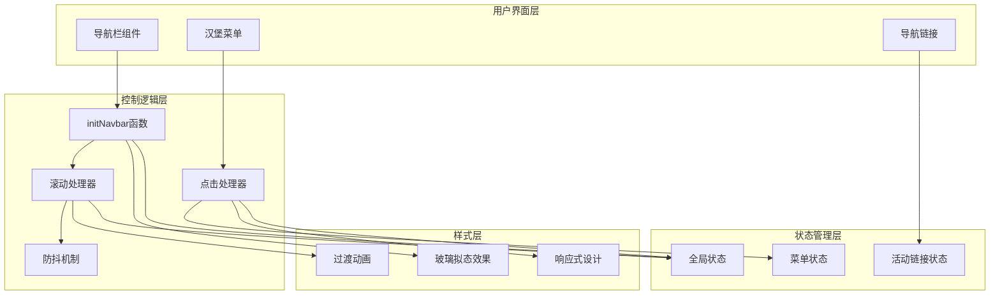
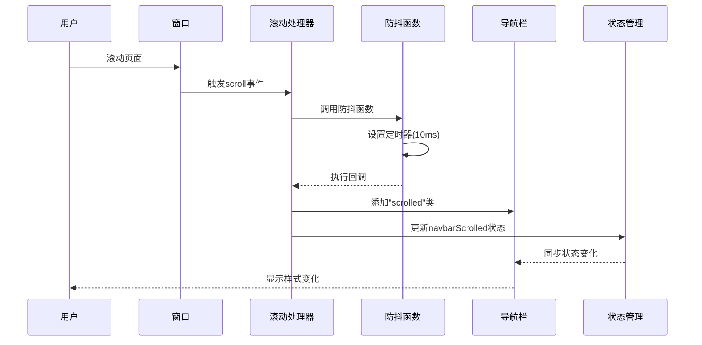
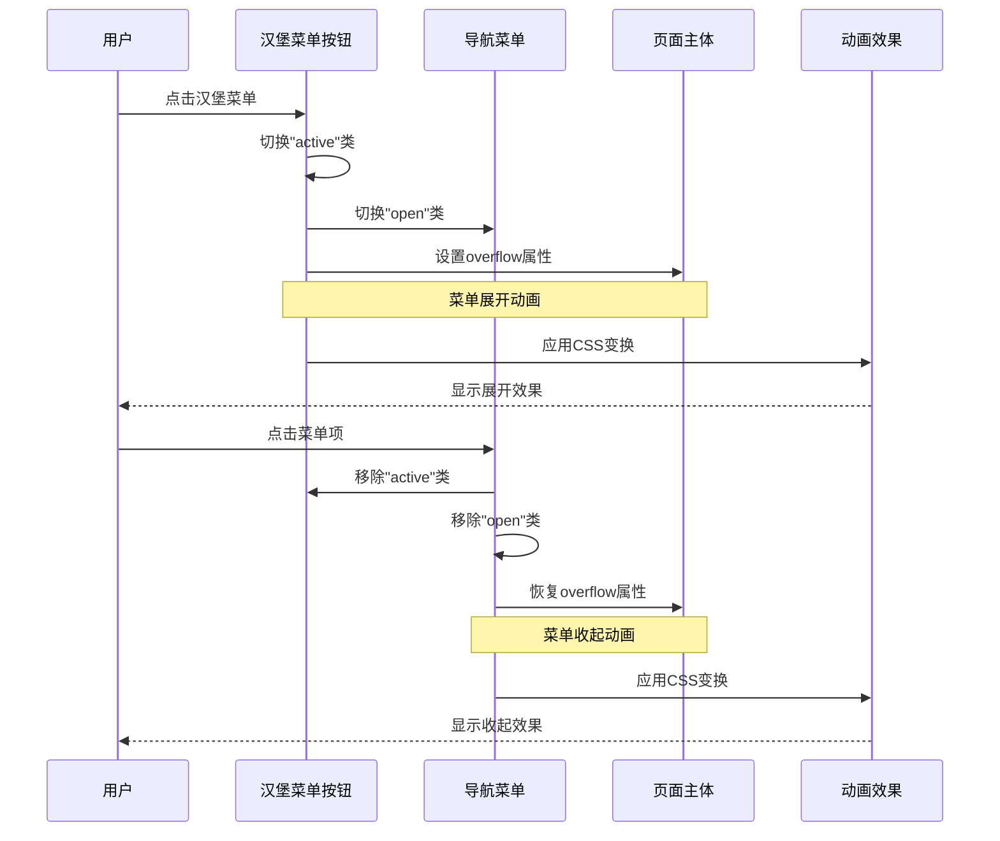
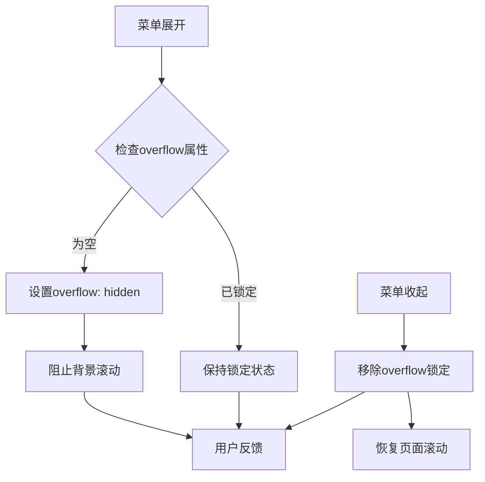
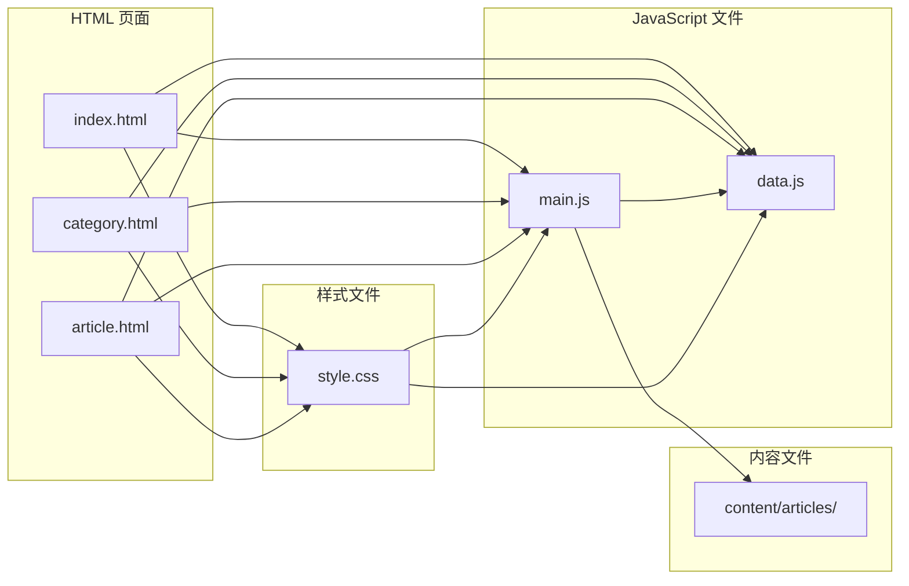

# 导航栏控制

<cite>
**本文档引用的文件**
- [index.html](file://index.html)
- [category.html](file://category.html)
- [article.html](file://article.html)
- [style.css](file://css/style.css)
- [main.js](file://js/main.js)
- [data.js](file://js/data.js)
</cite>

## 目录
1. [简介](#简介)
2. [项目结构](#项目结构)
3. [核心组件](#核心组件)
4. [架构概览](#架构概览)
5. [详细组件分析](#详细组件分析)
6. [依赖关系分析](#依赖关系分析)
7. [性能考虑](#性能考虑)
8. [故障排除指南](#故障排除指南)
9. [结论](#结论)

## 简介

本项目是一个现代化的静态网站，采用玻璃拟态设计风格，专注于技术、AI、游戏、音乐与艺术领域的知识分享。导航栏控制功能是整个网站交互体验的核心组成部分，实现了响应式设计、滚动监听、移动端汉堡菜单以及无障碍访问支持。

导航栏控制功能包含以下关键特性：
- 滚动监听与样式切换
- 防抖处理机制
- 移动端响应式导航
- 汉堡菜单动画效果
- body滚动锁定机制
- 键盘导航支持
- 无障碍访问优化

## 项目结构

该项目采用静态网站架构，主要文件组织如下：



**图表来源**
- [index.html:1-190](file://index.html#L1-L190)
- [category.html:1-103](file://category.html#L1-L103)
- [article.html:1-107](file://article.html#L1-L107)

**章节来源**
- [index.html:1-190](file://index.html#L1-L190)
- [category.html:1-103](file://category.html#L1-L103)
- [article.html:1-107](file://article.html#L1-L107)

## 核心组件

导航栏控制功能由多个核心组件协同工作，形成完整的交互体系：

### 导航栏结构组件
- **navbar**: 固定定位的导航容器，支持玻璃拟态效果
- **nav-container**: 导航栏内部容器，负责布局管理
- **nav-logo**: 网站标识，包含图标和品牌名称
- **hamburger**: 移动端汉堡菜单按钮
- **nav-menu**: 导航菜单，包含多个导航链接

### 样式控制组件
- **navbar.scrolled**: 滚动时的样式状态类
- **hamburger.active**: 汉堡菜单激活状态
- **nav-menu.open**: 菜单展开状态
- **nav-link.active**: 当前页面链接高亮状态

### JavaScript 控制组件
- **initNavbar()**: 导航栏初始化函数
- **debounce()**: 防抖函数，优化滚动性能
- **state**: 全局状态管理对象

**章节来源**
- [style.css:147-258](file://css/style.css#L147-L258)
- [main.js:6-11](file://js/main.js#L6-L11)
- [main.js:43-77](file://js/main.js#L43-L77)

## 架构概览

导航栏控制系统的整体架构采用模块化设计，各组件职责明确，耦合度低：



**图表来源**
- [main.js:43-77](file://js/main.js#L43-L77)
- [style.css:147-258](file://css/style.css#L147-L258)

## 详细组件分析

### 滚动监听与样式切换

导航栏的滚动监听功能通过事件监听器实现，当用户滚动页面超过特定阈值时，自动切换导航栏的视觉状态。

#### 实现机制



**图表来源**
- [main.js:49-58](file://js/main.js#L49-L58)
- [main.js:28-39](file://js/main.js#L28-L39)

#### 样式切换逻辑

导航栏在不同状态下具有不同的视觉表现：

| 状态 | 类名 | 视觉效果 | 触发条件 |
|------|------|----------|----------|
| 默认状态 | 无特殊类 | 半透明玻璃背景 | 滚动位置 ≤ 50px |
| 滚动状态 | `.navbar.scrolled` | 不透明白色背景 | 滚动位置 > 50px |
| 活跃状态 | `.nav-link.active` | 高亮显示当前页面 | 当前页面匹配链接 |

**章节来源**
- [main.js:49-58](file://js/main.js#L49-L58)
- [style.css:161-165](file://css/style.css#L161-L165)

### 防抖处理机制

为了优化滚动性能，系统采用了防抖技术，避免频繁的DOM操作导致的性能问题。

#### 防抖算法实现

```mermaid
flowchart TD
Start([开始滚动]) --> CheckTimeout{是否有待执行任务?}
CheckTimeout --> |是| ClearTimeout[清除现有定时器]
CheckTimeout --> |否| SetTimer[设置新定时器]
ClearTimeout --> SetTimer
SetTimer --> Wait[等待10ms]
Wait --> Execute[执行回调函数]
Execute --> AddClass[添加"scrolled"类]
AddClass --> UpdateState[更新全局状态]
UpdateState --> End([结束])
Wait --> |用户继续滚动| CheckTimeout
```

**图表来源**
- [main.js:28-39](file://js/main.js#L28-L39)

#### 性能优化效果

防抖机制的主要优势：
- **减少重绘次数**: 将多次滚动事件合并为一次处理
- **提升流畅度**: 避免滚动过程中的卡顿现象
- **节省资源**: 减少不必要的DOM操作和样式计算

**章节来源**
- [main.js:28-39](file://js/main.js#L28-L39)

### 移动端汉堡菜单

汉堡菜单是响应式设计的重要组成部分，为移动设备提供了紧凑的导航解决方案。

#### 菜单展开收起流程



**图表来源**
- [main.js:60-76](file://js/main.js#L60-L76)

#### 汉堡菜单动画效果

汉堡菜单的动画效果通过CSS变换实现，包含三个独立的线条元素：

| 线条元素 | 默认状态 | 激活状态 | CSS变换 |
|----------|----------|----------|---------|
| 第1根线条 | 水平 | 旋转45°并偏移 | `transform: rotate(45deg) translate(5px, 5px)` |
| 第2根线条 | 水平 | 完全透明 | `opacity: 0` |
| 第3根线条 | 水平 | 旋转-45°并偏移 | `transform: rotate(-45deg) translate(5px, -5px)` |

**章节来源**
- [main.js:60-76](file://js/main.js#L60-L76)
- [style.css:246-257](file://css/style.css#L246-L257)

### body滚动锁定机制

为了提供更好的移动端用户体验，系统实现了body滚动锁定功能，防止菜单展开时页面背景滚动。

#### 滚动锁定实现原理



**图表来源**
- [main.js:65](file://js/main.js#L65)
- [main.js:73](file://js/main.js#L73)

#### 键盘导航支持

系统支持完整的键盘导航，确保无障碍访问的可用性：

| 键位 | 功能 | 行为描述 |
|------|------|----------|
| Tab | 导航焦点 | 按顺序遍历可聚焦元素 |
| Enter | 触发点击 | 模拟鼠标点击事件 |
| Space | 触发点击 | 模拟鼠标点击事件 |
| Esc | 关闭菜单 | 关闭展开的导航菜单 |

**章节来源**
- [main.js:60-76](file://js/main.js#L60-L76)

### 无障碍访问优化

导航栏实现了多项无障碍访问标准，确保残障用户的正常使用：

#### 语义化标记

```html
<!-- 导航栏容器 -->
<nav class="navbar" role="navigation" aria-label="主导航">

<!-- 汉堡菜单按钮 -->
<button class="hamburger" aria-label="打开菜单" aria-expanded="false">

<!-- 导航菜单 -->
<ul class="nav-menu" role="menubar">

<!-- 导航链接 -->
<a href="index.html" class="nav-link" role="menuitem">首页</a>
```

#### 屏幕阅读器支持

- **角色定义**: 使用ARIA角色定义导航结构
- **标签描述**: 为重要元素提供清晰的aria-label
- **状态指示**: 通过aria-expanded显示菜单状态
- **焦点管理**: 确保键盘导航的焦点可见性

**章节来源**
- [index.html:31-52](file://index.html#L31-L52)
- [category.html:29-50](file://category.html#L29-L50)
- [article.html:29-50](file://article.html#L29-L50)

## 依赖关系分析

导航栏控制功能涉及多个文件之间的复杂依赖关系：



**图表来源**
- [index.html:18](file://index.html#L18)
- [category.html:16](file://category.html#L16)
- [article.html:14](file://article.html#L14)

### 组件间耦合度分析

| 组件 | 耦合类型 | 影响范围 | 复杂度影响 |
|------|----------|----------|------------|
| initNavbar() | 高内聚低耦合 | DOM操作、事件监听 | 中等 |
| debounce() | 独立工具函数 | 多个事件处理器共享 | 低 |
| CSS类名 | 样式与逻辑分离 | 视觉效果控制 | 低 |
| 全局状态 | 跨组件共享 | 状态同步 | 中等 |

**章节来源**
- [main.js:43-77](file://js/main.js#L43-L77)
- [style.css:147-258](file://css/style.css#L147-L258)

## 性能考虑

导航栏控制功能在性能方面采用了多项优化策略：

### 事件处理优化

1. **防抖机制**: 滚动事件使用10ms防抖，避免过度触发
2. **选择器优化**: 使用CSS类名而非复杂选择器
3. **事件委托**: 减少事件监听器数量

### 样式渲染优化

1. **GPU加速**: 使用transform属性触发动画
2. **最小重绘**: 通过类名切换减少样式计算
3. **CSS变量**: 统一管理颜色和过渡效果

### 内存管理

1. **事件清理**: 页面卸载时自动清理事件监听器
2. **DOM复用**: 复用现有DOM元素而非频繁创建
3. **状态管理**: 避免内存泄漏的状态存储

**章节来源**
- [main.js:28-39](file://js/main.js#L28-L39)
- [style.css:70-78](file://css/style.css#L70-L78)

## 故障排除指南

### 常见问题及解决方案

#### 问题1: 滚动监听失效
**症状**: 导航栏不随滚动变化
**原因**: 事件监听器未正确绑定
**解决方案**: 
- 检查DOM元素是否存在
- 确认initNavbar函数在DOMContentLoaded后执行
- 验证CSS类名拼写正确

#### 问题2: 汉堡菜单无法展开
**症状**: 点击汉堡菜单无反应
**原因**: JavaScript错误或CSS冲突
**解决方案**:
- 检查浏览器控制台错误
- 验证CSS媒体查询是否正确
- 确认JavaScript文件加载顺序

#### 问题3: 移动端滚动穿透
**症状**: 菜单展开时背景页面仍可滚动
**原因**: overflow锁定未正确应用
**解决方案**:
- 检查body元素的overflow属性
- 验证CSS媒体查询条件
- 确认事件处理函数正确执行

### 调试技巧

1. **开发者工具**: 使用Elements面板检查CSS类名状态
2. **Console日志**: 添加console.log跟踪事件触发
3. **Performance面板**: 分析滚动性能瓶颈
4. **Network面板**: 验证JavaScript文件加载情况

**章节来源**
- [main.js:43-77](file://js/main.js#L43-L77)

## 结论

导航栏控制功能通过精心设计的架构和多项优化技术，为用户提供了流畅、响应迅速且具有良好可访问性的导航体验。该系统的主要优势包括：

### 技术亮点
- **高效的滚动处理**: 通过防抖机制确保流畅的用户体验
- **优雅的响应式设计**: 完美适配桌面和移动设备
- **完善的无障碍支持**: 符合WCAG标准的可访问性设计
- **优秀的性能表现**: 最小化DOM操作和重绘开销

### 设计特色
- **玻璃拟态效果**: 提供现代感的视觉体验
- **平滑动画过渡**: 增强用户交互的连贯性
- **状态可视化**: 通过CSS类名清晰表达组件状态
- **键盘友好**: 支持完整的键盘导航操作

该导航栏控制系统为整个网站奠定了坚实的交互基础，其模块化的设计使得功能易于维护和扩展，为未来的功能增强提供了良好的技术基础。