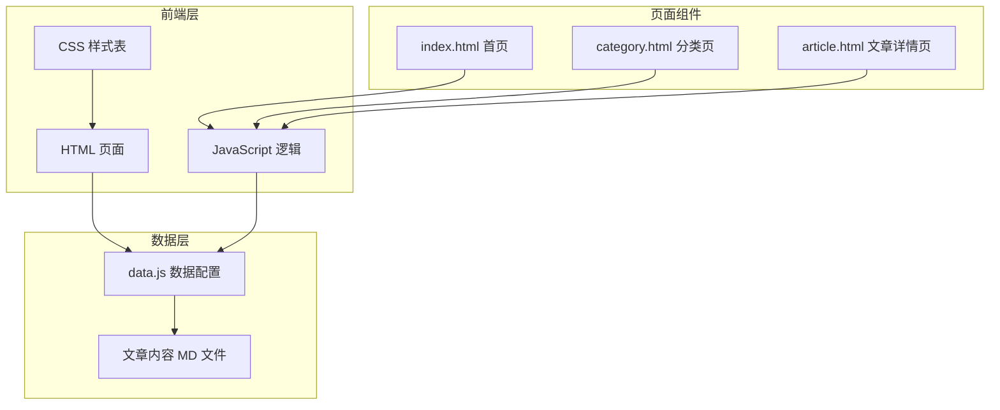
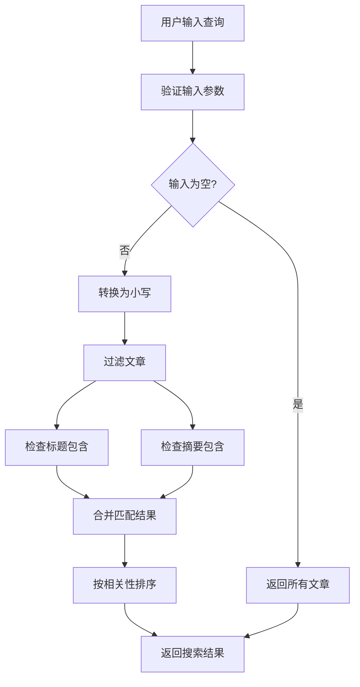
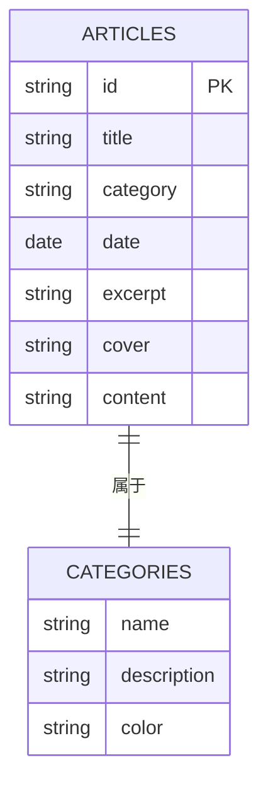
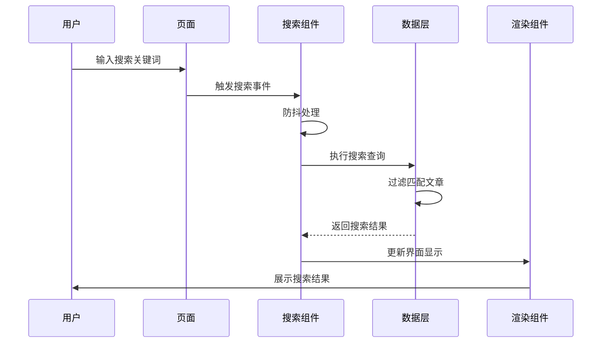
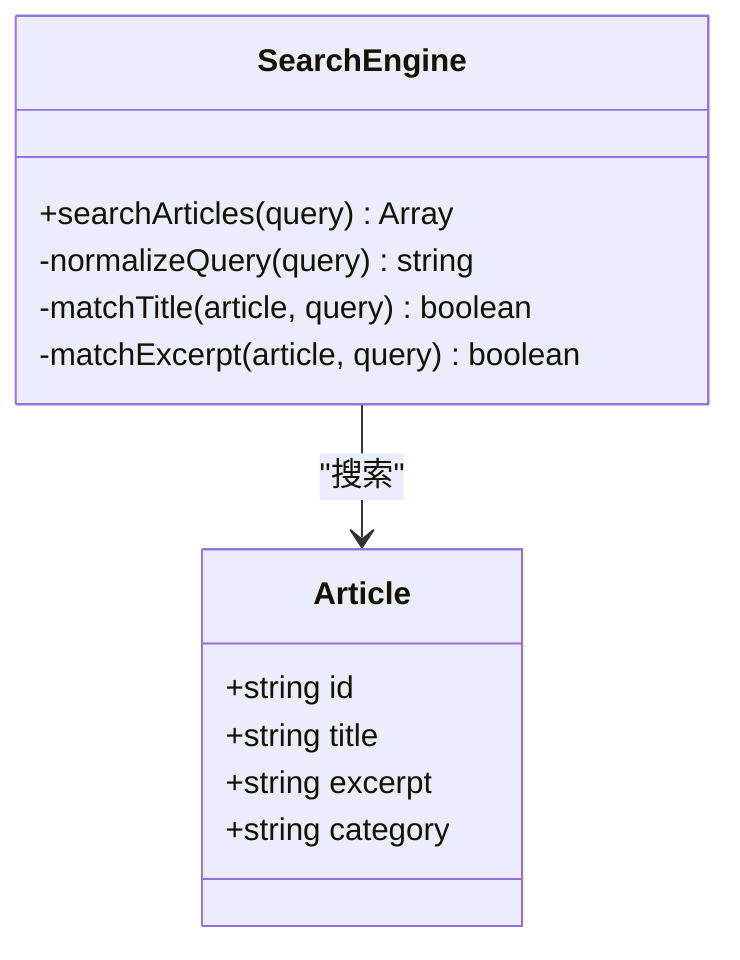
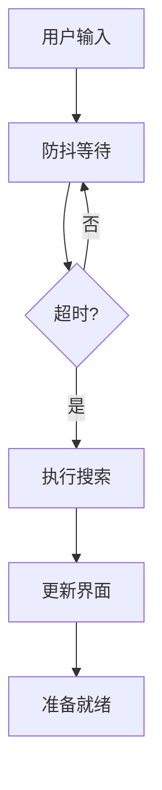
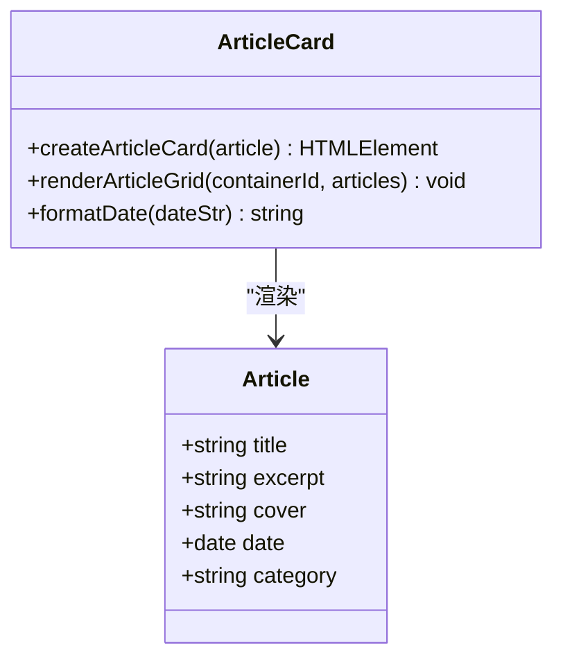
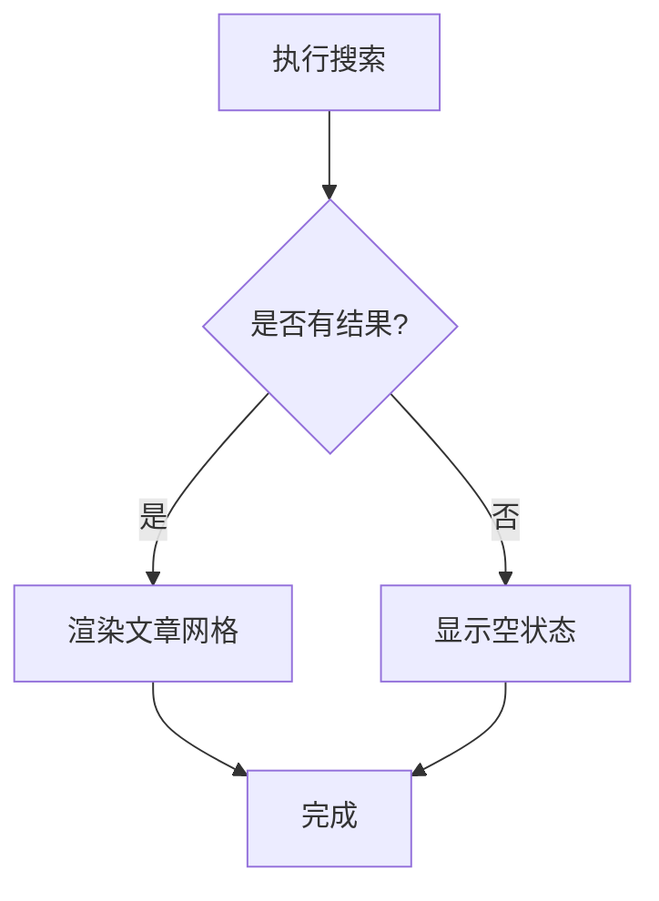
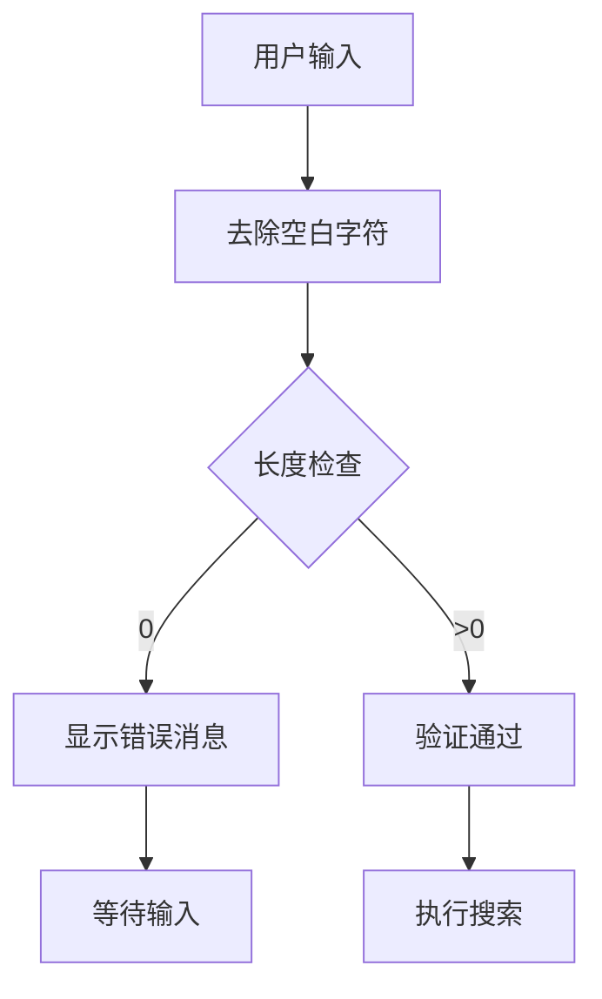
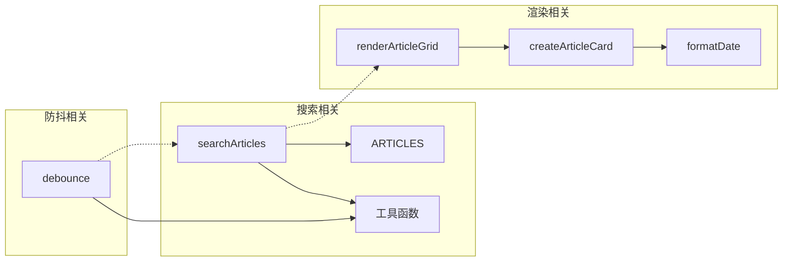

# 搜索功能实现

<cite>
**本文档引用的文件**
- [index.html](file://index.html)
- [category.html](file://category.html)
- [article.html](file://article.html)
- [js/main.js](file://js/main.js)
- [js/data.js](file://js/data.js)
- [css/style.css](file://css/style.css)
- [content/articles/article-1.md](file://content/articles/article-1.md)
- [content/articles/article-2.md](file://content/articles/article-2.md)
</cite>

## 目录
1. [简介](#简介)
2. [项目结构](#项目结构)
3. [核心组件](#核心组件)
4. [架构概览](#架构概览)
5. [详细组件分析](#详细组件分析)
6. [依赖关系分析](#依赖关系分析)
7. [性能考虑](#性能考虑)
8. [故障排除指南](#故障排除指南)
9. [结论](#结论)

## 简介

本文档详细分析了 Hot-Site 静态网站的全文搜索功能实现。该网站是一个技术博客平台，包含技术、AI、游戏、音乐和艺术五个主要分类。搜索功能允许用户在文章标题和摘要中进行关键词检索，并提供实时搜索体验。

## 项目结构

Hot-Site 采用静态网站架构，主要由以下组件构成：



**图表来源**
- [index.html:1-190](file://index.html#L1-L190)
- [category.html:1-103](file://category.html#L1-L103)
- [article.html:1-107](file://article.html#L1-L107)
- [js/data.js:1-158](file://js/data.js#L1-L158)

**章节来源**
- [index.html:1-190](file://index.html#L1-L190)
- [category.html:1-103](file://category.html#L1-L103)
- [article.html:1-107](file://article.html#L1-L107)

## 核心组件

### 搜索算法实现

当前搜索功能基于 JavaScript 的字符串匹配算法，实现了基本的全文搜索能力：



**图表来源**
- [js/data.js:138-145](file://js/data.js#L138-L145)

### 数据结构设计

搜索功能依赖于精心设计的数据结构：



**图表来源**
- [js/data.js:40-113](file://js/data.js#L40-L113)

**章节来源**
- [js/data.js:138-145](file://js/data.js#L138-L145)
- [js/data.js:40-113](file://js/data.js#L40-L113)

## 架构概览

搜索功能在整个系统中的位置和交互关系如下：



**图表来源**
- [js/main.js:28-39](file://js/main.js#L28-L39)
- [js/data.js:138-145](file://js/data.js#L138-L145)

## 详细组件分析

### 搜索算法实现

#### 基础搜索功能

搜索算法目前实现了简单的字符串包含匹配：



**图表来源**
- [js/data.js:138-145](file://js/data.js#L138-L145)

#### 防抖优化机制

为了提升用户体验，搜索功能集成了防抖优化：



**图表来源**
- [js/main.js:28-39](file://js/main.js#L28-L39)

### 搜索范围限定

当前搜索功能支持以下内容范围：

| 搜索范围 | 检索字段 | 实现方式 |
|---------|---------|---------|
| 标题 | `article.title` | `toLowerCase().includes()` |
| 摘要 | `article.excerpt` | `toLowerCase().includes()` |
| 正文 | `article.content` | **未实现** |

**章节来源**
- [js/data.js:138-145](file://js/data.js#L138-L145)

### 结果展示逻辑

#### 文章卡片渲染

搜索结果通过统一的文章卡片模板进行展示：



**图表来源**
- [js/main.js:81-146](file://js/main.js#L81-L146)

#### 空结果状态处理

当搜索无结果时，系统会显示友好的空状态提示：



**图表来源**
- [js/main.js:125-139](file://js/main.js#L125-L139)

### 输入验证机制

搜索功能包含基本的输入验证：



**图表来源**
- [js/data.js:138-145](file://js/data.js#L138-L145)

## 依赖关系分析

### 组件耦合度



**图表来源**
- [js/data.js:138-145](file://js/data.js#L138-L145)
- [js/main.js:81-146](file://js/main.js#L81-L146)
- [js/main.js:28-39](file://js/main.js#L28-L39)

### 外部依赖

当前搜索功能相对独立，主要依赖于：
- 浏览器原生 JavaScript API
- DOM 操作 API
- URL 参数处理

**章节来源**
- [js/main.js:15-26](file://js/main.js#L15-L26)

## 性能考虑

### 时间复杂度分析

当前搜索算法的时间复杂度为 O(n*m)，其中：
- n = 文章总数
- m = 查询字符串长度

```mermaid
flowchart TD
ALGORITHM[搜索算法] --> FILTER[过滤操作 O(n)]
FILTER --> INCLUDES[包含检查 O(m)]
INCLUDES --> TOTAL[总体 O(n*m)]
```

### 优化建议

1. **索引构建**：为常用搜索词建立倒排索引
2. **缓存机制**：缓存热门搜索结果
3. **分页处理**：实现结果分页加载
4. **智能排序**：基于相关性进行排序

## 故障排除指南

### 常见问题及解决方案

#### 搜索结果不准确

**问题描述**：搜索结果与预期不符

**可能原因**：
- 大小写敏感问题
- 特殊字符处理不当
- 语言处理限制

**解决方案**：
- 确保统一的小写转换
- 添加特殊字符转义
- 考虑多语言支持

#### 性能问题

**问题描述**：搜索响应缓慢

**可能原因**：
- 文章数量过多
- 重复搜索请求
- DOM 操作频繁

**解决方案**：
- 实施防抖机制
- 添加搜索结果缓存
- 优化 DOM 操作

**章节来源**
- [js/main.js:28-39](file://js/main.js#L28-L39)

## 结论

Hot-Site 的搜索功能虽然目前实现了基础的全文搜索能力，但仍有许多改进空间。当前实现具有以下特点：

**优势**：
- 实现简单，易于理解和维护
- 性能开销较小
- 用户体验良好

**改进方向**：
- 实现模糊搜索和智能匹配
- 支持正文章内容搜索
- 添加搜索历史和热门搜索功能
- 优化搜索结果排序算法
- 实现搜索结果高亮显示

通过以上改进，可以显著提升搜索功能的实用性和用户体验，使其更好地服务于用户的信息检索需求。