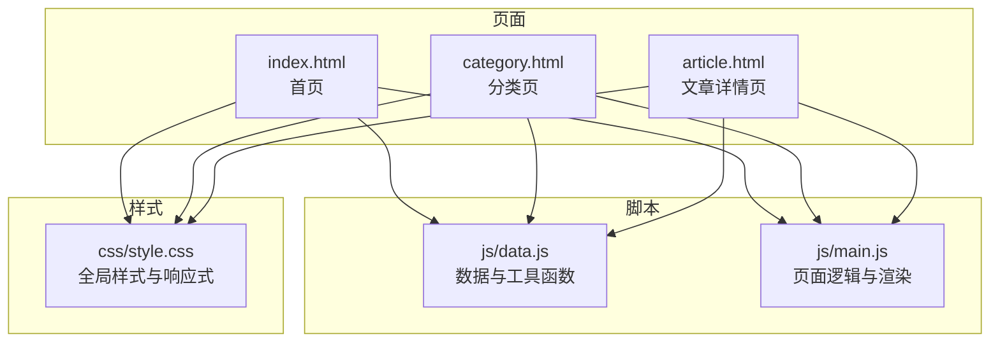
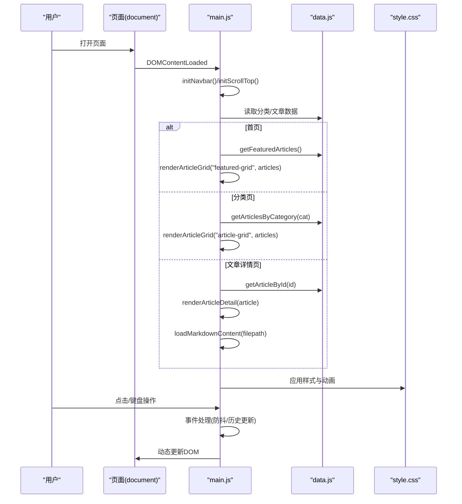
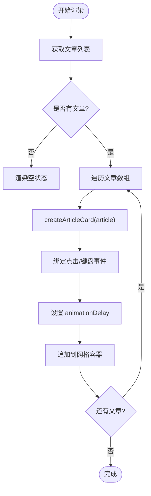
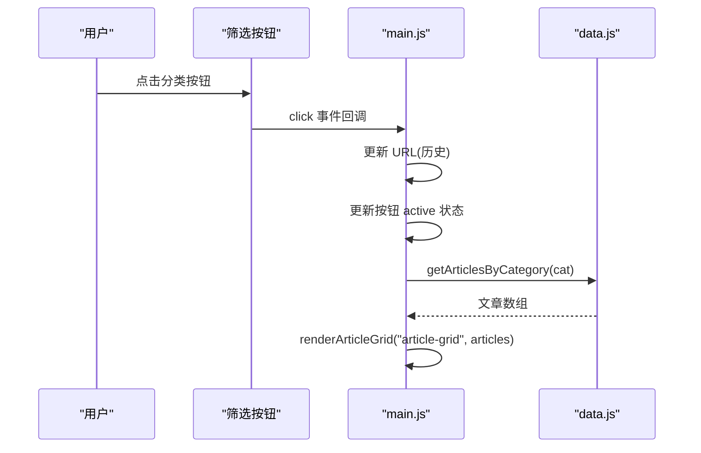
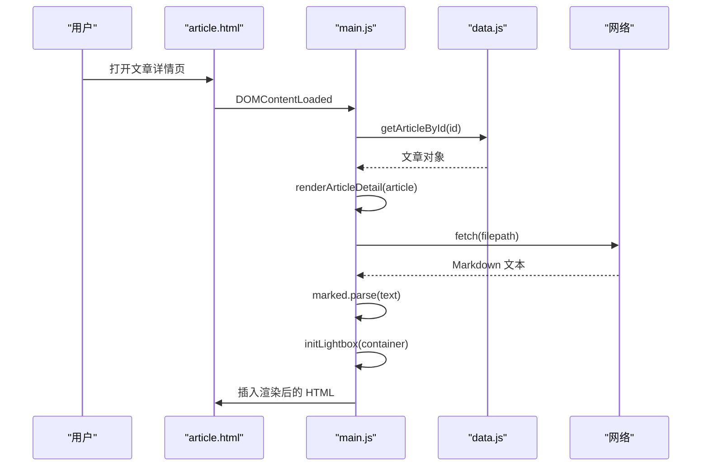
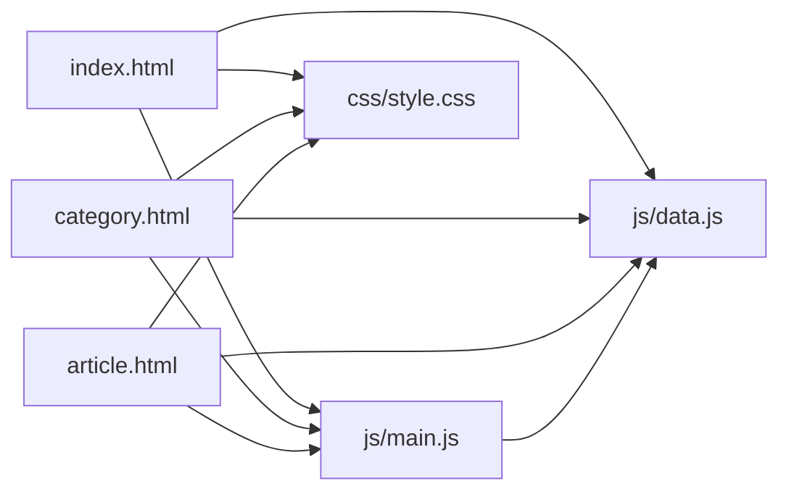

# 文章渲染与网格系统

<cite>
**本文引用的文件**
- [index.html](file://index.html)
- [category.html](file://category.html)
- [article.html](file://article.html)
- [js/main.js](file://js/main.js)
- [js/data.js](file://js/data.js)
- [css/style.css](file://css/style.css)
- [content/articles/article-1.md](file://content/articles/article-1.md)
</cite>

## 目录
1. [简介](#简介)
2. [项目结构](#项目结构)
3. [核心组件](#核心组件)
4. [架构总览](#架构总览)
5. [详细组件分析](#详细组件分析)
6. [依赖关系分析](#依赖关系分析)
7. [性能考量](#性能考量)
8. [故障排查指南](#故障排查指南)
9. [结论](#结论)
10. [附录](#附录)

## 简介
本文件面向“文章渲染系统”的实现细节，围绕以下目标展开：
- 文章卡片的创建流程：HTML 结构生成、事件绑定、键盘可达性与无障碍支持
- 文章网格渲染：动态内容插入、动画延迟、空状态处理
- 文章列表筛选与排序：基于分类与搜索条件的动态更新
- 文章详情页渲染：元数据展示、封面图处理、Markdown 内容加载与渲染
- 响应式布局：移动端适配与断点策略
- 性能优化与调试方法：防抖、骨架屏、懒加载、错误兜底

## 项目结构
该站点采用静态站点结构，核心由三类页面组成：
- 首页：展示精选文章网格与分类入口
- 分类页：按分类筛选文章，支持筛选按钮与空状态
- 文章详情页：展示文章元数据、封面图与 Markdown 正文

图表来源
- [index.html:1-190](file://index.html#L1-L190)
- [category.html:1-103](file://category.html#L1-L103)
- [article.html:1-107](file://article.html#L1-L107)
- [js/data.js:1-158](file://js/data.js#L1-L158)
- [js/main.js:1-461](file://js/main.js#L1-L461)
- [css/style.css:1-1166](file://css/style.css#L1-L1166)

章节来源
- [index.html:1-190](file://index.html#L1-L190)
- [category.html:1-103](file://category.html#L1-L103)
- [article.html:1-107](file://article.html#L1-L107)

## 核心组件
- 数据层（js/data.js）
  - 分类配置与文章元数据常量
  - 文章查询、分类过滤、精选文章、搜索等工具函数
- 逻辑层（js/main.js）
  - 导航栏交互、滚动行为、页面过渡动画
  - 文章卡片创建与网格渲染
  - 分类页筛选按钮初始化与切换
  - 文章详情页元数据与封面渲染、Markdown 加载与渲染
  - Lightbox 图片放大、返回顶部、错误状态处理
- 视图层（HTML/CSS）
  - 页面骨架与无障碍属性
  - 文章网格、分类网格、详情页布局
  - 响应式断点与动画效果

章节来源
- [js/data.js:1-158](file://js/data.js#L1-L158)
- [js/main.js:1-461](file://js/main.js#L1-L461)
- [css/style.css:431-548](file://css/style.css#L431-L548)

## 架构总览
系统采用“数据驱动 + 事件驱动”的前端架构：
- 数据层提供统一的数据源与查询函数
- 逻辑层根据当前页面路由执行初始化与渲染
- 视图层通过 CSS Grid、Flexbox 与媒体查询实现响应式布局
- 交互层通过事件绑定与防抖提升用户体验

图表来源
- [js/main.js:436-460](file://js/main.js#L436-L460)
- [js/data.js:115-145](file://js/data.js#L115-L145)
- [css/style.css:130-138](file://css/style.css#L130-L138)

## 详细组件分析

### 文章卡片创建与渲染
- HTML 结构生成
  - 卡片容器包含封面图、分类徽标与摘要信息
  - 使用 loading="lazy" 优化首屏性能
- 事件绑定
  - 点击卡片跳转至详情页
  - 键盘 Enter/Space 支持可访问性跳转
- 无障碍支持
  - article 容器设置 role="article"
  - 卡片设置 tabindex="0" 以启用键盘聚焦
- 动画与延迟
  - 通过 animationDelay 对每个卡片施加递增延迟，形成瀑布流进入效果
- 空状态处理
  - 当文章列表为空时，渲染空状态 SVG 与提示文本

图表来源
- [js/main.js:82-116](file://js/main.js#L82-L116)
- [js/main.js:119-146](file://js/main.js#L119-L146)

章节来源
- [js/main.js:82-116](file://js/main.js#L82-L116)
- [js/main.js:119-146](file://js/main.js#L119-L146)

### 文章网格渲染逻辑
- 动态内容插入
  - 清空容器后批量插入卡片节点
- 动画延迟
  - 依据索引计算 animationDelay，形成逐个出现的视觉效果
- 空状态处理
  - 列表为空时渲染统一的空状态占位符

章节来源
- [js/main.js:119-146](file://js/main.js#L119-L146)

### 分类筛选与排序机制
- 分类筛选
  - 读取 URL 参数 cat，初始化 active 状态
  - 动态生成筛选按钮，点击后更新 URL、按钮状态与页面标题
  - 根据分类调用 getArticlesByCategory 获取文章列表并重新渲染网格
- 排序机制
  - 数据层提供 getFeaturedArticles 默认按时间倒序（数组切片）
  - 搜索机制（searchArticles）支持标题与摘要模糊匹配
- 历史记录
  - 使用 history.pushState 更新 URL，保持浏览器前进/后退可用

图表来源
- [js/main.js:179-218](file://js/main.js#L179-L218)
- [js/data.js:120-126](file://js/data.js#L120-L126)

章节来源
- [js/main.js:157-177](file://js/main.js#L157-L177)
- [js/main.js:179-218](file://js/main.js#L179-L218)
- [js/data.js:120-145](file://js/data.js#L120-L145)

### 文章详情页渲染流程
- 元数据展示
  - 渲染分类徽标、日期、标题与摘要
- 封面图处理
  - 条件渲染封面图容器，使用 loading="eager" 提升首屏感知
- Markdown 内容加载与渲染
  - 异步加载 Markdown 文件，使用 marked.js CDN 渲染为 HTML
  - 若 marked.js 未加载，回退显示原始 Markdown
  - 错误时渲染空状态占位符
- Lightbox 图片放大
  - 为文章内图片绑定点击事件，创建 overlay 并支持 ESC 关闭

图表来源
- [js/main.js:220-243](file://js/main.js#L220-L243)
- [js/main.js:245-269](file://js/main.js#L245-L269)
- [js/main.js:271-314](file://js/main.js#L271-L314)
- [js/main.js:318-371](file://js/main.js#L318-L371)
- [js/data.js:115-118](file://js/data.js#L115-L118)

章节来源
- [js/main.js:220-243](file://js/main.js#L220-L243)
- [js/main.js:245-269](file://js/main.js#L245-L269)
- [js/main.js:271-314](file://js/main.js#L271-L314)
- [js/main.js:318-371](file://js/main.js#L318-L371)

### 响应式布局实现
- 断点策略
  - 移动端断点：768px 与 480px
  - 导航菜单在小屏变为抽屉式
  - 文章网格与分类网格在小屏调整列数
- 动画与交互
  - 页面进入动画、卡片悬停效果、返回顶部按钮
  - Lightbox 在小屏仍保持居中与缩放控制

章节来源
- [css/style.css:1029-1106](file://css/style.css#L1029-L1106)
- [css/style.css:1068-1074](file://css/style.css#L1068-L1074)
- [css/style.css:1121-1153](file://css/style.css#L1121-L1153)

## 依赖关系分析
- 页面到脚本
  - 三个页面均引入 data.js 与 main.js
- 脚本间依赖
  - main.js 依赖 data.js 的数据与工具函数
- 样式依赖
  - 所有页面共享 css/style.css，包含网格、动画、响应式等

图表来源
- [index.html:187-188](file://index.html#L187-L188)
- [category.html:100-101](file://category.html#L100-L101)
- [article.html:104-105](file://article.html#L104-L105)
- [js/main.js:1-461](file://js/main.js#L1-L461)
- [js/data.js:1-158](file://js/data.js#L1-L158)
- [css/style.css:1-1166](file://css/style.css#L1-L1166)

章节来源
- [index.html:187-188](file://index.html#L187-L188)
- [category.html:100-101](file://category.html#L100-L101)
- [article.html:104-105](file://article.html#L104-L105)

## 性能考量
- 首屏优化
  - 图片懒加载（封面图使用 loading="lazy"），详情页封面使用 eager 提升感知
  - 骨架屏与打字机加载动画（CSS 动画 shimmer 与 dots）
- 交互性能
  - 滚动事件使用防抖（debounce），降低重绘频率
  - 页面过渡使用 CSS 动画，避免 JavaScript 阻塞
- 渲染性能
  - 文章网格使用 CSS Grid，自动换列与自适应
  - 卡片动画延迟按顺序执行，避免同时大量动画造成卡顿
- 错误与降级
  - Markdown 加载失败时回退到空状态或原始 Markdown
  - 文章不存在时统一错误页面

章节来源
- [js/main.js:28-39](file://js/main.js#L28-L39)
- [js/main.js:119-146](file://js/main.js#L119-L146)
- [js/main.js:271-314](file://js/main.js#L271-L314)
- [css/style.css:1108-1119](file://css/style.css#L1108-L1119)
- [css/style.css:1155-1165](file://css/style.css#L1155-L1165)

## 故障排查指南
- 文章列表为空
  - 检查分类参数是否正确传递
  - 确认 getArticlesByCategory 返回值
- 详情页空白
  - 检查文章 ID 是否存在
  - 确认 Markdown 文件路径与可访问性
  - 查看 marked.js 是否成功加载
- 网格不显示或错位
  - 检查容器是否存在且可获取
  - 确认 CSS Grid 样式是否生效
- 移动端导航无法打开
  - 检查汉堡菜单事件绑定与样式类名
- Lightbox 不显示
  - 确认图片点击事件绑定与 overlay DOM 创建
  - 检查 ESC 键盘事件监听

章节来源
- [js/main.js:157-177](file://js/main.js#L157-L177)
- [js/main.js:220-243](file://js/main.js#L220-L243)
- [js/main.js:318-371](file://js/main.js#L318-L371)
- [js/main.js:436-460](file://js/main.js#L436-L460)

## 结论
该文章渲染系统以简洁的数据层与逻辑层实现，结合 CSS Grid 与响应式断点，提供了良好的跨设备体验。通过事件防抖、骨架屏与错误兜底，系统在性能与稳定性方面表现良好。建议后续可考虑：
- 增加搜索输入框与实时过滤
- 为网格卡片增加骨架屏占位
- 优化 Lightbox 的图片缓存与缩放策略
- 增加 SEO 元数据与结构化数据

## 附录
- 示例 Markdown 文档路径：[content/articles/article-1.md:1-66](file://content/articles/article-1.md#L1-L66)
- 页面骨架与无障碍属性参考：
  - 首页：[index.html:29-189](file://index.html#L29-L189)
  - 分类页：[category.html:27-102](file://category.html#L27-L102)
  - 详情页：[article.html:27-106](file://article.html#L27-L106)