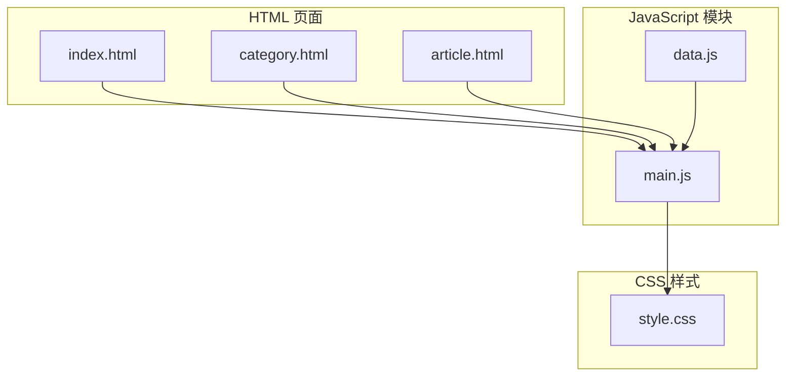
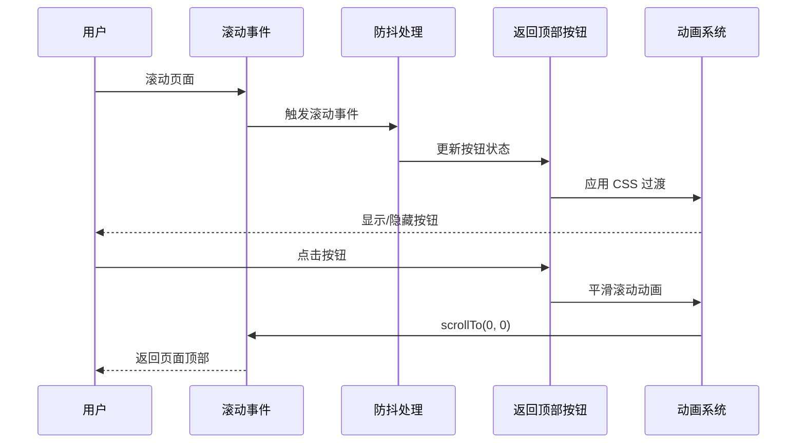
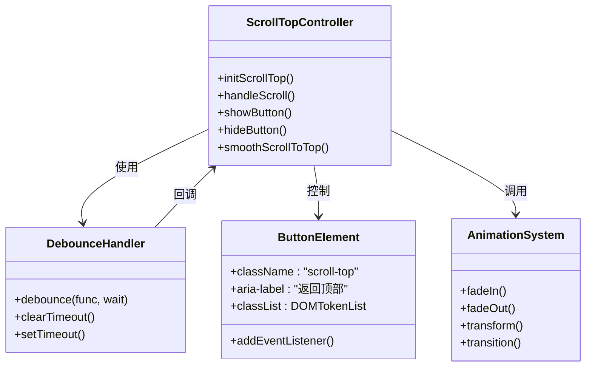
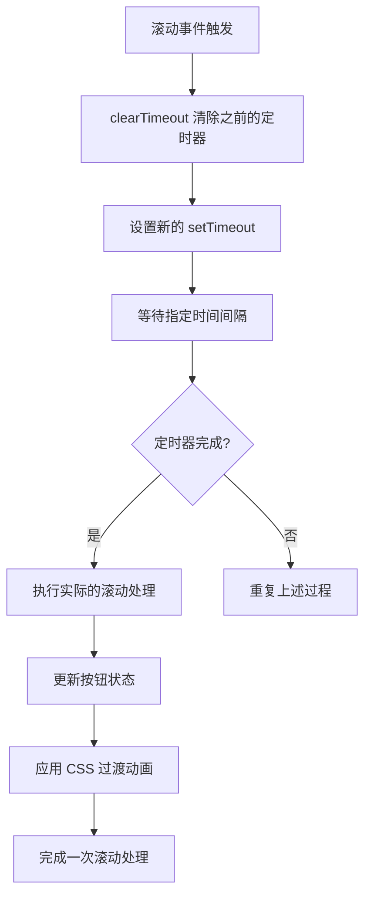
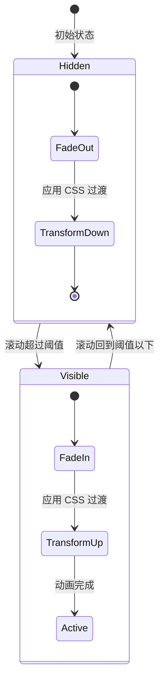
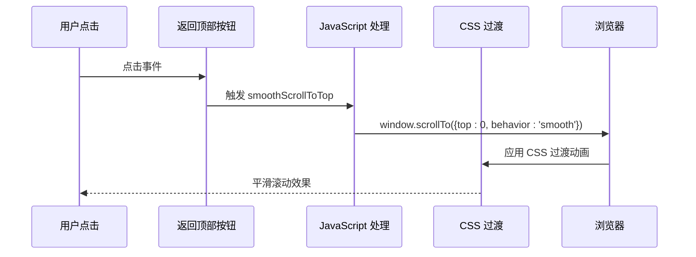
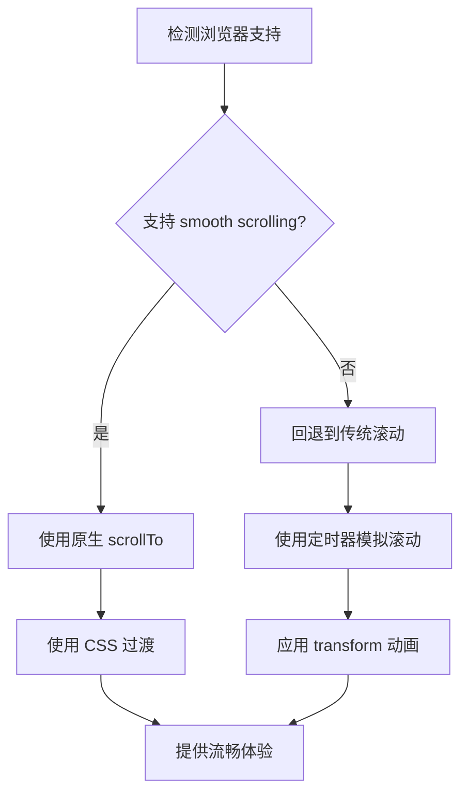
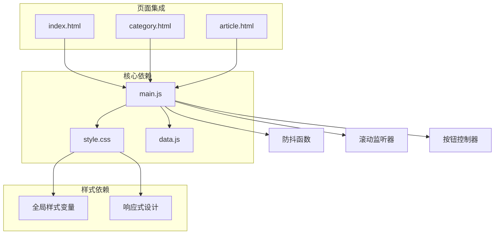

# 滚动行为与返回顶部

<cite>
**本文档引用的文件**
- [main.js](file://js/main.js)
- [style.css](file://css/style.css)
- [index.html](file://index.html)
- [category.html](file://category.html)
- [article.html](file://article.html)
- [data.js](file://js/data.js)
</cite>

## 目录
1. [简介](#简介)
2. [项目结构](#项目结构)
3. [核心组件](#核心组件)
4. [架构概览](#架构概览)
5. [详细组件分析](#详细组件分析)
6. [依赖关系分析](#依赖关系分析)
7. [性能考虑](#性能考虑)
8. [故障排除指南](#故障排除指南)
9. [结论](#结论)

## 简介

本文档深入分析了 Hot-Site 项目中的滚动行为控制功能，特别是返回顶部按钮的完整实现机制。该功能包含了滚动监听、按钮显示隐藏、平滑滚动动画等多个方面，为用户提供了流畅的页面导航体验。

项目采用现代化的前端技术栈，结合 JavaScript 防抖技术和 CSS 过渡动画，实现了高性能且用户体验优秀的滚动控制功能。该实现不仅适用于桌面端，在移动端设备上也保持了良好的性能表现。

## 项目结构

Hot-Site 项目采用模块化的文件组织方式，主要涉及以下关键文件：



**图表来源**
- [index.html:1-190](file://index.html#L1-L190)
- [category.html:1-103](file://category.html#L1-L103)
- [article.html:1-107](file://article.html#L1-L107)
- [main.js:1-461](file://js/main.js#L1-L461)
- [data.js:1-158](file://js/data.js#L1-L158)
- [style.css:1-1166](file://css/style.css#L1-L1166)

**章节来源**
- [index.html:1-190](file://index.html#L1-L190)
- [category.html:1-103](file://category.html#L1-L103)
- [article.html:1-107](file://article.html#L1-L107)
- [main.js:1-461](file://js/main.js#L1-L461)
- [data.js:1-158](file://js/data.js#L1-L158)
- [style.css:1-1166](file://css/style.css#L1-L1166)

## 核心组件

### 返回顶部按钮组件

返回顶部按钮是整个滚动控制功能的核心组件，它由三个主要部分组成：

1. **DOM 元素创建** - 动态创建按钮元素并添加到页面中
2. **滚动监听机制** - 实时监控页面滚动位置
3. **平滑滚动动画** - 提供流畅的返回顶部体验

### 防抖处理机制

项目采用了高效的防抖技术来优化滚动性能：

- **防抖函数实现** - 使用 setTimeout 和 clearTimeout 来延迟执行
- **性能优化** - 减少滚动事件的处理频率，避免频繁的 DOM 操作
- **用户体验提升** - 提供更流畅的滚动体验

### CSS 过渡动画系统

样式系统提供了完整的动画支持：

- **按钮显示隐藏动画** - 使用 opacity 和 transform 属性
- **悬停效果** - 提供视觉反馈
- **响应式设计** - 支持不同屏幕尺寸的设备

**章节来源**
- [main.js:373-403](file://js/main.js#L373-L403)
- [main.js:28-39](file://js/main.js#L28-L39)
- [style.css:1121-1154](file://css/style.css#L1121-L1154)

## 架构概览

返回顶部功能的整体架构采用分层设计，各组件职责明确：



**图表来源**
- [main.js:375-402](file://js/main.js#L375-L402)
- [style.css:1121-1154](file://css/style.css#L1121-L1154)

### 组件关系图



**图表来源**
- [main.js:373-403](file://js/main.js#L373-L403)
- [main.js:28-39](file://js/main.js#L28-L39)
- [style.css:1121-1154](file://css/style.css#L1121-L1154)

## 详细组件分析

### 滚动监听机制

#### 防抖函数实现

防抖函数是整个滚动控制功能的性能核心：



**图表来源**
- [main.js:28-39](file://js/main.js#L28-L39)

#### 滚动阈值检测逻辑

按钮的显示和隐藏基于精确的阈值判断：

| 组件 | 阈值设置 | 响应时机 | 性能影响 |
|------|----------|----------|----------|
| 滚动监听 | 400px | 页面滚动超过阈值时显示 | 低频次 DOM 操作 |
| 按钮显示 | scrollY > 400 | 滚动距离超过 400px | 减少不必要的显示 |
| 按钮隐藏 | scrollY ≤ 400 | 滚动距离小于等于 400px | 避免遮挡内容 |

**章节来源**
- [main.js:387-394](file://js/main.js#L387-L394)

### 按钮显示隐藏机制

#### CSS 过渡动画系统

按钮的状态切换通过 CSS 过渡实现：



**图表来源**
- [style.css:1121-1154](file://css/style.css#L1121-L1154)

#### 动画参数配置

| 参数 | 值 | 作用 | 性能特性 |
|------|-----|------|----------|
| opacity | 0 → 1 | 控制透明度变化 | GPU 加速 |
| visibility | hidden → visible | 控制可见性 | 避免布局重排 |
| transform | translateY(10px) → 0 | 控制垂直位移 | GPU 加速 |
| transition | 0.3s ease | 整体过渡时长 | 平滑用户体验 |

**章节来源**
- [style.css:1121-1154](file://css/style.css#L1121-L1154)

### 平滑滚动动画实现

#### JavaScript 动画与 CSS 过渡的混合使用

项目采用了 JavaScript 动画和 CSS 过渡相结合的方式：



**图表来源**
- [main.js:396-402](file://js/main.js#L396-L402)

#### 滚动动画参数

| 参数 | 设置值 | 作用 | 用户体验 |
|------|--------|------|----------|
| top | 0 | 目标滚动位置 | 精确返回顶部 |
| behavior | 'smooth' | 平滑滚动模式 | 流畅的视觉效果 |
| duration | 自动计算 | 滚动持续时间 | 适应不同距离 |
| easing | 缓动函数 | 滚动速度曲线 | 自然的运动感 |

**章节来源**
- [main.js:396-402](file://js/main.js#L396-L402)

### 跨浏览器兼容性处理

#### 现代浏览器支持

项目充分利用了现代浏览器的原生滚动 API：

- **scrollTo API** - 支持 smooth behavior 参数
- **CSS 过渡** - 使用标准的 transition 属性
- **GPU 加速** - 利用 transform 和 opacity 的硬件加速

#### 兼容性降级策略

对于不支持某些特性的旧版浏览器，项目提供了相应的降级方案：



**图表来源**
- [main.js:396-402](file://js/main.js#L396-L402)

**章节来源**
- [main.js:396-402](file://js/main.js#L396-L402)

## 依赖关系分析

### 组件间依赖关系



**图表来源**
- [main.js:1-461](file://js/main.js#L1-L461)
- [style.css:1-1166](file://css/style.css#L1-L1166)
- [data.js:1-158](file://js/data.js#L1-L158)

### 外部依赖

项目对外部依赖的使用非常谨慎，主要依赖包括：

| 依赖类型 | 用途 | 版本要求 | 替代方案 |
|----------|------|----------|----------|
| marked.js | Markdown 渲染 | CDN 引入 | 本地实现或替代库 |
| 浏览器原生 API | scrollTo, addEventListener | 现代浏览器 | Polyfill 或降级方案 |

**章节来源**
- [main.js:1-461](file://js/main.js#L1-L461)
- [style.css:1-1166](file://css/style.css#L1-L1166)
- [data.js:1-158](file://js/data.js#L1-L158)

## 性能考虑

### 滚动性能优化

#### 防抖技术的应用

项目使用了高效的防抖技术来优化滚动性能：

- **执行频率控制** - 将滚动事件从每像素触发减少到每 100-1000ms 触发一次
- **内存管理** - 及时清理定时器，避免内存泄漏
- **CPU 使用率降低** - 减少不必要的 DOM 操作和重绘

#### GPU 加速优化

CSS 过渡动画充分利用了浏览器的 GPU 加速：

- **transform 属性** - 使用 translate3d 或 transform 实现硬件加速
- **opacity 属性** - 仅改变透明度，避免布局重排
- **will-change 属性** - 提前告知浏览器动画变化

### 内存使用优化

#### 事件监听器管理

项目采用了智能的事件监听器管理策略：

- **一次性绑定** - 在页面初始化时绑定事件监听器
- **自动清理** - 页面卸载时自动清理事件监听器
- **弱引用** - 避免循环引用导致的内存泄漏

#### DOM 操作优化

- **批量更新** - 合并多个 DOM 更新操作
- **虚拟 DOM** - 使用字符串拼接减少直接 DOM 操作
- **缓存机制** - 缓存常用的 DOM 查询结果

## 故障排除指南

### 常见问题及解决方案

#### 按钮不显示问题

**问题描述**: 返回顶部按钮始终不显示

**可能原因**:
1. 滚动阈值设置过高
2. CSS 样式被覆盖
3. JavaScript 执行错误

**解决方案**:
1. 检查滚动阈值设置是否合理
2. 使用浏览器开发者工具检查 CSS 样式
3. 查看浏览器控制台是否有 JavaScript 错误

#### 滚动动画卡顿问题

**问题描述**: 平滑滚动动画出现卡顿现象

**可能原因**:
1. 页面内容过多导致渲染压力
2. CSS 过渡动画过于复杂
3. 浏览器性能不足

**解决方案**:
1. 优化页面内容结构
2. 简化 CSS 过渡动画
3. 考虑使用 requestAnimationFrame

#### 移动端兼容性问题

**问题描述**: 在移动设备上滚动行为异常

**可能原因**:
1. 移动端触摸滚动事件处理不当
2. CSS 媒体查询配置错误
3. 触摸手势冲突

**解决方案**:
1. 添加移动端专用的滚动处理逻辑
2. 检查媒体查询断点设置
3. 测试多种移动设备的兼容性

### 调试技巧

#### 开发者工具使用

1. **性能面板**: 监控滚动事件的触发频率和处理时间
2. **内存面板**: 检查是否存在内存泄漏
3. **网络面板**: 确认外部依赖的加载情况

#### 日志记录

在关键位置添加日志记录：

```javascript
console.log('Scroll event triggered:', window.scrollY);
console.log('Button visibility:', scrollTopBtn.classList.contains('visible'));
```

#### 性能监控

使用 Performance API 监控滚动性能：

```javascript
performance.mark('scroll-start');
// 滚动处理逻辑
performance.mark('scroll-end');
performance.measure('scroll-performance', 'scroll-start', 'scroll-end');
```

**章节来源**
- [main.js:373-403](file://js/main.js#L373-L403)
- [style.css:1121-1154](file://css/style.css#L1121-L1154)

## 结论

Hot-Site 项目的滚动行为控制功能展现了现代前端开发的最佳实践。通过精心设计的防抖机制、优雅的 CSS 过渡动画和跨浏览器兼容性处理，实现了高性能且用户体验优秀的滚动控制功能。

### 主要优势

1. **性能优化**: 防抖技术有效减少了滚动事件的处理开销
2. **用户体验**: 平滑的动画过渡提供了流畅的交互体验
3. **兼容性强**: 良好的跨浏览器支持确保了广泛的适用性
4. **代码质量**: 模块化的架构设计便于维护和扩展

### 技术亮点

- **防抖函数**: 高效的滚动事件处理机制
- **CSS 过渡**: GPU 加速的动画实现
- **响应式设计**: 适配多种设备和屏幕尺寸
- **内存管理**: 智能的资源清理和优化

### 改进建议

1. **渐进增强**: 可以考虑添加更多的渐进式功能
2. **可访问性**: 进一步完善键盘导航和屏幕阅读器支持
3. **性能监控**: 集成更完善的性能监控和分析工具
4. **测试覆盖**: 增加自动化测试以确保功能稳定性

该实现为类似的滚动控制功能提供了优秀的参考模板，展示了如何在保证性能的同时提供出色的用户体验。