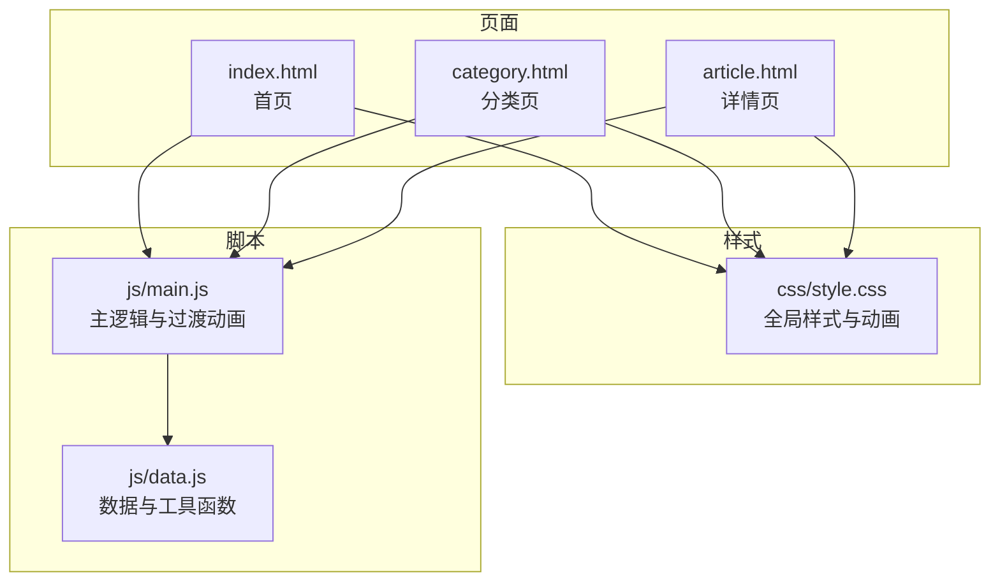
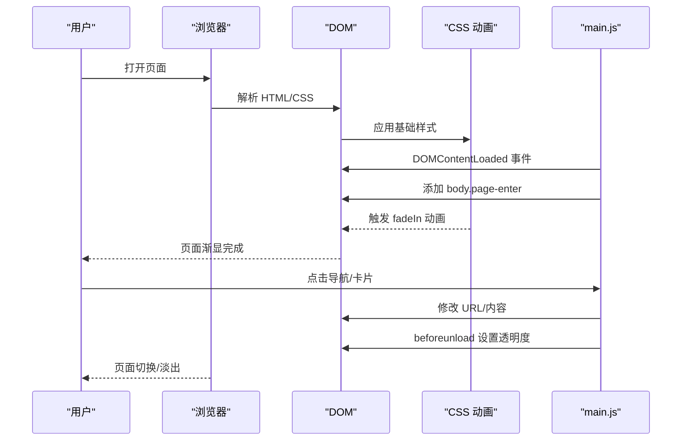
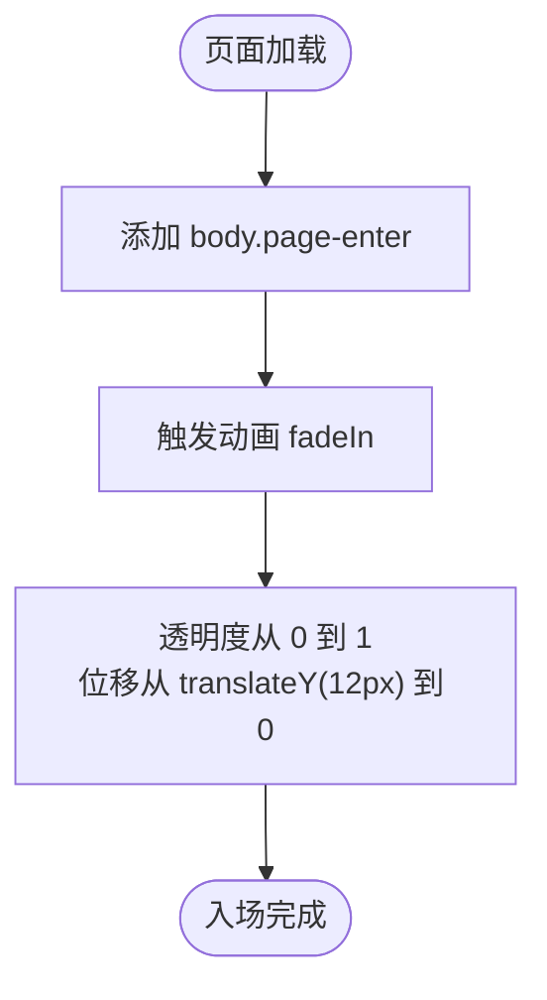
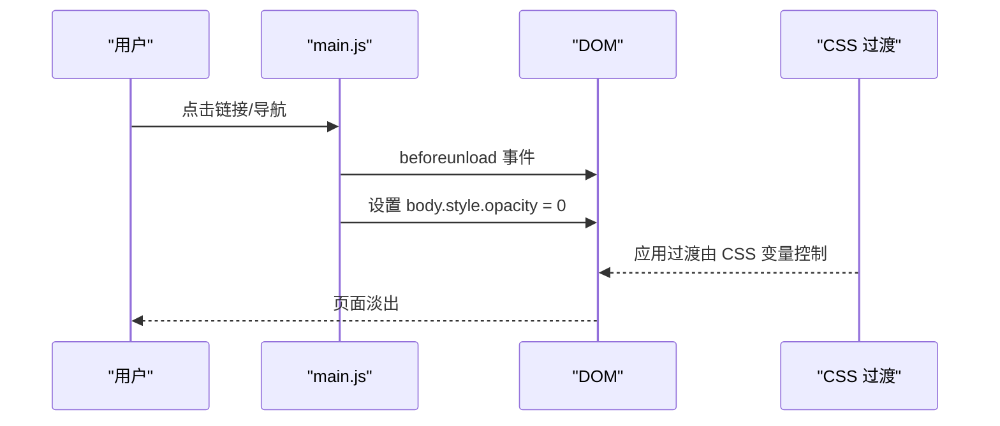
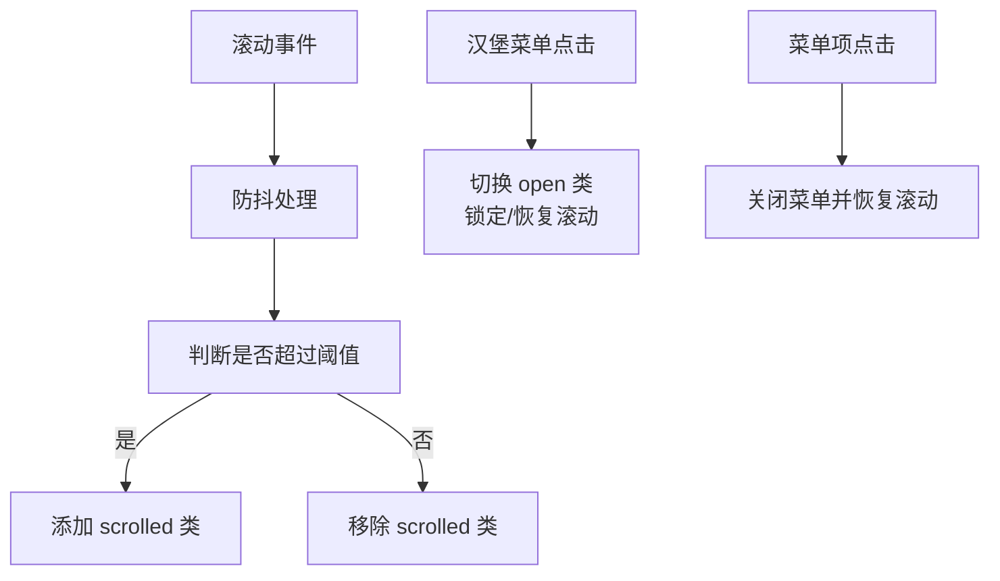
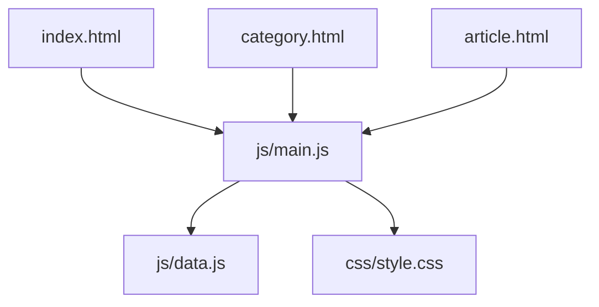

# 页面过渡动画

<cite>
**本文引用的文件**
- [index.html](file://index.html)
- [category.html](file://category.html)
- [article.html](file://article.html)
- [style.css](file://css/style.css)
- [main.js](file://js/main.js)
- [data.js](file://js/data.js)
</cite>

## 目录
1. [简介](#简介)
2. [项目结构](#项目结构)
3. [核心组件](#核心组件)
4. [架构总览](#架构总览)
5. [详细组件分析](#详细组件分析)
6. [依赖关系分析](#依赖关系分析)
7. [性能考量](#性能考量)
8. [故障排查指南](#故障排查指南)
9. [结论](#结论)
10. [附录](#附录)

## 简介
本文件围绕页面过渡动画功能进行系统化说明，重点覆盖：
- 页面加载时的入场动画机制（CSS 类名管理与触发时机）
- 页面卸载时的淡出效果与视觉连贯性
- 动画性能优化策略（requestAnimationFrame 使用与 GPU 加速要点）
- 动画状态管理（与用户交互的协调）
- 不同页面类型的过渡差异（首页、分类页、详情页）
- 动画调试与性能监控方法
- 具体实现路径与使用场景说明

## 项目结构
该项目采用静态站点结构，页面通过 HTML + CSS + JavaScript 实现，核心文件如下：
- HTML 页面：首页、分类页、文章详情页
- 样式：统一的 CSS 样式表，包含页面入场动画与各类 UI 组件
- 脚本：主逻辑脚本负责页面初始化、导航、数据加载与过渡动画；数据脚本提供文章与分类数据

图表来源
- [index.html](file://index.html)
- [category.html](file://category.html)
- [article.html](file://article.html)
- [style.css](file://css/style.css)
- [main.js](file://js/main.js)
- [data.js](file://js/data.js)

章节来源
- [index.html](file://index.html)
- [category.html](file://category.html)
- [article.html](file://article.html)
- [style.css](file://css/style.css)
- [main.js](file://js/main.js)
- [data.js](file://js/data.js)

## 核心组件
- 页面入场动画：通过为页面根元素添加特定 CSS 类，触发动画序列，实现平滑的出现效果。
- 卡片入场动画：文章卡片在渲染时自动附加入场类，并通过延迟实现“瀑布流”式逐个入场。
- 页面卸载淡出：在页面卸载前设置透明度，配合 CSS 过渡实现淡出效果。
- 导航栏与交互：滚动触发导航栏样式变化，移动端汉堡菜单交互，滚动回到顶部按钮。
- Markdown 内容加载：详情页异步加载 Markdown 并渲染，期间展示加载状态。

章节来源
- [main.js](file://js/main.js)
- [style.css](file://css/style.css)

## 架构总览
页面过渡动画在“页面加载 -> 元素渲染 -> 动画触发 -> 用户交互”的链路中运行，整体流程如下：

图表来源
- [main.js](file://js/main.js)
- [style.css](file://css/style.css)

## 详细组件分析

### 页面入场动画机制
- 触发时机：在 DOMContentLoaded 事件中，向 body 添加“page-enter”类，从而触发动画。
- 动画定义：CSS 中定义了“fadeIn”关键帧与“.page-enter”类，实现从半透明到不透明、轻微上移的入场效果。
- 卡片入场：文章卡片在创建时即带有“page-enter”，并通过 animation-delay 实现逐个延迟入场，形成“瀑布流”。

图表来源
- [main.js](file://js/main.js)
- [style.css](file://css/style.css)

章节来源
- [main.js](file://js/main.js)
- [style.css](file://css/style.css)

### 页面卸载淡出效果
- 触发时机：在 beforeunload 事件中，将 body 的 opacity 设为 0，使页面在切换时呈现淡出效果。
- 注意事项：该方案对现代浏览器支持良好，但具体行为可能受浏览器策略影响；如需更精细控制，可结合页面可见性 API 或自定义过渡层。

图表来源
- [main.js](file://js/main.js)
- [style.css](file://css/style.css)

章节来源
- [main.js](file://js/main.js)
- [style.css](file://css/style.css)

### 动画状态管理与用户交互协调
- 导航栏状态：滚动超过阈值时为导航栏添加“scrolled”类，改变背景与阴影，提升可读性。
- 移动端菜单：点击汉堡菜单切换“open”类，同时锁定 body 滚动，点击菜单项后自动关闭。
- 返回顶部：滚动超过阈值显示按钮，点击平滑滚动至顶部。
- 交互一致性：所有交互均通过防抖/节流与事件委托优化，避免动画与交互冲突。

图表来源
- [main.js](file://js/main.js)
- [style.css](file://css/style.css)

章节来源
- [main.js](file://js/main.js)
- [style.css](file://css/style.css)

### 不同页面类型的过渡差异
- 首页（home）：页面加载时整体入场；文章卡片逐个延迟入场，营造层次感。
- 分类页（category）：页面加载时整体入场；筛选按钮与文章网格渲染后逐个入场。
- 详情页（article）：页面加载时整体入场；封面图与标题等元素在渲染后自然进入视口，配合 Markdown 加载的占位状态。

图表来源
- [index.html](file://index.html)
- [category.html](file://category.html)
- [article.html](file://article.html)
- [main.js](file://js/main.js)
- [style.css](file://css/style.css)

章节来源
- [index.html](file://index.html)
- [category.html](file://category.html)
- [article.html](file://article.html)
- [main.js](file://js/main.js)
- [style.css](file://css/style.css)

### 动画性能优化策略
- requestAnimationFrame 使用：在需要精确控制帧时机或与动画同步的场景（如 Lightbox 显示）使用 rAF，确保在下一帧应用样式，减少回流与重绘。
- GPU 加速建议：优先使用 transform/opacity 等可触发合成层的属性；避免频繁修改 layout 属性（如 top/left/right/bottom），以减少强制同步布局。
- 动画批处理：将多个小动画合并为一次样式变更，减少样式计算次数。
- 延迟入场：通过 animation-delay 控制批量元素的入场节奏，避免同时触发大量动画造成卡顿。
- 防抖/节流：对滚动、窗口大小变化等高频事件使用防抖/节流，降低动画抖动与掉帧风险。

章节来源
- [main.js](file://js/main.js)
- [style.css](file://css/style.css)

### 动画调试与性能监控
- 浏览器开发者工具
  - 性能面板：记录动画帧率、CPU/内存占用，定位掉帧原因。
  - 合成层检查：确认 transform/opacity 是否触发合成层，避免不必要的回流。
  - 动画面板：查看关键帧动画的持续时间与缓动曲线。
- 控制台日志：在动画关键节点输出日志，验证触发顺序与参数。
- 样式检查：确认 CSS 类名是否正确附加，动画时长与缓动是否符合预期。
- 交互测试：模拟慢网速与弱设备，验证延迟入场与降级策略的有效性。

章节来源
- [main.js](file://js/main.js)
- [style.css](file://css/style.css)

## 依赖关系分析
- 页面依赖样式：所有页面共享同一套 CSS，包括动画定义、布局与组件样式。
- 脚本依赖：main.js 依赖 data.js 提供的数据与工具函数；页面通过 data-page 属性区分当前页面类型，执行相应初始化逻辑。
- 动画依赖：入场动画依赖 CSS 关键帧与类名；卡片瀑布流依赖 animation-delay；卸载淡出依赖 beforeunload 事件。

图表来源
- [index.html](file://index.html)
- [category.html](file://category.html)
- [article.html](file://article.html)
- [main.js](file://js/main.js)
- [data.js](file://js/data.js)
- [style.css](file://css/style.css)

章节来源
- [index.html](file://index.html)
- [category.html](file://category.html)
- [article.html](file://article.html)
- [main.js](file://js/main.js)
- [data.js](file://js/data.js)
- [style.css](file://css/style.css)

## 性能考量
- 动画时长与缓动：统一使用 CSS 变量控制过渡时长，保证不同页面的一致体验。
- 批量渲染：文章网格采用批量渲染并在循环中设置 animation-delay，避免单帧内过多 DOM 操作。
- 事件节流：滚动监听使用防抖，降低动画与滚动的耦合度。
- 资源加载：详情页 Markdown 采用异步加载，期间显示占位状态，避免阻塞主线程。

章节来源
- [main.js](file://js/main.js)
- [style.css](file://css/style.css)

## 故障排查指南
- 动画不生效
  - 检查是否正确添加“page-enter”类；确认 CSS 中是否存在对应的 keyframes 与类定义。
  - 确认 beforeunload 事件是否被其他脚本拦截。
- 卡片入场错乱
  - 检查 animation-delay 的计算逻辑，确保每个卡片的延迟递增。
  - 确认容器渲染顺序与 DOM 插入时机。
- 卸载淡出无效
  - 检查 beforeunload 事件绑定是否成功；确认 CSS 过渡时长与缓动设置。
  - 部分浏览器可能限制 beforeunload 的样式修改，考虑使用页面可见性 API 或自定义过渡层。
- 移动端交互异常
  - 检查汉堡菜单的 open 类切换与 body 滚动锁定逻辑。
  - 确认点击菜单项后的关闭逻辑是否执行。

章节来源
- [main.js](file://js/main.js)
- [style.css](file://css/style.css)

## 结论
本项目通过简洁的 CSS 关键帧与 JavaScript 事件驱动，实现了统一且高效的页面过渡动画体系。首页、分类页与详情页在保持一致视觉节奏的同时，针对不同内容形态提供了差异化体验。通过 requestAnimationFrame、防抖/节流与合理的动画策略，系统在性能与交互之间取得了良好平衡。建议在后续迭代中引入更细粒度的性能监控与跨浏览器兼容性测试，进一步提升动画稳定性与用户体验。

## 附录
- 使用场景示例
  - 首页：页面整体入场 + 文章卡片瀑布流入场，适合展示内容密度较高的页面。
  - 分类页：页面整体入场 + 筛选按钮与网格内容的逐个入场，适合强调交互与信息层级的页面。
  - 详情页：页面整体入场 + 封面图与标题的自然进入 + Markdown 内容异步加载，适合强调阅读体验的页面。
- 代码示例路径
  - 页面入场动画：[main.js](file://js/main.js)，行号 [424-432]
  - 卡片入场与延迟：[main.js](file://js/main.js)，行号 [82-116], [141-145]
  - 卸载淡出：[main.js](file://js/main.js)，行号 [428-431]
  - 导航栏滚动状态：[main.js](file://js/main.js)，行号 [44-58]
  - 移动端菜单交互：[main.js](file://js/main.js)，行号 [60-76]
  - 返回顶部按钮：[main.js](file://js/main.js)，行号 [375-403]
  - 动画 CSS 定义：[style.css](file://css/style.css)，行号 [130-138]