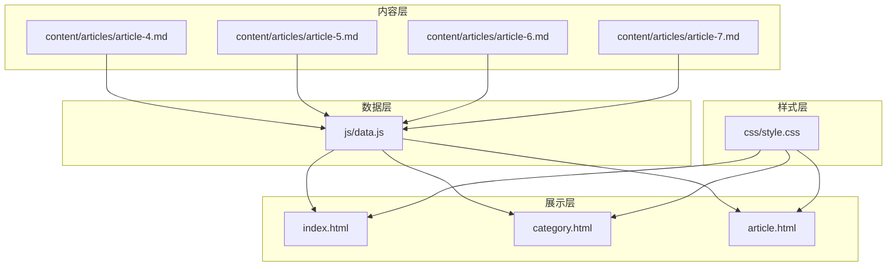
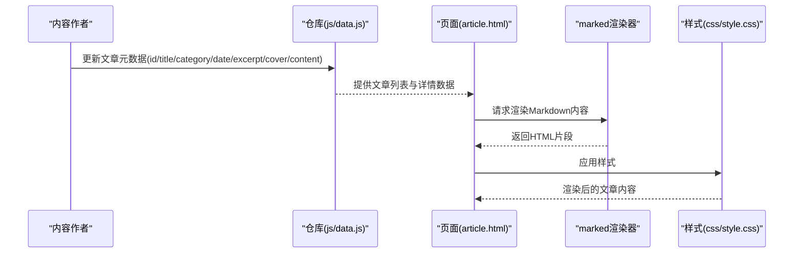
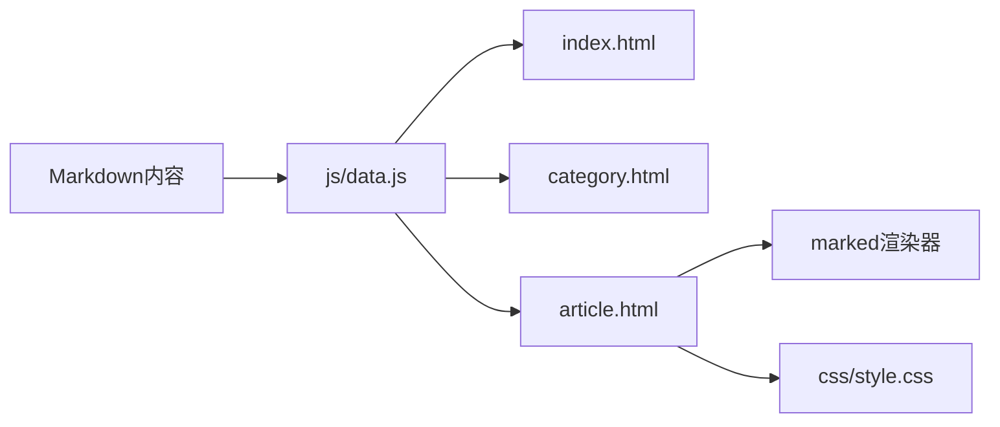

# Markdown写作规范

<cite>
**本文引用的文件**
- [CLAUDE.md](file://CLAUDE.md)
- [index.html](file://index.html)
- [category.html](file://category.html)
- [article.html](file://article.html)
- [js/data.js](file://js/data.js)
- [css/style.css](file://css/style.css)
- [content/articles/article-4.md](file://content/articles/article-4.md)
- [content/articles/article-5.md](file://content/articles/article-5.md)
- [content/articles/article-6.md](file://content/articles/article-6.md)
- [content/articles/article-7.md](file://content/articles/article-7.md)
</cite>

## 目录
1. [简介](#简介)
2. [项目结构](#项目结构)
3. [核心组件](#核心组件)
4. [架构总览](#架构总览)
5. [详细组件分析](#详细组件分析)
6. [依赖关系分析](#依赖关系分析)
7. [性能考量](#性能考量)
8. [故障排查指南](#故障排查指南)
9. [结论](#结论)
10. [附录](#附录)

## 简介
本指南面向Hot-Site平台的内容创作者，提供一套标准化的Markdown写作规范，确保文章在标题层级、列表格式、链接与图片、代码块、表格、引用等语法上的统一性与专业性；同时明确文章元数据配置方法（分类、日期、摘要、封面图等），并给出图片上传与链接管理的规范，以及实用的写作模板与检查清单，帮助提升文章质量与一致性。

## 项目结构
Hot-Site是一个静态站点，采用HTML/CSS/JavaScript技术栈，Markdown内容通过前端页面渲染展示。核心结构如下：
- 内容层：Markdown文章位于content/articles目录，每篇文章对应一个独立文件
- 数据层：js/data.js集中管理分类与文章元数据（标题、分类、日期、摘要、封面图、内容路径）
- 展示层：index.html（首页）、category.html（分类页）、article.html（详情页）负责页面布局与交互
- 样式层：css/style.css定义全局样式与Markdown渲染样式（标题、列表、引用、代码、表格、图片等）

图表来源
- [js/data.js:40-113](file://js/data.js#L40-L113)
- [index.html:29-190](file://index.html#L29-L190)
- [category.html:27-103](file://category.html#L27-L103)
- [article.html:27-107](file://article.html#L27-L107)
- [css/style.css:752-880](file://css/style.css#L752-L880)

章节来源
- [CLAUDE.md:13-23](file://CLAUDE.md#L13-L23)
- [js/data.js:40-113](file://js/data.js#L40-L113)
- [index.html:29-190](file://index.html#L29-L190)
- [category.html:27-103](file://category.html#L27-L103)
- [article.html:27-107](file://article.html#L27-L107)
- [css/style.css:752-880](file://css/style.css#L752-L880)

## 核心组件
- 文章元数据：在js/data.js中集中维护，包含id、title、category、date、excerpt、cover、content等字段
- Markdown渲染：article.html通过CDN引入marked进行Markdown渲染
- 样式规范：css/style.css对标题、列表、引用、代码、表格、图片等进行统一渲染
- 页面路由：index.html展示精选文章；category.html按分类筛选；article.html展示单篇文章

章节来源
- [js/data.js:40-113](file://js/data.js#L40-L113)
- [article.html:21-23](file://article.html#L21-L23)
- [css/style.css:752-880](file://css/style.css#L752-L880)
- [index.html:78-90](file://index.html#L78-L90)
- [category.html:62-76](file://category.html#L62-L76)

## 架构总览
下图展示了从Markdown内容到页面渲染的关键流程：文章元数据驱动页面展示，Markdown内容经由marked渲染为HTML，再由CSS进行样式化。

图表来源
- [js/data.js:40-113](file://js/data.js#L40-L113)
- [article.html:21-23](file://article.html#L21-L23)
- [css/style.css:752-880](file://css/style.css#L752-L880)

## 详细组件分析

### 标题层级规范（H1-H6）
- 一级标题用于文章主标题，二级标题用于章节划分，三级标题用于子章节，四级及以上用于细节层级
- 标题应简洁明确，避免冗长；同一层级内避免跳跃使用
- 标题前后建议留空行，便于渲染器识别

章节来源
- [content/articles/article-4.md:1](file://content/articles/article-4.md#L1)
- [content/articles/article-5.md:1](file://content/articles/article-5.md#L1)
- [content/articles/article-6.md:1](file://content/articles/article-6.md#L1)
- [content/articles/article-7.md:1](file://content/articles/article-7.md#L1)
- [css/style.css:760-780](file://css/style.css#L760-L780)

### 列表格式规范（有序、无序、任务列表）
- 无序列表：使用连字符或星号，缩进一致，项之间留空行
- 有序列表：使用数字加点，顺序自然递增，避免跳跃编号
- 任务列表：使用复选框标记完成状态，便于追踪进度
- 列表嵌套：使用4空格缩进，保持层级清晰

章节来源
- [content/articles/article-4.md:9-12](file://content/articles/article-4.md#L9-L12)
- [content/articles/article-6.md:13-17](file://content/articles/article-6.md#L13-L17)
- [content/articles/article-7.md:15-58](file://content/articles/article-7.md#L15-L58)
- [css/style.css:801-811](file://css/style.css#L801-L811)

### 链接与图片插入最佳实践
- 链接：优先使用纯文本链接，必要时使用标题说明；避免暴露隐私信息
- 图片：建议使用外链（如Unsplash），确保尺寸与加载性能；图片应居中展示，具备可访问性alt描述
- 相对路径：仅在本地资源可用时使用，注意路径与部署根路径的关系
- 绝对路径：推荐使用HTTPS外链，确保跨域与安全

章节来源
- [js/data.js:47-48](file://js/data.js#L47-L48)
- [js/data.js:56-57](file://js/data.js#L56-L57)
- [js/data.js:74-75](file://js/data.js#L74-L75)
- [js/data.js:101-102](file://js/data.js#L101-L102)
- [css/style.css:849-853](file://css/style.css#L849-L853)

### 代码块、表格、引用等高级语法
- 代码块：使用三反引号包裹，标注语言类型以便高亮；避免在代码块中出现敏感信息
- 表格：使用标准管道语法，表头与内容对齐；避免过宽表格影响阅读
- 引用：使用块级引用强调观点或摘录；引用内容需注明来源

章节来源
- [content/articles/article-5.md:13-17](file://content/articles/article-5.md#L13-L17)
- [content/articles/article-5.md:23-29](file://content/articles/article-5.md#L23-L29)
- [content/articles/article-5.md:38-47](file://content/articles/article-5.md#L38-L47)
- [content/articles/article-5.md:51-55](file://content/articles/article-5.md#L51-L55)
- [content/articles/article-5.md:61-66](file://content/articles/article-5.md#L61-L66)
- [content/articles/article-5.md:72-75](file://content/articles/article-5.md#L72-L75)
- [content/articles/article-5.md:83-91](file://content/articles/article-5.md#L83-L91)
- [content/articles/article-5.md:113-125](file://content/articles/article-5.md#L113-L125)
- [content/articles/article-5.md:158-162](file://content/articles/article-5.md#L158-L162)
- [content/articles/article-5.md:166-170](file://content/articles/article-5.md#L166-L170)
- [content/articles/article-5.md:174-176](file://content/articles/article-5.md#L174-L176)
- [content/articles/article-6.md:44-59](file://content/articles/article-6.md#L44-L59)
- [content/articles/article-6.md:65-74](file://content/articles/article-6.md#L65-L74)
- [content/articles/article-6.md:78-85](file://content/articles/article-6.md#L78-L85)
- [content/articles/article-6.md:91-94](file://content/articles/article-6.md#L91-L94)
- [content/articles/article-6.md:102-104](file://content/articles/article-6.md#L102-L104)
- [content/articles/article-6.md:110-113](file://content/articles/article-6.md#L110-L113)
- [content/articles/article-6.md:128-132](file://content/articles/article-6.md#L128-L132)
- [content/articles/article-7.md:122-134](file://content/articles/article-7.md#L122-L134)
- [css/style.css:813-821](file://css/style.css#L813-L821)
- [css/style.css:832-847](file://css/style.css#L832-L847)
- [css/style.css:862-879](file://css/style.css#L862-L879)

### 文章元数据配置方法
- 字段说明
  - id：唯一标识符，用于路由与数据检索
  - title：文章标题，建议简洁明确
  - category：分类标识，与js/data.js中的分类配置一致
  - date：发布日期，格式YYYY-MM-DD
  - excerpt：摘要，用于首页与分类页展示
  - cover：封面图URL，建议使用HTTPS外链
  - content：Markdown内容文件路径，相对于仓库根目录
- 新增文章流程
  - 在content/articles目录新增Markdown文件
  - 在js/data.js的ARTICLES数组中追加元数据条目
  - 确保分类存在且与CATEGORIES配置一致
  - 验证首页与分类页展示正常

章节来源
- [js/data.js:40-113](file://js/data.js#L40-L113)
- [js/data.js:6-37](file://js/data.js#L6-L37)
- [CLAUDE.md:46](file://CLAUDE.md#L46)

### 图片上传与链接管理规范
- 图片上传
  - 推荐使用公共图床（如Unsplash），确保HTTPS与CDN加速
  - 控制图片尺寸与格式，避免过大文件影响加载性能
- 链接管理
  - 外链：使用HTTPS协议，避免混合内容
  - 内链：使用相对路径时，确保与部署根路径一致
  - 避免泄露隐私信息与敏感链接
- 可访问性
  - 为图片提供alt描述，提升可访问性
  - 引用外部资源时注明来源

章节来源
- [js/data.js:47-48](file://js/data.js#L47-L48)
- [js/data.js:56-57](file://js/data.js#L56-L57)
- [js/data.js:74-75](file://js/data.js#L74-L75)
- [js/data.js:101-102](file://js/data.js#L101-L102)
- [css/style.css:849-853](file://css/style.css#L849-L853)

### 写作模板与检查清单
- 模板结构
  - 标题：H1主标题
  - 摘要：简要概述文章要点
  - 目录：可选，便于长文导航
  - 正文：按章节组织，使用H2/H3层级
  - 代码：使用代码块并标注语言
  - 表格：使用标准语法，保持对齐
  - 引用：注明来源与链接
  - 结语：总结与金句
- 检查清单
  - 标题层级是否规范
  - 列表缩进与格式是否一致
  - 代码块语言标注是否正确
  - 表格对齐与可读性
  - 引用来源是否完整
  - 图片链接是否可用、加载是否正常
  - 链接是否为HTTPS
  - 元数据是否完整并已同步到js/data.js
  - 首页与分类页展示是否正常

章节来源
- [content/articles/article-4.md:1-153](file://content/articles/article-4.md#L1-L153)
- [content/articles/article-5.md:1-193](file://content/articles/article-5.md#L1-L193)
- [content/articles/article-6.md:1-200](file://content/articles/article-6.md#L1-L200)
- [content/articles/article-7.md:1-200](file://content/articles/article-7.md#L1-L200)
- [js/data.js:40-113](file://js/data.js#L40-L113)

## 依赖关系分析
- 文章内容依赖于js/data.js提供的元数据
- 页面渲染依赖于article.html中的marked CDN与css/style.css样式
- 分类筛选依赖于js/data.js中的分类配置与页面逻辑

图表来源
- [js/data.js:40-113](file://js/data.js#L40-L113)
- [article.html:21-23](file://article.html#L21-L23)
- [css/style.css:752-880](file://css/style.css#L752-L880)

章节来源
- [js/data.js:40-113](file://js/data.js#L40-L113)
- [article.html:21-23](file://article.html#L21-L23)
- [css/style.css:752-880](file://css/style.css#L752-L880)

## 性能考量
- 图片优化：使用合适尺寸与格式，优先HTTPS外链
- 代码块：避免超长代码块导致滚动卡顿
- 表格：避免过宽表格，必要时提供横向滚动
- 渲染性能：减少不必要的DOM层级，保持Markdown结构简洁

## 故障排查指南
- 文章不显示
  - 检查js/data.js中ARTICLES条目是否完整
  - 确认content路径与文件名一致
- 样式异常
  - 检查css/style.css是否正确加载
  - 确认标题、列表、代码、表格等语法正确
- 链接失效
  - 使用HTTPS外链
  - 验证图片URL可访问性
- 分类筛选无效
  - 检查分类标识与CATEGORIES配置一致

章节来源
- [js/data.js:40-113](file://js/data.js#L40-L113)
- [css/style.css:752-880](file://css/style.css#L752-L880)

## 结论
遵循本规范可显著提升Hot-Site平台文章的可读性、一致性与专业性。通过标准化的标题层级、列表格式、链接与图片管理、元数据配置与高级语法使用，内容创作者能够高效产出高质量内容，并确保在不同页面与设备上的良好展示效果。

## 附录
- 示例文章参考
  - [电子音乐制作：从采样到混音:1-153](file://content/articles/article-4.md#L1-L153)
  - [TypeScript 高级类型体操：从入门到实践:1-193](file://content/articles/article-5.md#L1-L193)
  - [提示词工程：与 AI 高效对话的艺术:1-200](file://content/articles/article-6.md#L1-L200)
  - [Unity vs Godot： indie 游戏引擎对比:1-200](file://content/articles/article-7.md#L1-L200)