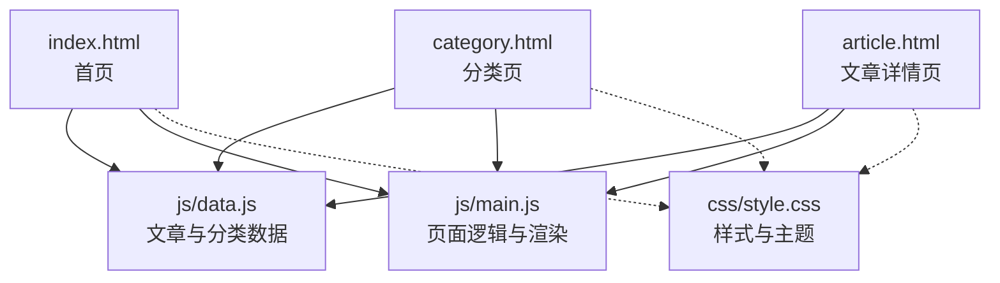
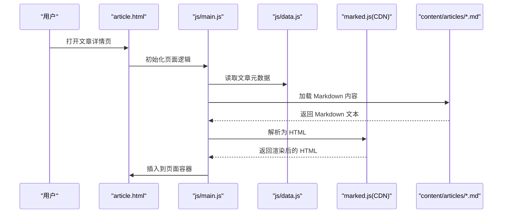
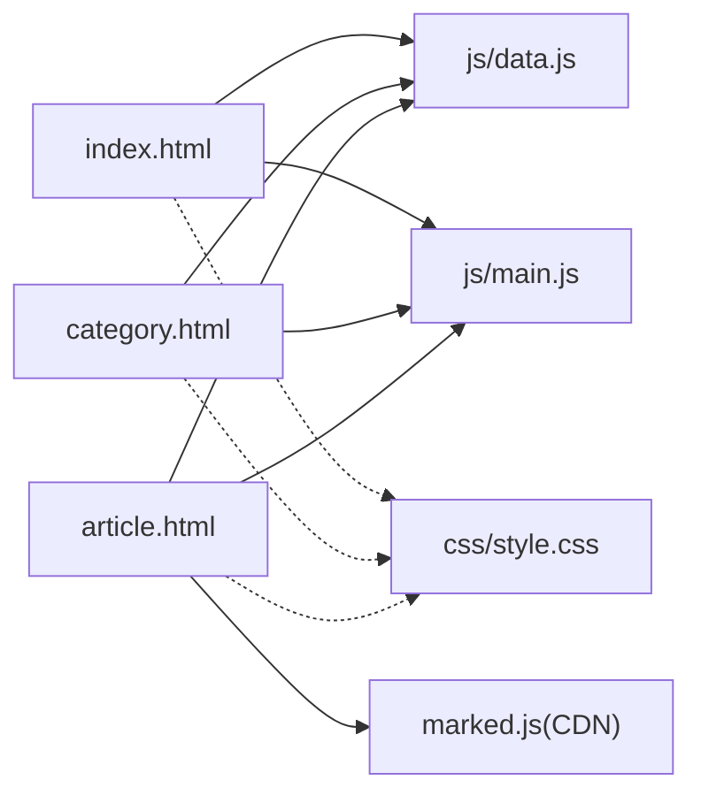
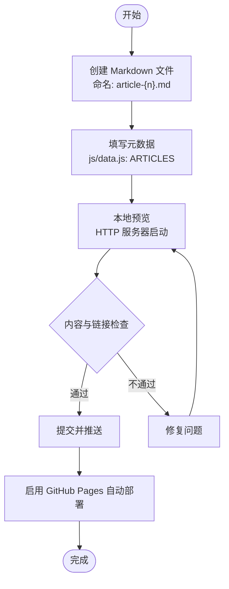

# 内容管理

<cite>
**本文引用的文件**
- [README.md](file://README.md)
- [CLAUDE.md](file://CLAUDE.md)
- [index.html](file://index.html)
- [category.html](file://category.html)
- [article.html](file://article.html)
- [js/data.js](file://js/data.js)
- [js/main.js](file://js/main.js)
- [css/style.css](file://css/style.css)
- [content/articles/article-4.md](file://content/articles/article-4.md)
- [content/articles/article-5.md](file://content/articles/article-5.md)
- [content/articles/article-6.md](file://content/articles/article-6.md)
- [content/articles/article-7.md](file://content/articles/article-7.md)
</cite>

## 目录
1. [简介](#简介)
2. [项目结构](#项目结构)
3. [核心组件](#核心组件)
4. [架构总览](#架构总览)
5. [详细组件分析](#详细组件分析)
6. [依赖关系分析](#依赖关系分析)
7. [性能考量](#性能考量)
8. [故障排查指南](#故障排查指南)
9. [结论](#结论)
10. [附录](#附录)

## 简介
本指南面向内容创作者与站点维护者，系统讲解 Hot-Site 内容管理系统的 Markdown 文章编写规范、元数据配置、发布流程、分类管理、内容组织与 SEO 优化策略，并提供实用写作模板与最佳实践建议。系统基于纯静态 HTML/CSS/JS 构建，使用 Markdown 文件作为内容源，通过前端 JavaScript 动态渲染与路由，支持 GitHub Pages 一键部署。

## 项目结构
- 静态页面：首页、分类页、文章详情页
- 样式：统一的 CSS 变量与响应式布局
- 脚本：数据模型与页面逻辑分离
- 内容：Markdown 文章与图片资源

图表来源
- [index.html:1-190](file://index.html#L1-L190)
- [category.html:1-103](file://category.html#L1-L103)
- [article.html:1-107](file://article.html#L1-L107)
- [js/data.js:1-158](file://js/data.js#L1-L158)
- [js/main.js:1-461](file://js/main.js#L1-L461)
- [css/style.css:1-800](file://css/style.css#L1-L800)

章节来源
- [README.md: 26-47:26-47](file://README.md#L26-L47)

## 核心组件
- 数据层（js/data.js）
  - 分类配置：名称、描述、颜色
  - 文章元数据：id、标题、分类、日期、摘要、封面图、内容路径
  - 查询接口：按分类、ID、精选、搜索
- 页面层（HTML + JS）
  - 首页：渲染精选文章网格
  - 分类页：筛选按钮、文章网格
  - 文章详情页：头部信息、封面图、Markdown 内容渲染、图片 Lightbox
- 样式层（CSS）
  - 主题色与分类色
  - 响应式网格与卡片
  - 动画与无障碍标签

章节来源
- [js/data.js: 6-37:6-37](file://js/data.js#L6-L37)
- [js/data.js: 40-113:40-113](file://js/data.js#L40-L113)
- [js/main.js: 148-154:148-154](file://js/main.js#L148-L154)
- [js/main.js: 158-177:158-177](file://js/main.js#L158-L177)
- [js/main.js: 222-243:222-243](file://js/main.js#L222-L243)
- [css/style.css: 8-78:8-78](file://css/style.css#L8-L78)

## 架构总览
系统采用“静态页面 + 前端渲染”的轻量架构。Markdown 内容通过 fetch 请求加载，使用 marked.js CDN 渲染为 HTML；文章元数据集中管理，页面逻辑负责路由、筛选与渲染。

图表来源
- [article.html:1-107](file://article.html#L1-L107)
- [js/main.js: 222-243:222-243](file://js/main.js#L222-L243)
- [js/main.js: 272-314:272-314](file://js/main.js#L272-L314)
- [js/data.js: 40-113:40-113](file://js/data.js#L40-L113)

## 详细组件分析

### Markdown 文章编写规范
- 标题层级
  - 使用 H1 作为文章主标题，H2/H3 作为章节标题，层级清晰，便于目录与可访问性
  - 示例参考：[content/articles/article-4.md:1-153](file://content/articles/article-4.md#L1-L153)、[content/articles/article-5.md:1-193](file://content/articles/article-5.md#L1-L193)
- 列表格式
  - 有序/无序列表均可，注意缩进与一致性
  - 示例参考：[content/articles/article-4.md:16-46](file://content/articles/article-4.md#L16-L46)、[content/articles/article-6.md:13-36](file://content/articles/article-6.md#L13-L36)
- 链接与图片
  - 链接使用标准 Markdown 语法，确保可读性
  - 图片建议使用外部图床（如 Unsplash），并配合懒加载与 Lightbox 放大查看
  - 示例参考：[content/articles/article-4.md:73-75](file://content/articles/article-4.md#L73-L75)、[js/main.js: 295-296:295-296](file://js/main.js#L295-L296)
- 代码块
  - 使用围栏代码块与语言标识，提升可读性
  - 示例参考：[content/articles/article-5.md:13-29](file://content/articles/article-5.md#L13-L29)
- 分隔线与强调
  - 使用分隔线（---）作为文章结尾标记，便于识别
  - 示例参考：[content/articles/article-4.md: 151:151-153](file://content/articles/article-4.md#L151-L153)、[content/articles/article-5.md: 191:191-193](file://content/articles/article-5.md#L191-L193)

章节来源
- [content/articles/article-4.md: 1-L153:1-153](file://content/articles/article-4.md#L1-L153)
- [content/articles/article-5.md: 1-L193:1-193](file://content/articles/article-5.md#L1-L193)
- [content/articles/article-6.md: 1-L188:1-188](file://content/articles/article-6.md#L1-L188)
- [content/articles/article-7.md: 1-L200:1-200](file://content/articles/article-7.md#L1-L200)

### 文章元数据配置方法
- 元数据字段
  - id：唯一标识
  - title：文章标题
  - category：分类（tech、ai、game、music、art）
  - date：发布日期（YYYY-MM-DD）
  - excerpt：摘要（建议 50-100 字）
  - cover：封面图 URL（建议使用高质量占位图）
  - content：Markdown 文件路径
- 配置位置
  - 在 js/data.js 的 ARTICLES 数组中新增条目
- 示例参考
  - [js/data.js: 40-113:40-113](file://js/data.js#L40-L113)

章节来源
- [js/data.js: 40-113:40-113](file://js/data.js#L40-L113)
- [README.md: 98-116:98-116](file://README.md#L98-L116)

### 文章发布流程（从创建到上线）
- 创建 Markdown 文件
  - 在 content/articles/ 下新建文件，命名建议使用 article-{n}.md
- 填写元数据
  - 在 js/data.js 的 ARTICLES 中添加对应条目
- 本地预览
  - 使用任意 HTTP 服务器启动（推荐 Python、npx serve、PHP）
  - 注意：直接双击打开 index.html 可能导致文章详情页 Markdown 加载受限
- 提交与部署
  - 推送至 GitHub，启用 GitHub Pages，等待自动部署
- 参考步骤
  - [README.md: 51-76:51-76](file://README.md#L51-L76)
  - [README.md: 77-96:77-96](file://README.md#L77-L96)

章节来源
- [README.md: 51-76:51-76](file://README.md#L51-L76)
- [README.md: 77-96:77-96](file://README.md#L77-L96)

### 分类系统管理
- 分类配置
  - 在 js/data.js 的 CATEGORIES 中定义分类名称、描述与颜色
  - 分类颜色与 CSS 类名一一对应
- 分类样式
  - 在 css/style.css 中为各分类添加样式（如 .category-tech、.category-ai 等）
- 导航与筛选
  - 首页与分类页均通过导航链接与筛选按钮访问分类内容
- 新增分类步骤
  - 在 js/data.js 添加分类
  - 在 css/style.css 添加对应样式
  - 在导航栏中添加链接
- 参考步骤
  - [js/data.js: 6-37:6-37](file://js/data.js#L6-L37)
  - [css/style.css: 550-L628:550-628](file://css/style.css#L550-L628)
  - [index.html: 44-51:44-51](file://index.html#L44-L51)
  - [category.html: 42-49:42-49](file://category.html#L42-L49)
  - [README.md: 141-146:141-146](file://README.md#L141-L146)

章节来源
- [js/data.js: 6-37:6-37](file://js/data.js#L6-L37)
- [css/style.css: 550-L628:550-628](file://css/style.css#L550-L628)
- [index.html: 44-51:44-51](file://index.html#L44-L51)
- [category.html: 42-49:42-49](file://category.html#L42-L49)
- [README.md: 141-146:141-146](file://README.md#L141-L146)

### 内容组织策略与 SEO 优化
- 内容组织
  - 使用清晰的标题层级与段落分隔，提升可读性
  - 合理使用列表、表格与代码块，突出重点信息
- SEO 优化
  - 页面具备语义化结构与 ARIA 标签
  - 首页与分类页包含 meta description、keywords、Open Graph 标签
  - 文章详情页设置 og:type 为 article，利于社交分享
- 参考文件
  - [index.html: 3-L28:3-28](file://index.html#L3-L28)
  - [category.html: 4-L13:4-13](file://category.html#L4-L13)
  - [article.html: 3-L11:3-11](file://article.html#L3-L11)

章节来源
- [index.html: 3-L28:3-28](file://index.html#L3-L28)
- [category.html: 4-L13:4-13](file://category.html#L4-L13)
- [article.html: 3-L11:3-11](file://article.html#L3-L11)

### 写作模板与最佳实践
- 标题与摘要
  - 标题简洁有力，摘要概括全文要点
- 结构化内容
  - 使用 H2/H3 分节，配合列表与表格
- 代码与示例
  - 使用围栏代码块，必要时标注语言
- 图片与链接
  - 图片使用外部图床，链接指向权威来源
- 发布前检查
  - 本地预览、检查链接与图片、确认分类与日期正确

章节来源
- [content/articles/article-4.md: 1-L153:1-153](file://content/articles/article-4.md#L1-L153)
- [content/articles/article-5.md: 1-L193:1-193](file://content/articles/article-5.md#L1-L193)
- [content/articles/article-6.md: 1-L188:1-188](file://content/articles/article-6.md#L1-L188)
- [content/articles/article-7.md: 1-L200:1-200](file://content/articles/article-7.md#L1-L200)

## 依赖关系分析
- 页面与脚本
  - index.html、category.html、article.html 均引入 js/data.js 与 js/main.js
- 样式依赖
  - 三页面共享 css/style.css，主题色与分类色集中管理
- Markdown 渲染
  - article.html 通过 CDN 引入 marked.js，用于将 Markdown 内容渲染为 HTML

图表来源
- [index.html:187-189](file://index.html#L187-L189)
- [category.html:99-101](file://category.html#L99-L101)
- [article.html:21-22](file://article.html#L21-L22)
- [js/data.js:1-158](file://js/data.js#L1-L158)
- [js/main.js:1-461](file://js/main.js#L1-L461)
- [css/style.css:1-800](file://css/style.css#L1-L800)

章节来源
- [index.html: 187-L189:187-189](file://index.html#L187-L189)
- [category.html: 99-L101:99-101](file://category.html#L99-L101)
- [article.html: 21-L22:21-22](file://article.html#L21-L22)

## 性能考量
- 资源加载
  - 使用 CDN 加载 marked.js，减少本地依赖
  - 图片懒加载与 Lightbox 优化用户体验
- 渲染策略
  - 首屏优先渲染精选文章网格，后续异步加载详情页内容
- 响应式与动画
  - CSS 动画与过渡采用轻量实现，避免阻塞主线程

章节来源
- [js/main.js: 272-314:272-314](file://js/main.js#L272-L314)
- [css/style.css: 130-L139:130-139](file://css/style.css#L130-L139)

## 故障排查指南
- 文章详情页无法加载 Markdown
  - 确保使用 HTTP 服务器启动，避免直接双击打开 HTML 文件
  - 检查 Markdown 文件路径与 js/data.js 中 content 字段一致
- 分类筛选无效
  - 确认 URL 参数 cat 与 js/data.js 中分类键一致
  - 检查分类样式是否已添加到 css/style.css
- 图片无法显示或放大
  - 确认 cover URL 可访问
  - 检查 marked.js 是否成功加载，若未加载则回退显示原始 Markdown
- 部署后页面空白
  - 确认 GitHub Pages 设置为从 main 分支根目录发布

章节来源
- [README.md: 75-L76:75-76](file://README.md#L75-L76)
- [js/data.js: 40-113:40-113](file://js/data.js#L40-L113)
- [js/main.js: 272-314:272-314](file://js/main.js#L272-L314)
- [CLAUDE.md: 35-L39:35-39](file://CLAUDE.md#L35-L39)

## 结论
Hot-Site 以极简架构实现了高质量的内容展示与管理：Markdown 内容 + 前端渲染 + 分类与筛选 + SEO 友好 + GitHub Pages 一键部署。遵循本文规范与流程，即可高效创建与维护内容，实现从创作到上线的全流程自动化。

## 附录

### Markdown 写作流程图

图表来源
- [README.md: 51-76:51-76](file://README.md#L51-L76)
- [README.md: 77-96:77-96](file://README.md#L77-L96)
- [README.md: 98-116:98-116](file://README.md#L98-L116)