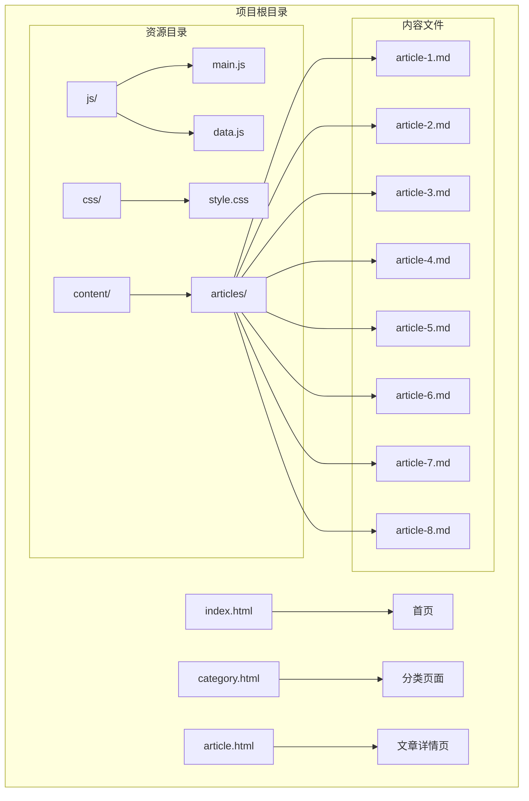
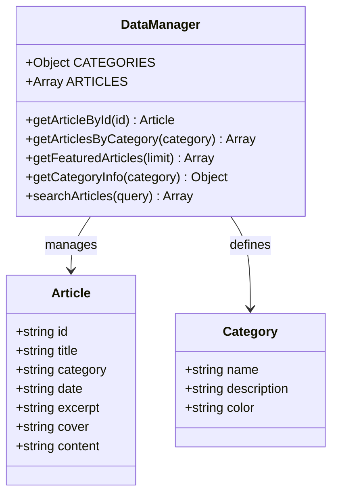
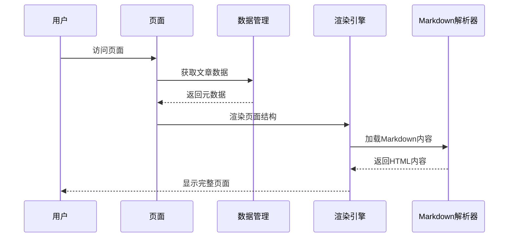
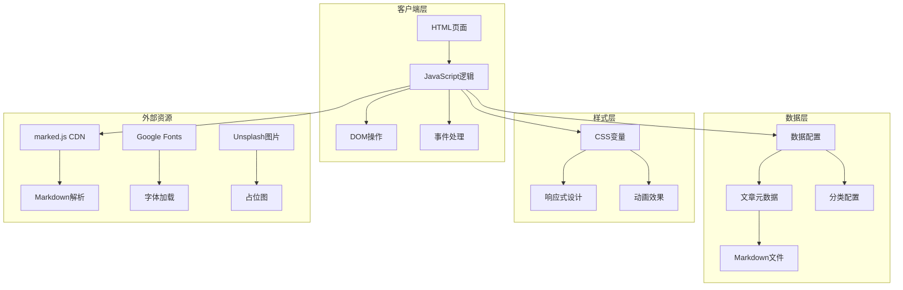
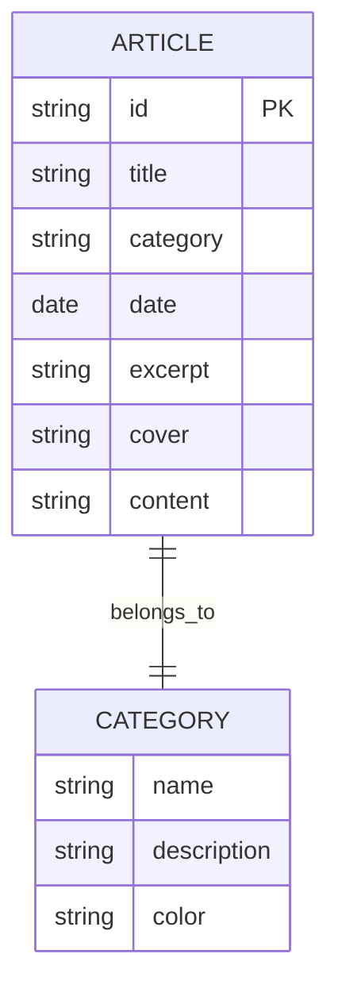
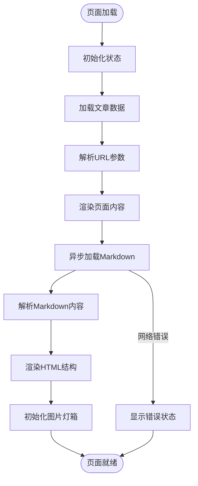
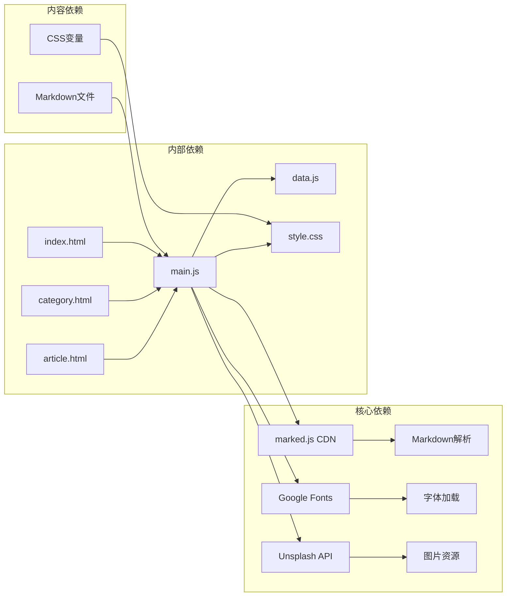

# 内容组织策略

<cite>
**本文档引用的文件**
- [README.md](file://README.md)
- [index.html](file://index.html)
- [category.html](file://category.html)
- [article.html](file://article.html)
- [js/data.js](file://js/data.js)
- [js/main.js](file://js/main.js)
- [css/style.css](file://css/style.css)
- [content/articles/article-1.md](file://content/articles/article-1.md)
- [content/articles/article-2.md](file://content/articles/article-2.md)
- [content/articles/article-3.md](file://content/articles/article-3.md)
- [content/articles/article-4.md](file://content/articles/article-4.md)
- [content/articles/article-5.md](file://content/articles/article-5.md)
- [content/articles/article-6.md](file://content/articles/article-6.md)
- [content/articles/article-7.md](file://content/articles/article-7.md)
- [content/articles/article-8.md](file://content/articles/article-8.md)
</cite>

## 目录
1. [引言](#引言)
2. [项目结构](#项目结构)
3. [核心组件](#核心组件)
4. [架构概览](#架构概览)
5. [详细组件分析](#详细组件分析)
6. [依赖关系分析](#依赖关系分析)
7. [性能考量](#性能考量)
8. [故障排除指南](#故障排除指南)
9. [结论](#结论)
10. [附录](#附录)

## 引言

Hot-Site 是一个现代化的静态内容聚合平台，专注于技术、AI、游戏、音乐和艺术领域的优质内容展示。该项目采用纯静态技术栈构建，具备响应式设计、无障碍支持和SEO友好特性。本文档旨在为内容管理者提供一套完整的Hot-Site平台内容组织策略指南，涵盖内容结构设计、分类体系、标签系统、时间线管理、优先级策略、增长规划、SEO优化和数据分析等关键方面。

## 项目结构

Hot-Site采用简洁而高效的项目结构，主要由HTML页面、JavaScript逻辑、CSS样式和Markdown内容组成：

**图表来源**
- [README.md:26-47](file://README.md#L26-L47)
- [index.html:1-190](file://index.html#L1-L190)
- [category.html:1-103](file://category.html#L1-L103)

### 页面架构

Hot-Site包含三个核心页面，每个页面都有特定的功能定位：

- **首页 (index.html)**：展示精选内容、分类导航和平台介绍
- **分类页面 (category.html)**：按主题分类展示文章列表
- **文章详情页 (article.html)**：展示完整的Markdown内容

**章节来源**
- [index.html:29](file://index.html#L29)
- [category.html:27](file://category.html#L27)
- [article.html](file://article.html)

## 核心组件

### 数据管理系统

Hot-Site采用集中式的数据管理策略，所有内容元数据都存储在JavaScript文件中，实现了数据与视图的分离：

**图表来源**
- [js/data.js:6-37](file://js/data.js#L6-L37)
- [js/data.js:40-113](file://js/data.js#L40-L113)

### 前端渲染引擎

主JavaScript文件负责页面逻辑、交互和内容渲染，采用模块化设计：

**图表来源**
- [js/main.js:272-314](file://js/main.js#L272-L314)
- [js/data.js:115-145](file://js/data.js#L115-L145)

**章节来源**
- [js/data.js:1-158](file://js/data.js#L1-L158)
- [js/main.js:1-461](file://js/main.js#L1-L461)

## 架构概览

Hot-Site采用前后端分离的静态网站架构，具有以下特点：

**图表来源**
- [js/main.js:272-314](file://js/main.js#L272-L314)
- [css/style.css:8-78](file://css/style.css#L8-L78)

### 技术栈特性

- **零依赖构建**：纯HTML、CSS、JavaScript，无需构建工具
- **Markdown驱动**：内容以Markdown格式存储，前端实时渲染
- **响应式设计**：移动端、平板、桌面三端适配
- **无障碍支持**：符合WCAG 2.1 AA标准
- **SEO友好**：语义化HTML和正确meta标签

**章节来源**
- [README.md:5-15](file://README.md#L5-L15)

## 详细组件分析

### 内容分类系统

Hot-Site采用五分类内容组织策略，每个分类都有独特的视觉标识和语义含义：

| 分类 | 颜色代码 | 描述 | 适用内容 |
|------|----------|------|----------|
| 技术 (tech) | #6366f1 | 前端开发、编程技术 | 前端架构、TypeScript、开发工具 |
| AI | #10b981 | 人工智能、机器学习 | 大语言模型、提示词工程 |
| 游戏 (game) | #f43f5e | 游戏开发、设计 | Unity、Godot、独立游戏 |
| 音乐 (music) | #8b5cf6 | 音乐创作、欣赏 | 电子音乐制作、音乐理论 |
| 艺术 (art) | #06b6d4 | 创意表达、美学探索 | 设计、创意内容 |

**章节来源**
- [js/data.js:7-37](file://js/data.js#L7-L37)
- [css/style.css:488-511](file://css/style.css#L488-L511)

### 文章元数据结构

每篇文章都包含完整的元数据信息，确保内容的可发现性和可管理性：

**图表来源**
- [js/data.js:40-113](file://js/data.js#L40-L113)
- [js/data.js:6-37](file://js/data.js#L6-L37)

### 页面渲染流程

Hot-Site的页面渲染采用异步加载和懒加载策略，确保良好的用户体验：

**图表来源**
- [js/main.js:220-314](file://js/main.js#L220-L314)

**章节来源**
- [js/main.js:148-218](file://js/main.js#L148-L218)

### 用户交互设计

平台注重用户体验和可访问性，提供了丰富的交互功能：

- **防抖导航**：滚动时导航栏样式切换
- **移动端汉堡菜单**：响应式导航菜单
- **图片灯箱**：点击放大查看图片
- **返回顶部**：便捷的页面导航
- **键盘导航**：完整的键盘操作支持

**章节来源**
- [js/main.js:43-77](file://js/main.js#L43-L77)
- [js/main.js:316-403](file://js/main.js#L316-L403)

## 依赖关系分析

Hot-Site的依赖关系相对简单，主要依赖于外部CDN资源：

**图表来源**
- [js/main.js:290-300](file://js/main.js#L290-L300)
- [index.html:22-24](file://index.html#L22-L24)

### 外部资源管理

平台对外部资源的管理策略：

- **marked.js CDN**：用于Markdown内容解析
- **Google Fonts**：字体资源加载
- **Unsplash图片**：高质量占位图
- **GitHub Pages**：托管和部署

**章节来源**
- [README.md:147-152](file://README.md#L147-L152)

## 性能考量

Hot-Site在性能优化方面采用了多项策略：

### 加载优化

- **懒加载图片**：使用`loading="lazy"`属性
- **异步Markdown加载**：避免阻塞页面渲染
- **CSS变量缓存**：减少样式计算开销
- **防抖函数**：优化滚动和窗口大小变化事件

### 内容优化

- **图片懒加载**：减少初始页面大小
- **CDN资源**：利用浏览器缓存机制
- **CSS模块化**：按需加载样式
- **JavaScript模块化**：代码分割和延迟加载

### 用户体验优化

- **页面过渡动画**：平滑的页面切换效果
- **骨架屏加载**：改善感知性能
- **错误处理**：友好的错误提示
- **无障碍支持**：完整的可访问性功能

## 故障排除指南

### 常见问题及解决方案

**问题1：文章详情页无法加载Markdown内容**
- **原因**：浏览器安全策略限制本地文件访问
- **解决方案**：使用HTTP服务器而非直接打开文件

**问题2：图片加载失败**
- **原因**：Unsplash API限制或网络问题
- **解决方案**：检查网络连接或使用本地图片

**问题3：分类筛选功能异常**
- **原因**：JavaScript执行错误或DOM元素缺失
- **解决方案**：检查浏览器控制台错误信息

**问题4：移动端显示异常**
- **原因**：CSS媒体查询或JavaScript兼容性问题
- **解决方案**：检查响应式设计和触摸事件处理

**章节来源**
- [README.md:75](file://README.md#L75)
- [js/main.js:301-313](file://js/main.js#L301-L313)

### 调试工具使用

- **浏览器开发者工具**：检查网络请求和JavaScript错误
- **控制台日志**：监控应用程序状态
- **元素检查器**：验证CSS样式应用
- **网络面板**：分析资源加载性能

## 结论

Hot-Site平台提供了一个完整的内容组织和展示解决方案。通过合理的分类体系、清晰的数据结构、优雅的用户界面和完善的性能优化，该平台能够有效地管理和展示各类内容。

对于内容管理者而言，Hot-Site的核心优势在于其简洁的架构、强大的可扩展性和优秀的用户体验。平台的设计理念体现了现代Web开发的最佳实践，为内容创作者提供了一个可靠的展示平台。

## 附录

### SEO优化最佳实践

基于Hot-Site的现有实现，以下是SEO优化的具体建议：

**元数据优化**
- 为每个页面设置独特的标题和描述
- 使用适当的关键词密度
- 优化Open Graph标签
- 添加结构化数据

**内容优化**
- 确保内容的原创性和价值
- 使用清晰的标题层级
- 优化图片的alt属性
- 添加内部链接

**技术优化**
- 确保页面加载速度
- 优化移动端体验
- 添加robots.txt文件
- 设置sitemap.xml

**内容增长策略**
- 建立内容日历和发布计划
- 定期更新过时内容
- 鼓励用户评论和互动
- 跨平台推广内容

**数据分析方法**
- 使用Google Analytics跟踪访问数据
- 监控页面停留时间和跳出率
- 分析热门内容和流量来源
- 定期评估SEO表现