# 分类管理系统

<cite>
**本文档引用的文件**
- [js/data.js](file://js/data.js)
- [js/main.js](file://js/main.js)
- [category.html](file://category.html)
- [index.html](file://index.html)
- [css/style.css](file://css/style.css)
- [content/articles/article-1.md](file://content/articles/article-1.md)
- [content/articles/article-2.md](file://content/articles/article-2.md)
</cite>

## 目录
1. [简介](#简介)
2. [项目结构](#项目结构)
3. [核心组件](#核心组件)
4. [架构概览](#架构概览)
5. [详细组件分析](#详细组件分析)
6. [依赖关系分析](#依赖关系分析)
7. [性能考虑](#性能考虑)
8. [故障排除指南](#故障排除指南)
9. [结论](#结论)
10. [附录](#附录)

## 简介

Hot-Site平台是一个基于静态网站技术构建的内容管理系统，采用简洁优雅的设计风格，专注于技术、AI、游戏、音乐和艺术五大核心领域的知识分享。该平台通过精心设计的分类体系，为用户提供清晰的内容导航和优质的阅读体验。

平台的核心设计理念是"内容为王，分类为纲"，通过科学的分类管理和直观的用户界面，让用户能够快速找到感兴趣的内容。整个系统采用纯前端技术实现，无需服务器端处理，具有加载速度快、安全性高、部署简便等优势。

## 项目结构

Hot-Site平台采用模块化的设计思路，将功能按照职责进行清晰划分：

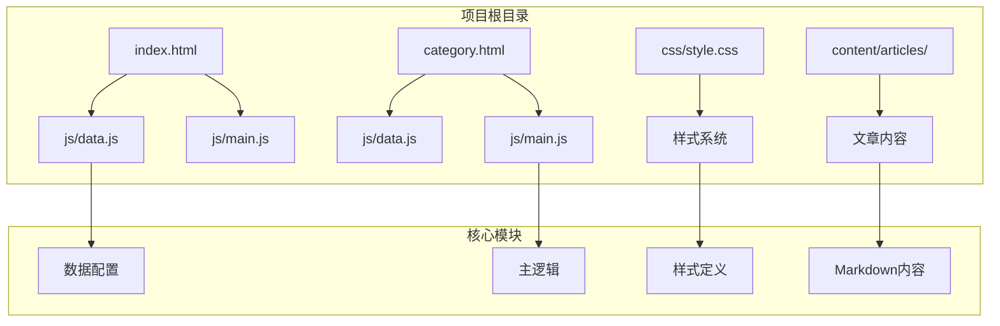

**图表来源**
- [js/data.js:1-158](file://js/data.js#L1-L158)
- [js/main.js:1-461](file://js/main.js#L1-L461)
- [category.html:1-103](file://category.html#L1-L103)
- [index.html:1-190](file://index.html#L1-L190)

**章节来源**
- [js/data.js:1-158](file://js/data.js#L1-L158)
- [js/main.js:1-461](file://js/main.js#L1-L461)
- [category.html:1-103](file://category.html#L1-L103)
- [index.html:1-190](file://index.html#L1-L190)

## 核心组件

### 分类配置系统

平台采用集中式的分类配置管理，所有分类信息都定义在`CATEGORIES`常量中。每个分类包含以下核心属性：

- **name**: 分类显示名称
- **description**: 分类描述信息  
- **color**: 分类配色方案（可选）

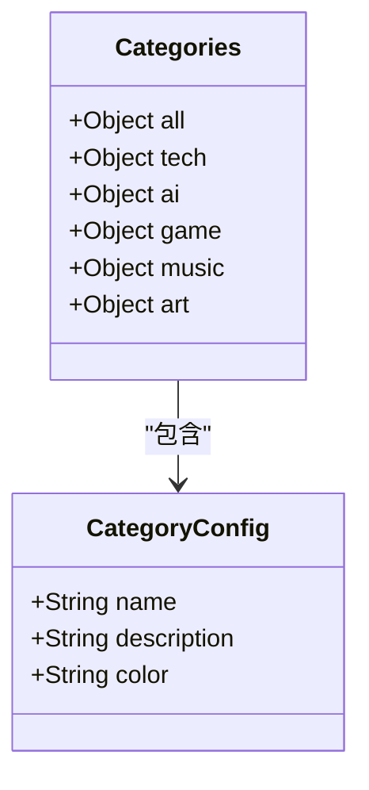

**图表来源**
- [js/data.js:6-37](file://js/data.js#L6-L37)

### 文章数据管理系统

文章数据采用统一的元数据格式，确保内容的一致性和可维护性：

- **id**: 唯一标识符
- **title**: 文章标题
- **category**: 所属分类
- **date**: 发布日期
- **excerpt**: 文章摘要
- **cover**: 封面图片URL
- **content**: Markdown内容路径

**章节来源**
- [js/data.js:39-113](file://js/data.js#L39-L113)

## 架构概览

Hot-Site平台采用前后端分离的架构设计，通过JavaScript实现完整的客户端功能：

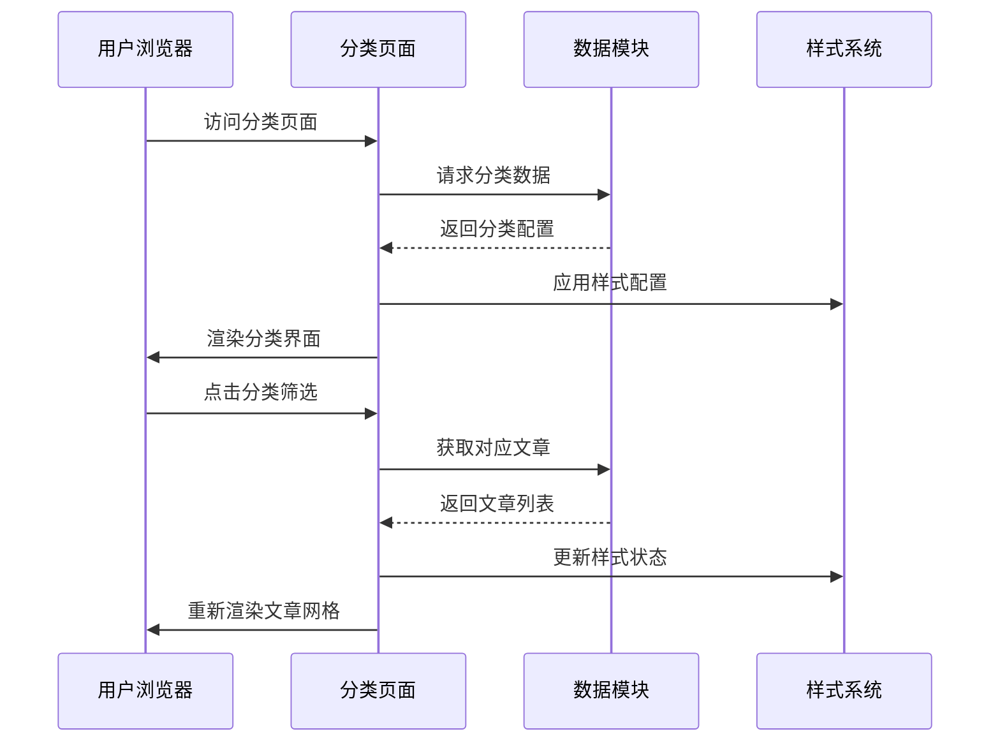

**图表来源**
- [js/main.js:158-218](file://js/main.js#L158-L218)
- [js/data.js:120-136](file://js/data.js#L120-L136)

### 分类体系设计理念

平台的五大分类体现了现代数字内容生态的核心要素：

| 分类 | 设计理念 | 适用范围 | 配色方案 |
|------|----------|----------|----------|
| 技术(Tech) | 前沿技术与开发实践 | 前端开发、后端架构、系统设计 | #6366f1 (靛青) |
| AI | 人工智能与机器学习 | 大语言模型、深度学习、算法研究 | #10b981 (Emerald) |
| 游戏 | 游戏开发与设计 | 游戏引擎、美术设计、玩法机制 | #f43f5e (Rose) |
| 音乐 | 音乐创作与欣赏 | 电子音乐、乐器演奏、音乐理论 | #8b5cf6 (Violet) |
| 艺术 | 创意表达与美学探索 | 数字艺术、视觉设计、创意实践 | #06b6d4 (Cyan) |

**章节来源**
- [js/data.js:12-36](file://js/data.js#L12-L36)
- [css/style.css:488-511](file://css/style.css#L488-L511)

## 详细组件分析

### 分类管理核心模块

#### 数据配置模块

数据配置模块负责维护整个平台的分类和文章数据，采用模块化设计便于维护和扩展：

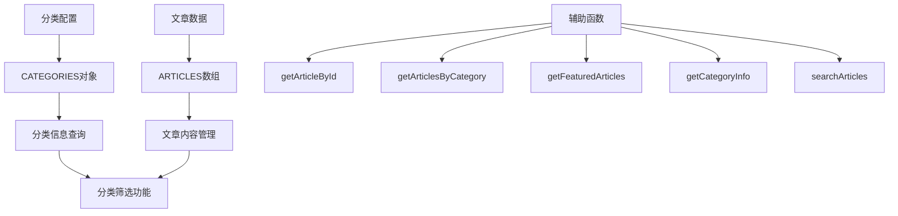

**图表来源**
- [js/data.js:6-158](file://js/data.js#L6-L158)

#### 分类筛选机制

分类筛选功能通过URL参数实现无刷新切换，提供流畅的用户体验：

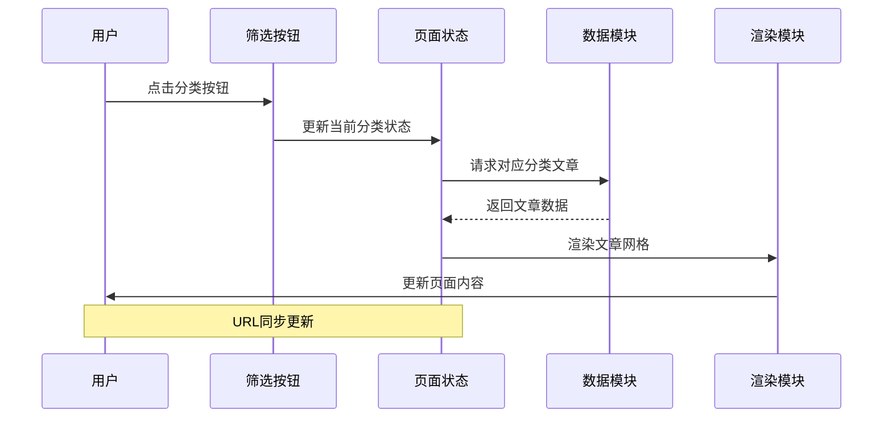

**图表来源**
- [js/main.js:179-218](file://js/main.js#L179-L218)

**章节来源**
- [js/data.js:120-145](file://js/data.js#L120-L145)
- [js/main.js:179-218](file://js/main.js#L179-L218)

### 文章展示系统

#### 文章卡片渲染

文章卡片采用响应式设计，支持多种屏幕尺寸：

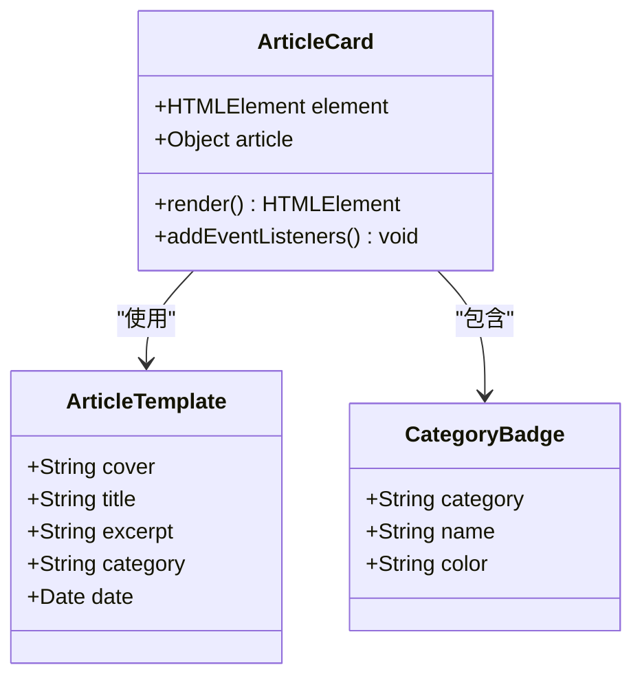

**图表来源**
- [js/main.js:81-116](file://js/main.js#L81-L116)
- [js/main.js:87-98](file://js/main.js#L87-L98)

#### 分类页面布局

分类页面采用"头部信息 + 筛选栏 + 文章网格"的经典布局模式：

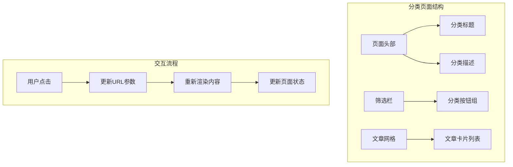

**图表来源**
- [category.html:53-76](file://category.html#L53-L76)
- [js/main.js:158-177](file://js/main.js#L158-L177)

**章节来源**
- [js/main.js:81-146](file://js/main.js#L81-L146)
- [category.html:53-76](file://category.html#L53-L76)

### 样式系统架构

平台采用CSS变量驱动的样式系统，支持主题定制和响应式设计：

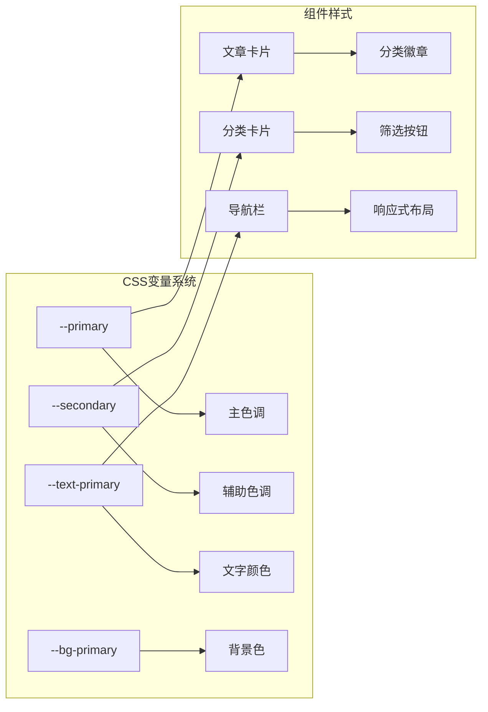

**图表来源**
- [css/style.css:7-78](file://css/style.css#L7-L78)
- [css/style.css:431-548](file://css/style.css#L431-L548)

**章节来源**
- [css/style.css:7-78](file://css/style.css#L7-L78)
- [css/style.css:431-548](file://css/style.css#L431-L548)

## 依赖关系分析

### 模块间依赖关系

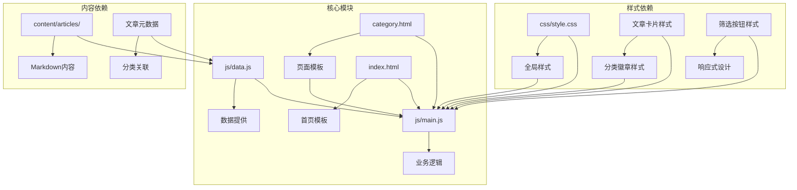

**图表来源**
- [js/data.js:147-158](file://js/data.js#L147-L158)
- [js/main.js:436-460](file://js/main.js#L436-L460)

### 数据流向分析

平台的数据流遵循"配置数据 → 业务逻辑 → 视图渲染"的单向数据流模式：

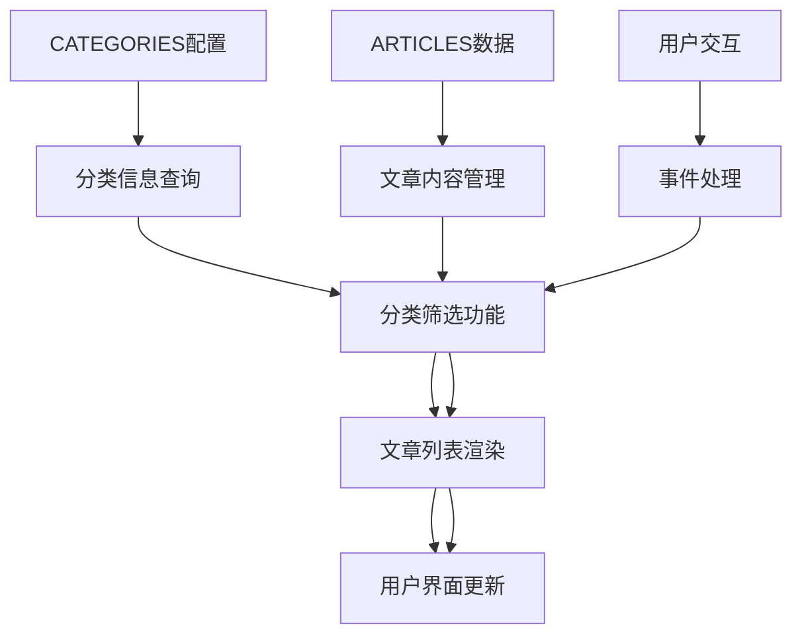

**图表来源**
- [js/data.js:120-136](file://js/data.js#L120-L136)
- [js/main.js:158-177](file://js/main.js#L158-L177)

**章节来源**
- [js/data.js:120-158](file://js/data.js#L120-L158)
- [js/main.js:158-177](file://js/main.js#L158-L177)

## 性能考虑

### 加载性能优化

平台采用多项性能优化策略：

1. **懒加载机制**: 图片采用`loading="lazy"`属性，延迟加载非首屏内容
2. **防抖优化**: 导航栏滚动事件使用防抖处理，减少重绘频率
3. **CSS变量**: 使用CSS变量替代内联样式，提高渲染性能
4. **响应式设计**: 采用CSS Grid和Flexbox，减少JavaScript计算

### 内容加载策略

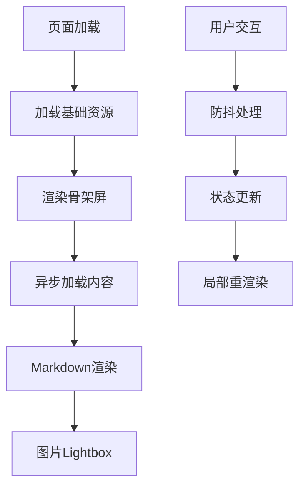

**图表来源**
- [js/main.js:272-314](file://js/main.js#L272-L314)

### SEO优化策略

平台在设计时充分考虑了搜索引擎优化：

- **语义化HTML**: 使用正确的HTML标签结构
- **Meta标签**: 完整的描述和关键词配置
- **Open Graph**: 社交媒体分享优化
- **结构化数据**: 为搜索引擎提供清晰的内容结构

**章节来源**
- [index.html:3-16](file://index.html#L3-L16)
- [category.html:4-14](file://category.html#L4-L14)

## 故障排除指南

### 常见问题及解决方案

#### 分类显示异常

**问题症状**: 分类按钮无法正常切换或显示错误

**可能原因**:
1. JavaScript文件加载失败
2. 分类ID配置错误
3. URL参数解析异常

**解决步骤**:
1. 检查控制台是否有JavaScript错误
2. 验证`CATEGORIES`配置的完整性
3. 确认URL参数格式正确

#### 文章内容加载失败

**问题症状**: 文章详情页显示"内容加载失败"

**可能原因**:
1. Markdown文件路径错误
2. 文件权限问题
3. 网络请求超时

**解决步骤**:
1. 验证文章内容文件路径
2. 检查文件是否存在且可访问
3. 查看网络面板确认请求状态

#### 样式显示异常

**问题症状**: 页面样式错乱或元素重叠

**可能原因**:
1. CSS文件加载失败
2. 响应式断点冲突
3. 浏览器兼容性问题

**解决步骤**:
1. 检查CSS文件路径和权限
2. 验证CSS变量定义
3. 测试不同浏览器兼容性

**章节来源**
- [js/main.js:407-420](file://js/main.js#L407-L420)
- [js/main.js:272-314](file://js/main.js#L272-L314)

## 结论

Hot-Site平台的分类管理系统展现了现代静态网站开发的最佳实践。通过精心设计的分类体系、模块化的代码架构和优化的用户体验，平台成功实现了内容的有效组织和便捷的用户访问。

系统的主要优势包括：
- **清晰的分类体系**: 五大核心分类覆盖现代数字内容的主要领域
- **优秀的用户体验**: 流畅的交互设计和响应式布局
- **良好的可维护性**: 模块化设计便于功能扩展和bug修复
- **高性能表现**: 优化的加载策略和渲染机制

未来可以在以下方面继续改进：
- 增加分类层级支持
- 优化搜索功能
- 添加内容推荐机制
- 改进移动端体验

## 附录

### 分类管理最佳实践

#### 分类层级设计建议

1. **保持简洁**: 建议维持两级分类结构，避免过深的层级
2. **语义明确**: 分类名称应准确反映内容主题
3. **数量适中**: 每个分类的文章数量应保持平衡
4. **可扩展性**: 预留新增分类的空间

#### 命名规范

- 使用简洁明了的英文单词作为分类ID
- 分类名称使用中文，便于用户理解
- 颜色值使用十六进制格式，确保兼容性
- 描述信息简洁有力，突出分类特色

#### 内容分配策略

1. **质量优先**: 优先收录高质量内容
2. **主题一致**: 确保文章内容与分类主题相符
3. **定期更新**: 保持内容的新鲜度和相关性
4. **用户反馈**: 根据用户行为调整分类策略

### 新分类添加指南

#### 添加步骤

1. 在`CATEGORIES`对象中添加新的分类配置
2. 在`ARTICLES`数组中为相关文章设置正确的分类ID
3. 更新导航链接以包含新分类
4. 测试分类筛选功能的正常运行

#### 配置参数说明

- **name**: 分类显示名称，建议使用2-4个汉字
- **description**: 分类描述，简要说明分类内容特色
- **color**: 可选的颜色配置，用于视觉标识

#### SEO考虑因素

1. **语义化**: 使用合适的HTML标签和结构
2. **元数据**: 完善的标题、描述和关键词
3. **结构化**: 为搜索引擎提供清晰的内容结构
4. **性能**: 优化加载速度和移动端体验

**章节来源**
- [js/data.js:6-37](file://js/data.js#L6-L37)
- [js/data.js:40-113](file://js/data.js#L40-L113)