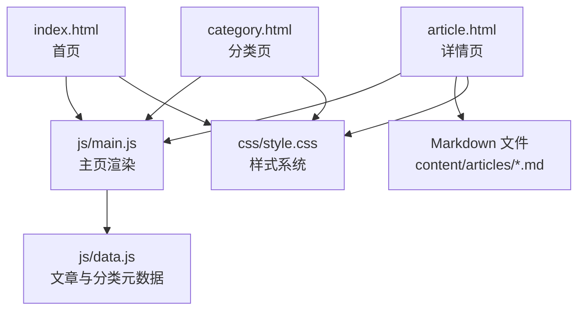
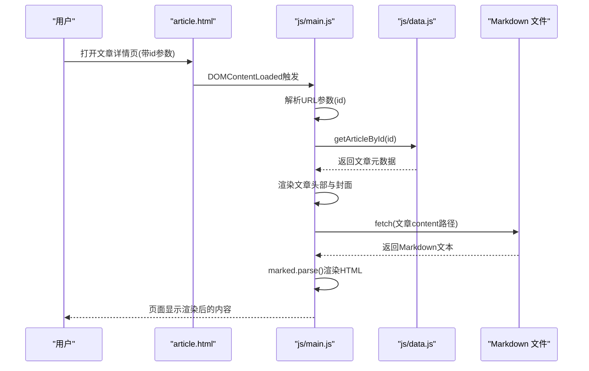
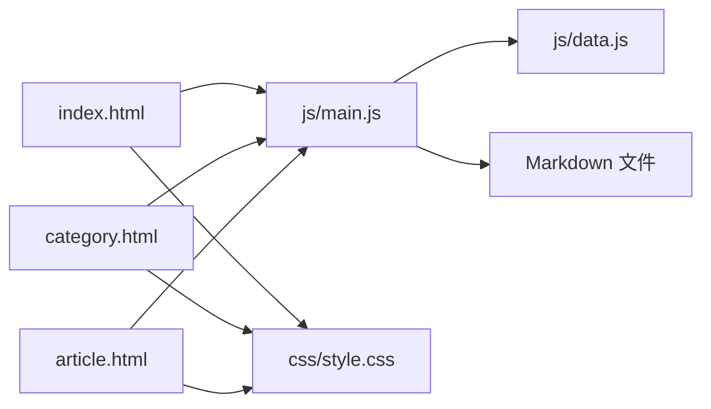

# 文章发布流程

<cite>
**本文引用的文件**
- [README.md](file://README.md)
- [CLAUDE.md](file://CLAUDE.md)
- [index.html](file://index.html)
- [category.html](file://category.html)
- [article.html](file://article.html)
- [js/data.js](file://js/data.js)
- [js/main.js](file://js/main.js)
- [css/style.css](file://css/style.css)
- [content/articles/article-1.md](file://content/articles/article-1.md)
- [content/articles/article-2.md](file://content/articles/article-2.md)
- [content/articles/article-4.md](file://content/articles/article-4.md)
- [content/articles/article-5.md](file://content/articles/article-5.md)
- [content/articles/article-6.md](file://content/articles/article-6.md)
- [content/articles/article-7.md](file://content/articles/article-7.md)
</cite>

## 目录
1. [简介](#简介)
2. [项目结构](#项目结构)
3. [核心组件](#核心组件)
4. [架构总览](#架构总览)
5. [详细组件分析](#详细组件分析)
6. [依赖关系分析](#依赖关系分析)
7. [性能考量](#性能考量)
8. [故障排查指南](#故障排查指南)
9. [结论](#结论)
10. [附录](#附录)

## 简介
本指南面向Hot-Site平台的内容管理者，提供从“选题策划—内容创作—格式检查—文件命名—上传部署—预览测试—发布后维护—批量操作与版本管理”的全流程操作说明。文档结合仓库现有实现，解释文章元数据配置方法（分类、日期、摘要等）、Markdown文章的组织方式、前端渲染与路由机制、以及发布后的维护与更新策略。

## 项目结构
Hot-Site采用静态站点架构，核心由HTML页面、CSS样式与JavaScript逻辑构成，文章内容以Markdown文件存放，通过前端脚本读取并渲染。

图表来源
- [index.html:1-190](file://index.html#L1-L190)
- [category.html:1-103](file://category.html#L1-L103)
- [article.html:1-107](file://article.html#L1-L107)
- [js/main.js:1-461](file://js/main.js#L1-L461)
- [js/data.js:1-158](file://js/data.js#L1-L158)
- [css/style.css:1-800](file://css/style.css#L1-L800)

章节来源
- [README.md: 26-47:26-47](file://README.md#L26-L47)
- [CLAUDE.md: 13-23:13-23](file://CLAUDE.md#L13-L23)

## 核心组件
- 静态页面
  - 首页、分类页、文章详情页均通过HTML骨架提供语义化结构与SEO标签。
- 数据层
  - js/data.js集中维护CATEGORIES与ARTICLES元数据数组，包含文章ID、标题、分类、日期、摘要、封面图与Markdown路径。
- 逻辑层
  - js/main.js负责导航栏交互、页面切换、文章网格渲染、详情页Markdown加载与渲染、图片Lightbox等。
- 样式层
  - css/style.css提供响应式布局、主题变量、组件样式与动画。

章节来源
- [js/data.js: 6-37:6-37](file://js/data.js#L6-L37)
- [js/data.js: 40-113:40-113](file://js/data.js#L40-L113)
- [js/main.js: 44-L77:44-77](file://js/main.js#L44-L77)
- [js/main.js: 119-L146:119-146](file://js/main.js#L119-L146)
- [js/main.js: 222-L243:222-243](file://js/main.js#L222-L243)
- [js/main.js: 272-L314:272-314](file://js/main.js#L272-L314)
- [css/style.css: 1-L120:1-120](file://css/style.css#L1-L120)

## 架构总览
Hot-Site采用“静态HTML + 前端数据 + Markdown渲染”的轻量架构。页面通过URL参数识别当前页（首页/分类/详情），逻辑层根据URL参数与数据层选择性渲染；文章详情页通过fetch异步加载对应Markdown文件并使用marked.js渲染为HTML。

图表来源
- [article.html:1-107](file://article.html#L1-L107)
- [js/main.js: 222-L243:222-243](file://js/main.js#L222-L243)
- [js/main.js: 272-L314:272-314](file://js/main.js#L272-L314)
- [js/data.js: 116-L118:116-118](file://js/data.js#L116-L118)

## 详细组件分析

### 1) 选题策划与元数据配置
- 分类选择
  - 在js/data.js的CATEGORIES中定义分类名称、描述与颜色，用于页面徽标与样式。
- 文章元数据
  - 在js/data.js的ARTICLES数组中新增条目，字段包括：
    - id：文章唯一标识（与URL参数id对应）
    - title：标题
    - category：分类键（tech/ai/game/music/art/all）
    - date：YYYY-MM-DD格式
    - excerpt：摘要（建议50-100字）
    - cover：封面图URL（懒加载）
    - content：Markdown文件路径（content/articles/*.md）

章节来源
- [js/data.js: 6-L37:6-37](file://js/data.js#L6-L37)
- [js/data.js: 40-L113:40-113](file://js/data.js#L40-L113)
- [README.md: 98-116:98-116](file://README.md#L98-L116)

### 2) 内容创作与格式规范
- Markdown组织
  - 文章内容位于content/articles/目录，文件名建议使用article-{序号}.md的命名模式。
  - 文章末尾可保留分隔线与引言，便于统一风格。
- 示例参考
  - 可参考现有文章示例，学习标题层级、列表、表格与代码块的使用方式。

章节来源
- [content/articles/article-1.md: 1-L66:1-66](file://content/articles/article-1.md#L1-L66)
- [content/articles/article-2.md: 1-L115:1-115](file://content/articles/article-2.md#L1-L115)
- [content/articles/article-4.md: 1-L153:1-153](file://content/articles/article-4.md#L1-L153)
- [content/articles/article-5.md: 1-L193:1-193](file://content/articles/article-5.md#L1-L193)
- [content/articles/article-6.md: 1-L188:1-188](file://content/articles/article-6.md#L1-L188)
- [content/articles/article-7.md: 1-L200:1-200](file://content/articles/article-7.md#L1-L200)

### 3) 文件命名规范
- 文章文件命名
  - 建议使用article-{序号}.md，序号按发布时间顺序递增。
- 资源文件
  - 封面图建议使用高分辨率且压缩质量适中的URL，确保加载速度与清晰度平衡。

章节来源
- [README.md: 100-L116:100-116](file://README.md#L100-L116)
- [js/data.js: 40-L113:40-113](file://js/data.js#L40-L113)

### 4) 上传与部署
- 本地预览
  - 使用任意HTTP服务器打开根目录进行预览（推荐使用本地静态服务器）。
- GitHub Pages部署
  - 推送至main分支后，在仓库设置中开启GitHub Pages，选择分支main与根目录/。
- 预览地址
  - 部署成功后可通过仓库域名访问站点。

章节来源
- [README.md: 51-L76:51-76](file://README.md#L51-L76)
- [README.md: 77-L96:77-96](file://README.md#L77-L96)
- [CLAUDE.md: 7-L11:7-11](file://CLAUDE.md#L7-L11)
- [CLAUDE.md: 35-L39:35-39](file://CLAUDE.md#L35-L39)

### 5) 预览与测试
- 首页与分类页
  - 首页展示精选文章网格；分类页支持筛选按钮与URL参数cat。
- 文章详情页
  - 详情页通过URL参数id加载对应文章；Markdown内容通过fetch异步加载并渲染。
- 图片Lightbox
  - 点击文章内图片可放大查看，ESC键关闭。
- 无障碍与SEO
  - 页面包含语义化结构、ARIA标签与Open Graph标签，利于SEO与可访问性。

章节来源
- [js/main.js: 150-L154:150-154](file://js/main.js#L150-L154)
- [js/main.js: 158-L177:158-177](file://js/main.js#L158-L177)
- [js/main.js: 222-L243:222-243](file://js/main.js#L222-L243)
- [js/main.js: 272-L314:272-314](file://js/main.js#L272-L314)
- [js/main.js: 318-L371:318-371](file://js/main.js#L318-L371)
- [index.html: 1-L190:1-190](file://index.html#L1-L190)
- [category.html: 1-L103:1-103](file://category.html#L1-L103)
- [article.html: 1-L107:1-107](file://article.html#L1-L107)

### 6) 发布后的维护与更新
- 内容修改
  - 修改Markdown文件后，GitHub Pages会自动重新构建；如需立即生效，可重新提交一次。
- SEO优化
  - 首页与分类页已在HTML中配置meta标签与Open Graph标签；可在js/data.js中优化excerpt以提升摘要质量。
- 版本管理
  - 通过Git提交记录追踪每次发布与修改，便于回滚与审计。

章节来源
- [README.md: 77-L96:77-96](file://README.md#L77-L96)
- [index.html: 6-L15:6-15](file://index.html#L6-L15)
- [category.html: 6-L12:6-12](file://category.html#L6-L12)
- [js/data.js: 40-L113:40-113](file://js/data.js#L40-L113)

### 7) 批量操作与最佳实践
- 批量新增文章
  - 在content/articles/批量创建Markdown文件，然后在js/data.js的ARTICLES数组中批量追加元数据。
- 批量修改分类
  - 通过批量替换js/data.js中的category字段，或编写脚本更新多篇文章。
- 版本管理
  - 使用Git分支管理草稿与正式发布，合并主分支后自动部署。
- 性能优化
  - 控制封面图尺寸与质量，减少首屏加载时间；利用懒加载与图片缩放策略。

章节来源
- [README.md: 98-L116:98-116](file://README.md#L98-L116)
- [js/data.js: 116-L126:116-126](file://js/data.js#L116-L126)

## 依赖关系分析
- 页面与脚本
  - index.html、category.html、article.html均引入js/data.js与js/main.js。
- 数据与渲染
  - js/main.js依赖js/data.js提供的CATEGORIES与ARTICLES；详情页通过fetch加载Markdown文件并使用marked.js渲染。
- 样式
  - 三页面共同引用css/style.css，确保视觉一致性。

图表来源
- [index.html:186-189](file://index.html#L186-L189)
- [category.html:99-102](file://category.html#L99-L102)
- [article.html:103-106](file://article.html#L103-L106)
- [js/main.js:1-461](file://js/main.js#L1-L461)
- [js/data.js:1-158](file://js/data.js#L1-L158)
- [css/style.css:1-800](file://css/style.css#L1-L800)

章节来源
- [index.html:186-189](file://index.html#L186-L189)
- [category.html:99-102](file://category.html#L99-L102)
- [article.html:103-106](file://article.html#L103-L106)
- [js/main.js:1-461](file://js/main.js#L1-L461)
- [js/data.js:1-158](file://js/data.js#L1-L158)
- [css/style.css:1-800](file://css/style.css#L1-L800)

## 性能考量
- 资源加载
  - 首屏仅加载必要资源，图片使用懒加载；详情页Markdown按需异步加载。
- 渲染优化
  - 使用marked.js CDN进行Markdown渲染，减少客户端体积。
- 响应式与动画
  - 样式系统采用CSS变量与媒体查询，确保多端一致体验。

章节来源
- [js/main.js: 272-L314:272-314](file://js/main.js#L272-L314)
- [article.html: 21-L22:21-22](file://article.html#L21-L22)
- [css/style.css: 1-L120:1-120](file://css/style.css#L1-L120)

## 故障排查指南
- 文章详情页空白或报错
  - 检查URL参数id是否正确；确认js/data.js中存在对应文章；确认content路径指向的Markdown文件存在且可访问。
- Markdown未渲染
  - 确认article.html已引入marked.js CDN；检查网络面板是否存在404。
- 分类筛选无效
  - 检查URL参数cat与js/data.js中的分类键一致；确认initFilterButtons逻辑正常执行。
- 图片无法放大
  - 确认initLightbox与openLightbox逻辑未被覆盖；检查点击事件绑定。

章节来源
- [js/main.js: 222-L243:222-243](file://js/main.js#L222-L243)
- [js/main.js: 272-L314:272-314](file://js/main.js#L272-L314)
- [js/main.js: 180-L218:180-218](file://js/main.js#L180-L218)
- [js/main.js: 318-L371:318-371](file://js/main.js#L318-L371)

## 结论
Hot-Site平台以极简架构实现了“内容即数据”的发布流程：通过在js/data.js中维护文章元数据、在content/articles/中编写Markdown内容，并借助js/main.js的前端渲染与路由逻辑，实现从选题到发布的全链路管理。配合GitHub Pages的零配置部署与完善的SEO/无障碍支持，内容管理者可专注于创作与优化，快速产出高质量文章。

## 附录

### A. 文章元数据字段说明
- id：文章唯一标识，用于详情页URL参数与数据查找
- title：文章标题
- category：分类键，对应CATEGORIES中的键
- date：发布日期，YYYY-MM-DD格式
- excerpt：摘要，建议50-100字
- cover：封面图URL
- content：Markdown文件路径

章节来源
- [js/data.js: 40-L113:40-113](file://js/data.js#L40-L113)

### B. 页面与路由对照
- 首页：index.html
- 分类页：category.html（支持URL参数cat）
- 详情页：article.html（支持URL参数id）

章节来源
- [index.html:1-190](file://index.html#L1-L190)
- [category.html:1-103](file://category.html#L1-L103)
- [article.html:1-107](file://article.html#L1-L107)