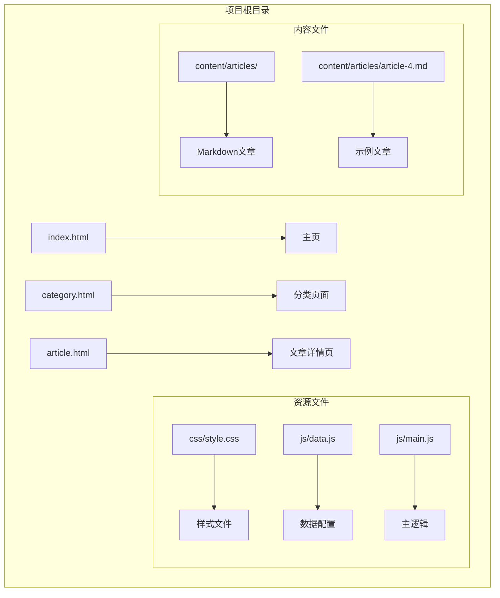
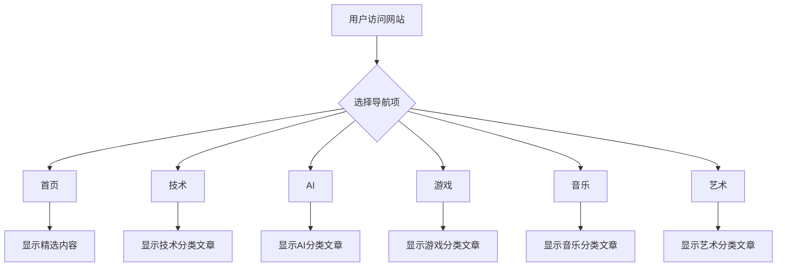

# 快速开始

<cite>
**本文档引用的文件**
- [index.html](file://index.html)
- [category.html](file://category.html)
- [article.html](file://article.html)
- [js/main.js](file://js/main.js)
- [js/data.js](file://js/data.js)
- [css/style.css](file://css/style.css)
- [content/articles/article-4.md](file://content/articles/article-4.md)
- [CLAUDE.md](file://CLAUDE.md)
</cite>

## 目录
1. [简介](#简介)
2. [项目结构](#项目结构)
3. [本地开发环境搭建](#本地开发环境搭建)
4. [GitHub Pages 部署](#github-pages-部署)
5. [基本使用方法](#基本使用方法)
6. [常见问题解决](#常见问题解决)
7. [故障排除指南](#故障排除指南)
8. [总结](#总结)

## 简介

Hot-Site 是一个现代化的静态内容展示网站，专注于技术、AI、游戏、音乐与艺术领域的优质内容分享。该项目采用纯静态技术栈构建，无需复杂的构建工具或依赖管理，开箱即用。

### 核心特性
- **纯静态技术栈**：HTML + CSS + JavaScript，无需构建工具
- **响应式设计**：适配各种设备屏幕尺寸
- **现代化交互**：平滑的动画效果和用户体验
- **分类浏览**：按主题分类组织内容
- **文章详情**：支持 Markdown 内容渲染
- **轻量级架构**：简洁高效的代码结构

## 项目结构

Hot-Site 项目采用清晰的文件组织结构，便于理解和维护：



**图表来源**
- [index.html:1-190](file://index.html#L1-L190)
- [category.html:1-103](file://category.html#L1-L103)
- [article.html:1-107](file://article.html#L1-L107)

### 文件组织说明

**HTML 页面文件**：
- `index.html` - 主页，包含英雄区域和精选内容展示
- `category.html` - 分类浏览页面，支持按主题筛选
- `article.html` - 文章详情页面，支持 Markdown 内容渲染

**JavaScript 文件**：
- `js/data.js` - 数据配置和文章元信息管理
- `js/main.js` - 核心业务逻辑和页面交互功能

**样式文件**：
- `css/style.css` - 完整的样式系统，包含现代化的设计元素

**内容文件**：
- `content/articles/` - Markdown 格式的文章内容

**Section sources**
- [index.html:1-190](file://index.html#L1-L190)
- [category.html:1-103](file://category.html#L1-L103)
- [article.html:1-107](file://article.html#L1-L107)

## 本地开发环境搭建

### 系统要求

在开始之前，请确保您的开发环境中已安装以下工具：

- **Git**：版本控制系统
- **Python**：用于启动本地开发服务器
- **文本编辑器**：推荐 VS Code 或其他支持语法高亮的编辑器

### Git 安装和配置

1. **安装 Git**
   - Windows: 从 https://git-scm.com/download/win 下载安装
   - macOS: 使用 Homebrew 安装 `brew install git`
   - Linux: 使用包管理器安装 `sudo apt install git`

2. **配置 Git 用户信息**
   ```bash
   git config --global user.name "您的姓名"
   git config --global user.email "您的邮箱地址"
   ```

### 代码克隆

1. **创建项目目录**
   ```bash
   mkdir hot-site
   cd hot-site
   ```

2. **克隆仓库**
   ```bash
   git clone https://github.com/rrramxy/hot-site.git .
   ```

3. **验证克隆结果**
   ```bash
   ls -la
   ```

### 启动本地服务器

项目提供了多种方式启动本地开发服务器：

#### 方法一：使用 Python 内置服务器
```bash
python -m http.server 8080
```

#### 方法二：使用 npx serve（推荐）
```bash
npx serve .
```

#### 方法三：使用 npm serve（如果已安装 Node.js）
```bash
npm install -g serve
serve -p 8080
```

### 验证安装

1. **启动服务器后，在浏览器中访问**：
   - http://localhost:8080

2. **预期功能验证**：
   - 主页正常显示
   - 导航栏可点击
   - 文章卡片可交互
   - 分类筛选功能正常

**Section sources**
- [CLAUDE.md:24-34](file://CLAUDE.md#L24-L34)
- [CLAUDE.md:7-8](file://CLAUDE.md#L7-L8)

## GitHub Pages 部署

### 准备工作

1. **确保本地代码已准备好**
   - 所有修改已完成并测试通过
   - 代码已提交到本地仓库

2. **创建 GitHub 仓库**
   - 登录 GitHub 账户
   - 点击 "New" 创建新仓库
   - 仓库名称格式：`username.github.io`（用户名必须与 GitHub 用户名匹配）

### 部署步骤

#### 第一步：推送代码到 GitHub
```bash
git add .
git commit -m "Initial commit"
git branch -M main
git remote add origin https://github.com/username/username.github.io.git
git push -u origin main
```

#### 第二步：启用 GitHub Pages
1. 在 GitHub 仓库页面点击 "Settings" 标签
2. 在左侧菜单找到 "Pages" 选项
3. 在 "Source" 部分：
   - **Branch**: `main`
   - **Folder**: `/ (root)`
4. 点击 "Save" 保存设置

#### 第三步：等待部署完成
- GitHub 会自动检测并部署网站
- 部署通常需要几分钟时间
- 部署完成后，您将看到部署状态指示

### 验证部署

1. **访问部署的网站**
   - URL 格式：`https://username.github.io`
   - 例如：`https://rrramxy.github.io`

2. **功能验证**
   - 网站正常加载
   - 所有页面功能正常
   - 样式和交互正常

**Section sources**
- [CLAUDE.md:35-39](file://CLAUDE.md#L35-L39)
- [CLAUDE.md:11](file://CLAUDE.md#L11)

## 基本使用方法

### 浏览文章内容

#### 主页浏览
1. **访问主页**：`https://username.github.io`
2. **查看精选内容**：主页显示最新的文章摘要
3. **查看更多内容**：点击 "浏览全部" 按钮

#### 分类筛选
1. **访问分类页面**：`https://username.github.io/category.html`
2. **选择分类**：点击相应的分类标签（技术、AI、游戏、音乐、艺术）
3. **查看筛选结果**：页面会显示该分类下的所有文章

#### 文章详情
1. **点击文章卡片**：在主页或分类页面点击任意文章
2. **阅读完整内容**：进入文章详情页面
3. **返回上一页**：使用浏览器的返回按钮或页面上的返回链接

### 搜索功能

虽然项目当前没有内置的搜索框，但系统具备搜索能力：

1. **URL 参数方式**：通过 URL 查询参数实现内容筛选
2. **JavaScript API**：使用 `searchArticles()` 函数进行内容搜索
3. **扩展开发**：可以在现有基础上添加搜索输入框

### 导航系统

项目采用现代化的导航系统：



**图表来源**
- [index.html:44-51](file://index.html#L44-L51)
- [category.html:42-49](file://category.html#L42-L49)

**Section sources**
- [index.html:44-51](file://index.html#L44-L51)
- [category.html:42-49](file://category.html#L42-L49)
- [article.html:29-51](file://article.html#L29-L51)

## 常见问题解决

### 本地服务器无法启动

**问题现象**：
- 命令行报错，无法启动服务器
- 浏览器无法访问 localhost

**解决方案**：
1. **检查端口占用**
   ```bash
   lsof -i :8080  # 检查端口占用情况
   ```

2. **更换端口号**
   ```bash
   python -m http.server 8000  # 使用其他端口
   ```

3. **使用 npx serve**
   ```bash
   npx serve .  # 自动选择可用端口
   ```

### 页面样式不显示

**问题现象**：
- 网站可以访问但样式缺失
- 页面布局混乱

**解决方案**：
1. **检查文件路径**
   - 确保 `css/style.css` 文件存在且路径正确
   - 检查相对路径是否正确

2. **清理浏览器缓存**
   - 强制刷新页面：Ctrl+F5
   - 清除浏览器缓存

3. **检查网络连接**
   - 确保本地服务器正常运行
   - 验证文件权限

### 文章内容无法加载

**问题现象**：
- 文章详情页显示错误信息
- Markdown 内容未正确渲染

**解决方案**：
1. **检查 Markdown 文件**
   - 确认 `content/articles/` 目录下文件存在
   - 验证 Markdown 文件格式正确

2. **检查数据配置**
   - 确认 `js/data.js` 中的文章配置正确
   - 验证文章 ID 和路径匹配

3. **查看浏览器控制台**
   - 检查是否有 JavaScript 错误
   - 查看网络请求状态

### GitHub Pages 部署失败

**问题现象**：
- GitHub Pages 状态显示失败
- 网站无法通过 GitHub URL 访问

**解决方案**：
1. **检查仓库设置**
   - 确认分支设置为 `main`
   - 确认文件夹设置为 `/ (root)`

2. **检查文件结构**
   - 确保根目录包含必要的 HTML 文件
   - 验证文件命名规范

3. **等待部署完成**
   - GitHub Pages 部署可能需要几分钟
   - 查看部署日志获取详细信息

**Section sources**
- [CLAUDE.md:52-57](file://CLAUDE.md#L52-L57)

## 故障排除指南

### 开发调试技巧

#### 浏览器开发者工具
1. **打开开发者工具**
   - Chrome: F12 或 Ctrl+Shift+I
   - Firefox: F12 或 Ctrl+Shift+I

2. **常用调试面板**
   - **Elements**：检查 HTML 结构和 CSS 样式
   - **Console**：查看 JavaScript 错误和日志
   - **Network**：检查资源加载状态
   - **Sources**：调试 JavaScript 代码

#### 常见错误诊断

**JavaScript 错误排查**：
```javascript
// 检查关键函数是否存在
console.log('Main.js loaded:', typeof initNavbar);
console.log('Data.js loaded:', typeof ARTICLES);

// 检查 DOM 元素
console.log('Article grid element:', document.getElementById('article-grid'));
```

**网络资源检查**：
1. **验证静态资源加载**
   - 检查 CSS 文件是否正确加载
   - 确认 JavaScript 文件无 404 错误

2. **检查跨域问题**
   - 确保所有资源使用正确的相对路径
   - 验证图片和内容文件的访问权限

### 性能优化建议

#### 静态资源优化
1. **图片优化**
   - 使用适当的图片格式（WebP 优先）
   - 压缩图片大小
   - 使用懒加载机制

2. **CSS 优化**
   - 合并和压缩 CSS 文件
   - 移除未使用的样式规则
   - 使用 CSS 变量减少重复代码

3. **JavaScript 优化**
   - 压缩 JavaScript 文件
   - 按需加载非关键功能
   - 优化事件监听器

#### 缓存策略
1. **浏览器缓存**
   - 设置合适的缓存头
   - 利用浏览器缓存机制
   - 版本化静态资源

2. **CDN 使用**
   - 对于外部依赖考虑使用 CDN
   - 图片资源可考虑云存储服务

### 安全最佳实践

#### 内容安全
1. **XSS 防护**
   - 对用户输入进行适当的转义
   - 验证和过滤外部内容
   - 使用 Content Security Policy

2. **数据验证**
   - 验证文章 ID 的有效性
   - 检查分类参数的合法性
   - 防止路径遍历攻击

#### 部署安全
1. **GitHub Pages 安全**
   - 使用 HTTPS 协议
   - 避免敏感信息泄露
   - 定期更新依赖文件

2. **代码审查**
   - 定期审查代码变更
   - 使用自动化测试
   - 建立代码质量标准

**Section sources**
- [js/main.js:407-420](file://js/main.js#L407-L420)
- [js/data.js:138-145](file://js/data.js#L138-L145)

## 总结

Hot-Site 项目提供了一个完整、现代化的静态内容展示解决方案。通过本文档的指导，您应该能够：

### 已完成的任务
- 成功搭建本地开发环境
- 掌握项目的基本使用方法
- 了解 GitHub Pages 部署流程
- 解决常见的开发和部署问题

### 下一步建议

1. **内容管理**
   - 添加新的文章内容
   - 更新现有文章
   - 优化内容结构

2. **功能扩展**
   - 添加搜索功能
   - 实现评论系统
   - 增加社交媒体集成

3. **性能优化**
   - 实施图片懒加载
   - 优化移动端体验
   - 添加 PWA 支持

### 技术支持

如遇技术问题，可以参考以下资源：
- 项目文档：`CLAUDE.md`
- GitHub Issues：报告 bug 和功能请求
- 社区支持：相关技术论坛和问答平台

感谢您选择 Hot-Site 项目！希望这个现代化的静态内容展示平台能够帮助您更好地分享知识和创意。