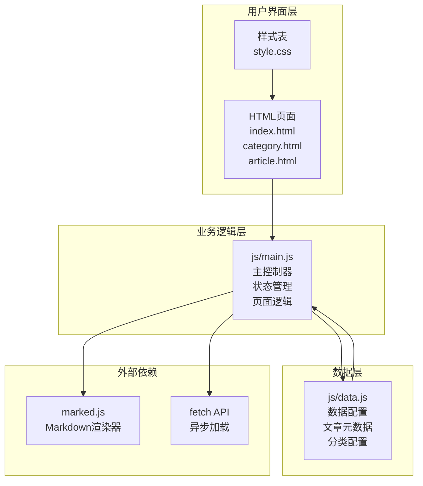
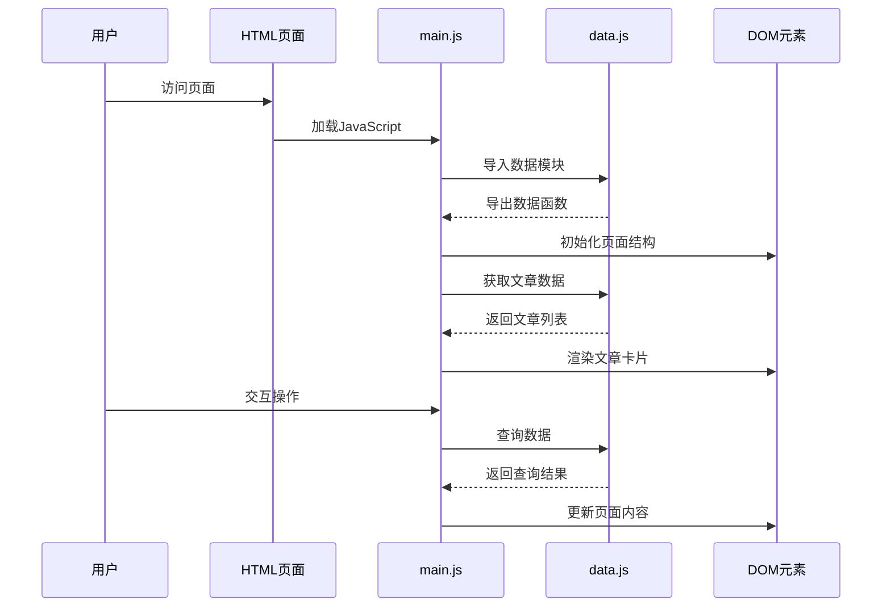
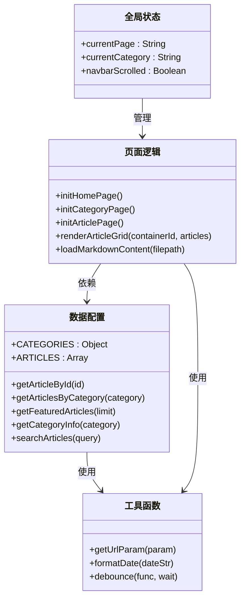
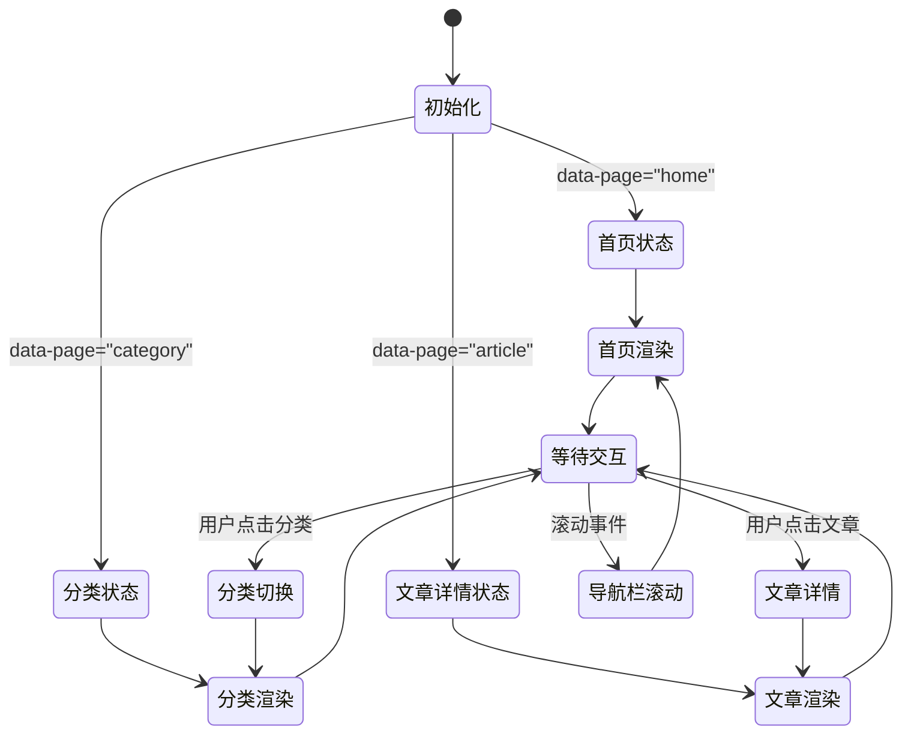
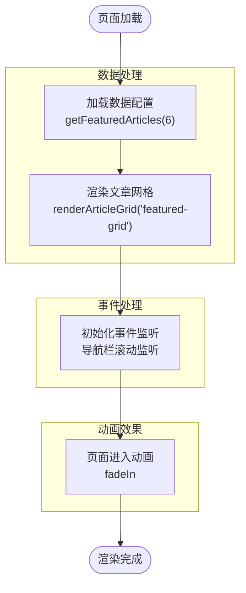
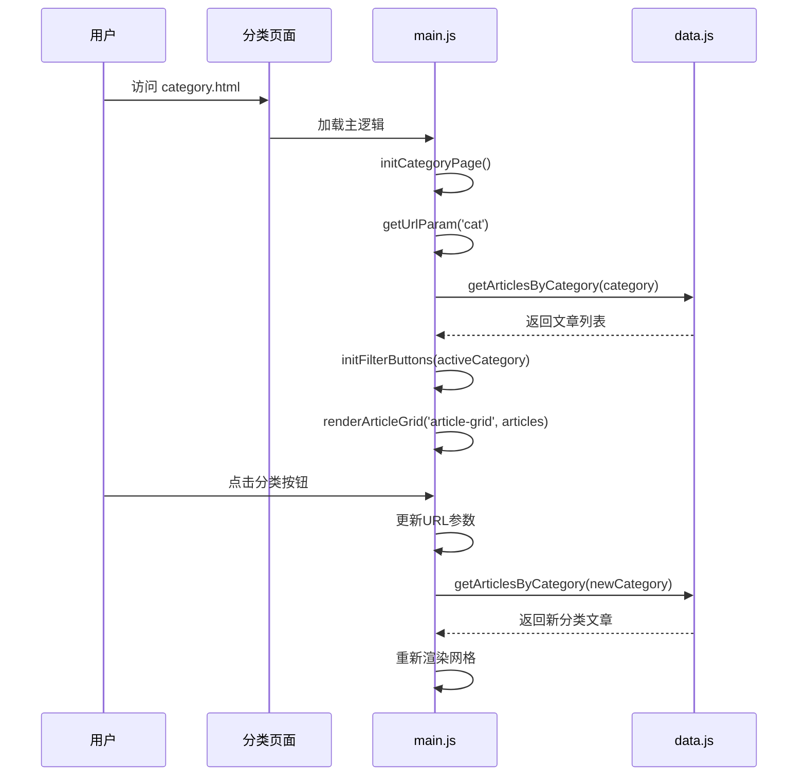
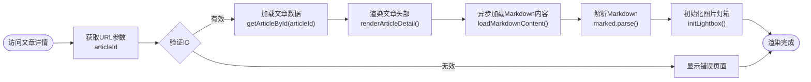
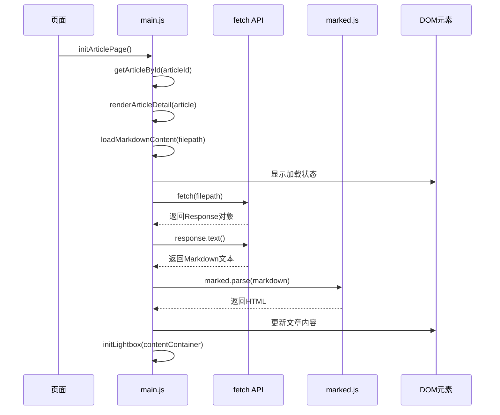
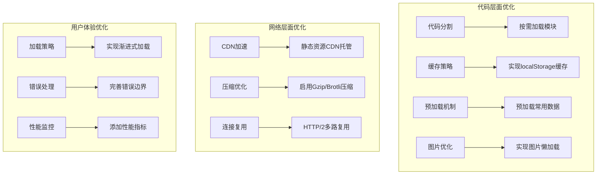

# Hot-Site项目数据流设计文档

<cite>
**本文档引用的文件**
- [js/data.js](file://js/data.js)
- [js/main.js](file://js/main.js)
- [index.html](file://index.html)
- [category.html](file://category.html)
- [article.html](file://article.html)
- [css/style.css](file://css/style.css)
</cite>

## 目录
1. [项目概述](#项目概述)
2. [整体架构概览](#整体架构概览)
3. [核心数据流分析](#核心数据流分析)
4. [状态管理系统](#状态管理系统)
5. [页面渲染流程](#页面渲染流程)
6. [异步数据加载机制](#异步数据加载机制)
7. [缓存策略分析](#缓存策略分析)
8. [性能优化建议](#性能优化建议)
9. [故障排除指南](#故障排除指南)
10. [总结](#总结)

## 项目概述

Hot-Site是一个基于纯JavaScript的静态网站项目，采用模块化架构设计。项目实现了从用户访问到页面渲染的完整数据流，包含文章展示、分类浏览、文章详情等多个功能模块。该系统通过清晰的数据分离和状态管理机制，提供了流畅的用户体验。

## 整体架构概览

**图表来源**
- [js/data.js:1-158](file://js/data.js#L1-L158)
- [js/main.js:1-461](file://js/main.js#L1-L461)
- [index.html:1-190](file://index.html#L1-L190)
- [category.html:1-103](file://category.html#L1-L103)
- [article.html:1-107](file://article.html#L1-L107)

## 核心数据流分析

### 数据流向图

**图表来源**
- [js/main.js:436-460](file://js/main.js#L436-L460)
- [js/data.js:147-158](file://js/data.js#L147-L158)

### 数据结构设计

项目采用模块化的数据结构设计，主要包含以下核心组件：

**图表来源**
- [js/data.js:6-158](file://js/data.js#L6-L158)
- [js/main.js:6-40](file://js/main.js#L6-L40)
- [js/main.js:148-460](file://js/main.js#L148-L460)

**章节来源**
- [js/data.js:6-158](file://js/data.js#L6-L158)
- [js/main.js:6-40](file://js/main.js#L6-L40)

## 状态管理系统

### 全局状态设计

项目采用集中式状态管理模式，通过单一状态对象管理所有全局状态：

**图表来源**
- [js/main.js:6-11](file://js/main.js#L6-L11)
- [js/main.js:444-456](file://js/main.js#L444-L456)

### 状态更新策略

状态管理遵循以下更新策略：

1. **初始化阶段**：页面加载时根据`data-page`属性确定当前状态
2. **事件驱动**：用户交互触发状态更新
3. **条件更新**：基于特定条件的状态变更
4. **响应式更新**：状态变更自动触发UI更新

**章节来源**
- [js/main.js:6-11](file://js/main.js#L6-L11)
- [js/main.js:436-460](file://js/main.js#L436-L460)

## 页面渲染流程

### 首页渲染流程

**图表来源**
- [js/main.js:150-154](file://js/main.js#L150-L154)
- [js/main.js:436-460](file://js/main.js#L436-L460)

### 分类页面渲染流程

**图表来源**
- [js/main.js:156-177](file://js/main.js#L156-L177)
- [js/main.js:179-218](file://js/main.js#L179-L218)

### 文章详情页渲染流程

**图表来源**
- [js/main.js:220-243](file://js/main.js#L220-L243)
- [js/main.js:271-314](file://js/main.js#L271-L314)

**章节来源**
- [js/main.js:148-460](file://js/main.js#L148-L460)

## 异步数据加载机制

### Markdown内容加载流程

项目采用异步加载机制处理Markdown内容，确保页面快速响应：

**图表来源**
- [js/main.js:271-314](file://js/main.js#L271-L314)

### 异步加载特性

1. **渐进式加载**：先显示骨架屏，再加载真实内容
2. **错误处理**：网络异常时显示友好的错误界面
3. **性能优化**：使用懒加载和防抖机制
4. **用户体验**：提供加载动画和状态反馈

**章节来源**
- [js/main.js:271-314](file://js/main.js#L271-L314)

## 缓存策略分析

### 当前缓存实现

项目采用了多层次的缓存策略：

1. **浏览器缓存**：静态资源通过HTTP缓存头控制
2. **内存缓存**：数据模块在内存中保持引用
3. **DOM缓存**：渲染后的DOM元素保持在内存中
4. **会话缓存**：URL参数和状态在会话期间保持

### 缺失的缓存机制

目前项目缺少以下缓存机制：
- **本地存储缓存**：localStorage/sessionStorage
- **服务端缓存**：CDN缓存策略
- **数据预加载缓存**：预取和缓存常用数据
- **图片缓存**：图片懒加载和缓存策略

**章节来源**
- [js/data.js:147-158](file://js/data.js#L147-L158)

## 性能优化建议

### 现有优化措施

项目已经实现了多项性能优化：

1. **防抖机制**：滚动事件使用防抖减少重绘
2. **懒加载**：图片使用`loading="lazy"`属性
3. **骨架屏**：异步加载时显示占位符
4. **CSS变量**：统一的颜色和间距管理
5. **响应式设计**：移动端适配优化

### 性能优化建议

**图表来源**
- [js/main.js:28-39](file://js/main.js#L28-L39)
- [js/main.js:118-146](file://js/main.js#L118-L146)

## 故障排除指南

### 常见问题及解决方案

#### 数据加载失败

**问题症状**：文章列表为空或显示错误信息

**可能原因**：
1. Markdown文件路径错误
2. 网络请求超时
3. marked.js未正确加载

**解决步骤**：
1. 检查文件路径是否正确
2. 验证网络连接状态
3. 确认marked.js CDN可用性

#### 页面渲染异常

**问题症状**：页面布局错乱或样式不生效

**可能原因**：
1. CSS文件加载失败
2. JavaScript执行顺序错误
3. DOM元素不存在

**解决步骤**：
1. 检查CSS文件路径
2. 验证JavaScript加载顺序
3. 确认DOM元素存在

#### 状态管理问题

**问题症状**：状态不更新或更新延迟

**可能原因**：
1. 事件监听器未正确绑定
2. 状态更新逻辑错误
3. 异步操作竞态条件

**解决步骤**：
1. 检查事件监听器绑定
2. 验证状态更新逻辑
3. 处理异步操作同步

**章节来源**
- [js/main.js:407-420](file://js/main.js#L407-L420)
- [js/main.js:271-314](file://js/main.js#L271-L314)

## 总结

Hot-Site项目展现了优秀的前端架构设计，通过清晰的数据分离和状态管理机制，实现了高效的数据流处理。项目的主要优势包括：

1. **模块化设计**：数据层、逻辑层、表现层职责明确
2. **状态管理**：集中式状态管理确保数据一致性
3. **异步处理**：合理的异步加载机制提升用户体验
4. **性能优化**：多种性能优化策略的综合运用
5. **可维护性**：清晰的代码结构便于后续维护和扩展

该项目为静态网站开发提供了良好的参考模式，特别是在数据流设计和状态管理方面具有重要的借鉴意义。