# 整体架构概览

<cite>
**本文档引用的文件**
- [index.html](file://index.html)
- [category.html](file://category.html)
- [article.html](file://article.html)
- [style.css](file://css/style.css)
- [data.js](file://js/data.js)
- [main.js](file://js/main.js)
- [article-1.md](file://content/articles/article-1.md)
- [README.md](file://README.md)
</cite>

## 目录
1. [简介](#简介)
2. [项目结构](#项目结构)
3. [核心组件](#核心组件)
4. [架构总览](#架构总览)
5. [详细组件分析](#详细组件分析)
6. [依赖关系分析](#依赖关系分析)
7. [性能考量](#性能考量)
8. [故障排除指南](#故障排除指南)
9. [结论](#结论)

## 简介

Hot-Site 是一个基于纯静态文件的 SPA（单页应用）内容聚合平台，专注于技术、AI、游戏、音乐与艺术领域的优质内容展示。该项目采用"HTML + CSS + JavaScript"三件套架构，实现了数据驱动的渲染机制，具有零依赖、完全响应式、SEO友好等特点。

该系统通过三个核心层次实现清晰的职责分离：
- **数据层**：js/data.js - 提供文章元数据、分类配置和查询方法
- **业务逻辑层**：js/main.js - 处理页面初始化、事件绑定、路由控制和交互逻辑
- **视图层**：HTML/CSS - 负责页面结构和样式表现

## 项目结构

Hot-Site 采用扁平化的项目组织方式，所有页面共享相同的模板结构和样式体系：

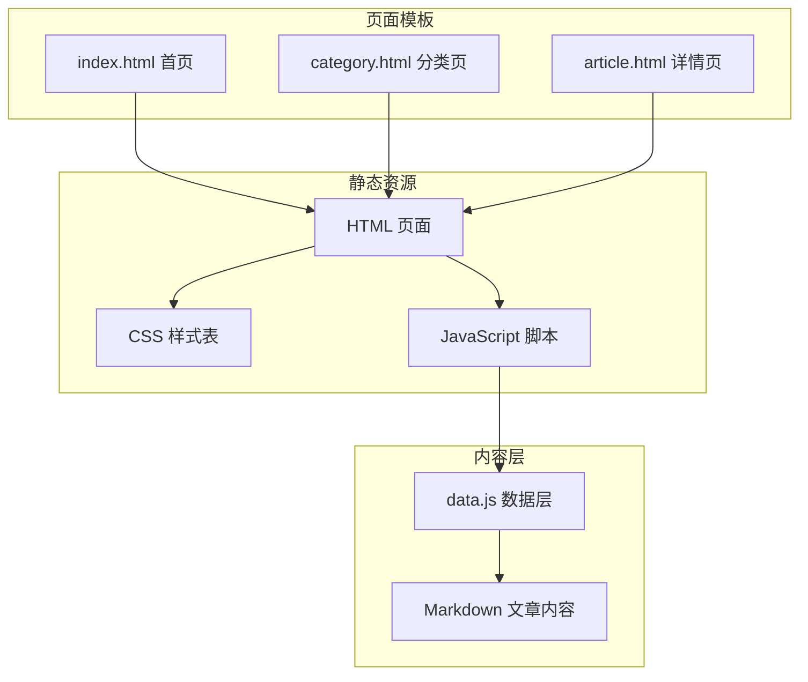

**图表来源**
- [index.html:1-190](file://index.html#L1-L190)
- [category.html:1-103](file://category.html#L1-L103)
- [article.html:1-107](file://article.html#L1-L107)
- [data.js:1-158](file://js/data.js#L1-L158)
- [main.js:1-461](file://js/main.js#L1-L461)

**章节来源**
- [README.md:26-47](file://README.md#L26-L47)
- [index.html:1-190](file://index.html#L1-L190)
- [category.html:1-103](file://category.html#L1-L103)
- [article.html:1-107](file://article.html#L1-L107)

## 核心组件

### 数据层组件 (data.js)

数据层采用模块化设计，提供统一的数据访问接口：

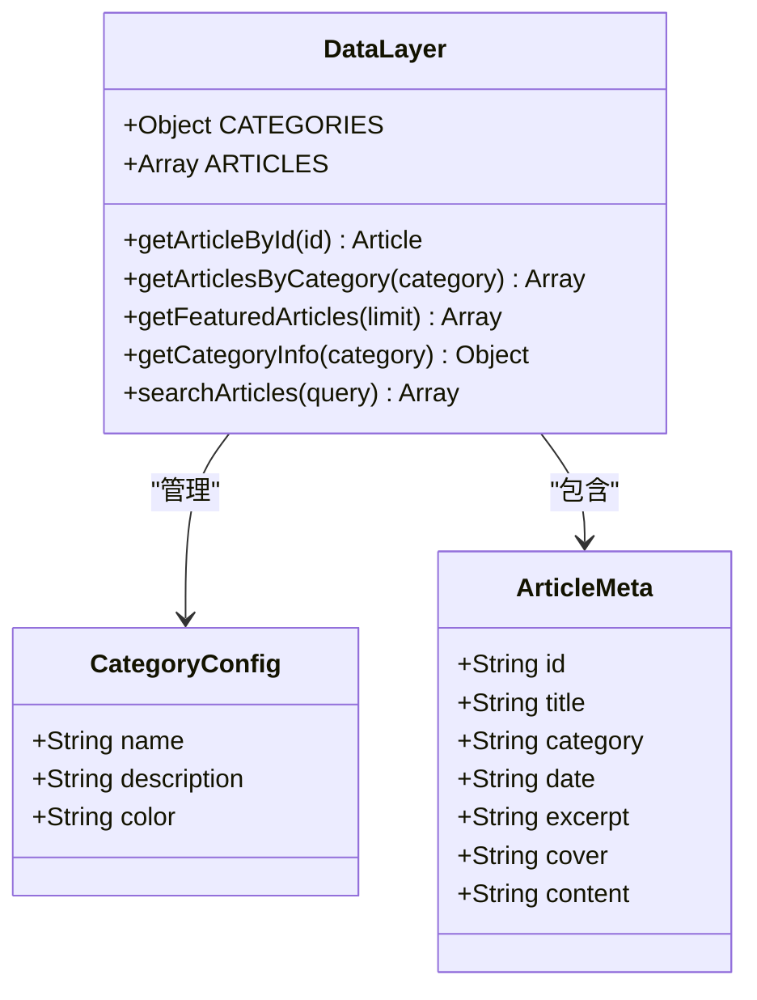

**图表来源**
- [data.js:6-37](file://js/data.js#L6-L37)
- [data.js:39-113](file://js/data.js#L39-L113)

数据层的主要职责：
- **分类配置管理**：维护完整的分类信息和颜色映射
- **文章元数据存储**：集中管理所有文章的基本信息
- **查询接口提供**：提供多种数据检索方法
- **环境兼容性**：支持 CommonJS 和浏览器环境

### 业务逻辑组件 (main.js)

业务逻辑层负责页面生命周期管理和用户交互：

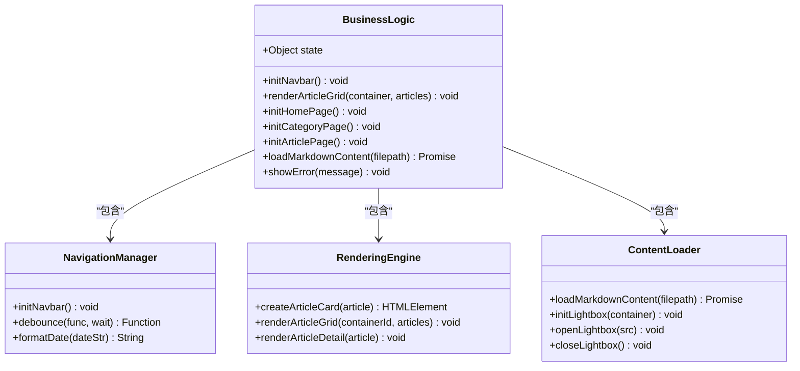

**图表来源**
- [main.js:6-11](file://js/main.js#L6-L11)
- [main.js:43-77](file://js/main.js#L43-L77)
- [main.js:81-146](file://js/main.js#L81-L146)
- [main.js:220-314](file://js/main.js#L220-L314)

业务逻辑层的核心功能：
- **导航栏管理**：响应式导航、滚动效果、移动端汉堡菜单
- **文章渲染**：网格布局、卡片组件、懒加载优化
- **页面路由**：根据 data-page 属性初始化对应页面
- **内容加载**：异步加载 Markdown 文件并渲染
- **错误处理**：统一的错误界面和降级策略

### 视图层组件 (HTML/CSS)

视图层采用语义化 HTML 和现代化 CSS 设计：

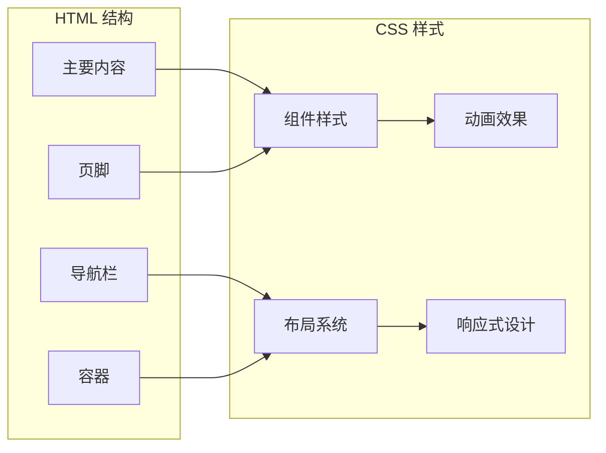

**图表来源**
- [style.css:140-175](file://css/style.css#L140-L175)
- [style.css:431-455](file://css/style.css#L431-L455)
- [style.css:697-799](file://css/style.css#L697-L799)

视图层的设计特点：
- **CSS 变量系统**：统一的颜色、间距、圆角等设计令牌
- **玻璃态效果**：模糊背景和半透明边框
- **渐变色彩**：多色渐变背景和装饰元素
- **动画过渡**：流畅的页面进入和组件动画

**章节来源**
- [data.js:1-158](file://js/data.js#L1-L158)
- [main.js:1-461](file://js/main.js#L1-L461)
- [style.css:1-1166](file://css/style.css#L1-L1166)

## 架构总览

Hot-Site 采用基于纯静态文件的 SPA 架构模式，实现了数据驱动的渲染机制：

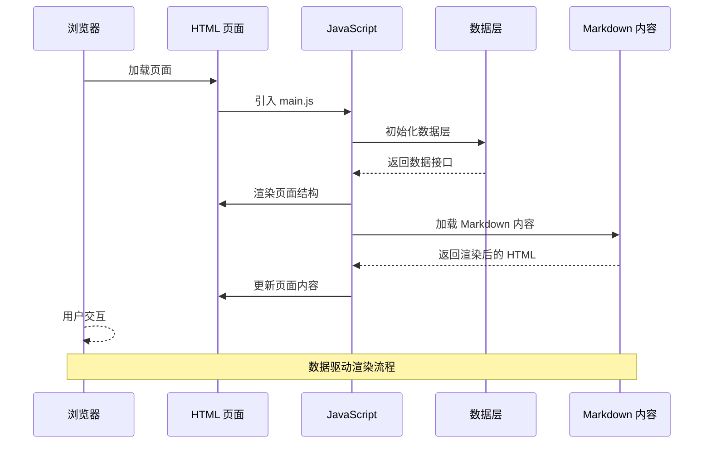

**图表来源**
- [index.html:186-189](file://index.html#L186-L189)
- [main.js:436-460](file://js/main.js#L436-L460)
- [data.js:147-158](file://js/data.js#L147-L158)

### 系统边界

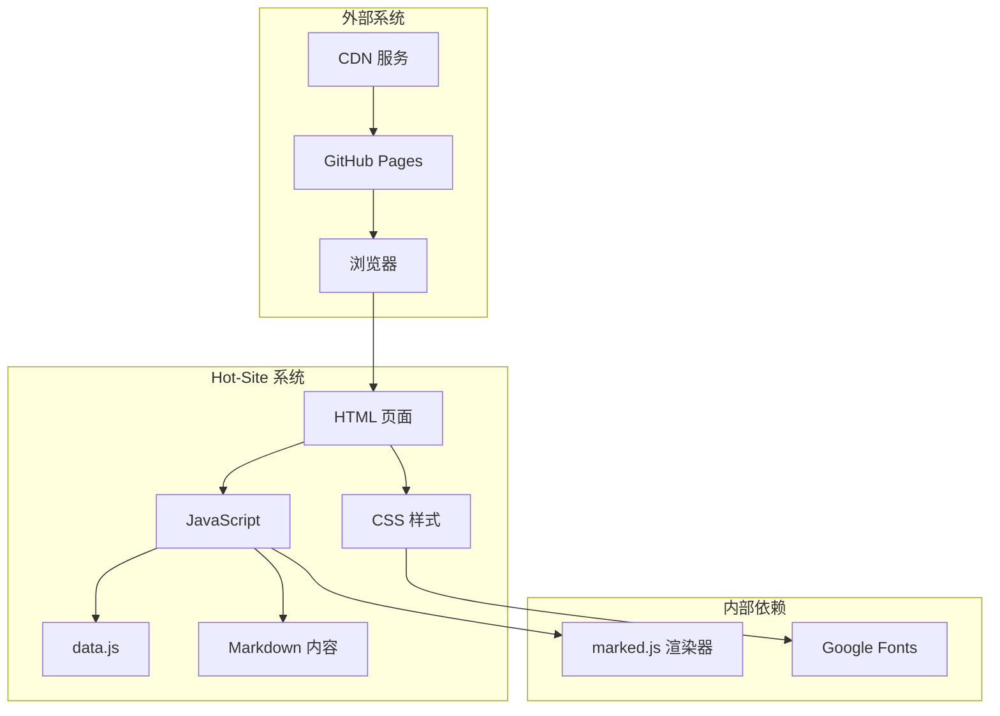

**图表来源**
- [article.html:21-22](file://article.html#L21-L22)
- [index.html:21-24](file://index.html#L21-L24)
- [category.html:19-22](file://category.html#L19-L22)

## 详细组件分析

### 数据驱动渲染机制

Hot-Site 的数据驱动渲染机制通过以下流程实现：

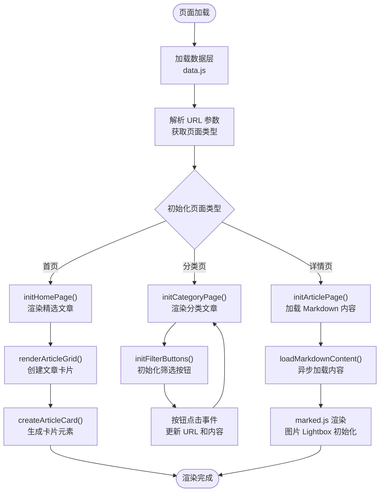

**图表来源**
- [main.js:150-154](file://js/main.js#L150-L154)
- [main.js:158-177](file://js/main.js#L158-L177)
- [main.js:222-243](file://js/main.js#L222-L243)
- [main.js:272-314](file://js/main.js#L272-L314)

### 模块化架构优势

#### 可维护性
- **职责分离**：数据层、业务逻辑层、视图层职责清晰
- **单一职责**：每个模块专注特定功能，降低复杂度
- **接口稳定**：通过统一的数据接口保证各层解耦

#### 可扩展性
- **插件化设计**：新增页面类型只需添加相应初始化函数
- **配置驱动**：分类和文章数据通过配置文件管理
- **样式模块化**：CSS 变量系统便于主题定制

#### 团队协作效率
- **开发并行**：前端、内容、设计可并行开发
- **版本控制友好**：纯静态文件便于 Git 管理
- **部署简单**：支持 GitHub Pages 一键部署

### 响应式设计实现

Hot-Site 采用移动优先的设计策略：

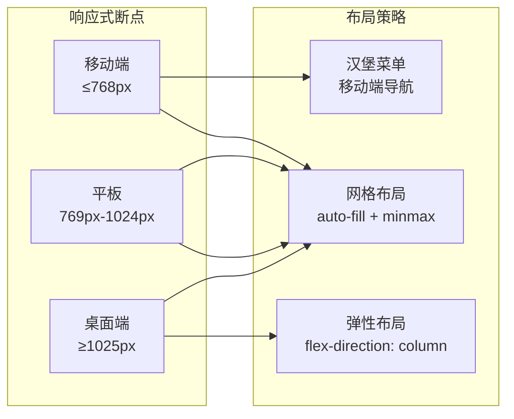

**图表来源**
- [style.css:432-436](file://css/style.css#L432-L436)
- [style.css:551-555](file://css/style.css#L551-L555)
- [style.css:229-258](file://css/style.css#L229-L258)

响应式设计的关键特性：
- **CSS Grid 网格**：自适应文章卡片布局
- **Flexbox 弹性**：内容区域灵活排列
- **媒体查询**：针对不同设备优化显示
- **触摸友好的交互**：移动端手势支持

### 跨浏览器兼容性

项目采用渐进增强的兼容性策略：

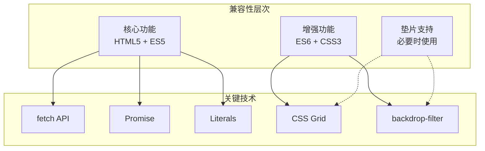

**图表来源**
- [main.js:28-39](file://js/main.js#L28-L39)
- [style.css:156-165](file://css/style.css#L156-L165)
- [style.css:363-366](file://css/style.css#L363-L366)

兼容性考虑要点：
- **ES6+ 语法**：使用现代 JavaScript 特性但保持向后兼容
- **CSS3 特性**：渐进增强，不支持的浏览器降级显示
- **Polyfill 选择**：仅在必要时引入垫片
- **浏览器测试**：Chrome、Firefox、Safari、Edge 兼容性验证

**章节来源**
- [data.js:147-158](file://js/data.js#L147-L158)
- [main.js:15-39](file://js/main.js#L15-L39)
- [style.css:140-175](file://css/style.css#L140-L175)

## 依赖关系分析

Hot-Site 的依赖关系相对简单，体现了"零依赖"的设计理念：

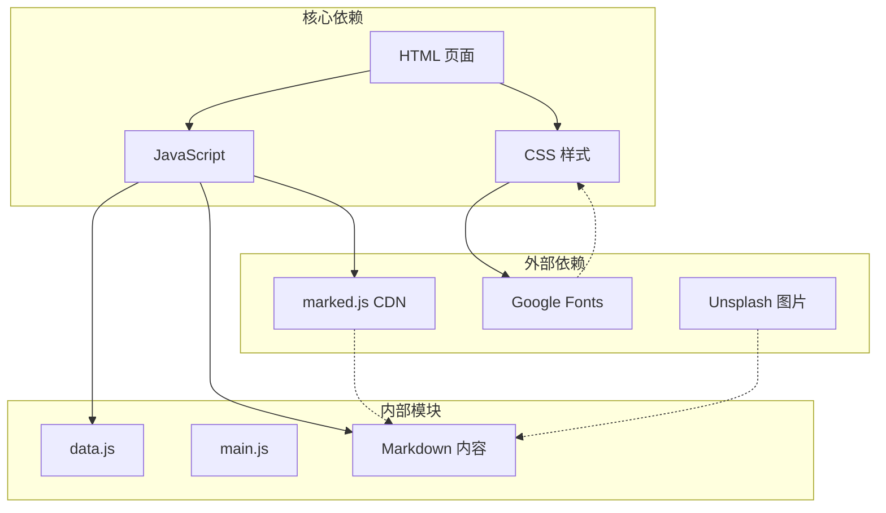

**图表来源**
- [index.html:186-189](file://index.html#L186-L189)
- [article.html:21-22](file://article.html#L21-L22)
- [style.css:21-24](file://css/style.css#L21-L24)

依赖关系特点：
- **外部依赖最少化**：仅使用必要的 CDN 服务
- **内部模块化**：所有业务逻辑集中在 main.js 和 data.js
- **内容分离**：文章内容与代码逻辑完全分离
- **缓存友好**：CDN 服务提升加载性能

**章节来源**
- [index.html:186-189](file://index.html#L186-L189)
- [article.html:21-22](file://article.html#L21-L22)
- [category.html:19-22](file://category.html#L19-L22)

## 性能考量

### 加载性能优化

Hot-Site 采用了多项性能优化策略：

1. **懒加载机制**：图片使用 `loading="lazy"` 属性
2. **CDN 优化**：字体和渲染器通过 CDN 加载
3. **CSS 变量**：减少重复样式定义，降低 CSS 体积
4. **模块化加载**：JavaScript 按需加载，避免不必要的执行

### 交互性能优化

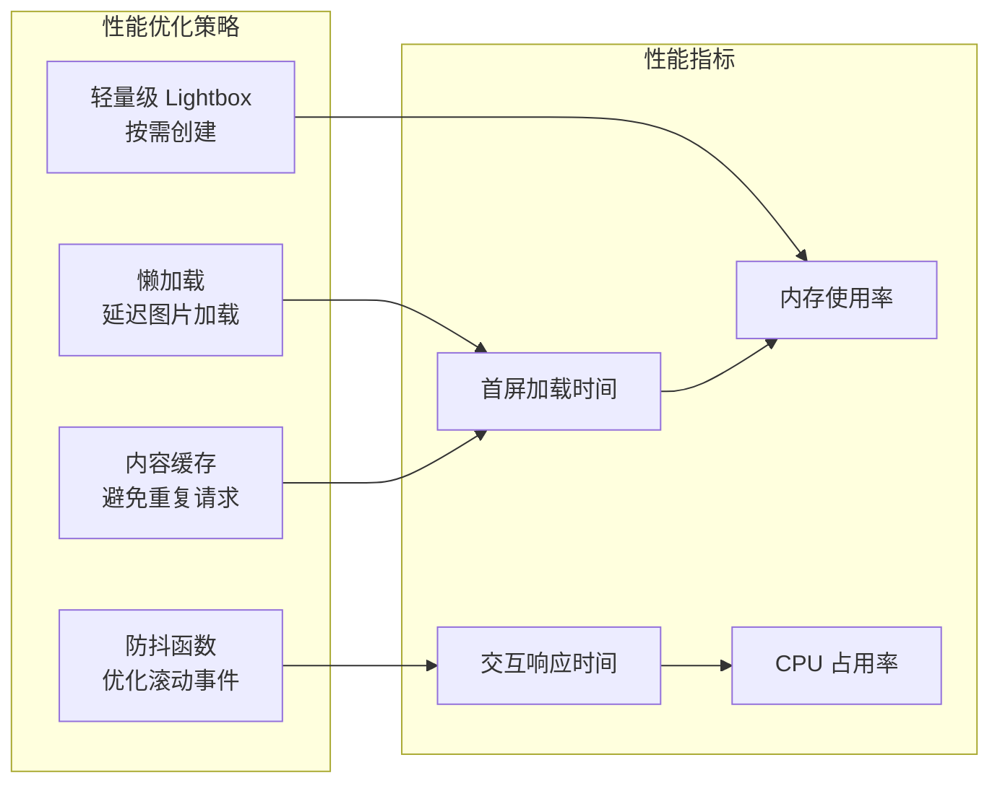

**图表来源**
- [main.js:28-39](file://js/main.js#L28-L39)
- [main.js:318-371](file://js/main.js#L318-L371)

### SEO 优化

项目具备良好的搜索引擎优化特性：
- **语义化 HTML**：使用正确的 HTML5 语义标签
- **结构化数据**：Open Graph 和 Twitter Cards 支持
- **可访问性**：完整的 ARIA 标签和键盘导航
- **内容质量**：高质量的 Markdown 内容结构

## 故障排除指南

### 常见问题及解决方案

#### Markdown 内容加载失败

**问题现象**：文章详情页显示"内容加载失败"

**可能原因**：
- 直接双击打开 HTML 文件导致的浏览器安全限制
- Markdown 文件路径配置错误
- CDN 服务不可用

**解决步骤**：
1. 使用 HTTP 服务器启动项目（推荐）
2. 检查 data.js 中的文章 content 路径
3. 验证 Markdown 文件是否存在且可访问

#### 图片加载问题

**问题现象**：文章封面图或内容图片不显示

**可能原因**：
- 图片链接失效
- CORS 跨域限制
- 图片格式不支持

**解决步骤**：
1. 替换为有效的图片链接
2. 使用支持 CORS 的图片服务
3. 确保图片格式为现代浏览器支持的格式

#### 响应式布局异常

**问题现象**：移动端显示效果不佳

**可能原因**：
- viewport 设置缺失
- CSS 媒体查询配置错误
- 字体加载问题

**解决步骤**：
1. 确认 meta viewport 标签正确配置
2. 检查 CSS 媒体查询断点设置
3. 验证 Google Fonts CDN 可用性

**章节来源**
- [main.js:301-314](file://js/main.js#L301-L314)
- [README.md:75](file://README.md#L75)

## 结论

Hot-Site 项目成功展示了基于纯静态文件的 SPA 架构模式。通过清晰的三层架构设计（数据层、业务逻辑层、视图层），实现了高度模块化和可维护的代码结构。

### 主要优势

1. **架构简洁**：零依赖设计降低了维护复杂度
2. **性能优异**：静态托管和 CDN 优化确保快速加载
3. **开发友好**：模块化设计便于团队协作和功能扩展
4. **用户体验**：响应式设计和流畅动画提升用户满意度

### 技术亮点

- **数据驱动渲染**：通过统一的数据接口实现动态内容管理
- **模块化设计**：清晰的职责分离便于代码维护和功能扩展
- **响应式布局**：移动端优先的设计策略适应多设备访问
- **SEO 友好**：语义化 HTML 和结构化数据提升搜索引擎排名

### 发展建议

1. **监控集成**：添加性能监控和错误追踪
2. **国际化支持**：扩展多语言内容管理
3. **搜索功能**：实现全文搜索和内容过滤
4. **数据分析**：集成访问统计和用户行为分析

Hot-Site 为静态内容网站提供了一个优秀的参考实现，其设计理念和架构模式可广泛应用于类似的静态站点项目中。