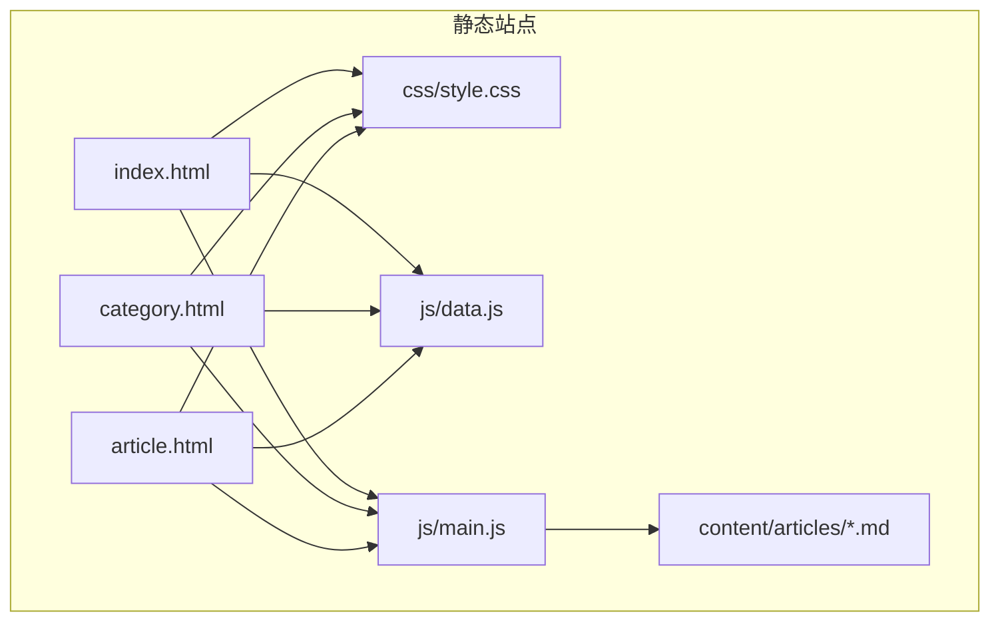
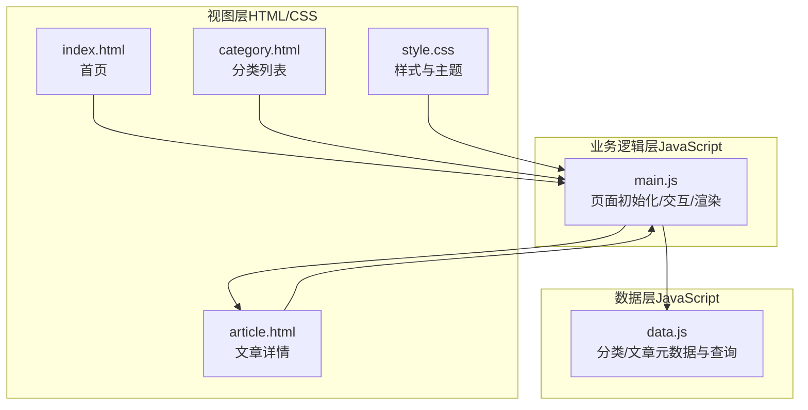
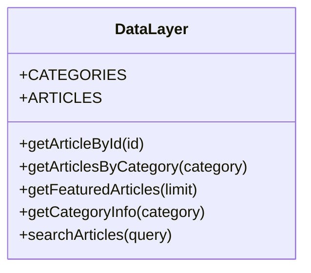
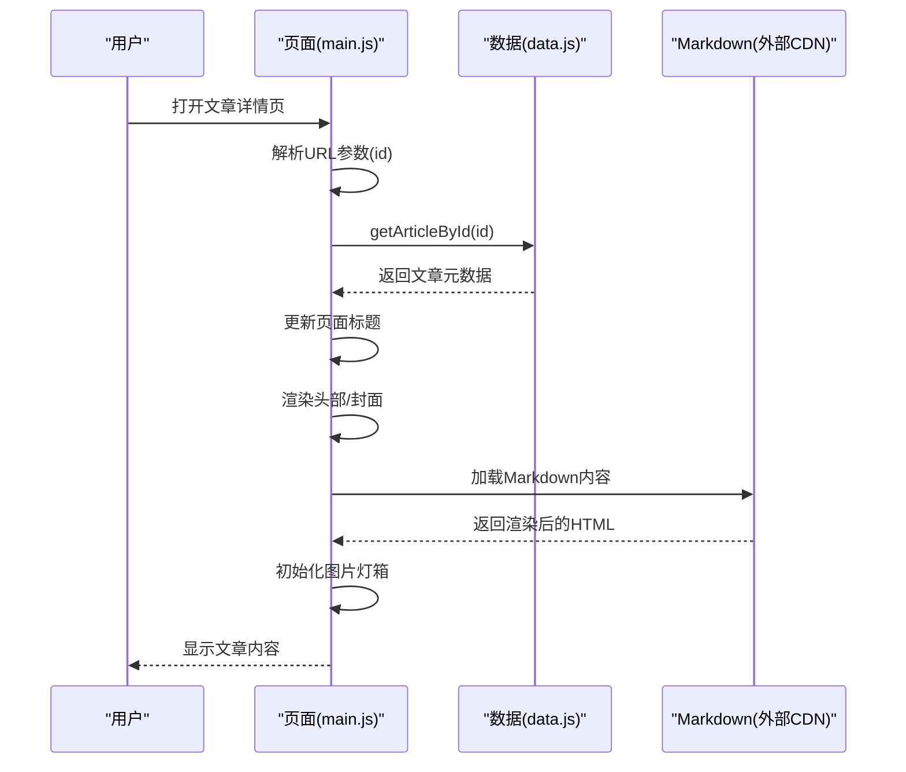
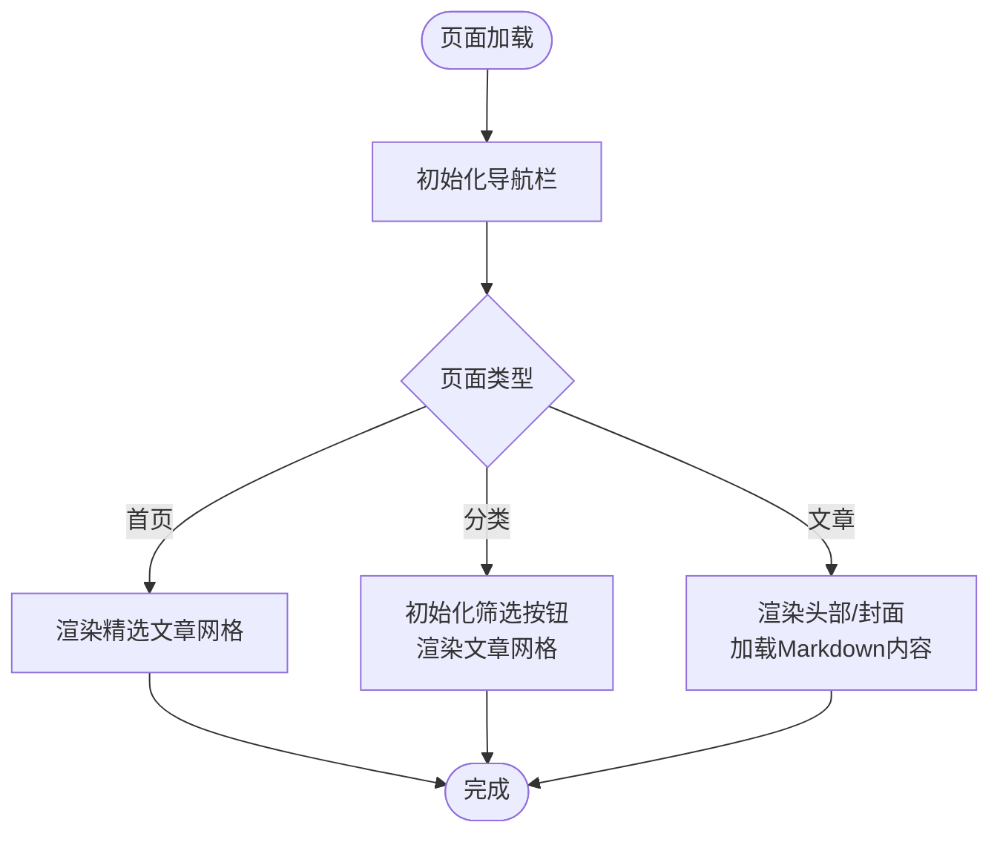
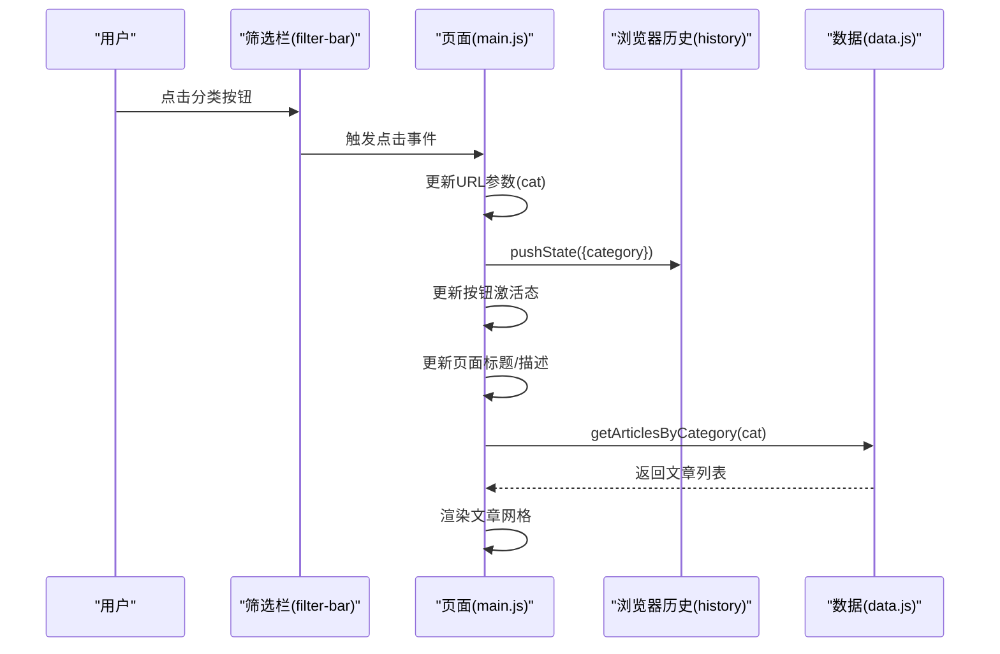
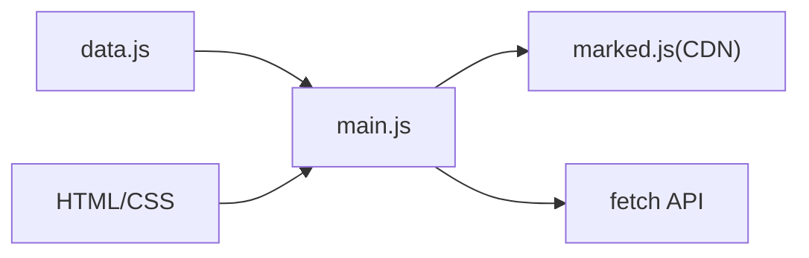
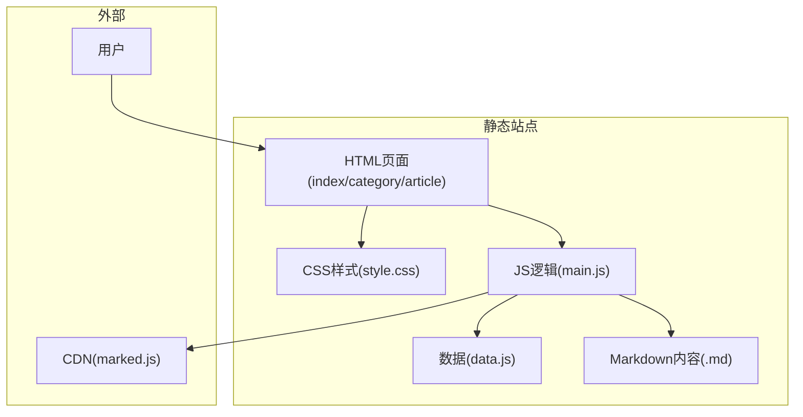

# 架构设计

<cite>
**本文引用的文件**
- [index.html](file://index.html)
- [category.html](file://category.html)
- [article.html](file://article.html)
- [style.css](file://css/style.css)
- [data.js](file://js/data.js)
- [main.js](file://js/main.js)
- [article-4.md](file://content/articles/article-4.md)
- [article-5.md](file://content/articles/article-5.md)
- [article-6.md](file://content/articles/article-6.md)
- [article-7.md](file://content/articles/article-7.md)
</cite>

## 目录
1. [简介](#简介)
2. [项目结构](#项目结构)
3. [核心组件](#核心组件)
4. [架构总览](#架构总览)
5. [详细组件分析](#详细组件分析)
6. [依赖关系分析](#依赖关系分析)
7. [性能考量](#性能考量)
8. [故障排查指南](#故障排查指南)
9. [结论](#结论)
10. [附录](#附录)

## 简介
本项目是一个基于纯静态文件的 SPA（单页应用）网站，采用 HTML、CSS、JavaScript 三分法的职责分离与模块化架构。数据层（js/data.js）负责文章与分类元数据；业务逻辑层（js/main.js）负责页面初始化、路由与交互、Markdown 渲染与图片灯箱；视图层（HTML/CSS）负责结构与样式表现。该架构强调：
- 数据驱动渲染：通过统一的数据接口驱动视图更新
- 模块化与可维护性：清晰的职责划分与最小耦合
- 可扩展性：新增页面或功能仅需在业务逻辑层扩展
- 团队协作效率：前端与内容作者可并行工作（内容以 Markdown 存储）

## 项目结构
项目采用扁平化的静态站点组织方式，核心文件如下：
- HTML 页面：index.html（首页）、category.html（分类列表）、article.html（文章详情）
- 样式：css/style.css（全局样式与主题变量）
- 脚本：js/data.js（数据配置与查询）、js/main.js（页面逻辑与交互）
- 内容：content/articles/*.md（Markdown 文章内容）

图表来源
- [index.html](file://index.html)
- [category.html](file://category.html)
- [article.html](file://article.html)
- [style.css](file://css/style.css)
- [data.js](file://js/data.js)
- [main.js](file://js/main.js)

章节来源
- [index.html](file://index.html)
- [category.html](file://category.html)
- [article.html](file://article.html)
- [style.css](file://css/style.css)
- [data.js](file://js/data.js)
- [main.js](file://js/main.js)

## 核心组件
- 数据层（data.js）
  - 定义分类配置与文章元数据
  - 提供查询接口：按 ID、分类、精选、搜索
  - 支持 CommonJS 导出，便于在不同环境复用
- 业务逻辑层（main.js）
  - 页面初始化：根据 data-page 属性选择初始化分支
  - 导航栏交互：滚动样式、移动端汉堡菜单
  - 文章网格渲染：创建卡片、键盘可达性、点击跳转
  - 分类筛选：URL 参数驱动、历史记录更新、动态刷新
  - 文章详情：标题更新、头部渲染、封面渲染、Markdown 加载与渲染
  - 图片灯箱：点击缩放、ESC 关闭、背景溢出控制
  - 返回顶部：滚动阈值触发、平滑回到顶部
  - 错误处理：空状态与错误提示
  - 页面过渡：入场动画与卸载淡出
- 视图层（HTML/CSS）
  - HTML 结构：语义化标签、ARIA 属性、无障碍友好
  - CSS 主题：CSS 变量、网格布局、响应式与动画
  - 组件化样式：文章卡片、分类卡片、按钮、导航栏、文章详情

章节来源
- [data.js](file://js/data.js)
- [main.js](file://js/main.js)
- [style.css](file://css/style.css)
- [index.html](file://index.html)
- [category.html](file://category.html)
- [article.html](file://article.html)

## 架构总览
该 SPA 采用“数据驱动 + 业务逻辑 + 视图”的三层分离：
- 数据层：集中管理文章与分类元数据，提供稳定查询接口
- 业务逻辑层：封装页面行为、交互与异步加载（Markdown）
- 视图层：结构与样式解耦，通过类名与属性与逻辑层协作

图表来源
- [index.html](file://index.html)
- [category.html](file://category.html)
- [article.html](file://article.html)
- [style.css](file://css/style.css)
- [data.js](file://js/data.js)
- [main.js](file://js/main.js)

## 详细组件分析

### 数据层（data.js）
- 职责
  - 维护分类配置（名称、描述、颜色）
  - 维护文章元数据（标题、分类、日期、摘要、封面、内容路径）
  - 提供查询方法：按 ID、分类、精选、搜索
- 设计要点
  - 面向查询的 API：getArticleById、getArticlesByCategory、getFeaturedArticles、searchArticles
  - 与环境解耦：CommonJS 导出兼容
- 复杂度
  - 查询为线性扫描，文章数量增长时可考虑索引优化

图表来源
- [data.js](file://js/data.js)

章节来源
- [data.js](file://js/data.js)

### 业务逻辑层（main.js）
- 职责
  - 页面初始化：根据 data-page 选择首页、分类、文章详情初始化
  - 导航栏：滚动样式、移动端菜单、点击关闭
  - 文章网格：创建卡片、键盘可达性、点击跳转详情
  - 分类筛选：按钮生成、激活态切换、URL 更新、内容刷新
  - 文章详情：头部信息、封面、Markdown 加载与渲染、错误处理
  - 图片灯箱：动态创建遮罩、点击/ESC 关闭、溢出控制
  - 返回顶部：滚动阈值、平滑回到顶部
  - 错误处理：空状态与错误提示
  - 页面过渡：入场动画、卸载淡出
- 设计要点
  - 状态管理：currentPage、currentCategory、navbarScrolled
  - 工具函数：URL 参数解析、日期格式化、防抖
  - 异步加载：Markdown 通过 fetch 获取，使用 marked.js 渲染
- 复杂度
  - 页面初始化 switch 分支线性，新增页面只需扩展分支
  - 渲染函数按文章数线性，支持动画延迟

图表来源
- [main.js](file://js/main.js)
- [data.js](file://js/data.js)

章节来源
- [main.js](file://js/main.js)

### 视图层（HTML/CSS）
- 职责
  - HTML：语义化结构、无障碍属性、占位容器（通过 JS 填充）
  - CSS：主题变量、网格布局、响应式、动画与交互
- 设计要点
  - 主题系统：CSS 变量统一配色与间距
  - 组件化：文章卡片、分类卡片、按钮、导航栏
  - 响应式：媒体查询与 clamp 字体、网格列数自适应
  - 动画：页面入场、浮动几何图形、悬停效果

图表来源
- [index.html](file://index.html)
- [category.html](file://category.html)
- [article.html](file://article.html)
- [style.css](file://css/style.css)
- [main.js](file://js/main.js)

章节来源
- [index.html](file://index.html)
- [category.html](file://category.html)
- [article.html](file://article.html)
- [style.css](file://css/style.css)

### 组件交互流程图（分类筛选）

图表来源
- [main.js](file://js/main.js)
- [data.js](file://js/data.js)
- [category.html](file://category.html)

章节来源
- [main.js](file://js/main.js)
- [category.html](file://category.html)

## 依赖关系分析
- 模块内聚与耦合
  - data.js 与 main.js：通过函数调用耦合，接口稳定，耦合度低
  - main.js 与 HTML/CSS：通过类名与属性耦合，结构清晰
  - main.js 与 Markdown：通过 fetch 与 marked.js 耦合，外部依赖明确
- 外部依赖
  - marked.js（CDN）：Markdown 渲染
  - 浏览器 API：fetch、URL、History、DOM、事件
- 循环依赖
  - 无循环依赖，职责边界清晰

图表来源
- [data.js](file://js/data.js)
- [main.js](file://js/main.js)
- [article.html](file://article.html)
- [style.css](file://css/style.css)

章节来源
- [data.js](file://js/data.js)
- [main.js](file://js/main.js)

## 性能考量
- 渲染性能
  - 文章卡片逐个插入，支持动画延迟，提升感知性能
  - 图片懒加载（loading="lazy/eager"）减少首屏阻塞
- 网络性能
  - Markdown 通过 fetch 异步加载，避免阻塞首屏
  - marked.js 通过 CDN 加载，减少本地体积
- 交互性能
  - 滚动事件使用防抖，降低重绘频率
  - 返回顶部按钮仅在超过阈值时显示
- 可扩展性
  - 新增页面只需在 main.js 的初始化分支中扩展
  - 新增分类只需在 data.js 中扩展分类配置

## 故障排查指南
- 文章详情空白或报错
  - 检查文章内容路径是否存在且可访问
  - 确认 marked.js 是否正确加载
  - 查看控制台错误信息
- 分类筛选不生效
  - 检查 URL 参数是否正确传递
  - 确认筛选按钮的 data-category 属性与分类键一致
- 导航栏在移动端无法关闭
  - 检查汉堡菜单的 active 类与 open 类是否正确切换
  - 确认 body 溢出控制逻辑
- 图片灯箱无法打开
  - 检查图片点击事件绑定是否生效
  - 确认遮罩元素是否正确创建与移除

章节来源
- [main.js](file://js/main.js)
- [article.html](file://article.html)

## 结论
该 SPA 架构通过“数据驱动 + 业务逻辑 + 视图”三层分离，实现了清晰的职责划分与良好的可维护性。模块化设计使得新增页面与功能的成本极低，同时通过 CSS 变量与组件化样式保证了视觉一致性与响应式体验。配合 Markdown 内容与 CDN 渲染，内容作者与前端开发者可以高效协作，满足从个人博客到小型知识库的多种场景。

## 附录
- 系统边界图

图表来源
- [index.html](file://index.html)
- [category.html](file://category.html)
- [article.html](file://article.html)
- [style.css](file://css/style.css)
- [data.js](file://js/data.js)
- [main.js](file://js/main.js)
- [article-4.md](file://content/articles/article-4.md)
- [article-5.md](file://content/articles/article-5.md)
- [article-6.md](file://content/articles/article-6.md)
- [article-7.md](file://content/articles/article-7.md)