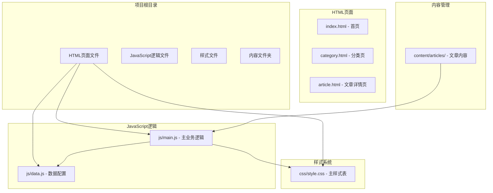
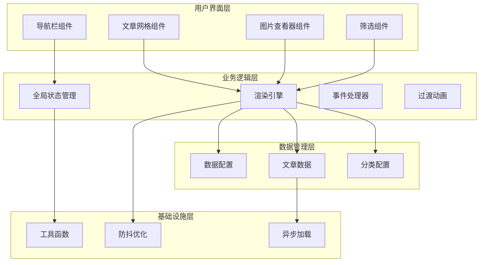
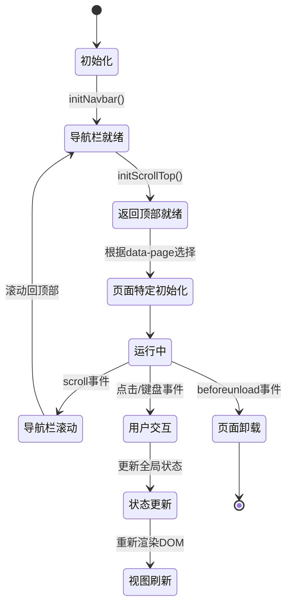
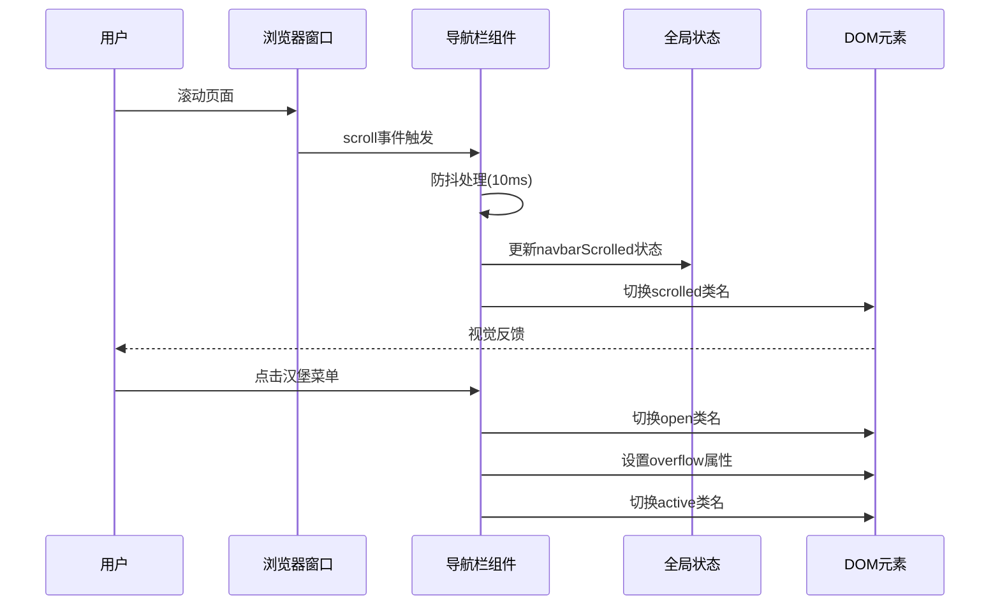
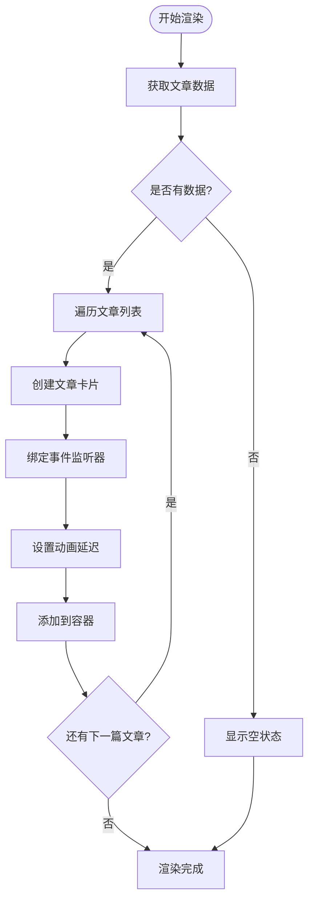
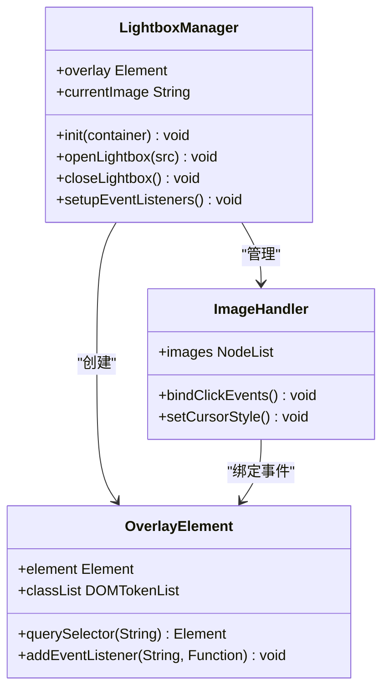
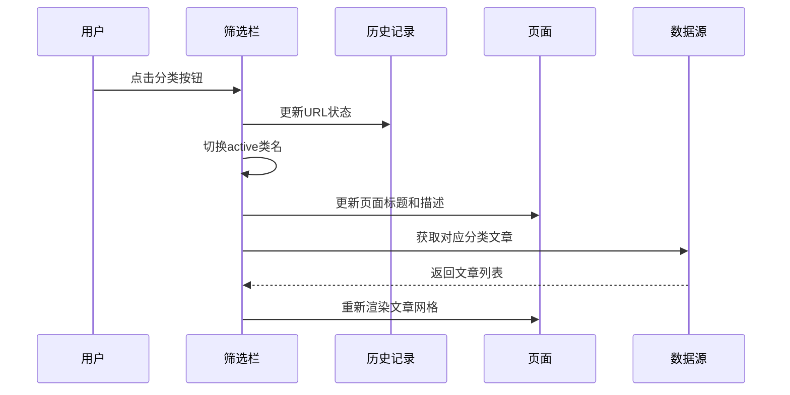
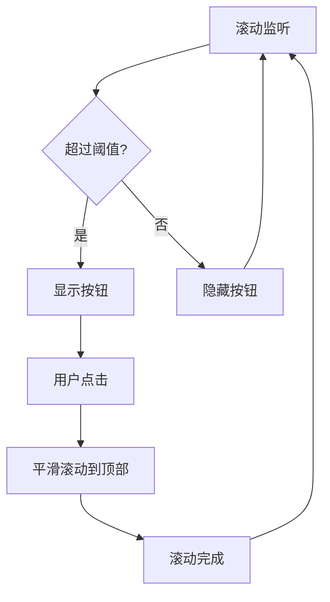
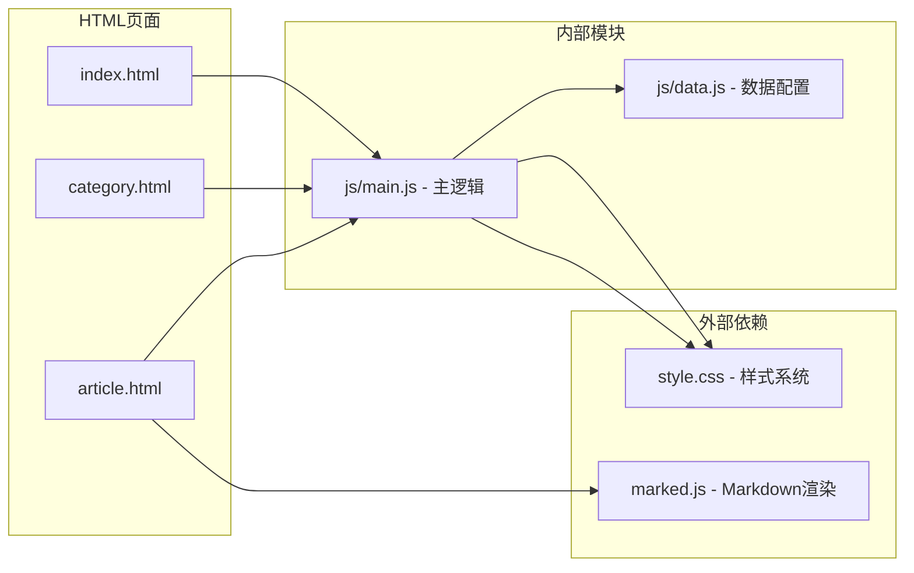
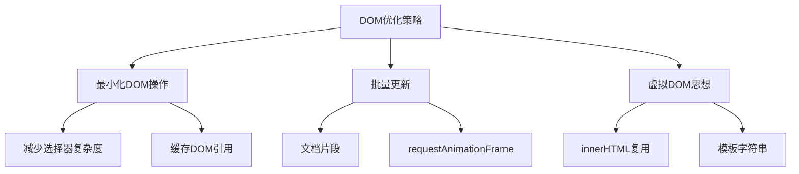

# 业务逻辑模块

<cite>
**本文档引用的文件**
- [js/main.js](file://js/main.js)
- [js/data.js](file://js/data.js)
- [index.html](file://index.html)
- [category.html](file://category.html)
- [article.html](file://article.html)
- [css/style.css](file://css/style.css)
</cite>

## 目录
1. [项目概述](#项目概述)
2. [项目结构](#项目结构)
3. [核心组件](#核心组件)
4. [架构概览](#架构概览)
5. [详细组件分析](#详细组件分析)
6. [依赖关系分析](#依赖关系分析)
7. [性能考虑](#性能考虑)
8. [故障排除指南](#故障排除指南)
9. [结论](#结论)

## 项目概述

Hot-Site是一个现代化的静态知识库网站，采用纯JavaScript实现的单页应用(SPA)架构。该项目专注于技术、AI、游戏、音乐和艺术等领域的优质内容展示，提供了完整的导航、文章浏览、分类筛选和图片查看等核心功能。

项目采用模块化设计，将业务逻辑集中在js/main.js中，数据管理在js/data.js中，通过HTML模板和CSS样式实现响应式布局。整个应用支持移动端适配，具备良好的用户体验和性能表现。

## 项目结构

Hot-Site项目采用清晰的文件组织结构，主要包含以下核心文件：

**图表来源**
- [index.html:1-190](file://index.html#L1-L190)
- [category.html:1-103](file://category.html#L1-L103)
- [article.html:1-107](file://article.html#L1-L107)
- [js/main.js:1-461](file://js/main.js#L1-L461)
- [js/data.js:1-158](file://js/data.js#L1-L158)

**章节来源**
- [index.html:1-190](file://index.html#L1-L190)
- [category.html:1-103](file://category.html#L1-L103)
- [article.html:1-107](file://article.html#L1-L107)

## 核心组件

Hot-Site项目的核心业务逻辑由js/main.js文件实现，该文件包含了完整的SPA应用程序功能。主要组件包括：

### 全局状态管理
- **状态对象**: 维护当前页面、分类状态和导航栏滚动状态
- **URL参数处理**: 提供统一的URL查询参数获取功能
- **日期格式化**: 标准化的日期显示格式

### 导航栏控制系统
- **滚动检测**: 实时监控页面滚动位置，动态调整导航栏样式
- **移动端汉堡菜单**: 响应式导航菜单，支持触摸手势
- **菜单交互**: 平滑的展开收起动画和键盘导航支持

### 文章渲染系统
- **文章卡片生成**: 动态创建美观的文章卡片组件
- **网格布局**: 响应式网格系统，支持多种屏幕尺寸
- **动画效果**: 有序的入场动画和悬停效果

### 图片查看器组件
- **Lightbox实现**: 全屏图片查看器，支持缩放和拖拽
- **键盘控制**: 支持ESC键关闭和箭头键导航
- **触摸支持**: 移动端手势操作

### 页面过渡动画
- **淡入效果**: 页面加载时的平滑过渡动画
- **状态保持**: 页面切换时的状态持久化

**章节来源**
- [js/main.js:6-11](file://js/main.js#L6-L11)
- [js/main.js:15-39](file://js/main.js#L15-L39)
- [js/main.js:44-77](file://js/main.js#L44-L77)
- [js/main.js:82-116](file://js/main.js#L82-L116)
- [js/main.js:318-371](file://js/main.js#L318-L371)

## 架构概览

Hot-Site采用模块化的单页应用架构，实现了清晰的关注点分离：

**图表来源**
- [js/main.js:436-460](file://js/main.js#L436-L460)
- [js/data.js:6-37](file://js/data.js#L6-L37)
- [js/data.js:40-158](file://js/data.js#L40-L158)

### 模块间通信机制

系统采用事件驱动的通信模式：

1. **事件监听器注册**: 统一在DOM加载完成后注册
2. **状态共享**: 通过全局状态对象实现跨模块数据共享
3. **回调函数**: 使用高阶函数实现灵活的事件处理
4. **异步数据流**: 通过Promise和async/await处理异步操作

### 状态管理策略

**图表来源**
- [js/main.js:436-460](file://js/main.js#L436-L460)
- [js/main.js:49-58](file://js/main.js#L49-L58)
- [js/main.js:388-394](file://js/main.js#L388-L394)

**章节来源**
- [js/main.js:436-460](file://js/main.js#L436-L460)
- [js/main.js:49-58](file://js/main.js#L49-L58)
- [js/main.js:388-394](file://js/main.js#L388-L394)

## 详细组件分析

### 导航栏控制系统

导航栏是Hot-Site的核心交互组件，实现了完整的响应式导航功能：

#### 核心功能特性
- **滚动检测**: 通过防抖优化减少重绘频率
- **样式切换**: 根据滚动位置动态调整视觉效果
- **移动端适配**: 完整的汉堡菜单实现
- **键盘无障碍**: 支持Tab键导航和Enter键激活

#### 技术实现细节

**图表来源**
- [js/main.js:49-77](file://js/main.js#L49-L77)
- [js/main.js:62-76](file://js/main.js#L62-L76)

#### 事件监听器管理

导航栏组件注册了多个事件监听器，采用统一的管理策略：

- **滚动事件**: 使用debounce函数优化性能
- **点击事件**: 处理菜单开关和链接跳转
- **键盘事件**: 支持无障碍访问

**章节来源**
- [js/main.js:44-77](file://js/main.js#L44-L77)

### 文章网格渲染系统

文章网格系统负责将文章数据转换为美观的卡片布局：

#### 渲染流程

**图表来源**
- [js/main.js:119-146](file://js/main.js#L119-L146)
- [js/main.js:82-116](file://js/main.js#L82-L116)

#### 卡片组件特性

每个文章卡片都包含完整的交互功能：
- **点击跳转**: 支持文章详情页导航
- **键盘支持**: Enter和Space键激活
- **悬停效果**: 平滑的视觉反馈
- **动画入场**: 有序的加载动画

**章节来源**
- [js/main.js:119-146](file://js/main.js#L119-L146)
- [js/main.js:82-116](file://js/main.js#L82-L116)

### 图片查看器组件

Lightbox图片查看器提供了完整的图片浏览体验：

#### 核心功能实现

**图表来源**
- [js/main.js:318-371](file://js/main.js#L318-L371)
- [js/main.js:318-327](file://js/main.js#L318-L327)

#### 交互特性

- **点击放大**: 图片点击触发全屏显示
- **键盘控制**: ESC键关闭，箭头键切换
- **触摸手势**: 支持拖拽和缩放
- **自动隐藏**: 点击背景关闭

**章节来源**
- [js/main.js:318-371](file://js/main.js#L318-L371)

### 分类筛选系统

分类筛选功能允许用户按主题浏览内容：

#### 筛选流程

**图表来源**
- [js/main.js:179-218](file://js/main.js#L179-L218)

#### 状态同步机制

系统实现了完整的URL状态同步：
- **历史API**: 使用pushState保持浏览器历史
- **实时更新**: 动态更新页面标题和描述
- **状态持久化**: 通过URL参数保持筛选状态

**章节来源**
- [js/main.js:179-218](file://js/main.js#L179-L218)

### 返回顶部功能

返回顶部按钮提供了便捷的页面导航：

#### 实现策略

**图表来源**
- [js/main.js:375-403](file://js/main.js#L375-L403)
- [js/main.js:388-394](file://js/main.js#L388-L394)

#### 性能优化

- **防抖处理**: 100ms防抖减少重绘
- **requestAnimationFrame**: 使用浏览器优化的动画帧
- **条件显示**: 仅在需要时显示按钮

**章节来源**
- [js/main.js:375-403](file://js/main.js#L375-L403)

## 依赖关系分析

Hot-Site项目的依赖关系清晰且模块化：

**图表来源**
- [js/main.js:18-22](file://js/main.js#L18-L22)
- [js/main.js:291-299](file://js/main.js#L291-L299)
- [index.html:187-188](file://index.html#L187-L188)
- [article.html:22](file://article.html#L22)

### 数据依赖

系统对js/data.js的依赖关系：

- **CATEGORIES**: 分类配置数据
- **ARTICLES**: 文章元数据
- **辅助函数**: 数据查询和过滤

### 样式依赖

CSS文件提供了完整的样式支持：
- **响应式设计**: 移动端适配
- **动画效果**: 页面过渡和组件动画
- **主题变量**: 统一的颜色和字体系统

**章节来源**
- [js/main.js:18-22](file://js/main.js#L18-L22)
- [js/main.js:291-299](file://js/main.js#L291-L299)
- [js/data.js:6-37](file://js/data.js#L6-L37)

## 性能考虑

Hot-Site项目在性能优化方面采用了多项策略：

### 防抖优化技术

系统广泛使用防抖技术减少不必要的计算：

- **滚动事件**: 10ms防抖间隔
- **返回顶部**: 100ms防抖间隔
- **窗口大小变化**: 合理的防抖处理

### DOM操作优化

### 资源加载策略

- **懒加载**: 图片使用loading="lazy"
- **预加载**: 关键字体预连接
- **CDN使用**: 第三方库通过CDN加载

### 内存管理

- **事件监听器清理**: 合理的生命周期管理
- **闭包优化**: 避免内存泄漏
- **对象复用**: 减少对象创建开销

## 故障排除指南

### 常见问题诊断

#### 导航栏不响应

**症状**: 滚动时导航栏样式不变化

**排查步骤**:
1. 检查console是否有错误
2. 验证DOM元素是否存在
3. 确认事件监听器是否正确注册

**解决方案**:
- 确保DOM完全加载后再初始化
- 检查CSS类名拼写
- 验证防抖函数正常工作

#### 文章网格空白

**症状**: 文章列表显示为空

**排查步骤**:
1. 检查网络请求是否成功
2. 验证数据格式正确性
3. 确认容器元素存在

**解决方案**:
- 检查文章数据路径
- 验证Markdown文件可访问性
- 确认CORS配置正确

#### 图片查看器失效

**症状**: 点击图片无反应

**排查步骤**:
1. 检查图片元素是否正确绑定事件
2. 验证Lightbox元素创建
3. 确认CSS样式加载

**解决方案**:
- 确保marked.js正确加载
- 检查图片路径有效性
- 验证事件委托正确性

### 调试工具使用

推荐使用以下调试方法：
- **浏览器开发者工具**: 监控事件和网络请求
- **性能面板**: 分析渲染性能
- **网络面板**: 检查资源加载状态
- **控制台**: 查看错误信息和日志

**章节来源**
- [js/main.js:301-313](file://js/main.js#L301-L313)
- [js/main.js:407-420](file://js/main.js#L407-L420)

## 结论

Hot-Site项目展现了现代JavaScript应用开发的最佳实践。通过模块化设计、清晰的架构分层和完善的性能优化，该项目成功实现了功能丰富且用户体验优秀的静态知识库网站。

### 主要成就

- **模块化架构**: 清晰的职责分离和依赖管理
- **响应式设计**: 完整的移动端适配方案
- **性能优化**: 多层次的性能提升策略
- **无障碍支持**: 完善的键盘导航和屏幕阅读器支持
- **可扩展性**: 良好的代码结构便于功能扩展

### 技术亮点

- **防抖优化**: 有效减少重绘和重排
- **事件委托**: 提升事件处理效率
- **异步加载**: 改善首屏加载性能
- **状态管理**: 统一的数据流管理
- **动画系统**: 流畅的用户体验

### 发展建议

为进一步提升项目质量，建议考虑：
- 添加单元测试覆盖关键功能
- 实现服务端渲染以改善SEO
- 集成PWA功能提升离线体验
- 添加内容缓存机制
- 实现更丰富的用户交互功能

Hot-Site项目为静态站点开发提供了优秀的参考实现，其设计理念和最佳实践值得在类似项目中借鉴和应用。