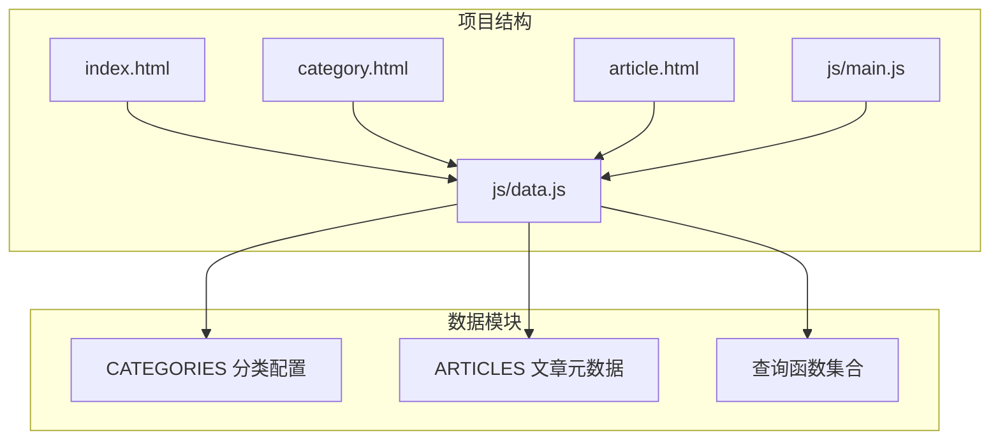
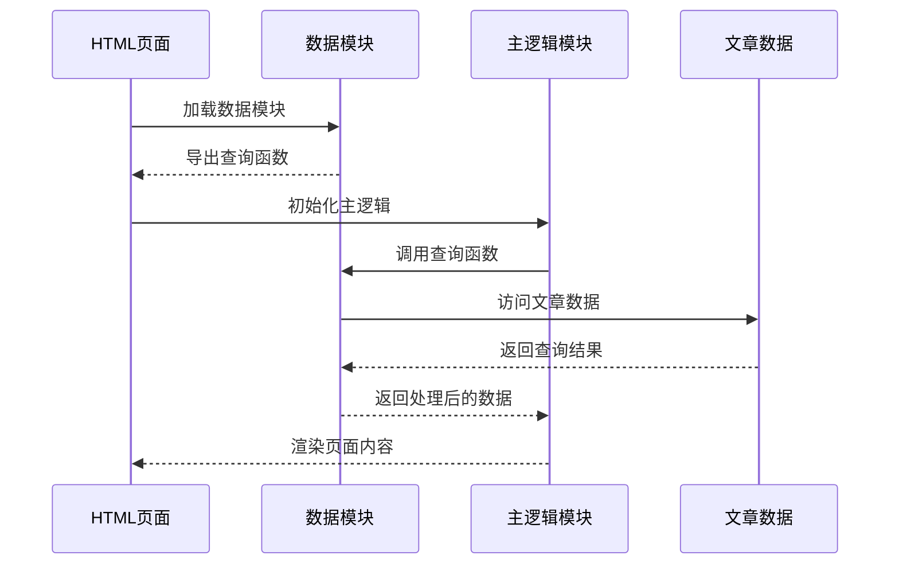
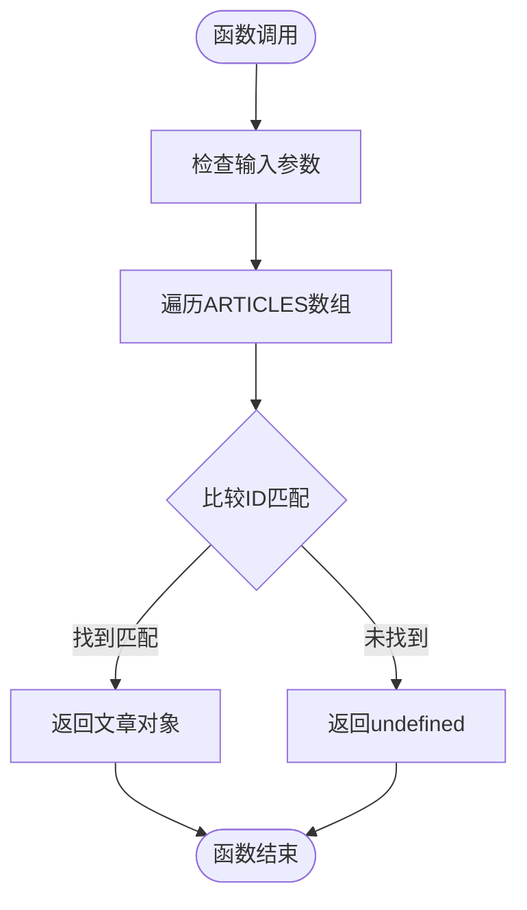
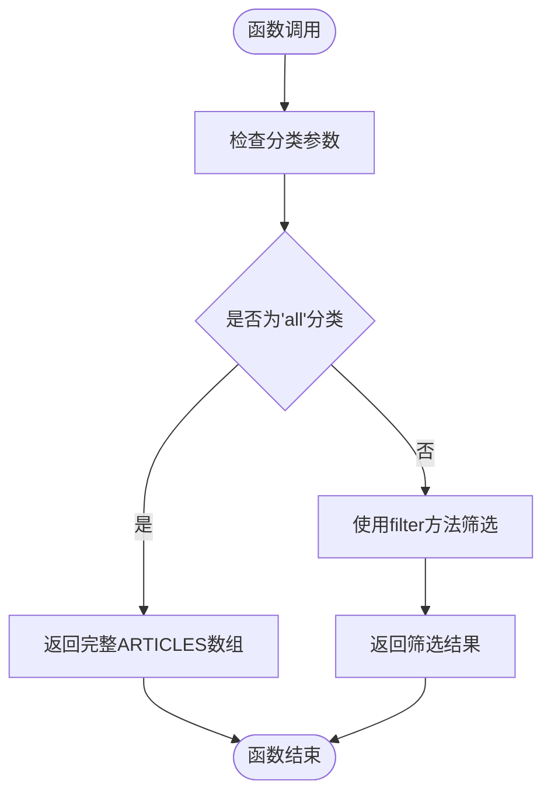
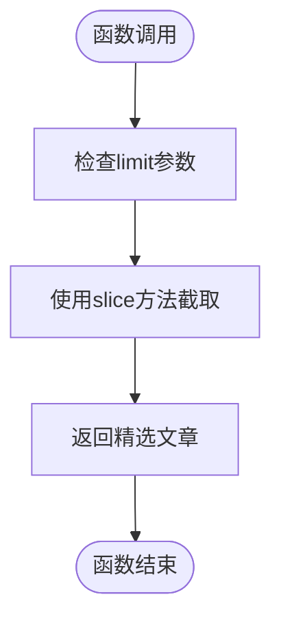
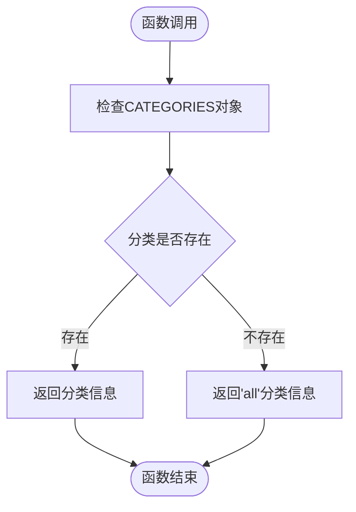
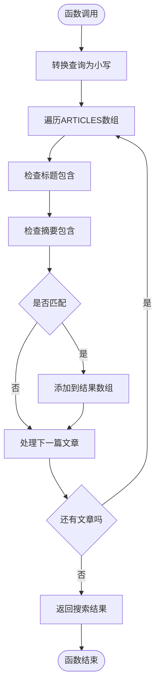
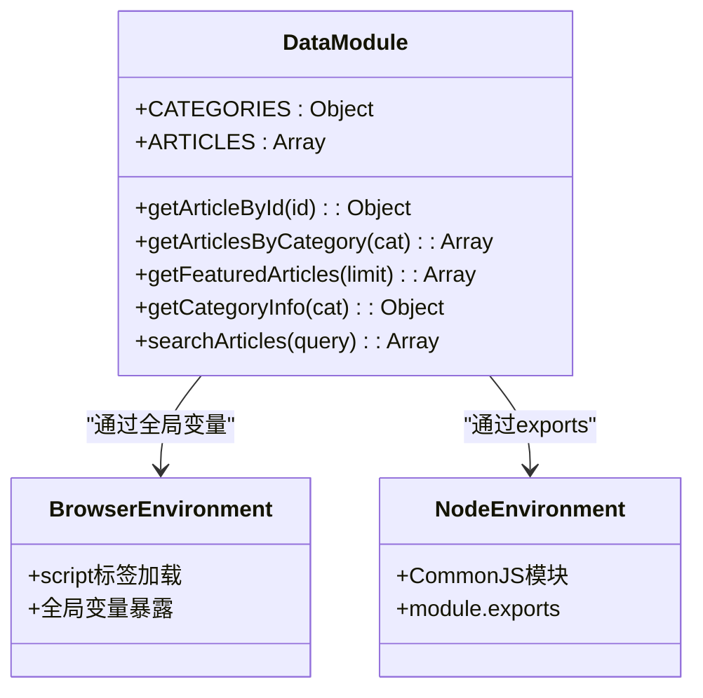
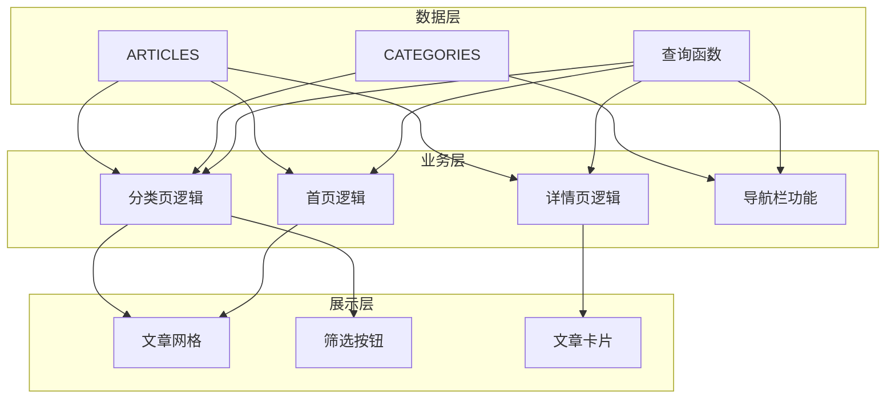

# 数据配置模块

<cite>
**本文档引用的文件**
- [data.js](file://js/data.js)
- [main.js](file://js/main.js)
- [index.html](file://index.html)
- [category.html](file://category.html)
- [article.html](file://article.html)
- [article-1.md](file://content/articles/article-1.md)
- [article-2.md](file://content/articles/article-2.md)
- [CLAUDE.md](file://CLAUDE.md)
</cite>

## 目录
1. [简介](#简介)
2. [项目结构](#项目结构)
3. [核心组件](#核心组件)
4. [架构概览](#架构概览)
5. [详细组件分析](#详细组件分析)
6. [依赖关系分析](#依赖关系分析)
7. [性能考虑](#性能考虑)
8. [故障排除指南](#故障排除指南)
9. [结论](#结论)

## 简介

Hot-Site项目的数据配置模块是整个静态站点的核心数据层，负责管理文章元数据和分类配置。该模块采用简洁的JavaScript模块设计，提供了完整的数据访问接口，支持文章查询、分类管理和内容搜索等功能。模块设计遵循单一职责原则，将数据存储与业务逻辑分离，为前端应用提供了可靠的数据支撑。

## 项目结构

数据配置模块位于`js/data.js`文件中，采用模块化设计，通过UMD（通用模块定义）模式支持多种环境。项目整体结构清晰，数据层与展示层分离，便于维护和扩展。

**图表来源**
- [data.js:1-158](file://js/data.js#L1-L158)
- [index.html:187-188](file://index.html#L187-L188)
- [category.html:100-101](file://category.html#L100-L101)
- [article.html:104-105](file://article.html#L104-L105)

**章节来源**
- [data.js:1-158](file://js/data.js#L1-L158)
- [CLAUDE.md:21-22](file://CLAUDE.md#L21-L22)

## 核心组件

数据配置模块包含两个主要数据结构和一组查询函数，形成了完整的数据访问层。

### 分类配置对象 (CATEGORIES)

CATEGORIES是一个常量对象，定义了所有可用的分类及其元数据信息。每个分类包含以下属性：
- `name`: 分类的中文名称
- `description`: 分类的描述信息
- `color`: 分类的颜色标识（可选）

系统预定义了6个分类：全部、技术、AI、游戏、音乐、艺术，其中技术、AI、游戏、音乐、艺术分类具有颜色属性，用于界面渲染。

### 文章元数据数组 (ARTICLES)

ARTICLES是一个包含8个文章对象的数组，每个文章对象包含以下必需字段：
- `id`: 文章唯一标识符
- `title`: 文章标题
- `category`: 文章所属分类标识符
- `date`: 发布日期（YYYY-MM-DD格式）
- `excerpt`: 文章摘要
- `cover`: 封面图片URL
- `content`: Markdown内容文件路径

**章节来源**
- [data.js:6-37](file://js/data.js#L6-L37)
- [data.js:40-113](file://js/data.js#L40-L113)

## 架构概览

数据配置模块采用模块化架构，通过UMD模式实现跨平台兼容性。模块导出后可在浏览器环境中直接使用，也可在Node.js环境中通过CommonJS规范导入。

**图表来源**
- [data.js:147-158](file://js/data.js#L147-L158)
- [main.js:436-460](file://js/main.js#L436-L460)

**章节来源**
- [data.js:147-158](file://js/data.js#L147-L158)
- [main.js:150-177](file://js/main.js#L150-L177)

## 详细组件分析

### 查询函数详解

数据模块提供了5个核心查询函数，每个函数都针对特定的数据访问场景进行了优化。

#### getArticleById 函数

该函数用于根据文章ID精确查找文章对象，采用Array.prototype.find方法实现O(n)时间复杂度的线性搜索。

**图表来源**
- [data.js:115-118](file://js/data.js#L115-L118)

#### getArticlesByCategory 函数

该函数支持按分类过滤文章，特殊处理'all'分类返回完整列表，其他分类使用Array.prototype.filter进行筛选。

**图表来源**
- [data.js:120-126](file://js/data.js#L120-L126)

#### getFeaturedArticles 函数

该函数返回最新的文章列表，默认返回前6篇，使用Array.prototype.slice进行数组切片操作。

**图表来源**
- [data.js:128-131](file://js/data.js#L128-L131)

#### getCategoryInfo 函数

该函数提供分类信息查询，如果指定分类不存在则回退到'all'分类，确保数据访问的健壮性。

**图表来源**
- [data.js:133-136](file://js/data.js#L133-L136)

#### searchArticles 函数

该函数实现全文本搜索功能，支持在标题和摘要中搜索关键词，使用大小写不敏感的匹配方式。

**图表来源**
- [data.js:138-145](file://js/data.js#L138-L145)

**章节来源**
- [data.js:115-145](file://js/data.js#L115-L145)

### 模块导出机制

数据模块采用UMD（Universal Module Definition）模式，确保在不同环境下都能正常工作：

**图表来源**
- [data.js:147-158](file://js/data.js#L147-L158)

**章节来源**
- [data.js:147-158](file://js/data.js#L147-L158)

## 依赖关系分析

数据模块与主逻辑模块之间存在紧密的依赖关系，主逻辑模块通过数据模块提供的查询函数实现各种功能。

**图表来源**
- [main.js:150-243](file://js/main.js#L150-L243)
- [data.js:6-37](file://js/data.js#L6-L37)
- [data.js:40-113](file://js/data.js#L40-L113)

**章节来源**
- [main.js:150-243](file://js/main.js#L150-L243)
- [index.html:29](file://index.html#L29)
- [category.html:27](file://category.html#L27)
- [article.html:27](file://article.html#L27)

## 性能考虑

数据模块在设计时充分考虑了性能因素，采用了适合静态站点的优化策略：

### 时间复杂度分析
- `getArticleById`: O(n) - 线性搜索，适合小规模数据集
- `getArticlesByCategory`: O(n) - 线性过滤，适合分类数量较少的情况
- `getFeaturedArticles`: O(k) - k为限制数量，通常很小
- `getCategoryInfo`: O(1) - 对象属性访问
- `searchArticles`: O(n*m) - n为文章数量，m为平均文章长度

### 内存使用
- 所有数据存储在内存中，启动时一次性加载
- 文章内容文件路径存储，实际内容通过异步加载
- 分类颜色信息存储在内存中，减少DOM操作

### 优化建议
1. **数据分页**: 对于大量文章时考虑实现分页加载
2. **缓存机制**: 实现查询结果缓存，避免重复计算
3. **索引优化**: 为常用查询字段建立索引
4. **懒加载**: 对于大型内容文件实现懒加载

## 故障排除指南

### 常见问题及解决方案

#### 文章未找到错误
当使用`getArticleById`函数查询不存在的文章时，会返回`undefined`。主逻辑模块中对这种情况进行了处理，显示错误页面。

**解决方法**:
- 检查文章ID是否正确
- 确认文章是否存在于ARTICLES数组中
- 验证URL参数传递是否正确

#### 分类信息缺失
当查询不存在的分类时，`getCategoryInfo`函数会回退到'all'分类。这可能导致页面显示不符合预期。

**解决方法**:
- 检查分类标识符拼写
- 确认CATEGORIES对象中是否存在该分类
- 验证分类参数传递逻辑

#### 搜索结果为空
`searchArticles`函数可能返回空数组，这通常表示没有匹配的文章。

**解决方法**:
- 检查搜索关键词是否正确
- 确认文章标题和摘要中包含关键词
- 验证大小写转换逻辑

**章节来源**
- [main.js:222-233](file://js/main.js#L222-L233)
- [main.js:407-420](file://js/main.js#L407-L420)

## 结论

Hot-Site项目的数据配置模块设计简洁而实用，成功实现了数据与逻辑的分离。模块采用UMD模式确保了跨平台兼容性，查询函数提供了完整的数据访问接口。对于当前的小规模数据集，模块的性能表现良好。

### 设计优势
1. **模块化设计**: 清晰的职责分离，便于维护和扩展
2. **跨平台兼容**: UMD模式支持多种运行环境
3. **查询接口丰富**: 提供多种数据访问方式
4. **错误处理完善**: 对异常情况有良好的处理机制

### 改进建议
1. **性能优化**: 考虑实现查询缓存和索引机制
2. **数据验证**: 添加数据结构验证和类型检查
3. **异步加载**: 实现文章内容的异步加载机制
4. **扩展接口**: 提供数据修改和删除接口

该模块为Hot-Site项目提供了坚实的数据基础，为后续的功能扩展和性能优化奠定了良好的基础。