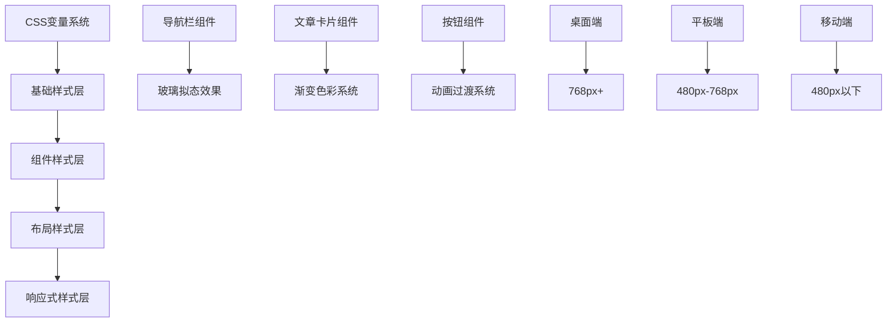
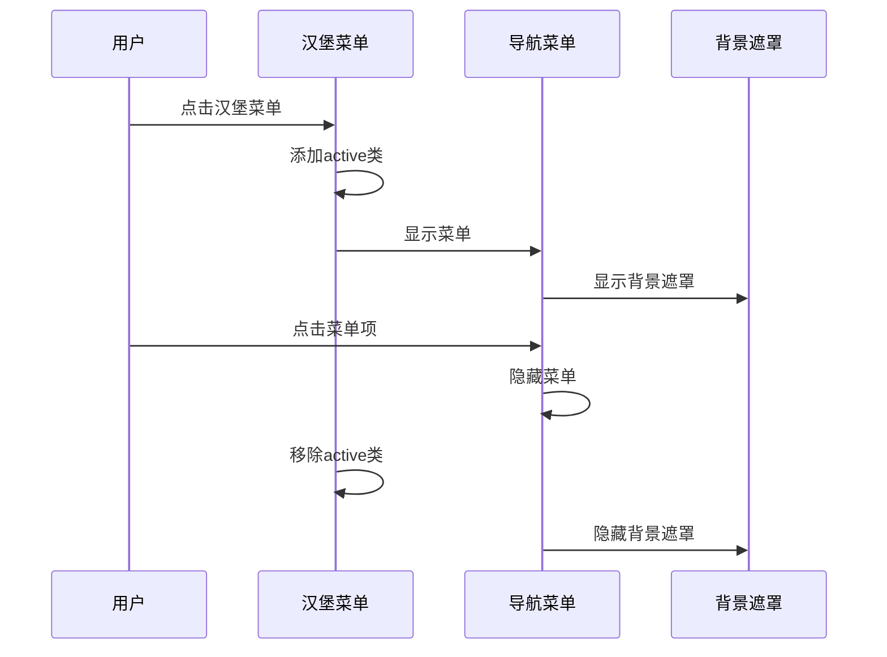
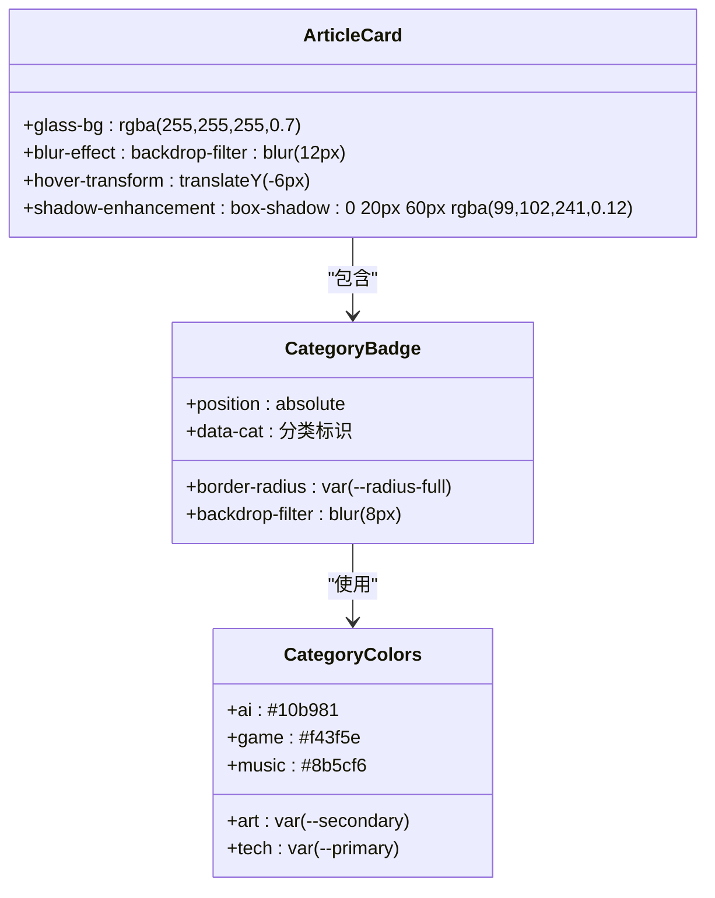
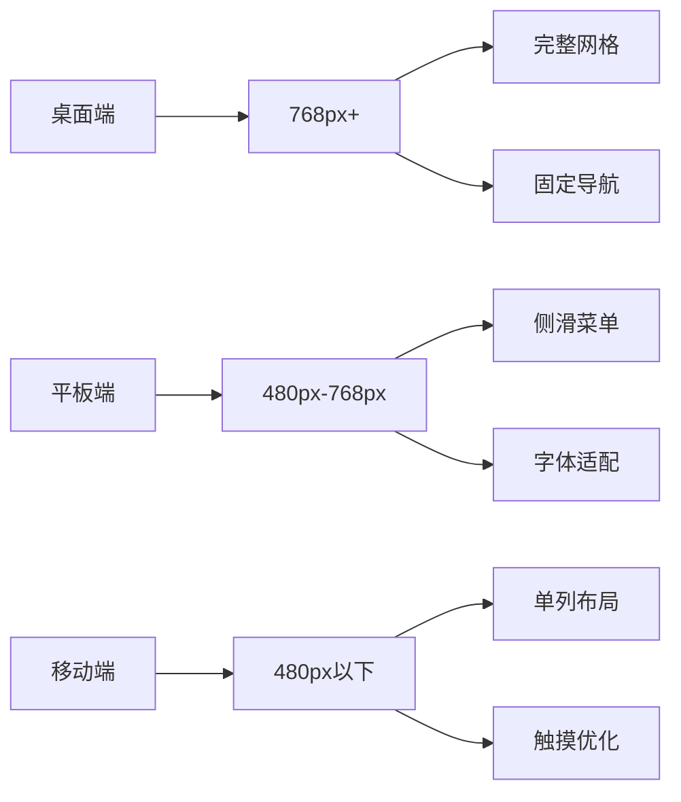
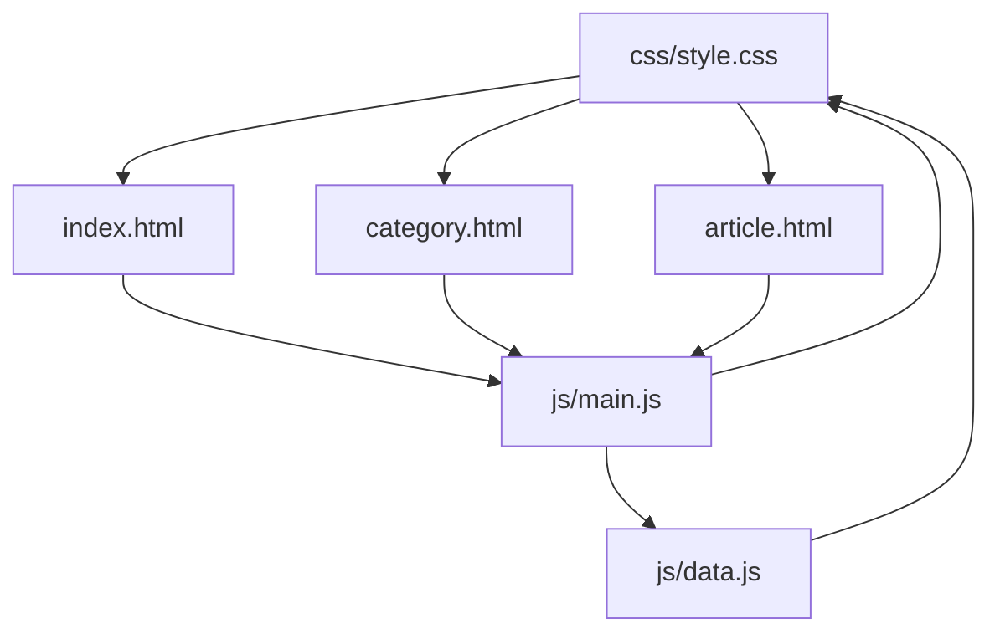

# 样式系统模块

<cite>
**本文档引用的文件**
- [css/style.css](file://css/style.css)
- [index.html](file://index.html)
- [category.html](file://category.html)
- [article.html](file://article.html)
- [main.js](file://js/main.js)
- [data.js](file://js/data.js)
</cite>

## 目录
1. [简介](#简介)
2. [项目结构](#项目结构)
3. [核心组件](#核心组件)
4. [架构概览](#架构概览)
5. [详细组件分析](#详细组件分析)
6. [依赖关系分析](#依赖关系分析)
7. [性能考虑](#性能考虑)
8. [故障排除指南](#故障排除指南)
9. [结论](#结论)

## 简介

Hot-Site项目采用现代化的CSS变量系统设计，构建了一个完整的样式系统模块。该系统基于CSS自定义属性实现了主题化、组件化和响应式设计，支持玻璃拟态效果、渐变色彩系统和流畅的动画过渡。本文档将深入解析样式系统的各个层面，包括CSS变量设计、组件化样式架构、响应式断点策略以及主题定制方案。

## 项目结构

Hot-Site项目的样式系统主要集中在单个CSS文件中，采用了模块化的组织方式：

```mermaid
graph TB
subgraph "样式系统架构"
A[CSS变量系统] --> B[全局重置]
A --> C[基础样式]
A --> D[组件样式]
A --> E[响应式设计]
A --> F[动画系统]
D --> G[导航栏组件]
D --> H[卡片组件]
D --> I[按钮组件]
D --> J[布局组件]
E --> K[桌面端样式]
E --> L[移动端样式]
E --> M[平板端样式]
</subgraph>
```

**图表来源**
- [css/style.css:1-1166](file://css/style.css#L1-L1166)

**章节来源**
- [css/style.css:1-1166](file://css/style.css#L1-L1166)
- [index.html:1-190](file://index.html#L1-L190)
- [category.html:1-103](file://category.html#L1-L103)
- [article.html:1-107](file://article.html#L1-L107)

## 核心组件

### CSS变量系统设计

样式系统的核心是基于`:root`伪类的CSS变量定义，提供了完整的主题化基础设施：

#### 主色调板系统
- **主色系**: Indigo系列 (#6366f1及其变体)
- **辅助色**: Cyan系列 (#06b6d4及其变体)
- **强调色**: Amber系列 (#f59e0b)
- **中性色**: Gray系列 (50-900级别)

#### 玻璃拟态变量
- `--glass-bg`: rgba(255, 255, 255, 0.7)
- `--glass-border`: rgba(255, 255, 255, 0.3)
- `--glass-shadow`: 0 8px 32px rgba(99, 102, 241, 0.08)

#### 间距系统
- 细间距: `--space-xs` (0.25rem)
- 小间距: `--space-sm` (0.5rem)
- 中间距: `--space-md` (1rem)
- 大间距: `--space-lg` (1.5rem)
- 超大间距: `--space-xl` (2rem)

**章节来源**
- [css/style.css:8-78](file://css/style.css#L8-L78)

### 字体系统

系统采用双字体栈设计：
- **西文**: Inter字体族，支持300-700权重
- **中文字体**: Noto Sans SC，支持300-700权重
- **等宽字体**: JetBrains Mono/Fira Code，用于代码展示

### 动画过渡系统

定义了三种过渡速度：
- 快速: `--transition-fast` (0.15s ease)
- 基础: `--transition-base` (0.3s ease)
- 缓慢: `--transition-slow` (0.5s ease)

**章节来源**
- [css/style.css:96-103](file://css/style.css#L96-L103)
- [css/style.css:70-74](file://css/style.css#L70-L74)

## 架构概览

样式系统采用分层架构设计，确保了良好的可维护性和扩展性：



**图表来源**
- [css/style.css:148-165](file://css/style.css#L148-L165)
- [css/style.css:438-455](file://css/style.css#L438-L455)
- [css/style.css:1029-1106](file://css/style.css#L1029-L1106)

## 详细组件分析

### 导航栏组件

导航栏是样式系统中最复杂的组件之一，实现了多种交互效果：

#### 玻璃拟态导航栏
- 使用`backdrop-filter: blur(20px)`实现毛玻璃效果
- 支持滚动时的样式切换
- 固定定位，层级设置为1000+

#### 汉堡菜单系统
- 响应式设计，在小屏幕设备上自动显示
- 三线菜单图标，支持动画变换
- 菜单滑入滑出效果



**图表来源**
- [css/style.css:230-257](file://css/style.css#L230-L257)
- [css/style.css:1035-1056](file://css/style.css#L1035-L1056)

**章节来源**
- [css/style.css:148-257](file://css/style.css#L148-L257)
- [main.js:44-77](file://js/main.js#L44-L77)

### 文章卡片组件

文章卡片系统实现了完整的卡片设计模式：

#### 玻璃拟态卡片
- 使用`backdrop-filter: blur(12px)`实现深度模糊效果
- 支持悬停时的阴影增强
- 动态边框颜色变化

#### 分类徽章系统
- 支持5种不同分类的颜色标识
- 使用CSS变量实现主题一致性
- 动态定位和透明度控制



**图表来源**
- [css/style.css:438-511](file://css/style.css#L438-L511)
- [css/style.css:488-511](file://css/style.css#L488-L511)

**章节来源**
- [css/style.css:438-548](file://css/style.css#L438-L548)
- [data.js:6-37](file://js/data.js#L6-L37)

### 按钮组件系统

按钮系统提供了两种主要样式：

#### 主要按钮
- 渐变背景：从主色到深主色
- 投影效果：使用主色发光变量
- 悬停动画：位移和阴影增强

#### 次要按钮
- 玻璃拟态设计
- 动态边框颜色变化
- 悬停时的白色背景转换

```mermaid
flowchart TD
A[按钮基类] --> B[主要按钮]
A --> C[次要按钮]
B --> D[渐变背景]
B --> E[发光投影]
B --> F[悬停位移]
C --> G[玻璃背景]
C --> H[动态边框]
C --> I[白色转换]
J[过渡动画] --> K[--transition-base]
L[圆角半径] --> M[--radius-full]
N[内边距] --> O[var(--space-md) var(--space-lg)]
```

**图表来源**
- [css/style.css:369-405](file://css/style.css#L369-L405)

**章节来源**
- [css/style.css:369-405](file://css/style.css#L369-L405)

### 响应式设计系统

样式系统实现了三层响应式断点：

#### 桌面端 (768px+)
- 标准网格布局
- 固定导航栏高度
- 完整的功能菜单

#### 平板端 (480px-768px)
- 网格列数减少
- 导航菜单改为侧滑
- 字体大小适配

#### 移动端 (480px以下)
- 单列网格布局
- 简化导航结构
- 优化触摸交互



**图表来源**
- [css/style.css:1029-1106](file://css/style.css#L1029-L1106)

**章节来源**
- [css/style.css:1029-1106](file://css/style.css#L1029-L1106)

### 动画过渡系统

系统实现了多种动画效果：

#### 页面进入动画
- 淡入效果：从translateY(12px)到0
- 持续时间：0.5秒
- 缓动函数：ease

#### 加载状态动画
- 骨骼屏动画：使用渐变背景移动
- 闪烁动画：shimmer效果
- 动画持续：1.5秒无限循环

#### 打字机动画
- 点号闪烁效果
- 步进动画：3步循环
- 动画持续：1.5秒

**章节来源**
- [css/style.css:131-138](file://css/style.css#L131-L138)
- [css/style.css:1109-1119](file://css/style.css#L1109-L1119)
- [css/style.css:1156-1165](file://css/style.css#L1156-L1165)

## 依赖关系分析

样式系统与其他模块的依赖关系：



**图表来源**
- [index.html:18](file://index.html#L18)
- [category.html:16](file://category.html#L16)
- [article.html:13](file://article.html#L13)

样式系统与JavaScript的交互主要体现在：
- 导航栏状态管理
- 页面过渡动画触发
- 动态内容渲染
- Lightbox图片查看器

**章节来源**
- [main.js:436-460](file://js/main.js#L436-L460)
- [index.html:18](file://index.html#L18)
- [category.html:16](file://category.html#L16)
- [article.html:13](file://article.html#L13)

## 性能考虑

样式系统在性能方面采用了多项优化策略：

### CSS变量优化
- 集中管理所有设计令牌
- 减少重复定义
- 支持动态主题切换

### 玻璃拟态性能
- 使用backdrop-filter替代复杂阴影
- 合理的模糊半径设置
- 避免过度的滤镜效果

### 响应式优化
- 使用媒体查询分层加载
- 移动端优先的样式设计
- 减少不必要的重绘

### 动画性能
- 使用transform和opacity动画
- 避免影响布局的属性动画
- 合理的动画持续时间和缓动函数

## 故障排除指南

### 常见问题及解决方案

#### 玻璃拟态效果不显示
**问题**: 在某些浏览器中玻璃效果不生效
**原因**: 浏览器对backdrop-filter支持不一致
**解决方案**: 
- 确保使用标准属性和-webkit前缀
- 提供降级方案（纯色背景）
- 检查浏览器兼容性

#### 字体加载问题
**问题**: 字体无法正确加载
**原因**: Google Fonts CDN访问受限
**解决方案**:
- 检查网络连接
- 使用本地字体备份
- 验证字体预加载链接

#### 响应式布局异常
**问题**: 移动端布局错乱
**原因**: 媒体查询断点设置不当
**解决方案**:
- 检查viewport meta标签
- 验证媒体查询语法
- 测试不同设备尺寸

#### 动画性能问题
**问题**: 动画卡顿或掉帧
**原因**: 复杂的动画效果影响性能
**解决方案**:
- 优化动画属性（仅使用transform和opacity）
- 减少动画数量
- 调整动画持续时间

**章节来源**
- [css/style.css:155-165](file://css/style.css#L155-L165)
- [css/style.css:1029-1106](file://css/style.css#L1029-L1106)

## 结论

Hot-Site项目的样式系统展现了现代CSS架构的最佳实践。通过精心设计的CSS变量系统、组件化的样式组织、完善的响应式策略和丰富的动画效果，构建了一个既美观又实用的视觉系统。

### 主要优势

1. **主题化能力**: 基于CSS变量的完整主题系统，支持轻松的主题定制
2. **组件化设计**: 清晰的组件边界和复用机制
3. **响应式架构**: 三层断点设计，覆盖所有设备
4. **性能优化**: 合理的动画策略和渲染优化
5. **可维护性**: 模块化的组织方式，便于扩展和维护

### 扩展建议

1. **主题定制**: 可以通过修改CSS变量快速切换主题
2. **组件扩展**: 基于现有组件系统添加新组件
3. **动画增强**: 可以添加更多类型的动画效果
4. **性能监控**: 建立性能指标监控机制

这个样式系统为Hot-Site项目提供了坚实的设计基础，为未来的功能扩展和视觉升级奠定了良好的技术基础。