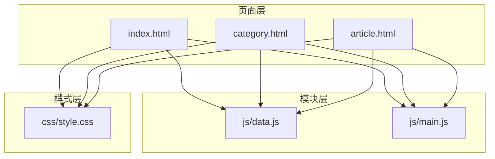
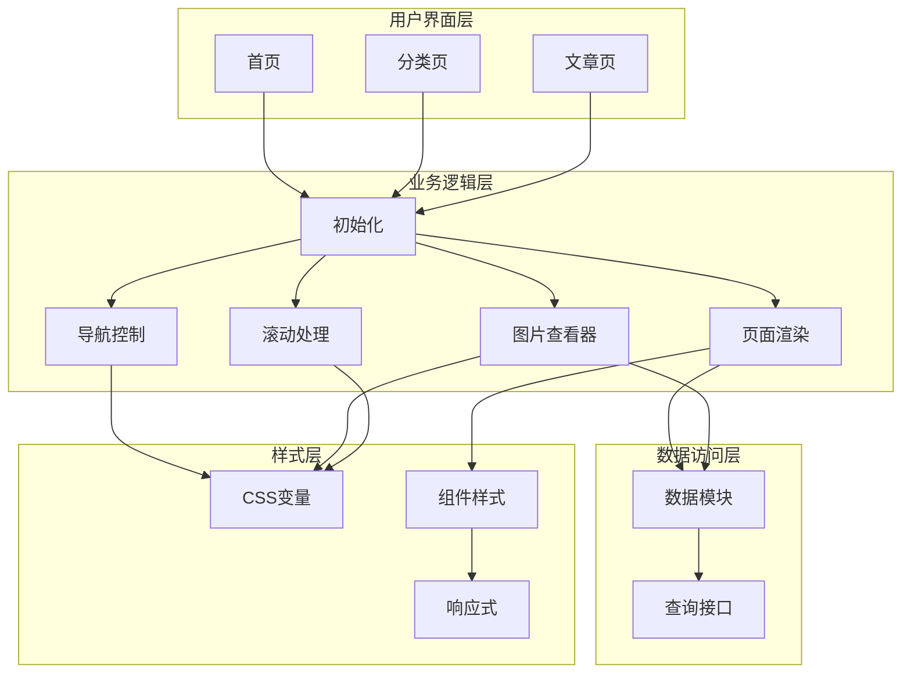
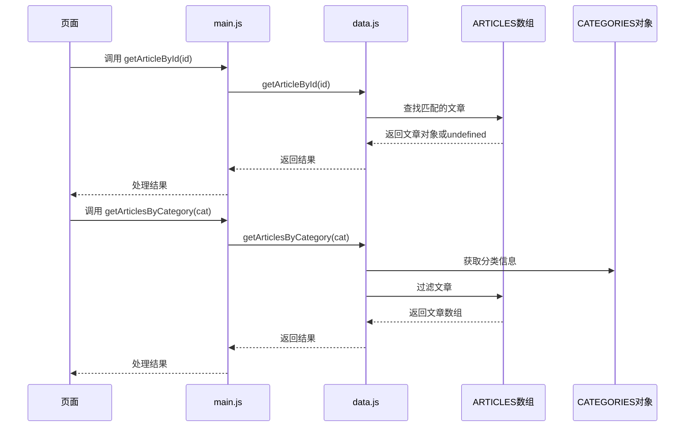
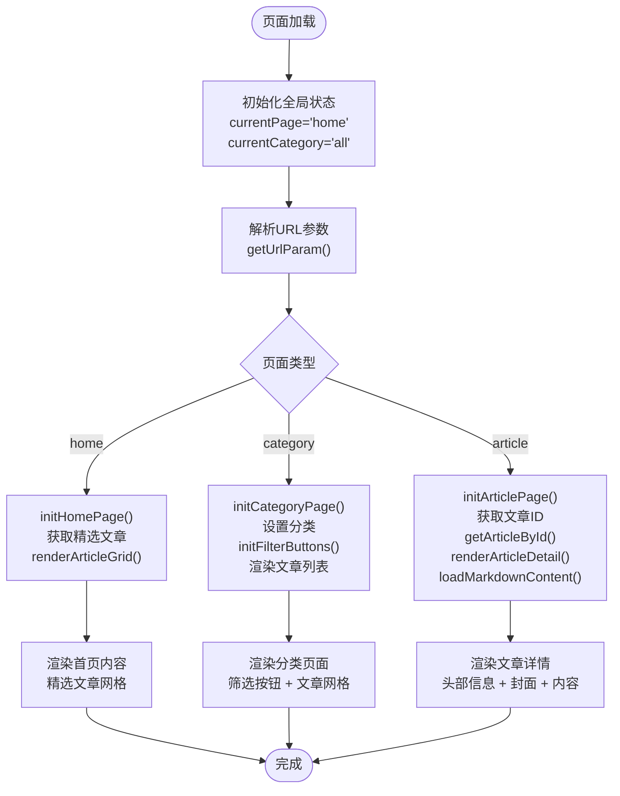
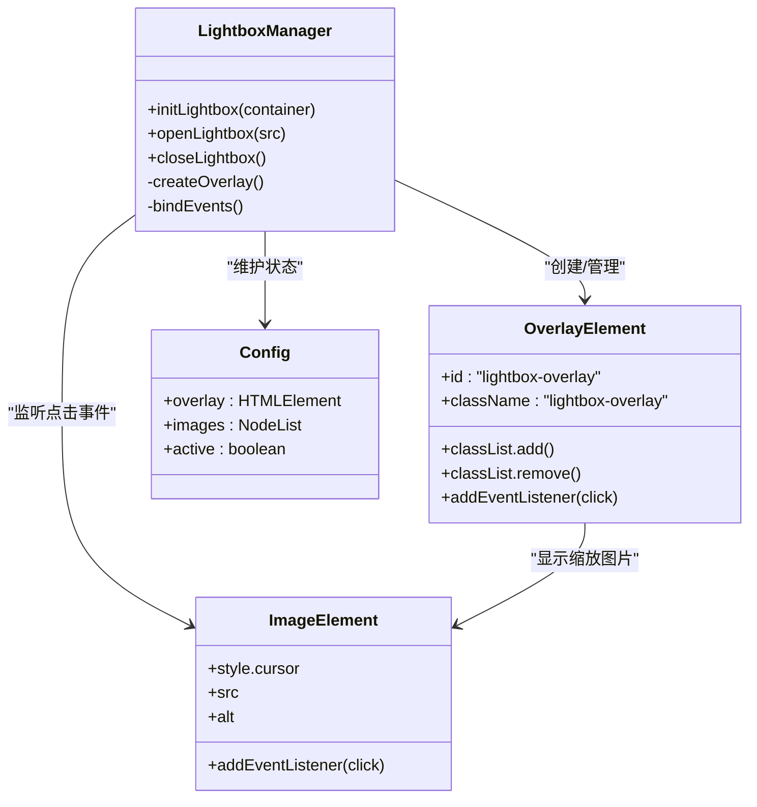
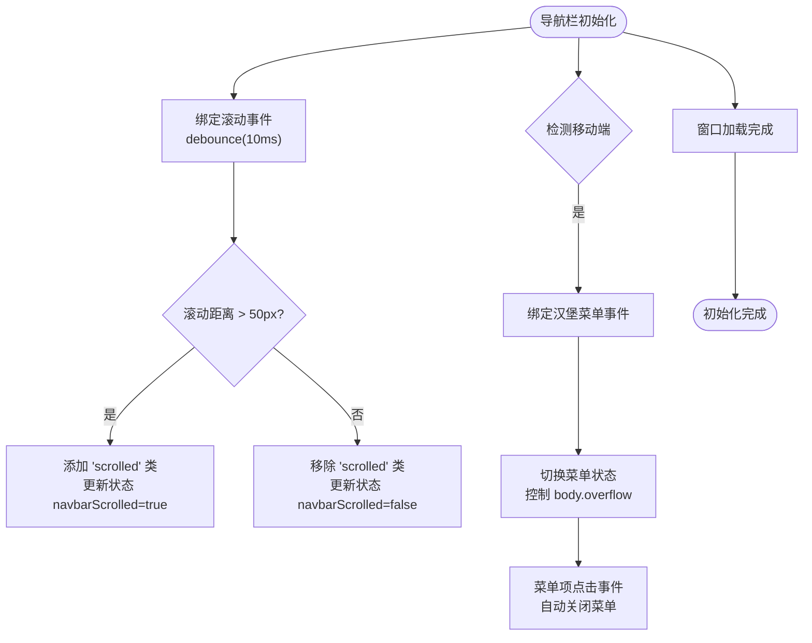
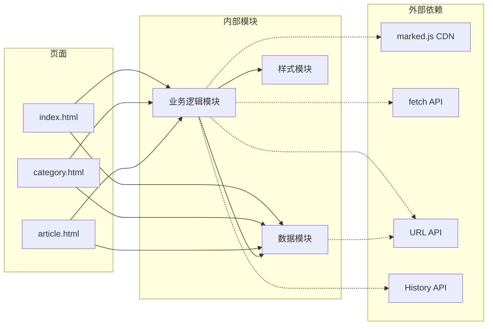

# 模块化设计

<cite>
**本文档引用的文件**
- [js/data.js](file://js/data.js)
- [js/main.js](file://js/main.js)
- [css/style.css](file://css/style.css)
- [index.html](file://index.html)
- [category.html](file://category.html)
- [article.html](file://article.html)
</cite>

## 目录
1. [简介](#简介)
2. [项目结构](#项目结构)
3. [核心组件](#核心组件)
4. [架构总览](#架构总览)
5. [详细组件分析](#详细组件分析)
6. [依赖关系分析](#依赖关系分析)
7. [性能考虑](#性能考虑)
8. [故障排除指南](#故障排除指南)
9. [结论](#结论)

## 简介
本项目采用模块化设计，将数据配置、业务逻辑与样式分离，形成清晰的职责边界：
- 数据配置模块负责文章元数据与分类配置的集中管理
- 业务逻辑模块负责页面渲染、导航控制、图片查看器、滚动处理等交互功能
- 样式模块通过CSS变量系统实现主题化与组件化设计

## 项目结构
项目采用静态站点架构，HTML页面通过引入JS模块实现动态内容渲染与交互。

**图表来源**
- [index.html:1-190](file://index.html#L1-L190)
- [category.html:1-103](file://category.html#L1-L103)
- [article.html:1-107](file://article.html#L1-L107)

**章节来源**
- [index.html:1-190](file://index.html#L1-L190)
- [category.html:1-103](file://category.html#L1-L103)
- [article.html:1-107](file://article.html#L1-L107)

## 核心组件

### 数据配置模块 (js/data.js)
负责文章元数据与分类配置的集中管理，提供数据查询与过滤接口。

**主要职责**
- 维护CATEGORIES常量：定义分类名称、描述与颜色
- 维护ARTICLES常量：存储文章元数据（ID、标题、分类、日期、摘要、封面、内容路径）
- 提供数据查询接口：getArticleById、getArticlesByCategory、getFeaturedArticles、getCategoryInfo、searchArticles

**数据结构复杂度**
- ARTICLES数组：O(n)遍历查找，n为文章数量
- CATEGORIES对象：O(1)直接访问
- 查询操作：基于数组方法的线性时间复杂度

**章节来源**
- [js/data.js:6-37](file://js/data.js#L6-L37)
- [js/data.js:40-113](file://js/data.js#L40-L113)
- [js/data.js:115-145](file://js/data.js#L115-L145)

### 业务逻辑模块 (js/main.js)
负责页面渲染、导航控制、图片查看器、滚动处理等核心功能。

**主要功能模块**
- 导航栏控制：滚动样式切换、移动端汉堡菜单
- 页面渲染：文章网格渲染、分类页面初始化、文章详情渲染
- 图片查看器：Lightbox图片放大功能
- 交互处理：防抖优化、错误处理、返回顶部按钮

**状态管理**
- 全局状态对象：currentPage、currentCategory、navbarScrolled
- URL参数解析：getUrlParam函数

**章节来源**
- [js/main.js:6-11](file://js/main.js#L6-L11)
- [js/main.js:15-39](file://js/main.js#L15-L39)
- [js/main.js:43-77](file://js/main.js#L43-L77)
- [js/main.js:118-146](file://js/main.js#L118-L146)
- [js/main.js:220-314](file://js/main.js#L220-L314)

### 样式模块 (css/style.css)
通过CSS变量系统实现主题化设计，采用组件化架构。

**CSS变量系统**
- 主色系：--primary、--primary-light、--primary-dark、--primary-glow
- 辅助色：--secondary、--secondary-light、--secondary-dark
- 强调色：--accent
- 中性色：灰阶系统
- 布局变量：--container-max、--navbar-height
- 间距系统：--space-xs到--space-4xl
- 圆角系统：--radius-sm到--radius-full
- 动画过渡：--transition-fast到--transition-slow

**组件化设计**
- 导航栏组件：.navbar、.nav-container、.nav-menu
- 文章卡片组件：.article-card、.article-grid
- 分类卡片组件：.category-card、.category-grid
- Lightbox组件：.lightbox-overlay
- 响应式组件：媒体查询断点

**章节来源**
- [css/style.css:8-78](file://css/style.css#L8-L78)
- [css/style.css:147-258](file://css/style.css#L147-L258)
- [css/style.css:431-548](file://css/style.css#L431-L548)
- [css/style.css:880-933](file://css/style.css#L880-L933)

## 架构总览

**图表来源**
- [js/main.js:436-460](file://js/main.js#L436-L460)
- [js/data.js:147-158](file://js/data.js#L147-L158)
- [css/style.css:8-1166](file://css/style.css#L8-L1166)

## 详细组件分析

### 数据查询接口序列图

**图表来源**
- [js/data.js:115-126](file://js/data.js#L115-L126)
- [js/main.js:222-243](file://js/main.js#L222-L243)

**章节来源**
- [js/data.js:115-145](file://js/data.js#L115-L145)
- [js/main.js:220-243](file://js/main.js#L220-L243)

### 页面渲染流程图

**图表来源**
- [js/main.js:436-460](file://js/main.js#L436-L460)
- [js/main.js:150-177](file://js/main.js#L150-L177)
- [js/main.js:220-243](file://js/main.js#L220-L243)

**章节来源**
- [js/main.js:436-460](file://js/main.js#L436-L460)
- [js/main.js:148-177](file://js/main.js#L148-L177)

### 图片查看器组件图

**图表来源**
- [js/main.js:318-371](file://js/main.js#L318-L371)
- [js/main.js:295-300](file://js/main.js#L295-L300)

**章节来源**
- [js/main.js:316-371](file://js/main.js#L316-L371)

### 导航栏交互流程图

**图表来源**
- [js/main.js:44-77](file://js/main.js#L44-L77)

**章节来源**
- [js/main.js:41-77](file://js/main.js#L41-L77)

## 依赖关系分析

**图表来源**
- [js/main.js:272-300](file://js/main.js#L272-L300)
- [js/main.js:16-19](file://js/main.js#L16-L19)
- [js/main.js:194-200](file://js/main.js#L194-L200)

**章节来源**
- [js/main.js:272-300](file://js/main.js#L272-L300)
- [js/main.js:16-19](file://js/main.js#L16-L19)
- [js/main.js:194-200](file://js/main.js#L194-L200)

### 模块接口规范

**数据模块导出接口**
- CATEGORIES: 分类配置对象
- ARTICLES: 文章元数据数组
- getArticleById(id): 根据ID获取文章
- getArticlesByCategory(category): 根据分类获取文章列表
- getFeaturedArticles(limit): 获取精选文章
- getCategoryInfo(category): 获取分类信息
- searchArticles(query): 搜索文章

**业务逻辑模块公共接口**
- initNavbar(): 导航栏初始化
- renderArticleGrid(containerId, articles): 渲染文章网格
- initCategoryPage(): 分类页面初始化
- initArticlePage(): 文章页面初始化
- showError(message): 错误状态渲染
- initLightbox(container): 图片查看器初始化

**章节来源**
- [js/data.js:147-158](file://js/data.js#L147-L158)
- [js/main.js:43-77](file://js/main.js#L43-L77)
- [js/main.js:118-146](file://js/main.js#L118-L146)

## 性能考虑

### 优化策略
1. **防抖优化**: 导航栏滚动事件使用10ms防抖，减少重绘频率
2. **懒加载**: 文章封面图使用`loading="lazy"`属性
3. **虚拟滚动**: 文章网格使用CSS Grid而非JavaScript循环渲染
4. **缓存策略**: 分类信息通过对象直接访问，避免重复计算
5. **内存管理**: Lightbox组件复用DOM元素，避免频繁创建销毁

### 性能指标
- 页面渲染: O(n)线性复杂度，n为文章数量
- 搜索功能: O(n*m)时间复杂度，m为搜索关键词长度
- 图片查看器: O(1)初始化，点击事件触发
- 导航栏: 防抖后O(1)事件处理

## 故障排除指南

### 常见问题及解决方案

**文章内容加载失败**
- 检查Markdown文件路径是否正确
- 确认marked.js CDN是否正常加载
- 查看浏览器控制台网络请求

**分类筛选不生效**
- 确认URL参数格式正确
- 检查History API支持情况
- 验证分类ID与CATEGORIES配置一致

**图片无法放大**
- 确认图片元素存在且有点击事件
- 检查CSS类名是否正确
- 验证Lightbox样式是否加载

**章节来源**
- [js/main.js:272-314](file://js/main.js#L272-L314)
- [js/main.js:194-218](file://js/main.js#L194-L218)
- [js/main.js:318-371](file://js/main.js#L318-L371)

## 结论

本项目通过模块化设计实现了清晰的职责分离：
- 数据配置模块提供稳定的数据接口，便于维护和扩展
- 业务逻辑模块封装了复杂的UI交互，保证代码可读性
- 样式模块通过CSS变量系统实现了主题化和组件化设计
- 各模块间依赖关系简单明确，便于测试和调试

建议后续优化方向：
1. 添加TypeScript类型定义提升开发体验
2. 实现数据持久化支持
3. 增加单元测试覆盖关键功能
4. 优化移动端交互体验
5. 实现内容缓存机制提升性能