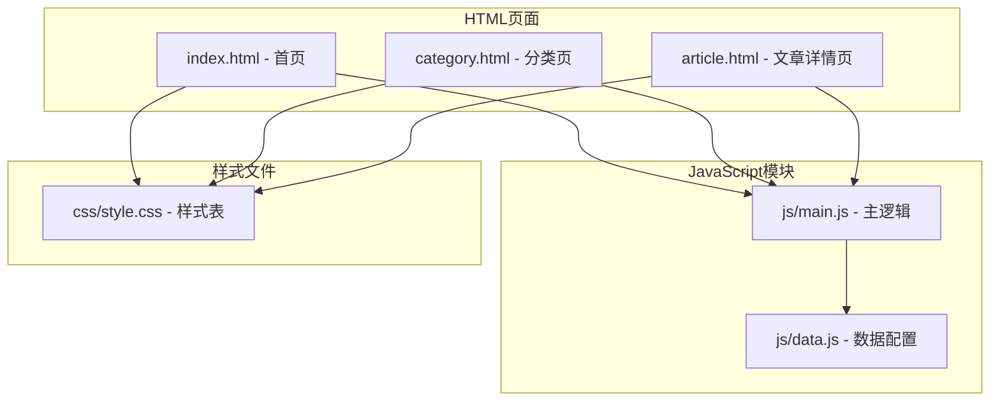
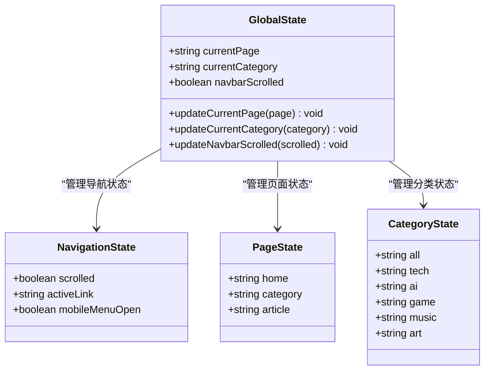
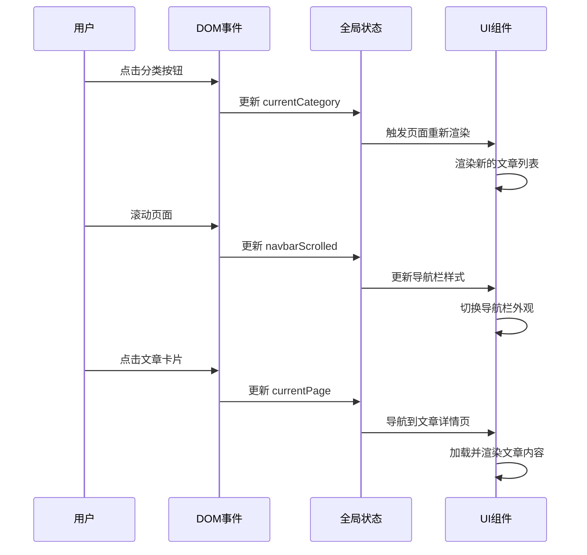
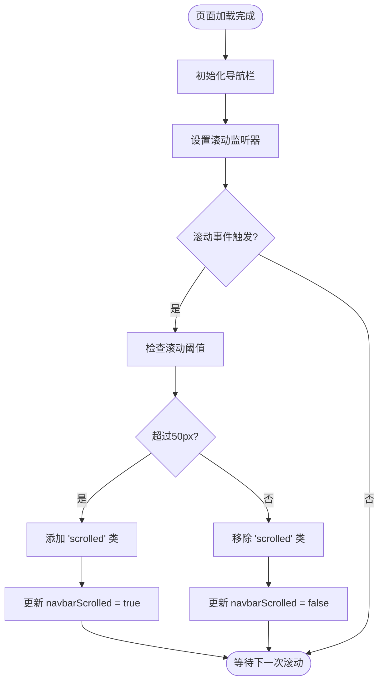
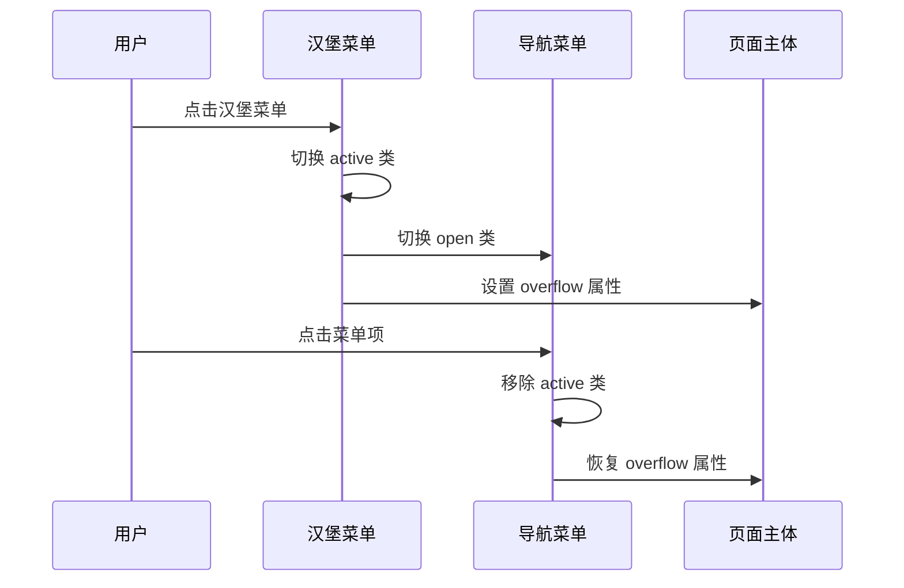
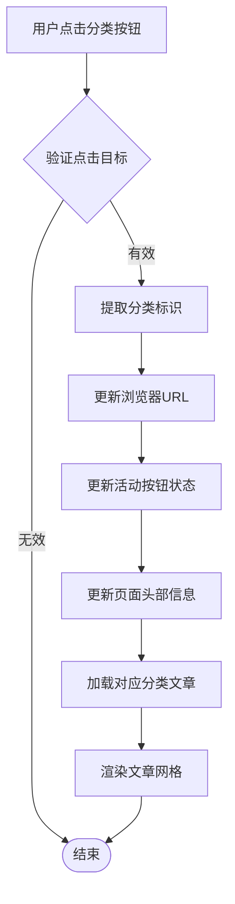
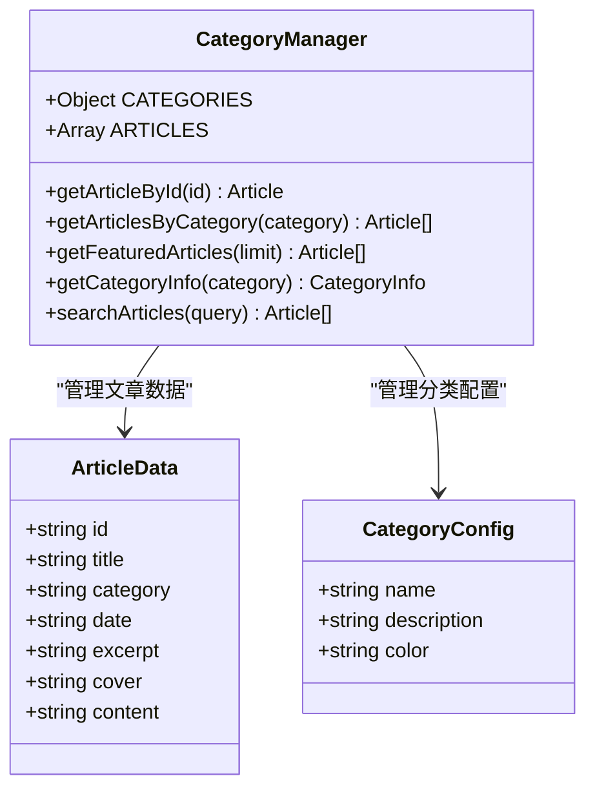
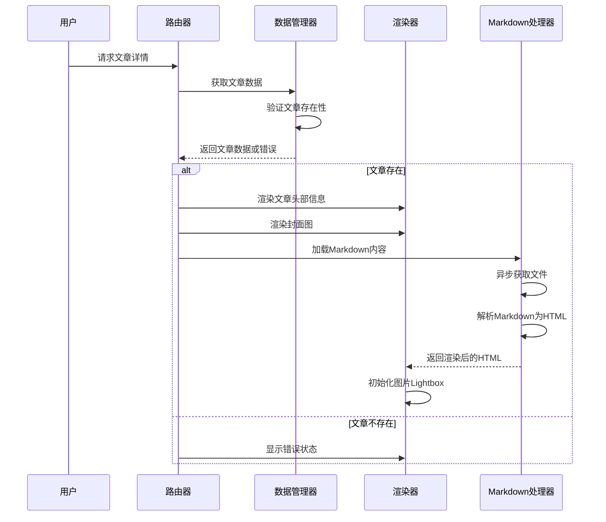
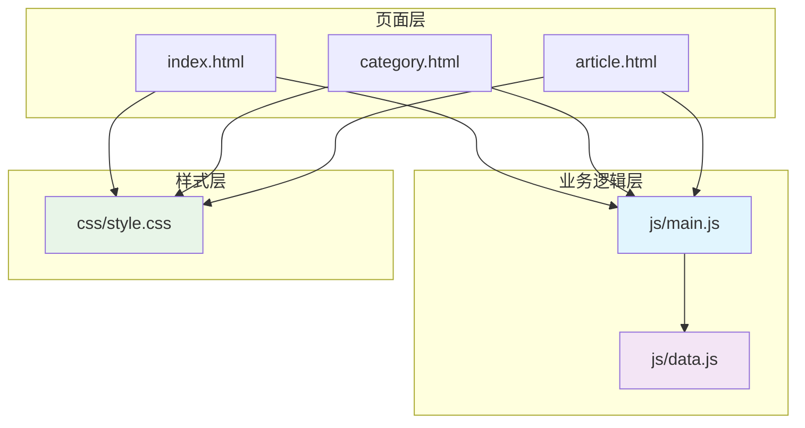
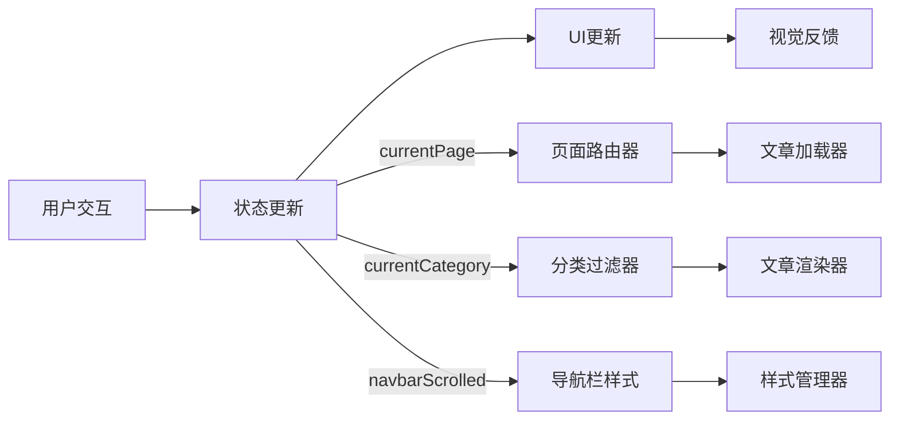

# 状态管理与数据流

<cite>
**本文档引用的文件**
- [js/main.js](file://js/main.js)
- [js/data.js](file://js/data.js)
- [index.html](file://index.html)
- [category.html](file://category.html)
- [article.html](file://article.html)
- [css/style.css](file://css/style.css)
</cite>

## 目录
1. [简介](#简介)
2. [项目结构](#项目结构)
3. [核心组件](#核心组件)
4. [架构概览](#架构概览)
5. [详细组件分析](#详细组件分析)
6. [依赖关系分析](#依赖关系分析)
7. [性能考虑](#性能考虑)
8. [故障排除指南](#故障排除指南)
9. [结论](#结论)

## 简介

Hot-Site 是一个基于静态站点技术构建的内容展示平台，采用简洁而高效的状态管理模式。该项目通过单一的全局状态对象实现了页面状态的统一管理，涵盖了导航栏状态、页面路由状态和分类过滤状态等多个维度。

本项目的核心设计理念是"单一数据源"和"不可变性"原则，通过集中式的状态管理确保了数据流的可控性和可预测性。状态更新严格遵循单向数据流模式，从用户交互到UI更新形成了清晰的数据传递路径。

## 项目结构

Hot-Site 项目采用模块化的文件组织结构，主要包含以下核心文件：

**图表来源**
- [index.html:29](file://index.html#L29)
- [category.html:27](file://category.html#L27)
- [article.html:27](file://article.html#L27)

**章节来源**
- [index.html:1-190](file://index.html#L1-L190)
- [category.html:1-103](file://category.html#L1-L103)
- [article.html:1-107](file://article.html#L1-L107)

## 核心组件

### 全局状态管理器

项目的核心是一个名为 `state` 的全局状态对象，它包含了三个关键状态变量：

**图表来源**
- [js/main.js:7-11](file://js/main.js#L7-L11)

### 状态变量详解

#### currentPage 状态
- **作用**: 标识当前激活的页面类型
- **取值范围**: `'home' | 'category' | 'article'`
- **生命周期**: 应用启动时初始化，页面切换时更新
- **更新时机**: DOMContentLoaded 事件触发时根据 `data-page` 属性设置

#### currentCategory 状态  
- **作用**: 当前显示的文章分类
- **取值范围**: `'all' | 'tech' | 'ai' | 'game' | 'music' | 'art'`
- **生命周期**: 页面加载时初始化，分类切换时更新
- **更新时机**: 分类页初始化、筛选按钮点击、URL参数变化

#### navbarScrolled 状态
- **作用**: 导航栏滚动状态指示
- **取值范围**: `true | false`
- **生命周期**: 页面加载时初始化，滚动事件触发时动态更新
- **更新时机**: 窗口滚动超过阈值时切换

**章节来源**
- [js/main.js:6-11](file://js/main.js#L6-L11)

## 架构概览

Hot-Site 采用了简洁而高效的单页应用架构，通过单一状态源实现了组件间的解耦和数据共享。

**图表来源**
- [js/main.js:44-77](file://js/main.js#L44-L77)
- [js/main.js:158-177](file://js/main.js#L158-L177)
- [js/main.js:222-243](file://js/main.js#L222-L243)

## 详细组件分析

### 导航栏状态管理系统

导航栏状态管理是项目中最复杂的交互模块，涉及滚动检测、移动端响应和样式切换等多个方面。

**图表来源**
- [js/main.js:44-77](file://js/main.js#L44-L77)

#### 移动端汉堡菜单交互

移动端菜单的实现采用了防抖优化和状态同步机制：

**图表来源**
- [js/main.js:60-77](file://js/main.js#L60-L77)

**章节来源**
- [js/main.js:44-77](file://js/main.js#L44-L77)

### 分类筛选系统

分类筛选系统实现了完整的单向数据流，从用户交互到UI更新的每个环节都经过精心设计。

**图表来源**
- [js/main.js:194-218](file://js/main.js#L194-L218)

#### 分类数据管理

分类数据通过专门的数据模块进行管理，提供了丰富的查询和过滤功能：

**图表来源**
- [js/data.js:6-37](file://js/data.js#L6-L37)
- [js/data.js:40-113](file://js/data.js#L40-L113)

**章节来源**
- [js/main.js:158-218](file://js/main.js#L158-L218)
- [js/data.js:6-158](file://js/data.js#L6-L158)

### 文章详情页渲染系统

文章详情页采用了异步内容加载和Markdown渲染的混合架构：

**图表来源**
- [js/main.js:222-243](file://js/main.js#L222-L243)
- [js/main.js:272-314](file://js/main.js#L272-L314)

**章节来源**
- [js/main.js:222-314](file://js/main.js#L222-L314)

## 依赖关系分析

Hot-Site 项目展现了清晰的模块化依赖关系，各组件之间保持低耦合高内聚的特点。

**图表来源**
- [index.html:187-188](file://index.html#L187-L188)
- [category.html:100-101](file://category.html#L100-L101)
- [article.html:104-105](file://article.html#L104-L105)

### 状态依赖链

项目的状态管理遵循严格的依赖链，确保了数据的一致性和可追踪性：

**图表来源**
- [js/main.js:436-460](file://js/main.js#L436-L460)

**章节来源**
- [js/main.js:1-461](file://js/main.js#L1-L461)

## 性能考虑

### 防抖优化策略

项目在多个关键位置采用了防抖技术来优化性能：

- **滚动事件防抖**: 10ms 防抖间隔，避免频繁的DOM操作
- **滚动显示/隐藏按钮**: 100ms 防抖间隔，平滑用户体验
- **分类切换**: 使用 pushState API 避免页面刷新

### 内存管理

- **事件监听器**: 合理的事件绑定和解绑机制
- **DOM操作**: 批量DOM操作减少重排重绘
- **图片懒加载**: 使用 `loading="lazy"` 属性优化首屏加载

### 缓存策略

- **分类数据缓存**: 通过全局变量缓存分类配置
- **文章数据缓存**: 通过全局数组缓存文章元数据
- **渲染结果缓存**: 避免重复的DOM操作

## 故障排除指南

### 常见问题诊断

#### 状态不一致问题
**症状**: 界面状态与预期不符
**排查步骤**:
1. 检查全局状态对象是否正确初始化
2. 验证事件监听器是否正常工作
3. 确认状态更新函数是否被正确调用

#### 分类筛选失效
**症状**: 点击分类按钮无响应
**排查步骤**:
1. 检查 `initFilterButtons` 函数是否正确执行
2. 验证事件委托是否正确设置
3. 确认 `CATEGORIES` 对象是否存在

#### 导航栏样式异常
**症状**: 滚动时导航栏样式不变化
**排查步骤**:
1. 检查滚动事件监听器是否绑定成功
2. 验证 `debounce` 函数是否正常工作
3. 确认CSS类名是否正确

**章节来源**
- [js/main.js:407-420](file://js/main.js#L407-L420)

### 调试建议

1. **使用浏览器开发者工具**监控全局状态变化
2. **启用JavaScript调试模式**跟踪函数调用栈
3. **检查网络面板**确认Markdown文件加载状态
4. **使用性能面板**分析渲染性能瓶颈

## 结论

Hot-Site 项目展示了现代前端应用中状态管理的最佳实践。通过采用单一全局状态对象、严格的单向数据流和模块化的架构设计，项目实现了高度的可维护性和可扩展性。

### 设计原则总结

1. **单一数据源**: 所有状态变更都通过统一的状态管理器进行
2. **不可变性**: 状态更新采用新对象替换而非直接修改
3. **单向数据流**: 数据流向始终保持从用户交互到UI更新的单向性
4. **模块化设计**: 功能按职责分离，组件间保持低耦合

### 技术亮点

- **简洁的状态管理**: 仅三个核心状态变量覆盖所有页面需求
- **高效的事件处理**: 防抖优化确保流畅的用户体验
- **优雅的降级处理**: 完善的错误处理和空状态显示
- **响应式设计**: 完整的移动端适配方案

这个项目为类似的内容展示平台提供了优秀的参考模板，展示了如何在保持代码简洁的同时实现复杂的功能需求。