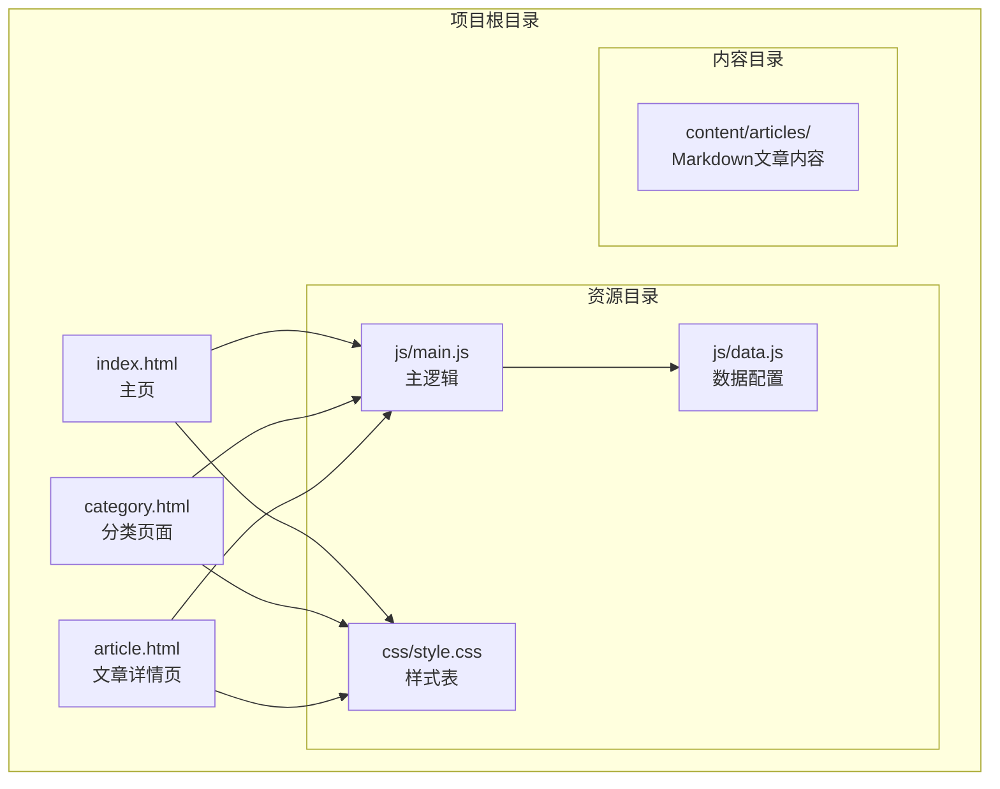
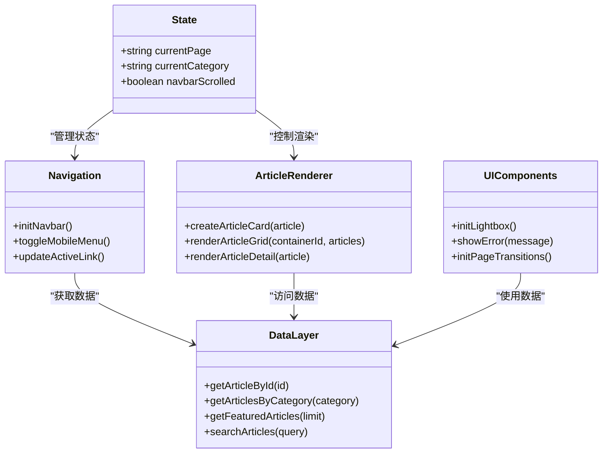
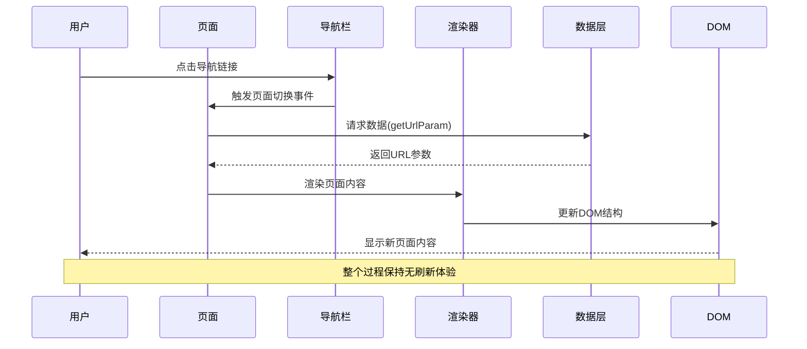
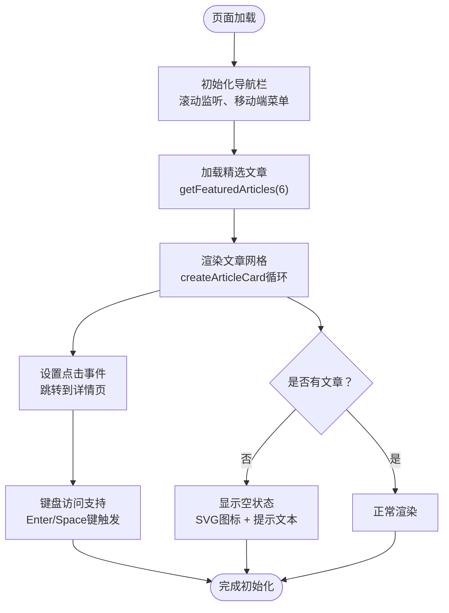
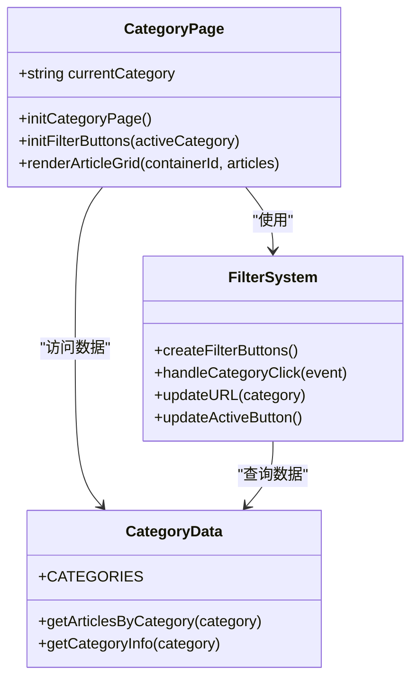
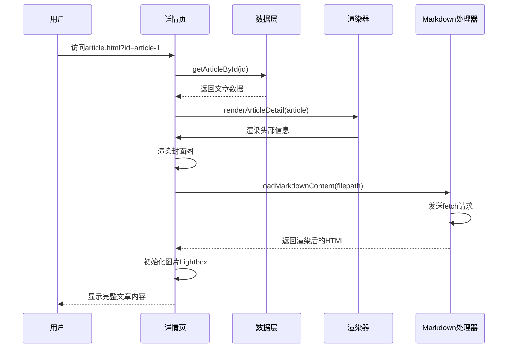
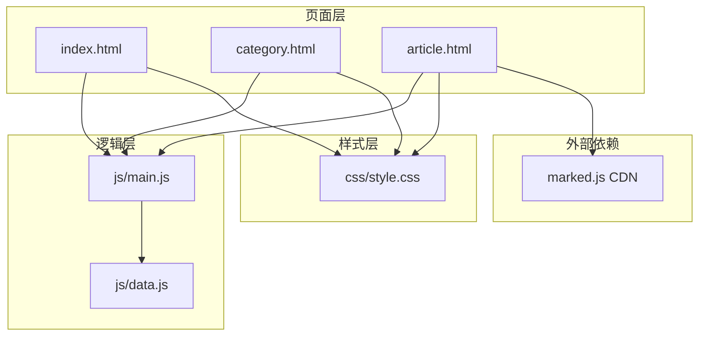
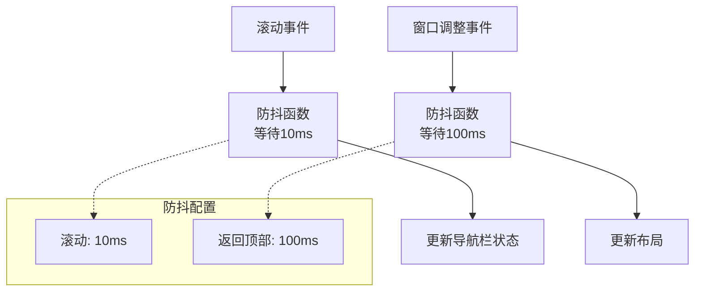

# 组件交互设计

<cite>
**本文档引用的文件**
- [index.html](file://index.html)
- [category.html](file://category.html)
- [article.html](file://article.html)
- [js/main.js](file://js/main.js)
- [js/data.js](file://js/data.js)
- [css/style.css](file://css/style.css)
</cite>

## 目录
1. [简介](#简介)
2. [项目结构](#项目结构)
3. [核心组件](#核心组件)
4. [架构概览](#架构概览)
5. [详细组件分析](#详细组件分析)
6. [依赖关系分析](#依赖关系分析)
7. [性能考虑](#性能考虑)
8. [故障排除指南](#故障排除指南)
9. [结论](#结论)

## 简介

Hot-Site是一个基于静态站点技术构建的内容展示平台，专注于技术、AI、游戏、音乐与艺术领域的优质内容分享。该项目采用现代化的前端架构，实现了流畅的用户交互体验和良好的可维护性。

本项目包含三个主要页面：主页(index.html)、分类页面(category.html)和文章详情页面(article.html)，通过统一的JavaScript框架实现组件间的无缝交互。

## 项目结构

项目采用清晰的文件组织结构，遵循静态网站的最佳实践：

**图表来源**
- [index.html:1-190](file://index.html#L1-L190)
- [category.html:1-103](file://category.html#L1-L103)
- [article.html:1-107](file://article.html#L1-L107)

**章节来源**
- [index.html:1-190](file://index.html#L1-L190)
- [category.html:1-103](file://category.html#L1-L103)
- [article.html:1-107](file://article.html#L1-L107)

## 核心组件

### 页面组件架构

Hot-Site采用基于页面的数据驱动架构，每个HTML页面都承载特定的功能职责：

| 组件 | 职责 | 关键特性 |
|------|------|----------|
| 主页(index.html) | 展示精选内容、分类导航 | Hero区域、精选文章网格、分类卡片 |
| 分类页面(category.html) | 内容分类浏览、动态筛选 | 筛选栏、文章网格、分类切换 |
| 文章详情页(article.html) | 文章内容展示、Markdown渲染 | 详情头部、封面图、内容渲染 |

### JavaScript模块化设计

项目采用模块化的JavaScript架构，将功能分解为独立的模块：

**图表来源**
- [js/main.js:6-11](file://js/main.js#L6-L11)
- [js/main.js:44-77](file://js/main.js#L44-L77)
- [js/main.js:82-146](file://js/main.js#L82-L146)
- [js/data.js:40-158](file://js/data.js#L40-L158)

**章节来源**
- [js/main.js:6-461](file://js/main.js#L6-L461)
- [js/data.js:1-158](file://js/data.js#L1-L158)

## 架构概览

Hot-Site采用事件驱动的交互架构，通过统一的状态管理和模块化的设计实现组件间的松耦合交互：

**图表来源**
- [js/main.js:16-19](file://js/main.js#L16-L19)
- [js/main.js:158-177](file://js/main.js#L158-L177)
- [js/main.js:222-243](file://js/main.js#L222-L243)

### 组件间通信机制

项目实现了多种组件间通信模式：

1. **URL参数传递**: 通过URL查询参数在页面间传递数据
2. **全局状态共享**: 使用JavaScript对象管理应用状态
3. **事件委托**: 利用DOM事件委托减少事件监听器数量
4. **防抖优化**: 对高频事件进行防抖处理提升性能

**章节来源**
- [js/main.js:16-39](file://js/main.js#L16-L39)
- [js/main.js:44-77](file://js/main.js#L44-L77)
- [js/main.js:194-218](file://js/main.js#L194-L218)

## 详细组件分析

### 主页组件分析

主页是用户访问的第一个页面，承担着内容展示和导航引导的重要职责：

#### 主页功能特性

**图表来源**
- [js/main.js:150-154](file://js/main.js#L150-L154)
- [js/main.js:119-146](file://js/main.js#L119-L146)
- [js/main.js:82-116](file://js/main.js#L82-L116)

#### 主页交互流程

主页的核心交互包括：

1. **导航栏交互**: 支持桌面端悬浮效果和移动端汉堡菜单
2. **文章卡片交互**: 点击或键盘激活跳转到文章详情页
3. **分类导航**: 点击分类卡片跳转到对应分类页面

**章节来源**
- [index.html:30-53](file://index.html#L30-L53)
- [index.html:100-160](file://index.html#L100-L160)
- [js/main.js:44-77](file://js/main.js#L44-L77)

### 分类页面组件分析

分类页面提供内容的分类浏览和筛选功能：

#### 分类页面架构

**图表来源**
- [js/main.js:158-177](file://js/main.js#L158-L177)
- [js/main.js:179-218](file://js/main.js#L179-L218)
- [js/data.js:6-37](file://js/data.js#L6-L37)

#### 分类筛选机制

分类页面实现了动态筛选功能：

1. **URL参数解析**: 从URL中提取分类参数
2. **筛选按钮生成**: 根据分类配置动态创建筛选按钮
3. **实时内容更新**: 点击筛选按钮时即时更新文章列表
4. **历史记录管理**: 使用pushState API更新URL而不刷新页面

**章节来源**
- [category.html:27](file://category.html#L27)
- [category.html:66](file://category.html#L66)
- [js/main.js:158-218](file://js/main.js#L158-L218)

### 文章详情页组件分析

文章详情页负责展示单篇文章的完整内容：

#### 文章详情渲染流程

**图表来源**
- [js/main.js:222-243](file://js/main.js#L222-L243)
- [js/main.js:246-269](file://js/main.js#L246-L269)
- [js/main.js:272-314](file://js/main.js#L272-L314)

#### Markdown内容处理

文章详情页集成了Markdown渲染功能：

1. **异步内容加载**: 使用fetch API异步获取Markdown文件
2. **marked.js集成**: 通过CDN引入的Markdown解析器
3. **错误处理**: 网络错误和解析错误的优雅降级
4. **图片Lightbox**: 支持图片点击放大查看

**章节来源**
- [article.html:22](file://article.html#L22)
- [js/main.js:272-314](file://js/main.js#L272-L314)
- [js/main.js:318-371](file://js/main.js#L318-L371)

## 依赖关系分析

项目采用松耦合的设计，各组件间通过明确的接口进行交互：

**图表来源**
- [index.html:187-188](file://index.html#L187-L188)
- [category.html:100-101](file://category.html#L100-L101)
- [article.html:104-105](file://article.html#L104-L105)

### 数据流分析

项目实现了清晰的数据流向：

1. **数据源**: js/data.js中的ARTICLES和CATEGORIES数组
2. **数据访问**: 通过函数接口(getArticleById, getArticlesByCategory等)访问
3. **数据转换**: 在js/main.js中进行格式化和处理
4. **数据展示**: 通过DOM操作更新页面内容

**章节来源**
- [js/data.js:40-158](file://js/data.js#L40-L158)
- [js/main.js:115-136](file://js/main.js#L115-L136)

## 性能考虑

### 防抖优化策略

项目在多个关键位置实现了防抖优化：

**图表来源**
- [js/main.js:50](file://js/main.js#L50)
- [js/main.js:388](file://js/main.js#L388)

### 图片优化

项目采用了多种图片优化技术：

1. **懒加载**: 使用loading="lazy"属性延迟加载图片
2. **响应式图片**: 通过CSS媒体查询适配不同屏幕尺寸
3. **占位符**: 使用骨架屏效果提升加载体验

**章节来源**
- [js/main.js:91](file://js/main.js#L91)
- [css/style.css:1109-1119](file://css/style.css#L1109-L1119)

### 内存管理

项目注意了内存使用的优化：

1. **事件监听器清理**: 使用事件委托减少监听器数量
2. **DOM元素复用**: 通过innerHTML更新而非频繁创建DOM节点
3. **垃圾回收友好**: 避免创建不必要的闭包和循环引用

## 故障排除指南

### 常见问题及解决方案

#### 文章内容加载失败

**问题症状**: 文章详情页显示"内容加载失败，请稍后重试"

**可能原因**:
1. Markdown文件路径错误
2. 网络请求超时
3. marked.js CDN加载失败

**解决步骤**:
1. 检查content/articles目录下的文件是否存在
2. 验证文件路径是否正确
3. 确认网络连接正常
4. 检查marked.js CDN可用性

#### 分类筛选不工作

**问题症状**: 点击分类按钮无响应

**可能原因**:
1. URL参数解析失败
2. 事件监听器绑定错误
3. 数据层访问异常

**解决步骤**:
1. 检查URL参数格式(category.html?cat=tech)
2. 验证事件监听器是否正确绑定
3. 确认getArticlesByCategory函数正常工作

#### 导航栏响应异常

**问题症状**: 移动端菜单无法打开或关闭

**可能原因**:
1. CSS样式冲突
2. JavaScript执行顺序问题
3. 事件冒泡阻止

**解决步骤**:
1. 检查CSS媒体查询是否正确
2. 验证DOMContentLoaded事件是否触发
3. 确认事件监听器没有被意外阻止

**章节来源**
- [js/main.js:407-420](file://js/main.js#L407-L420)
- [js/main.js:284-313](file://js/main.js#L284-L313)
- [js/main.js:62-76](file://js/main.js#L62-L76)

## 结论

Hot-Site项目展现了现代静态网站开发的最佳实践，通过精心设计的组件交互架构实现了优秀的用户体验。项目的主要优势包括：

### 设计亮点

1. **模块化架构**: 清晰的组件分离和职责划分
2. **事件驱动交互**: 基于DOM事件的响应式设计
3. **性能优化**: 防抖、懒加载等技术的应用
4. **可访问性**: 完善的ARIA标签和键盘导航支持
5. **渐进增强**: 优雅降级和错误处理机制

### 技术创新

1. **无刷新导航**: 通过pushState API实现SPA般的体验
2. **Markdown集成**: 简洁的内容管理系统
3. **响应式设计**: 完整的移动端适配方案
4. **动画优化**: CSS动画和JavaScript动画的有机结合

### 改进建议

1. **状态管理**: 可以考虑引入更完善的状态管理模式
2. **测试覆盖**: 添加单元测试和集成测试
3. **性能监控**: 实现页面加载性能监控
4. **SEO优化**: 进一步优化搜索引擎可见性

该项目为静态网站开发提供了优秀的参考范例，展示了如何在不使用复杂框架的情况下实现现代化的Web应用体验。