# 组件组合与解耦

<cite>
**本文档引用的文件**
- [index.html](file://index.html)
- [category.html](file://category.html)
- [article.html](file://article.html)
- [js/main.js](file://js/main.js)
- [js/data.js](file://js/data.js)
- [css/style.css](file://css/style.css)
</cite>

## 目录
1. [项目概述](#项目概述)
2. [组件架构设计](#组件架构设计)
3. [核心组件分析](#核心组件分析)
4. [组件组合模式](#组件组合模式)
5. [解耦设计原则](#解耦设计原则)
6. [数据绑定机制](#数据绑定机制)
7. [事件通信系统](#事件通信系统)
8. [样式隔离策略](#样式隔离策略)
9. [生命周期管理](#生命周期管理)
10. [测试与维护指南](#测试与维护指南)
11. [重构建议](#重构建议)

## 项目概述

Hot-Site是一个采用静态站点技术构建的内容展示平台，专注于技术、AI、游戏、音乐与艺术领域的优质内容分发。项目采用组件化的HTML结构设计，通过JavaScript实现动态内容渲染，实现了高度模块化的组件架构。

### 技术栈特点
- **静态HTML模板**：采用语义化的HTML5结构，确保SEO友好性和可访问性
- **纯JavaScript**：无框架依赖，使用原生JavaScript实现组件逻辑
- **CSS变量系统**：统一的样式变量管理，支持主题定制
- **响应式设计**：移动端优先的自适应布局

## 组件架构设计

### 整体架构模式

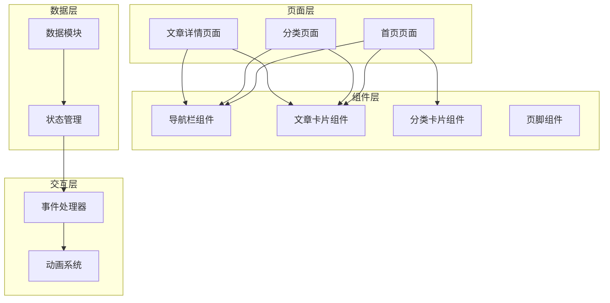

**图表来源**
- [index.html:29-190](file://index.html#L29-L190)
- [category.html:27-103](file://category.html#L27-L103)
- [article.html:27-107](file://article.html#L27-L107)

### 组件层次结构

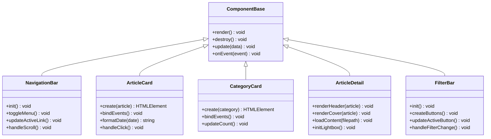

**图表来源**
- [js/main.js:44-77](file://js/main.js#L44-L77)
- [js/main.js:82-116](file://js/main.js#L82-L116)
- [js/main.js:158-177](file://js/main.js#L158-L177)

## 核心组件分析

### 导航栏组件 (NavigationBar)

导航栏是整个站点的控制中心，负责页面间导航和用户交互。

#### HTML结构设计
导航栏采用语义化HTML结构，包含Logo、导航菜单和汉堡菜单按钮：

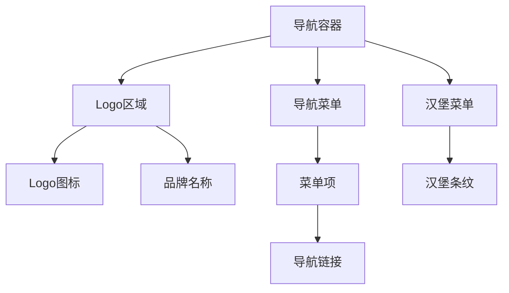

**图表来源**
- [index.html:31-53](file://index.html#L31-L53)

#### JavaScript实现要点
- **滚动监听**：使用防抖函数优化滚动性能
- **移动端适配**：汉堡菜单的展开收起逻辑
- **键盘导航**：支持Tab键和Enter键操作

**章节来源**
- [js/main.js:44-77](file://js/main.js#L44-L77)

### 文章卡片组件 (ArticleCard)

文章卡片是内容展示的核心组件，支持多种交互行为。

#### 组件特性
- **动态渲染**：根据文章数据动态生成DOM结构
- **点击交互**：支持点击跳转到文章详情页
- **键盘支持**：支持Enter和Space键触发点击
- **动画效果**：逐个卡片的入场动画

#### 数据绑定模式
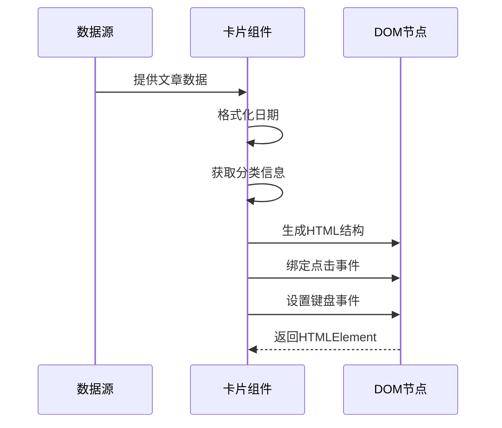

**图表来源**
- [js/main.js:82-116](file://js/main.js#L82-L116)

**章节来源**
- [js/main.js:82-146](file://js/main.js#L82-L146)

### 分类卡片组件 (CategoryCard)

分类卡片用于展示内容分类，提供直观的分类导航。

#### 设计特点
- **视觉标识**：每个分类都有独特的颜色标识
- **图标支持**：使用SVG图标增强视觉效果
- **统计信息**：显示各分类下的文章数量
- **悬停效果**：渐变边框和阴影效果

**章节来源**
- [index.html:100-160](file://index.html#L100-L160)

### 文章详情组件 (ArticleDetail)

文章详情页面专门处理单篇文章的展示，包含复杂的内容渲染逻辑。

#### 核心功能
- **Markdown渲染**：使用marked.js库渲染Markdown内容
- **图片灯箱**：支持图片点击放大查看
- **错误处理**：完善的加载失败处理机制
- **SEO优化**：动态更新页面标题和元数据

**章节来源**
- [js/main.js:222-314](file://js/main.js#L222-L314)

## 组件组合模式

### 模板继承模式

项目采用模板继承的方式组织组件，每个页面都包含相同的基础结构：

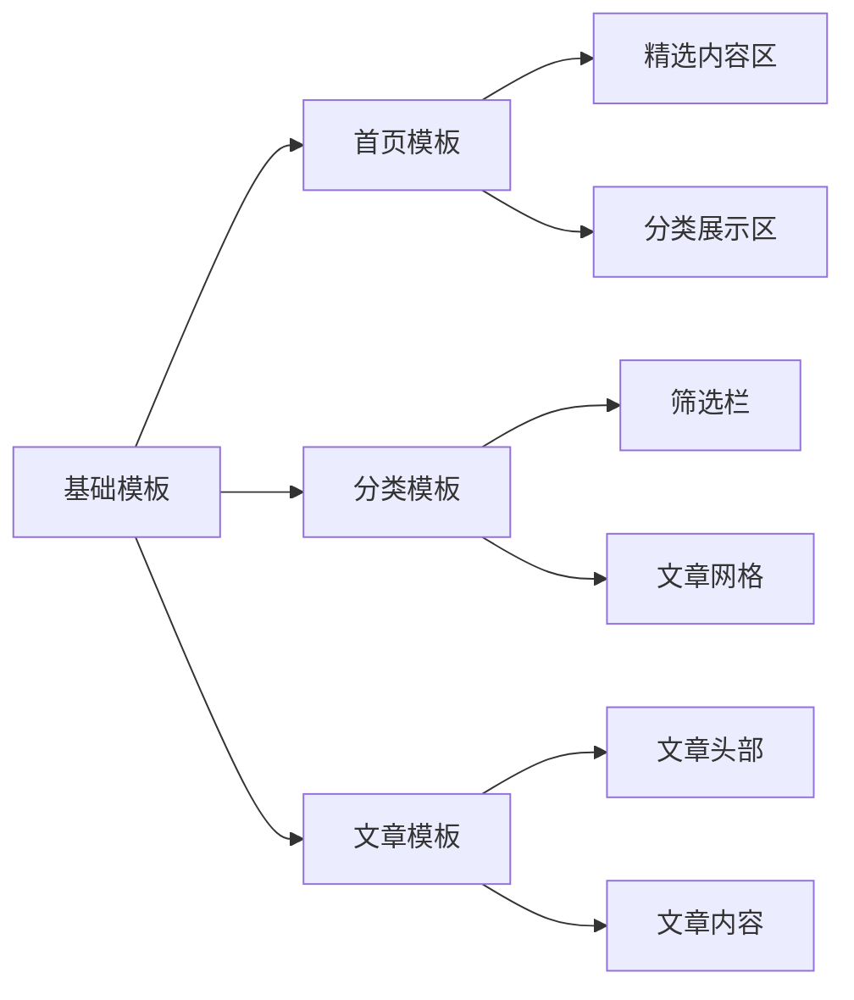

**图表来源**
- [index.html:29-190](file://index.html#L29-L190)
- [category.html:27-103](file://category.html#L27-L103)
- [article.html:27-107](file://article.html#L27-L107)

### 组件间通信模式

#### 事件驱动通信
组件间通过事件系统进行松耦合通信：

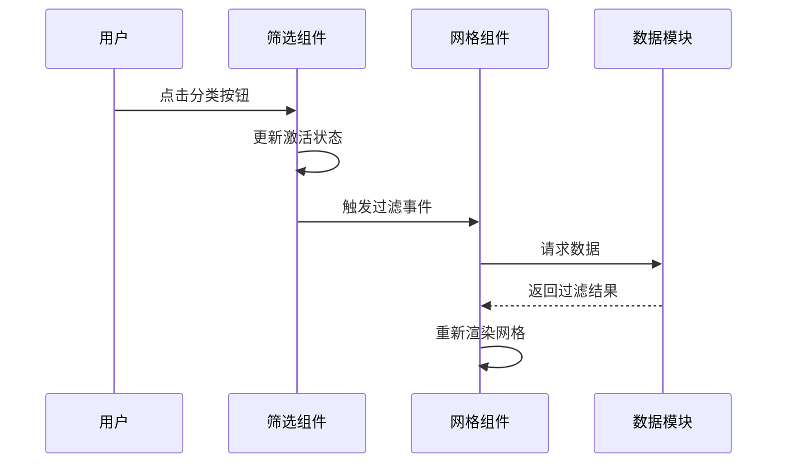

**图表来源**
- [js/main.js:194-218](file://js/main.js#L194-L218)

#### 数据流管理
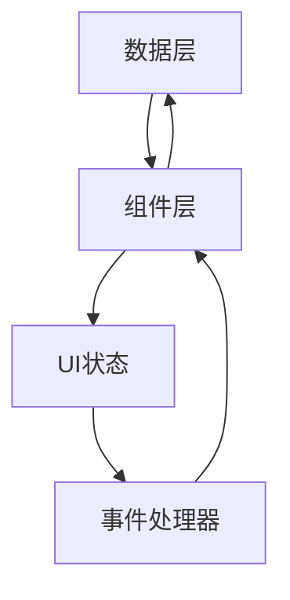

**图表来源**
- [js/data.js:6-37](file://js/data.js#L6-L37)

## 解耦设计原则

### 1. 接口抽象原则

每个组件都遵循统一的接口规范：

| 组件接口 | 方法名 | 功能描述 |
|---------|--------|----------|
| NavigationBar | init() | 初始化导航栏 |
| NavigationBar | toggleMenu() | 切换菜单显示状态 |
| ArticleCard | create(article) | 创建文章卡片 |
| ArticleCard | bindEvents() | 绑定事件处理器 |
| CategoryCard | updateCount() | 更新文章数量 |

### 2. 依赖注入原则

组件通过参数传递依赖，避免全局状态污染：

```javascript
// 好的做法：显式传参
function createArticleCard(article, onClickHandler) {
    // 组件逻辑
}

// 避免的做法：全局依赖
function createArticleCard(article) {
    // 依赖全局onClickHandler变量
}
```

### 3. 状态隔离原则

每个组件维护自己的状态，通过明确的接口进行状态共享：

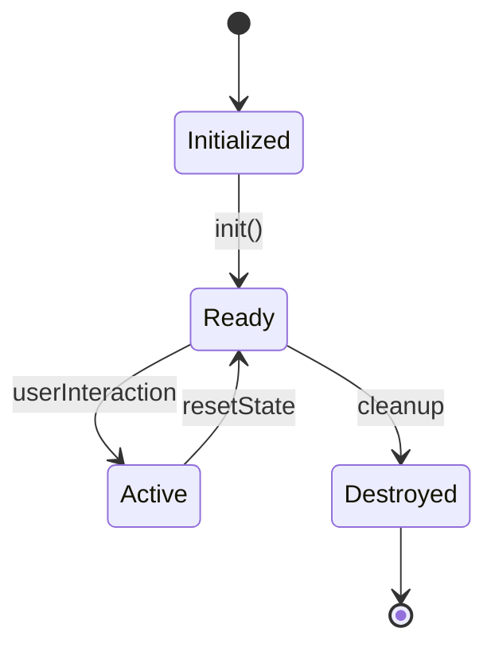

## 数据绑定机制

### 数据源设计

项目使用单一数据源管理模式：

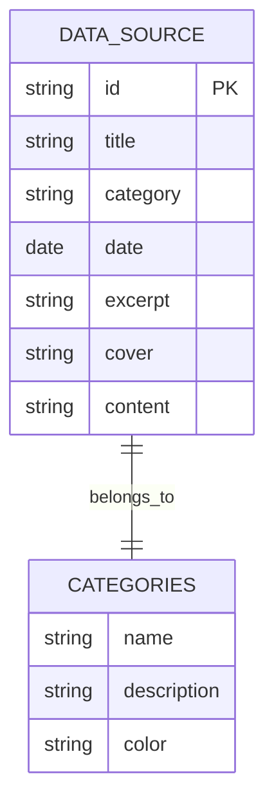

**图表来源**
- [js/data.js:40-113](file://js/data.js#L40-L113)
- [js/data.js:6-37](file://js/data.js#L6-L37)

### 绑定策略

#### 单向数据流
```javascript
// 数据流向：数据源 -> 组件 -> DOM
const articles = getFeaturedArticles();
const cards = articles.map(createArticleCard);
renderArticleGrid('featured-grid', cards);
```

#### 双向绑定支持
```javascript
// 事件驱动的数据更新
filterBar.addEventListener('click', (e) => {
    const category = e.target.dataset.category;
    updateActiveCategory(category);
    renderArticleGrid('article-grid', getArticlesByCategory(category));
});
```

**章节来源**
- [js/data.js:115-145](file://js/data.js#L115-L145)

## 事件通信系统

### 事件总线模式

项目实现了简单的事件总线系统：

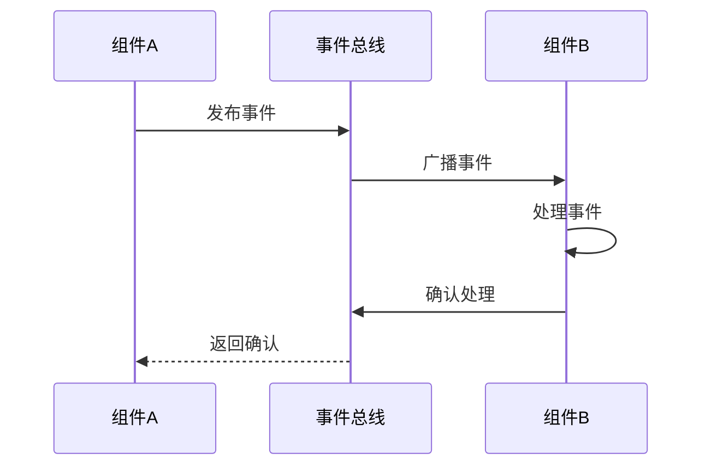

### 事件类型定义

| 事件类型 | 触发条件 | 处理函数 |
|---------|----------|----------|
| navigation:change | 导航项点击 | updateActiveNavigation |
| filter:change | 筛选按钮点击 | applyCategoryFilter |
| article:select | 文章卡片点击 | navigateToArticle |
| window:scroll | 滚动事件 | handleScrollBehavior |
| window:resize | 窗口大小变化 | adjustLayout |

**章节来源**
- [js/main.js:60-76](file://js/main.js#L60-L76)
- [js/main.js:194-218](file://js/main.js#L194-L218)

## 样式隔离策略

### CSS模块化设计

项目采用CSS变量和模块化设计实现样式隔离：

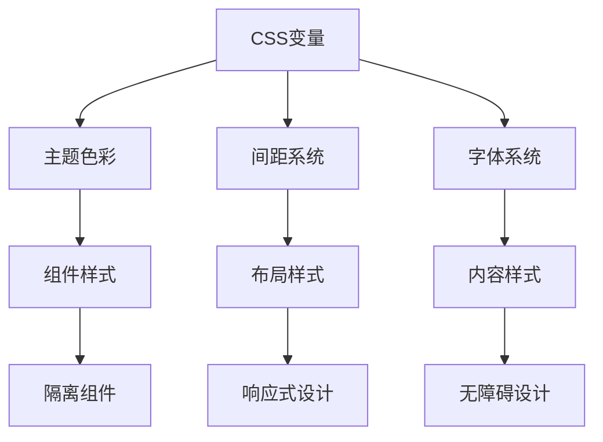

**图表来源**
- [css/style.css:8-78](file://css/style.css#L8-L78)

### 样式命名规范

#### BEM命名方法
- **Block**: `.navbar` - 导航栏容器
- **Element**: `.navbar__logo` - 导航栏Logo元素
- **Modifier**: `.navbar--scrolled` - 导航栏滚动状态

#### 组件作用域
```css
/* 文章卡片样式作用域 */
.article-card {
    /* 卡片基础样式 */
}

.article-card__cover {
    /* 封面图片样式 */
}

.article-card--hover {
    /* 悬停状态样式 */
}
```

**章节来源**
- [css/style.css:438-548](file://css/style.css#L438-L548)

## 生命周期管理

### 组件生命周期阶段

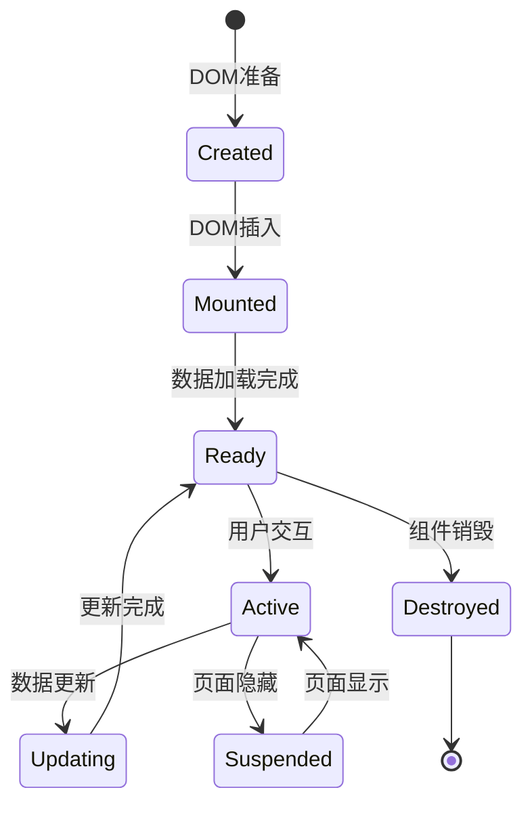

### 生命周期钩子

#### 初始化阶段
```javascript
function initHomePage() {
    // 1. 获取数据
    const featuredArticles = getFeaturedArticles(6);
    
    // 2. 渲染组件
    renderArticleGrid('featured-grid', featuredArticles);
    
    // 3. 绑定事件
    bindEventListeners();
    
    // 4. 启动动画
    startAnimations();
}
```

#### 更新阶段
```javascript
function updateArticleGrid(articles) {
    // 1. 清理旧DOM
    clearGrid();
    
    // 2. 重新渲染
    renderArticleGrid('article-grid', articles);
    
    // 3. 重新绑定事件
    rebindEventListeners();
}
```

#### 销毁阶段
```javascript
function destroyComponent() {
    // 1. 解绑事件
    unbindAllEvents();
    
    // 2. 清理定时器
    clearTimers();
    
    // 3. 释放内存
    releaseResources();
}
```

**章节来源**
- [js/main.js:150-154](file://js/main.js#L150-L154)
- [js/main.js:436-460](file://js/main.js#L436-L460)

## 测试与维护指南

### 单元测试策略

#### 组件测试
```javascript
describe('ArticleCard Component', () => {
    let articleCard;
    let mockArticle;
    
    beforeEach(() => {
        mockArticle = {
            id: 'test-id',
            title: 'Test Title',
            category: 'tech',
            date: '2026-01-01',
            excerpt: 'Test excerpt'
        };
        
        articleCard = createArticleCard(mockArticle);
    });
    
    test('should render with correct data', () => {
        expect(articleCard.querySelector('.article-card-title').textContent)
            .toBe('Test Title');
    });
    
    test('should handle click event', () => {
        const spy = jest.spyOn(window, 'location', 'set');
        articleCard.click();
        expect(spy).toHaveBeenCalledWith('article.html?id=test-id');
    });
});
```

#### 数据模块测试
```javascript
describe('Data Module', () => {
    test('should filter articles by category', () => {
        const techArticles = getArticlesByCategory('tech');
        expect(techArticles.every(article => article.category === 'tech'))
            .toBe(true);
    });
    
    test('should return all articles for "all" category', () => {
        const allArticles = getArticlesByCategory('all');
        expect(allArticles.length).toBe(ARTICLES.length);
    });
});
```

### 维护最佳实践

#### 代码组织
- **单一职责原则**：每个函数只负责一个功能
- **命名一致性**：使用一致的命名约定
- **注释规范**：为复杂逻辑添加详细注释

#### 性能优化
- **懒加载**：图片和内容的延迟加载
- **防抖节流**：滚动和窗口大小变化事件的优化
- **内存管理**：及时清理事件监听器和定时器

**章节来源**
- [js/main.js:28-39](file://js/main.js#L28-L39)
- [js/main.js:436-460](file://js/main.js#L436-L460)

## 重构建议

### 结构优化

#### 组件封装
```javascript
// 当前实现
function createArticleCard(article) {
    // 复杂的DOM创建逻辑
}

// 建议的封装
class ArticleCard {
    constructor(article) {
        this.article = article;
        this.element = null;
    }
    
    render() {
        this.element = document.createElement('article');
        this.bindEvents();
        return this.element;
    }
    
    bindEvents() {
        // 事件绑定逻辑
    }
}
```

#### 状态管理
```javascript
// 使用简单状态对象
const state = {
    currentPage: 'home',
    currentCategory: 'all',
    navbarScrolled: false,
    activeFilters: []
};

// 提供状态更新方法
function updateState(newState) {
    Object.assign(state, newState);
    notifySubscribers();
}
```

### 新增功能建议

#### 组件注册系统
```javascript
const componentRegistry = new Map();

function registerComponent(name, componentClass) {
    componentRegistry.set(name, componentClass);
}

function createComponent(name, props) {
    const ComponentClass = componentRegistry.get(name);
    if (!ComponentClass) {
        throw new Error(`Component ${name} not registered`);
    }
    return new ComponentClass(props);
}
```

#### 插件系统
```javascript
const plugins = [];

function use(plugin) {
    plugins.push(plugin);
    plugin.init && plugin.init(this);
}

function applyPlugins(methodName, ...args) {
    plugins.forEach(plugin => {
        plugin[methodName] && plugin[methodName](...args);
    });
}
```

### 性能改进

#### 虚拟滚动
对于大量文章列表，考虑实现虚拟滚动：
```javascript
class VirtualScroller {
    constructor(container, items, itemHeight) {
        this.container = container;
        this.items = items;
        this.itemHeight = itemHeight;
        this.visibleRange = this.calculateVisibleRange();
    }
    
    calculateVisibleRange() {
        const startIndex = Math.floor(this.container.scrollTop / this.itemHeight);
        const endIndex = Math.min(startIndex + this.visibleCount, this.items.length);
        return { start: startIndex, end: endIndex };
    }
}
```

#### 缓存策略
```javascript
class DataCache {
    constructor(ttl = 5 * 60 * 1000) {
        this.cache = new Map();
        this.ttl = ttl;
    }
    
    get(key) {
        const item = this.cache.get(key);
        if (item && Date.now() - item.timestamp < this.ttl) {
            return item.value;
        }
        this.cache.delete(key);
        return null;
    }
    
    set(key, value) {
        this.cache.set(key, {
            value,
            timestamp: Date.now()
        });
    }
}
```

Hot-Site项目展现了优秀的组件化设计理念，通过标准化的HTML结构、清晰的接口约定和合理的解耦策略，实现了高度可维护和可扩展的静态站点架构。这些设计原则为类似项目的组件化开发提供了宝贵的参考价值。