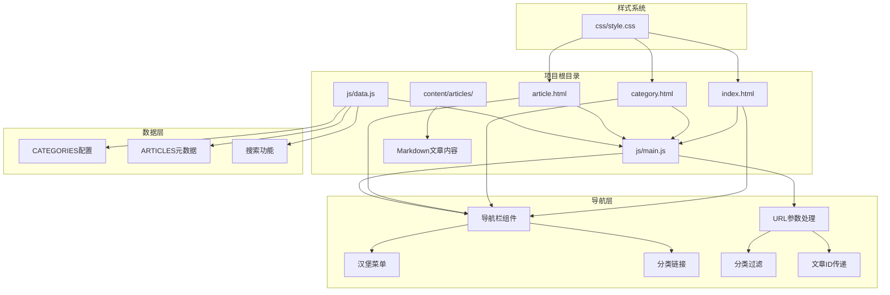
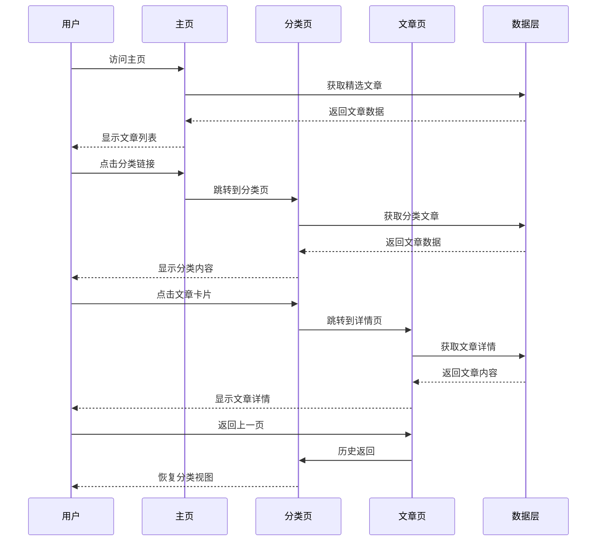
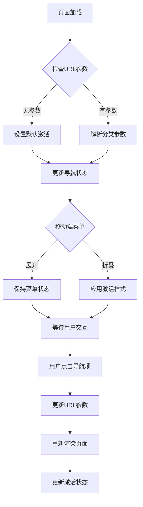
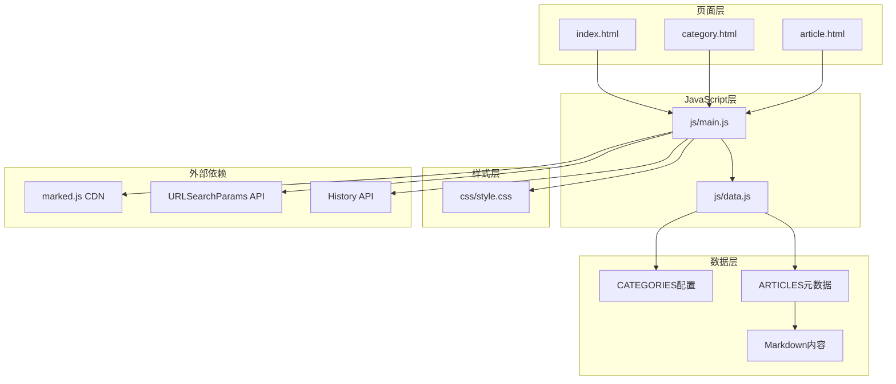

# 页面导航机制

<cite>
**本文档引用的文件**
- [index.html](file://index.html)
- [category.html](file://category.html)
- [article.html](file://article.html)
- [js/main.js](file://js/main.js)
- [js/data.js](file://js/data.js)
</cite>

## 目录
1. [简介](#简介)
2. [项目结构](#项目结构)
3. [核心组件](#核心组件)
4. [架构概览](#架构概览)
5. [详细组件分析](#详细组件分析)
6. [依赖关系分析](#依赖关系分析)
7. [性能考虑](#性能考虑)
8. [故障排除指南](#故障排除指南)
9. [结论](#结论)

## 简介

Hot-Site项目是一个基于静态站点技术构建的内容展示平台，采用现代化的前端架构实现流畅的页面导航体验。该项目包含三个主要HTML页面：主页(index.html)、分类页面(category.html)和文章详情页面(article.html)，通过统一的导航系统实现无缝的页面间跳转。

该导航机制的核心特点包括：
- 基于URL参数的分类导航系统
- 动态的导航栏激活状态管理
- 移动端响应式汉堡菜单交互
- 页面间数据传递的统一接口
- SEO友好的URL设计原则

## 项目结构

Hot-Site项目采用简洁而高效的文件组织结构：

**图表来源**
- [index.html:1-190](file://index.html#L1-L190)
- [category.html:1-103](file://category.html#L1-L103)
- [article.html:1-107](file://article.html#L1-L107)
- [js/main.js:1-461](file://js/main.js#L1-L461)
- [js/data.js:1-158](file://js/data.js#L1-L158)

**章节来源**
- [index.html:1-190](file://index.html#L1-L190)
- [category.html:1-103](file://category.html#L1-L103)
- [article.html:1-107](file://article.html#L1-L107)
- [js/main.js:1-461](file://js/main.js#L1-L461)
- [js/data.js:1-158](file://js/data.js#L1-L158)

## 核心组件

### 导航栏系统

导航栏是Hot-Site项目导航机制的核心组件，负责页面间的统一跳转和状态管理。每个页面都包含一个完整的导航栏结构，支持桌面端和移动端两种交互模式。

**导航栏特性：**
- 统一的品牌标识和Logo
- 固定的导航链接集合
- 动态激活状态管理
- 响应式汉堡菜单
- 滚动时的视觉反馈

**章节来源**
- [index.html:30-53](file://index.html#L30-L53)
- [category.html:28-51](file://category.html#L28-L51)
- [article.html:28-51](file://article.html#L28-L51)
- [js/main.js:43-77](file://js/main.js#L43-L77)

### URL参数处理系统

项目采用标准化的URL参数传递机制，确保页面间的数据传递既直观又可靠：

**分类参数(cat)系统：**
- 支持多种分类类型：tech、ai、game、music、art
- 默认分类(all)用于显示全部内容
- 参数格式：`category.html?cat=分类值`
- 无参数时自动降级到默认分类

**文章ID传递机制：**
- 参数格式：`article.html?id=文章ID`
- 用于精确定位和加载特定文章
- 支持历史记录和书签功能

**章节来源**
- [js/main.js:15-19](file://js/main.js#L15-L19)
- [js/main.js:158-177](file://js/main.js#L158-L177)
- [js/main.js:222-243](file://js/main.js#L222-L243)

### 文章卡片系统

文章卡片是连接主页和详情页的重要桥梁，提供统一的点击交互体验：

**卡片功能：**
- 点击事件触发页面跳转
- 键盘无障碍访问支持
- 动画过渡效果
- 分类徽章显示

**章节来源**
- [js/main.js:81-116](file://js/main.js#L81-L116)
- [js/main.js:118-146](file://js/main.js#L118-L146)

## 架构概览

Hot-Site项目的导航架构采用分层设计，确保各组件职责明确且相互协作：

**图表来源**
- [index.html:101-160](file://index.html#L101-L160)
- [category.html:71-75](file://category.html#L71-L75)
- [article.html:57-63](file://article.html#L57-L63)
- [js/main.js:150-177](file://js/main.js#L150-L177)
- [js/main.js:222-243](file://js/main.js#L222-L243)

## 详细组件分析

### 主页导航机制

主页作为用户访问的第一个页面，承担着引导用户探索内容的重要职责：

**导航特性：**
- 首页链接默认激活状态
- 分类导航链接提供快速跳转
- 精选内容区域展示热门文章
- 响应式布局适配移动设备

**页面元素：**
- Hero区域提供品牌展示
- 分类导航网格展示各类别
- 精选文章网格显示推荐内容

**章节来源**
- [index.html:55-163](file://index.html#L55-L163)
- [js/main.js:148-154](file://js/main.js#L148-L154)

### 分类页面导航逻辑

分类页面专门处理内容分类浏览，提供灵活的筛选和导航功能：

**核心功能：**
- URL参数解析和分类识别
- 动态筛选按钮生成
- 实时内容更新
- 历史状态管理

**交互流程：**
1. 页面加载时解析URL参数
2. 初始化筛选按钮状态
3. 根据分类过滤文章列表
4. 动态更新页面标题和描述

**章节来源**
- [category.html:53-76](file://category.html#L53-L76)
- [js/main.js:156-218](file://js/main.js#L156-L218)

### 文章详情页面导航

文章详情页面专注于单篇文章的深度展示，提供完整的阅读体验：

**页面特色：**
- 返回上一页功能
- 动态内容加载
- Markdown渲染支持
- 图片缩放功能

**导航行为：**
- 通过URL参数获取文章ID
- 异步加载文章内容
- 自动渲染Markdown格式
- 错误处理和降级显示

**章节来源**
- [article.html:53-80](file://article.html#L53-L80)
- [js/main.js:220-314](file://js/main.js#L220-L314)

### 导航栏激活状态管理

导航栏的激活状态管理是用户体验的关键组成部分：

**图表来源**
- [js/main.js:43-77](file://js/main.js#L43-L77)
- [js/main.js:158-177](file://js/main.js#L158-L177)
- [js/main.js:193-218](file://js/main.js#L193-L218)

**章节来源**
- [js/main.js:43-77](file://js/main.js#L43-L77)
- [js/main.js:158-177](file://js/main.js#L158-L177)
- [js/main.js:193-218](file://js/main.js#L193-L218)

### 移动端汉堡菜单交互

移动端导航是Hot-Site项目的重要组成部分，确保在小屏幕设备上的良好体验：

**交互特性：**
- 汉堡菜单按钮切换
- 菜单项点击后的自动关闭
- 背景滚动锁定防止穿透
- ARIA属性支持无障碍访问

**状态管理：**
- `aria-expanded`属性控制菜单状态
- CSS类名切换实现视觉反馈
- JavaScript事件监听器管理交互

**章节来源**
- [index.html:38-42](file://index.html#L38-L42)
- [js/main.js:60-77](file://js/main.js#L60-L77)

## 依赖关系分析

Hot-Site项目的导航系统具有清晰的依赖层次结构：

**图表来源**
- [js/main.js:103-104](file://js/main.js#L103-L104)
- [js/main.js:284-293](file://js/main.js#L284-L293)
- [js/data.js:6-37](file://js/data.js#L6-L37)
- [js/data.js:40-113](file://js/data.js#L40-L113)

**章节来源**
- [js/main.js:103-104](file://js/main.js#L103-L104)
- [js/main.js:284-293](file://js/main.js#L284-L293)
- [js/data.js:6-37](file://js/data.js#L6-L37)
- [js/data.js:40-113](file://js/data.js#L40-L113)

## 性能考虑

Hot-Site项目的导航机制在设计时充分考虑了性能优化：

### 加载性能优化

**资源预加载策略：**
- 字体资源预连接优化
- 图片懒加载减少初始负载
- CDN加速Markdown渲染器

**JavaScript执行优化：**
- 防抖函数减少滚动事件开销
- 按需加载文章内容
- 事件委托减少内存占用

### 导航性能特性

**URL参数处理优化：**
- 原生URLSearchParams API高效解析
- 缓存分类信息避免重复查询
- 异步内容加载不阻塞主线程

**页面切换优化：**
- CSS动画硬件加速
- 请求动画帧优化滚动效果
- 历史状态管理避免全页刷新

**章节来源**
- [js/main.js:28-39](file://js/main.js#L28-L39)
- [js/main.js:436-460](file://js/main.js#L436-L460)
- [js/main.js:272-314](file://js/main.js#L272-L314)

## 故障排除指南

### 常见导航问题及解决方案

**问题1：分类页面无法正确显示内容**
- 检查URL参数格式是否正确
- 验证分类ID是否存在于CATEGORIES配置中
- 确认文章数据是否正确加载

**问题2：文章详情页面显示空白**
- 验证文章ID参数是否存在
- 检查Markdown文件路径是否正确
- 确认网络请求是否成功

**问题3：导航栏激活状态异常**
- 检查URL参数解析逻辑
- 验证CSS类名切换逻辑
- 确认事件监听器绑定状态

**问题4：移动端菜单无法正常关闭**
- 检查事件冒泡处理
- 验证CSS过渡动画状态
- 确认body滚动锁定逻辑

**章节来源**
- [js/main.js:222-243](file://js/main.js#L222-L243)
- [js/main.js:158-177](file://js/main.js#L158-L177)
- [js/main.js:60-77](file://js/main.js#L60-L77)

### 调试工具和方法

**浏览器开发者工具使用：**
- Network面板监控资源加载
- Console面板查看错误信息
- Elements面板检查DOM状态
- Sources面板调试JavaScript

**性能分析方法：**
- Performance面板分析渲染性能
- Memory面板检测内存泄漏
- Lighthouse工具评估SEO指标

## 结论

Hot-Site项目的页面导航机制展现了现代Web应用的最佳实践：

**设计优势：**
- 统一的导航体验贯穿所有页面
- 响应式设计确保多设备兼容性
- 标准化的URL参数传递机制
- 完善的无障碍访问支持

**技术亮点：**
- 清晰的分层架构便于维护
- 高效的性能优化策略
- 灵活的扩展性设计
- 友好的用户体验

**改进建议：**
- 可以考虑引入客户端路由框架
- 增加更多的缓存策略
- 优化图片资源的加载优先级
- 添加更多SEO优化措施

该导航系统为Hot-Site项目提供了稳定可靠的页面跳转基础，为用户创造了一致而流畅的浏览体验。