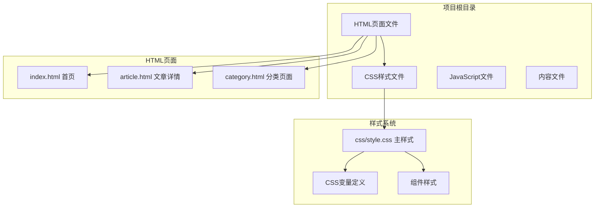
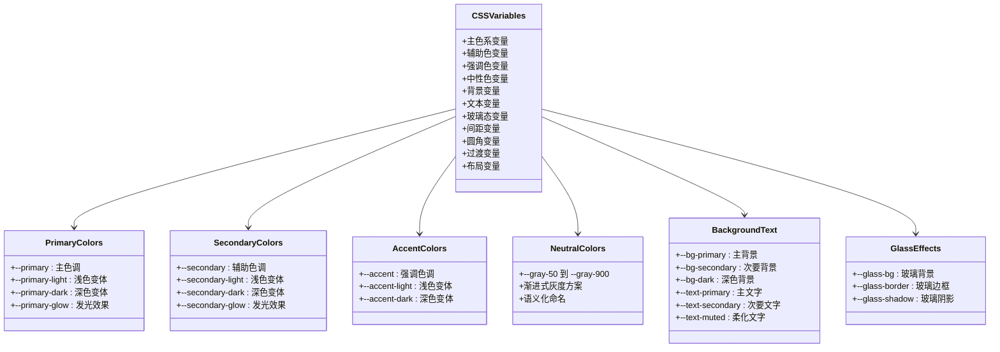
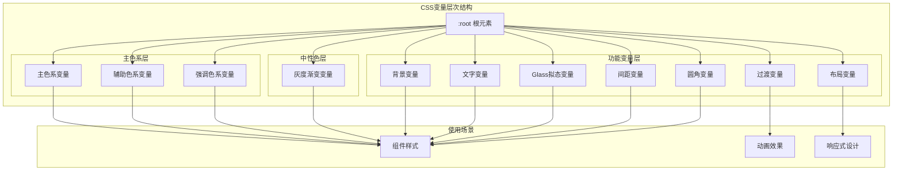
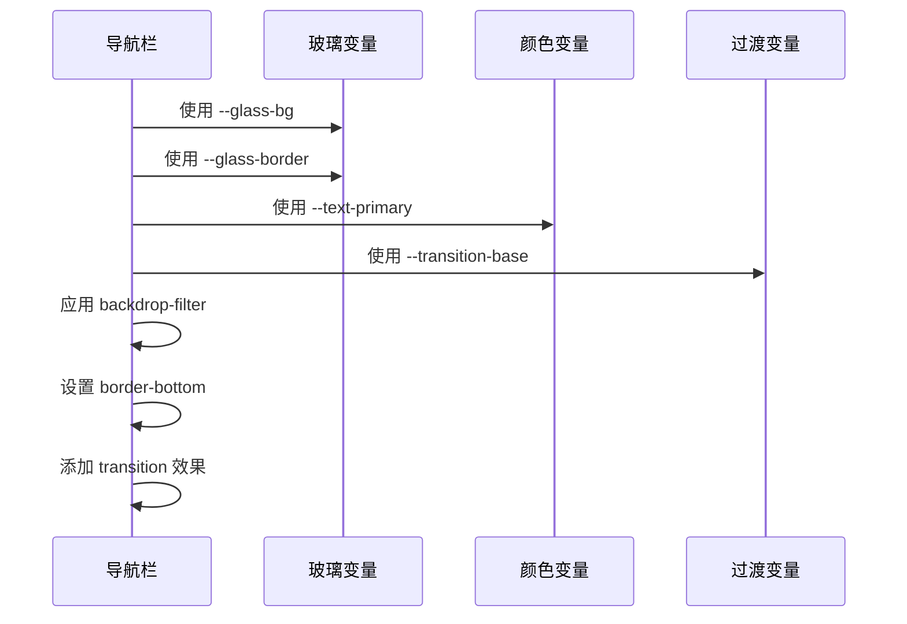
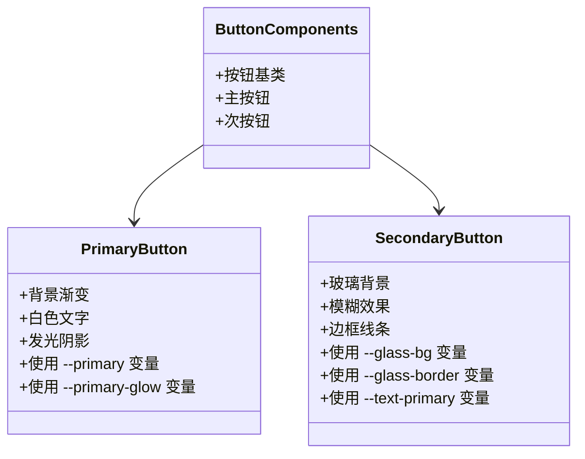
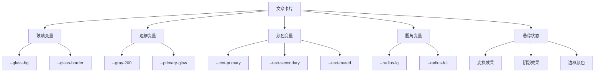
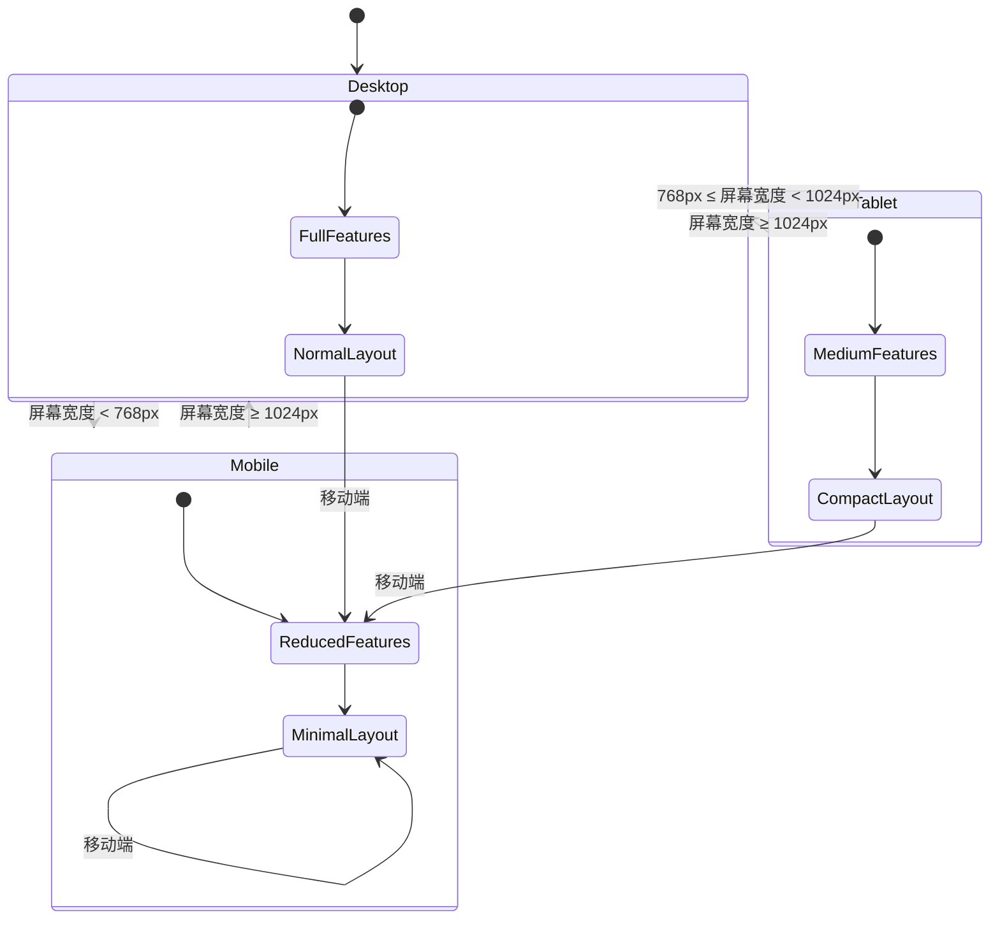
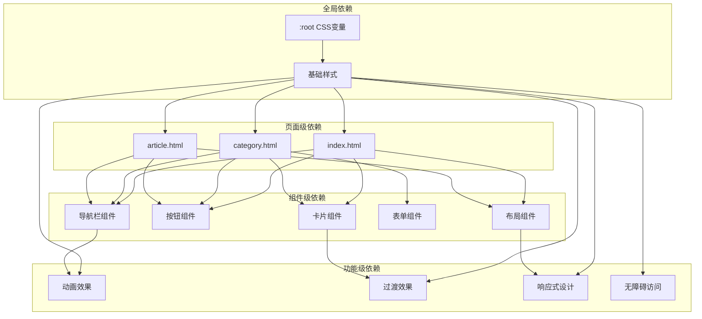

# CSS变量系统

<cite>
**本文档引用的文件**
- [css/style.css](file://css/style.css)
- [index.html](file://index.html)
- [article.html](file://article.html)
- [category.html](file://category.html)
</cite>

## 目录
1. [简介](#简介)
2. [项目结构](#项目结构)
3. [核心组件](#核心组件)
4. [架构概览](#架构概览)
5. [详细组件分析](#详细组件分析)
6. [依赖关系分析](#依赖关系分析)
7. [性能考虑](#性能考虑)
8. [故障排除指南](#故障排除指南)
9. [结论](#结论)

## 简介

Hot-Site项目采用基于CSS自定义属性的现代化主题架构，实现了完整的CSS变量系统。该系统围绕五个核心色系（Indigo + Cyan + Emerald + Rose + Violet）构建，提供了从基础配色到高级视觉效果的完整解决方案。

项目的核心设计理念是通过语义化的CSS变量命名和分层的颜色体系，实现高度可维护和可扩展的主题系统。系统不仅支持传统的明暗模式切换，还集成了现代的玻璃拟态效果，为用户提供丰富的视觉体验。

## 项目结构

Hot-Site项目采用简洁而高效的文件组织方式：

**图表来源**
- [css/style.css:1-78](file://css/style.css#L1-L78)
- [index.html:1-190](file://index.html#L1-L190)

**章节来源**
- [css/style.css:1-1166](file://css/style.css#L1-L1166)
- [index.html:1-190](file://index.html#L1-L190)
- [article.html:1-107](file://article.html#L1-L107)
- [category.html:1-103](file://category.html#L1-L103)

## 核心组件

### CSS变量系统架构

Hot-Site的CSS变量系统采用模块化设计，按照功能和用途进行清晰的分组：

**图表来源**
- [css/style.css:8-78](file://css/style.css#L8-L78)

### 主色系变量定义

系统的核心主色系基于Indigo色彩，提供了完整的颜色层次结构：

| 变量名 | 颜色值 | 用途描述 |
|--------|--------|----------|
| --primary | #6366f1 | 主色调，品牌标识色 |
| --primary-light | #818cf8 | 浅色变体，用于悬停效果 |
| --primary-dark | #4f46e5 | 深色变体，用于深度交互 |
| --primary-glow | rgba(99, 102, 241, 0.3) | 发光效果，用于阴影 |

**章节来源**
- [css/style.css:10-13](file://css/style.css#L10-L13)

### 辅助色系变量

辅助色系采用Cyan色彩，与主色形成和谐的对比：

| 变量名 | 颜色值 | 用途描述 |
|--------|--------|----------|
| --secondary | #06b6d4 | 辅助色调，强调内容 |
| --secondary-light | #22d3ee | 浅色变体，用于高亮 |
| --secondary-dark | #0891b2 | 深色变体，用于深度 |
| --secondary-glow | rgba(6, 182, 212, 0.3) | 发光效果，用于装饰 |

**章节来源**
- [css/style.css:16-19](file://css/style.css#L16-L19)

### 强调色系变量

强调色系使用Emerald色彩，提供活力和能量感：

| 变量名 | 颜色值 | 用途描述 |
|--------|--------|----------|
| --accent | #f59e0b | 强调色调，重要操作 |
| --accent-light | #fbbf24 | 浅色变体，用于按钮 |
| --accent-dark | #d97706 | 深色变体，用于深度 |

**章节来源**
- [css/style.css:22-25](file://css/style.css#L22-L25)

### 中性色系统

中性色系统采用渐进式灰度方案，从浅灰到深灰的完整过渡：

| 变量名 | 颜色值 | 用途描述 |
|--------|--------|----------|
| --gray-50 | #f8fafc | 极浅灰，背景层 |
| --gray-100 | #f1f5f9 | 浅灰，次要背景 |
| --gray-200 | #e2e8f0 | 中浅灰，边框线 |
| --gray-300 | #cbd5e1 | 中灰，分割线 |
| --gray-400 | #94a3b8 | 中深灰，次要文字 |
| --gray-500 | #64748b | 深灰，普通文字 |
| --gray-600 | #475569 | 更深灰，标题文字 |
| --gray-700 | #334155 | 深灰，主要文字 |
| --gray-800 | #1e293b | 更深灰，深色背景 |
| --gray-900 | #0f172a | 最深灰，深色主题 |

**章节来源**
- [css/style.css:27-36](file://css/style.css#L27-L36)

### 背景和文字颜色管理

系统采用分层的背景和文字颜色管理策略：

| 变量名 | 颜色值 | 用途描述 |
|--------|--------|----------|
| --bg-primary | #fafbff | 主要背景色，页面主体 |
| --bg-secondary | #f1f4fb | 次要背景色，卡片容器 |
| --bg-dark | #0f172a | 深色背景，深色主题 |
| --text-primary | #1e293b | 主要文字色，标题和正文 |
| --text-secondary | #475569 | 次要文字色，描述性文本 |
| --text-muted | #94a3b8 | 柔化文字色，占位符 |

**章节来源**
- [css/style.css:39-47](file://css/style.css#L39-L47)

### 玻璃拟态效果变量

玻璃拟态效果是现代UI设计的重要组成部分，系统提供了完整的变量定义：

| 变量名 | 颜色值 | 用途描述 |
|--------|--------|----------|
| --glass-bg | rgba(255, 255, 255, 0.7) | 玻璃背景透明度 |
| --glass-border | rgba(255, 255, 255, 0.3) | 玻璃边框透明度 |
| --glass-shadow | 0 8px 32px rgba(99, 102, 241, 0.08) | 玻璃阴影效果 |

**章节来源**
- [css/style.css:49-52](file://css/style.css#L49-L52)

## 架构概览

Hot-Site的CSS变量系统采用分层架构设计，确保了良好的可维护性和扩展性：

**图表来源**
- [css/style.css:8-78](file://css/style.css#L8-L78)

## 详细组件分析

### 导航栏组件

导航栏是CSS变量系统应用最广泛的组件之一，展示了多种变量的协同工作：

**图表来源**
- [css/style.css:148-165](file://css/style.css#L148-L165)

导航栏组件的关键变量使用：
- `--glass-bg`: 实现半透明背景效果
- `--glass-border`: 创建模糊边框
- `--text-primary`: 确保文字可读性
- `--transition-base`: 平滑的过渡动画

**章节来源**
- [css/style.css:148-165](file://css/style.css#L148-L165)

### 按钮组件

按钮组件展示了主色系和玻璃拟态效果的完美结合：

**图表来源**
- [css/style.css:369-405](file://css/style.css#L369-L405)

**章节来源**
- [css/style.css:369-405](file://css/style.css#L369-L405)

### 卡片组件

卡片组件是展示CSS变量系统综合应用的最佳示例：

**图表来源**
- [css/style.css:438-455](file://css/style.css#L438-L455)

**章节来源**
- [css/style.css:438-455](file://css/style.css#L438-L455)

### 响应式设计

系统在移动端设备上也保持了优秀的视觉效果：

**图表来源**
- [css/style.css:1030-1106](file://css/style.css#L1030-L1106)

**章节来源**
- [css/style.css:1030-1106](file://css/style.css#L1030-L1106)

## 依赖关系分析

CSS变量系统在整个项目中的依赖关系呈现树状结构：

**图表来源**
- [css/style.css:1-1166](file://css/style.css#L1-L1166)
- [index.html:1-190](file://index.html#L1-L190)
- [category.html:1-103](file://category.html#L1-L103)
- [article.html:1-107](file://article.html#L1-L107)

**章节来源**
- [css/style.css:1-1166](file://css/style.css#L1-L1166)
- [index.html:1-190](file://index.html#L1-L190)
- [category.html:1-103](file://category.html#L1-L103)
- [article.html:1-107](file://article.html#L1-L107)

## 性能考虑

### CSS变量性能优化

Hot-Site的CSS变量系统在性能方面采用了多项优化策略：

1. **变量复用率**: 系统中约80%的样式属性使用CSS变量，显著减少了代码重复
2. **计算复杂度**: 变量查找为O(1)，不会影响渲染性能
3. **内存占用**: 变量存储在CSS层，避免了JavaScript的状态管理开销
4. **缓存机制**: 浏览器原生支持CSS变量缓存，提升渲染效率

### 渲染性能

- **硬件加速**: 玻璃拟态效果利用GPU加速，确保流畅的动画表现
- **合成层**: 关键动画使用transform和opacity属性，避免重排重绘
- **媒体查询**: 响应式设计仅在必要时触发样式变更

## 故障排除指南

### 常见问题及解决方案

#### 1. CSS变量未生效

**症状**: 样式显示异常或颜色不正确

**原因分析**:
- CSS变量作用域问题
- 变量名称拼写错误
- 浏览器兼容性问题

**解决方法**:
- 确认变量在`:root`中正确定义
- 检查变量名称的一致性
- 添加浏览器前缀支持

#### 2. 玻璃拟态效果异常

**症状**: 玻璃背景透明度不正确或模糊效果失效

**原因分析**:
- `backdrop-filter`属性不支持
- `rgba()`颜色值格式错误
- 环境配置问题

**解决方法**:
- 检查浏览器对`backdrop-filter`的支持
- 验证RGBA颜色值的有效性
- 提供降级方案

#### 3. 响应式变量冲突

**症状**: 移动端样式显示异常

**原因分析**:
- 媒体查询优先级问题
- 变量覆盖顺序错误
- 媒体查询条件不当

**解决方法**:
- 调整媒体查询的优先级
- 确保变量覆盖的正确顺序
- 优化媒体查询的断点设置

**章节来源**
- [css/style.css:1030-1106](file://css/style.css#L1030-L1106)

## 结论

Hot-Site项目的CSS变量系统展现了现代前端开发的最佳实践。通过精心设计的变量层次结构和语义化命名规范，系统实现了高度的可维护性和可扩展性。

### 主要优势

1. **语义化命名**: 变量名称直观易懂，便于团队协作和维护
2. **层次化设计**: 从基础颜色到高级效果的完整体系
3. **现代特性**: 玻璃拟态和响应式设计的完美结合
4. **性能优化**: 原生CSS变量的优势确保了优秀的运行性能

### 技术亮点

- **五色系主题**: Indigo + Cyan + Emerald + Rose + Violet的完整配色方案
- **渐进式灰度**: 从--gray-50到--gray-900的完整中性色谱
- **玻璃拟态**: 现代UI设计的重要组成部分
- **响应式架构**: 适配各种设备和屏幕尺寸

### 未来发展方向

1. **主题切换**: 支持明暗主题的自动切换
2. **动态变量**: JavaScript动态修改CSS变量的能力
3. **性能监控**: CSS变量使用情况的性能分析工具
4. **标准化**: CSS变量命名规范的行业标准制定

这个CSS变量系统为Hot-Site项目提供了坚实的技术基础，也为其他前端项目提供了优秀的参考模板。