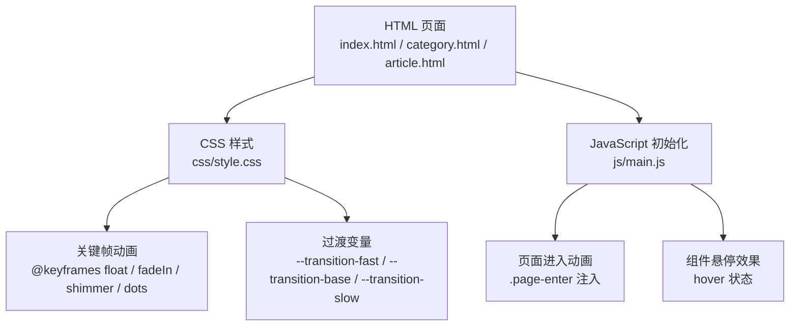
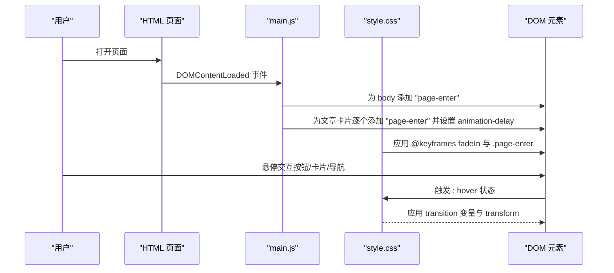
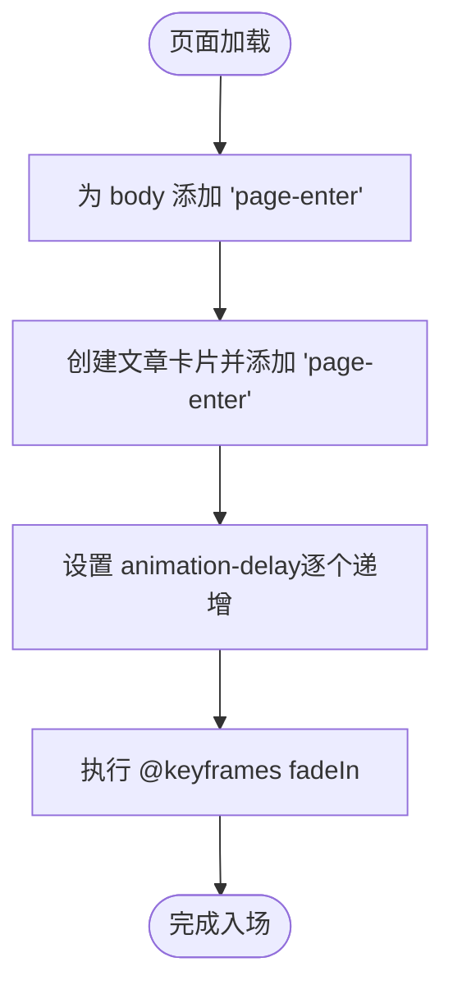
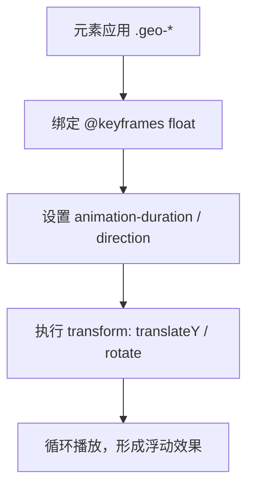
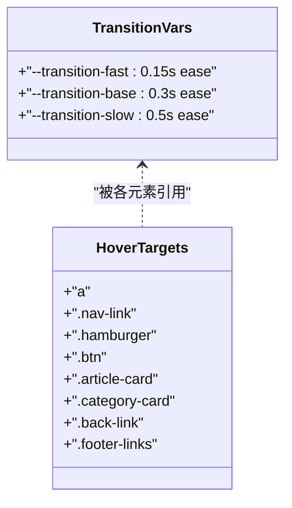
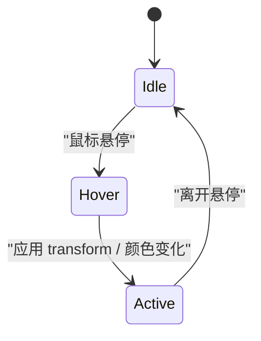
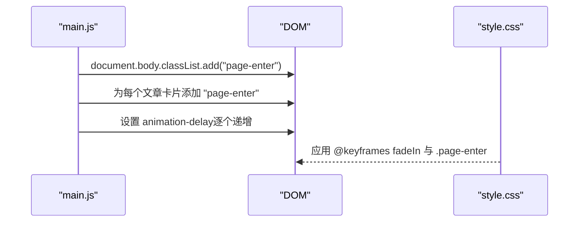
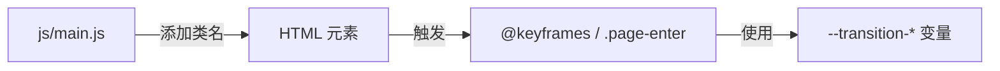

# 动画与过渡效果

<cite>
**本文引用的文件**
- [css/style.css](file://css/style.css)
- [index.html](file://index.html)
- [category.html](file://category.html)
- [article.html](file://article.html)
- [js/main.js](file://js/main.js)
- [js/data.js](file://js/data.js)
</cite>

## 目录
1. [简介](#简介)
2. [项目结构](#项目结构)
3. [核心组件](#核心组件)
4. [架构总览](#架构总览)
5. [详细组件分析](#详细组件分析)
6. [依赖关系分析](#依赖关系分析)
7. [性能考量](#性能考量)
8. [故障排查指南](#故障排查指南)
9. [结论](#结论)

## 简介
本文件系统性梳理 Hot-Site 项目的动画与过渡效果，覆盖以下主题：
- CSS 关键帧动画：float 动画的 @keyframes 定义与 transform 属性使用
- 过渡系统变量：--transition-fast、--transition-base、--transition-slow 的定义与应用场景
- 悬停效果：按钮、卡片、导航链接 hover 状态变化
- 页面进入动画：fadeIn 动画的 @keyframes 定义与 .page-enter 类的使用
- 缓动函数选择与性能考虑：ease、ease-in-out 等函数的应用时机
- 性能优化建议：will-change 属性与硬件加速的使用

## 项目结构
Hot-Site 采用“HTML + CSS + JavaScript”三层结构，动画与过渡主要集中在 CSS 变量与关键帧定义中，配合 JavaScript 在页面加载时注入入场动画类名，实现统一的页面进入体验；同时通过 hover 状态实现交互反馈。

图表来源
- [css/style.css:131-138](file://css/style.css#L131-L138)
- [css/style.css:363-366](file://css/style.css#L363-L366)
- [css/style.css:70-73](file://css/style.css#L70-L73)
- [js/main.js:422-432](file://js/main.js#L422-L432)

章节来源
- [index.html:1-190](file://index.html#L1-L190)
- [category.html:1-103](file://category.html#L1-L103)
- [article.html:1-107](file://article.html#L1-L107)
- [css/style.css:1-1166](file://css/style.css#L1-L1166)
- [js/main.js:1-461](file://js/main.js#L1-L461)

## 核心组件
- 过渡变量系统
  - --transition-fast：0.15s ease，适用于快速反馈（如链接、按钮、图标）
  - --transition-base：0.3s ease，适用于中等节奏的交互（如导航、卡片、输入框）
  - --transition-slow：0.5s ease，适用于较慢的视觉变化（如图片缩放、遮罩）
- 页面进入动画
  - @keyframes fadeIn：从透明 + 向下位移至不透明 + 回归原位
  - .page-enter：绑定 fadeIn 动画，持续时间与缓动由 CSS 控制
- 几何浮动装饰
  - @keyframes float：上下轻微位移 + 固定旋转角度
  - 多个 .geo-* 元素使用该动画，配合不同持续时间与方向实现层次感
- 悬停效果
  - 导航链接、按钮、卡片、分类卡片、返回链接、页脚链接等均使用 transition 变量与 transform 实现悬停反馈

章节来源
- [css/style.css:70-73](file://css/style.css#L70-L73)
- [css/style.css:131-138](file://css/style.css#L131-L138)
- [css/style.css:363-366](file://css/style.css#L363-L366)
- [css/style.css:213-227](file://css/style.css#L213-L227)
- [css/style.css:369-405](file://css/style.css#L369-L405)
- [css/style.css:438-455](file://css/style.css#L438-L455)
- [css/style.css:557-587](file://css/style.css#L557-L587)
- [css/style.css:935-948](file://css/style.css#L935-L948)
- [css/style.css:1020-1027](file://css/style.css#L1020-L1027)

## 架构总览
页面进入动画与组件悬停效果的协作流程如下：

图表来源
- [js/main.js:422-432](file://js/main.js#L422-L432)
- [js/main.js:141-146](file://js/main.js#L141-L146)
- [css/style.css:131-138](file://css/style.css#L131-L138)
- [css/style.css:213-227](file://css/style.css#L213-L227)

## 详细组件分析

### 组件一：页面进入动画（fadeIn 与 .page-enter）
- @keyframes fadeIn
  - 起始：透明度 0，向下平移 12px
  - 结束：透明度 1，回到原位
- .page-enter
  - 绑定 fadeIn 动画，持续时间为 0.5s，缓动为 ease
- JavaScript 注入
  - 页面加载完成后，为 body 添加 "page-enter"
  - 文章卡片逐个创建时也添加 "page-enter"，并通过 animation-delay 实现错峰入场
- 应用范围
  - 整体页面淡入
  - 文章网格项逐个入场

图表来源
- [js/main.js:422-432](file://js/main.js#L422-L432)
- [js/main.js:141-146](file://js/main.js#L141-L146)
- [css/style.css:131-138](file://css/style.css#L131-L138)

章节来源
- [css/style.css:131-138](file://css/style.css#L131-L138)
- [js/main.js:422-432](file://js/main.js#L422-L432)
- [js/main.js:141-146](file://js/main.js#L141-L146)

### 组件二：几何浮动装饰（float 动画）
- @keyframes float
  - 起止：保持旋转角度，垂直方向回弹
  - 中间：向上偏移一定距离
- 使用方式
  - 多个 .geo-* 元素应用该动画
  - 不同元素设置不同的 animation-duration 与 animation-direction（reverse）实现差异化
- transform 属性
  - 结合 translateY 与 rotate，形成“漂浮+旋转”的复合变换
- 应用范围
  - Hero 区域背景装饰元素

图表来源
- [css/style.css:363-366](file://css/style.css#L363-L366)
- [css/style.css:332-361](file://css/style.css#L332-L361)

章节来源
- [css/style.css:363-366](file://css/style.css#L363-L366)
- [css/style.css:332-361](file://css/style.css#L332-L361)

### 组件三：过渡变量系统（--transition-fast / --transition-base / --transition-slow）
- --transition-fast：0.15s ease
  - 适用：链接 hover、图标 hover、轻量交互反馈
- --transition-base：0.3s ease
  - 适用：导航栏、按钮、卡片、输入框等常规交互
- --transition-slow：0.5s ease
  - 适用：图片缩放、遮罩显隐、复杂变换
- 使用示例
  - a、.nav-link、.hamburger、.btn、.article-card、.category-card、.back-link、.footer-links 等均使用上述变量控制过渡时长与缓动

图表来源
- [css/style.css:70-73](file://css/style.css#L70-L73)
- [css/style.css:105-109](file://css/style.css#L105-L109)
- [css/style.css:213-227](file://css/style.css#L213-L227)
- [css/style.css:238-245](file://css/style.css#L238-L245)
- [css/style.css:369-405](file://css/style.css#L369-L405)
- [css/style.css:438-455](file://css/style.css#L438-L455)
- [css/style.css:557-587](file://css/style.css#L557-L587)
- [css/style.css:935-948](file://css/style.css#L935-L948)
- [css/style.css:1020-1027](file://css/style.css#L1020-L1027)

章节来源
- [css/style.css:70-73](file://css/style.css#L70-L73)
- [css/style.css:105-109](file://css/style.css#L105-L109)
- [css/style.css:213-227](file://css/style.css#L213-L227)
- [css/style.css:238-245](file://css/style.css#L238-L245)
- [css/style.css:369-405](file://css/style.css#L369-L405)
- [css/style.css:438-455](file://css/style.css#L438-L455)
- [css/style.css:557-587](file://css/style.css#L557-L587)
- [css/style.css:935-948](file://css/style.css#L935-L948)
- [css/style.css:1020-1027](file://css/style.css#L1020-L1027)

### 组件四：悬停效果（hover 状态）
- 导航链接
  - 颜色与背景高亮，配合 --transition-fast
- 按钮
  - 主按钮：hover 时轻微上移 + 阴影增强
  - 次按钮：hover 时背景与边框变化 + 上移
- 卡片
  - 文章卡片：hover 时上移 + 阴影增强 + 边框高亮
  - 分类卡片：hover 时上移 + 顶部高亮条高度变化
- 返回链接与页脚链接
  - hover 时颜色变化，配合 --transition-fast
- 图片缩放
  - 文章封面图 hover 时 scale 放大，使用 --transition-slow

图表来源
- [css/style.css:213-227](file://css/style.css#L213-L227)
- [css/style.css:389-392](file://css/style.css#L389-L392)
- [css/style.css:401-405](file://css/style.css#L401-L405)
- [css/style.css:451-455](file://css/style.css#L451-L455)
- [css/style.css:580-587](file://css/style.css#L580-L587)
- [css/style.css:946-948](file://css/style.css#L946-L948)
- [css/style.css:1025-1027](file://css/style.css#L1025-L1027)
- [css/style.css:471-473](file://css/style.css#L471-L473)

章节来源
- [css/style.css:213-227](file://css/style.css#L213-L227)
- [css/style.css:389-392](file://css/style.css#L389-L392)
- [css/style.css:401-405](file://css/style.css#L401-L405)
- [css/style.css:451-455](file://css/style.css#L451-L455)
- [css/style.css:580-587](file://css/style.css#L580-L587)
- [css/style.css:946-948](file://css/style.css#L946-L948)
- [css/style.css:1025-1027](file://css/style.css#L1025-L1027)
- [css/style.css:471-473](file://css/style.css#L471-L473)

### 组件五：页面进入动画的 JavaScript 触发
- 页面加载完成后，为 body 添加 "page-enter"，触发展开的淡入动画
- 文章网格项逐个创建时，同样添加 "page-enter"，并通过 animation-delay 实现错峰入场
- 该模式确保首屏内容有序出现，提升感知性能

图表来源
- [js/main.js:422-432](file://js/main.js#L422-L432)
- [js/main.js:141-146](file://js/main.js#L141-L146)
- [css/style.css:131-138](file://css/style.css#L131-L138)

章节来源
- [js/main.js:422-432](file://js/main.js#L422-L432)
- [js/main.js:141-146](file://js/main.js#L141-L146)
- [css/style.css:131-138](file://css/style.css#L131-L138)

## 依赖关系分析
- CSS 变量与关键帧
  - --transition-* 变量被大量元素引用，统一了过渡节奏
  - @keyframes 定义集中于 style.css，便于复用与修改
- JavaScript 与 CSS 的耦合
  - main.js 通过为元素添加 "page-enter" 类名，间接触发 CSS 中的 @keyframes
  - hover 状态完全由 CSS 控制，无需额外 JS 干预
- HTML 与动画
  - index.html、category.html、article.html 作为宿主页面，承载动画容器与交互元素

图表来源
- [js/main.js:422-432](file://js/main.js#L422-L432)
- [css/style.css:131-138](file://css/style.css#L131-L138)
- [css/style.css:70-73](file://css/style.css#L70-L73)

章节来源
- [js/main.js:422-432](file://js/main.js#L422-L432)
- [css/style.css:131-138](file://css/style.css#L131-L138)
- [css/style.css:70-73](file://css/style.css#L70-L73)

## 性能考量
- 缓动函数选择
  - ease：适合大多数通用过渡，平衡速度与自然感
  - ease-in-out：适合需要强调起止阶段的动画（如页面进入、卡片展开）
- 硬件加速与合成层
  - 优先使用 transform 与 opacity 实现动画，避免频繁触发布局与绘制
  - 对于复杂动画，可考虑使用 will-change 提示浏览器提前准备合成层（需谨慎使用，避免过度消耗内存）
- 动画数量与频率
  - 页面进入动画采用错峰延迟，减少同时触发的动画数量
  - 图片缩放使用较慢过渡，避免在高频交互中造成卡顿
- 可访问性
  用户偏好设置降低动画时，可通过媒体查询禁用或简化动画（例如减少过渡时长或移除复杂变换）

## 故障排查指南
- 页面进入动画不生效
  - 检查是否正确为 body 添加 "page-enter" 类
  - 确认 @keyframes fadeIn 是否存在且未被覆盖
- 悬停效果异常
  - 检查对应元素是否正确应用 transition 变量
  - 确认 hover 状态选择器未被更高优先级规则覆盖
- 浮动装饰不运动
  - 检查 .geo-* 元素是否应用了 @keyframes float
  - 确认 animation-duration 与 animation-play-state 正常
- 过渡卡顿
  - 减少同时运行的动画数量
  - 将复杂变换拆分为多个简单动画
  - 使用 transform/opacity 替代布局敏感属性

章节来源
- [js/main.js:422-432](file://js/main.js#L422-L432)
- [css/style.css:131-138](file://css/style.css#L131-L138)
- [css/style.css:363-366](file://css/style.css#L363-L366)

## 结论
Hot-Site 的动画与过渡体系以 CSS 变量与关键帧为核心，结合 JavaScript 的页面进入动画触发，形成了统一、可维护且具有良好性能表现的交互体验。通过合理的缓动函数选择与 transform 为主的动画策略，既保证了视觉流畅性，又兼顾了性能与可访问性。建议在后续迭代中：
- 为高频交互场景引入 will-change 提示，但需配合条件判断与资源回收
- 在移动端进一步优化动画时长与复杂度
- 通过媒体查询适配用户的“减少动画”偏好设置