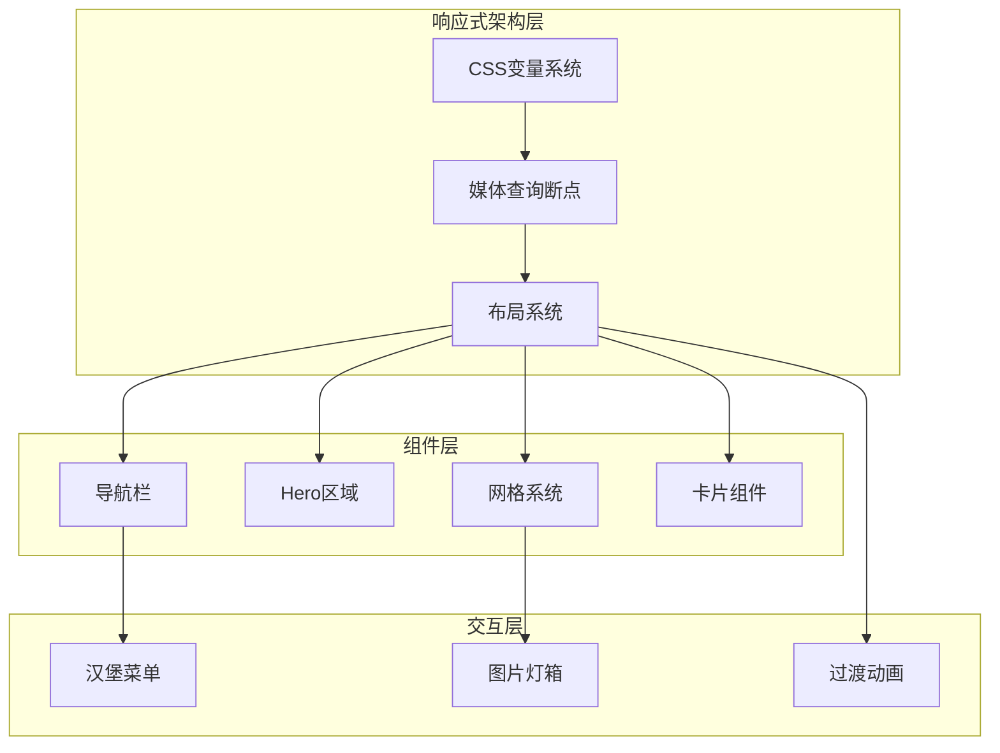
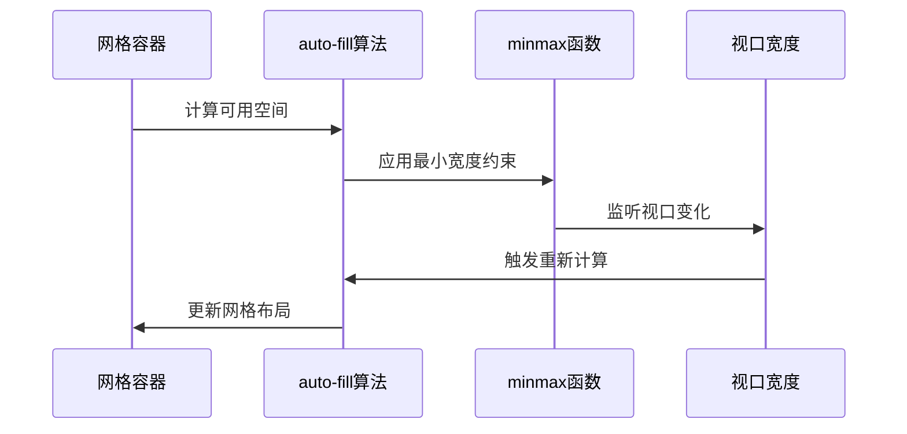
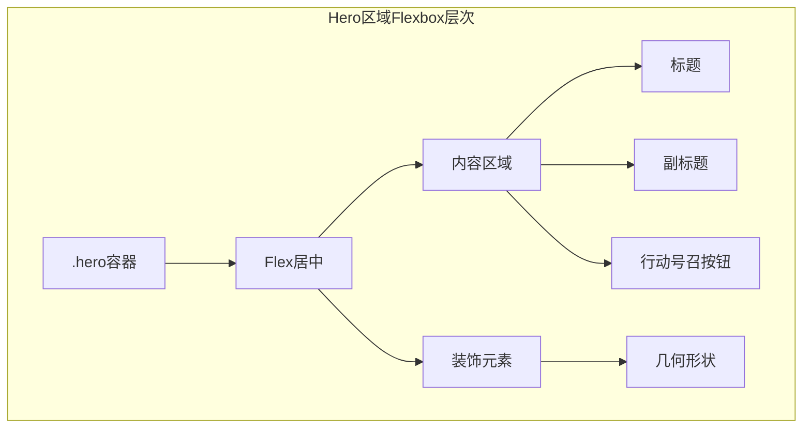
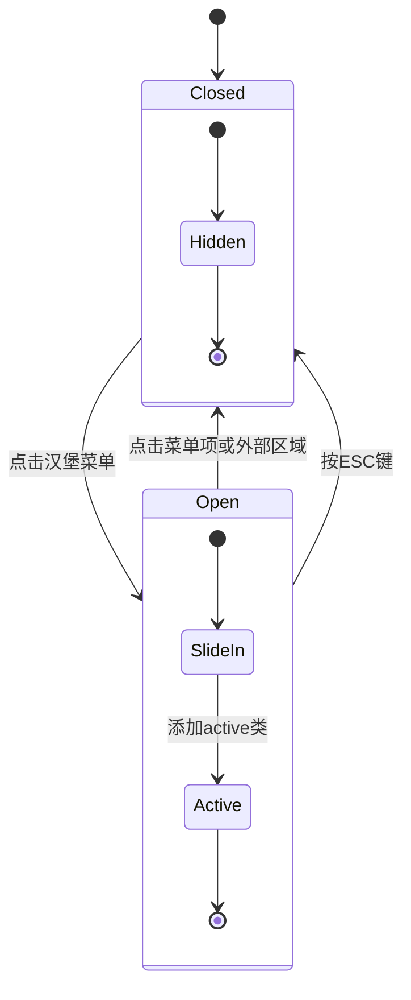
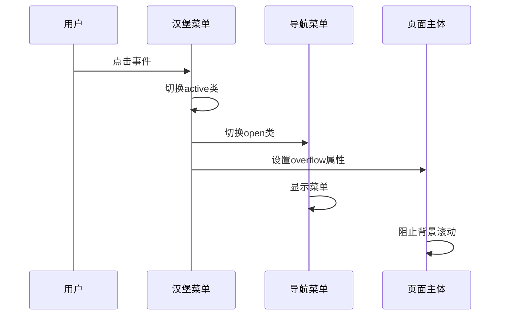
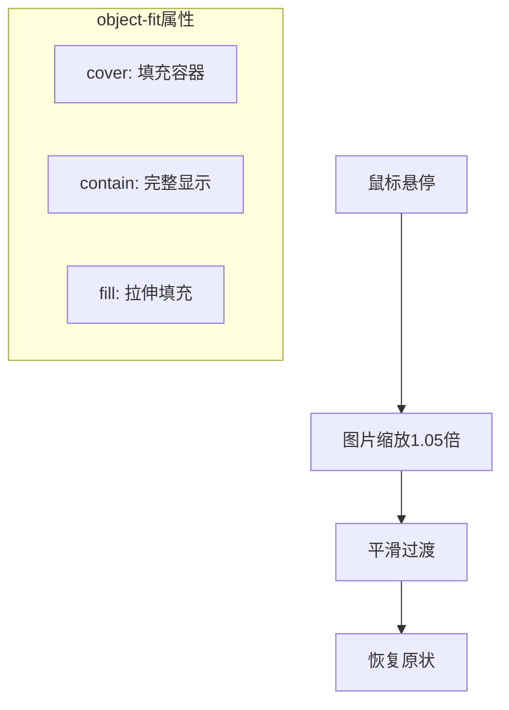
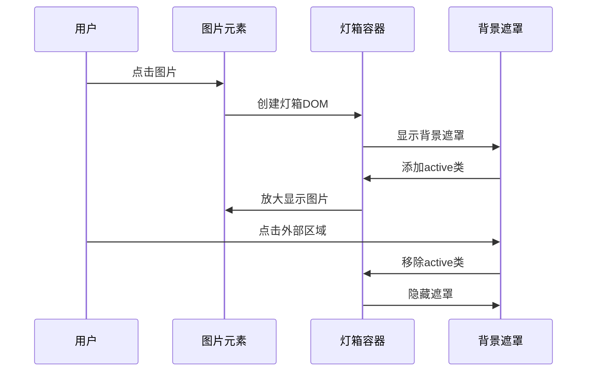
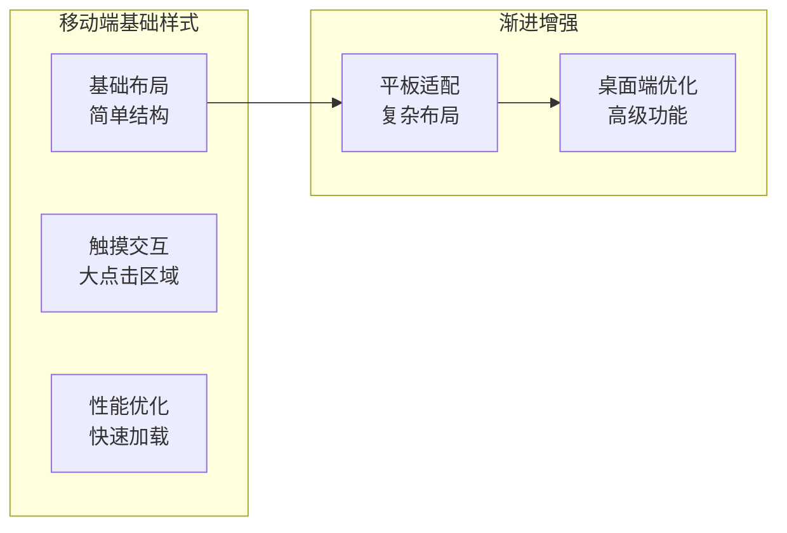
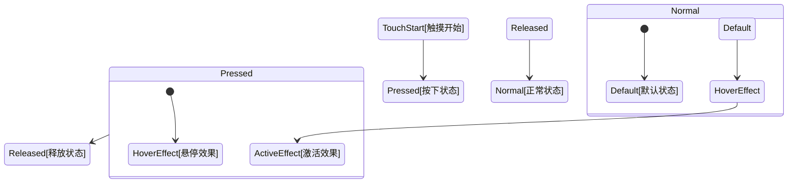

# 响应式设计实现

<cite>
**本文档引用的文件**
- [style.css](file://css/style.css)
- [index.html](file://index.html)
- [category.html](file://category.html)
- [article.html](file://article.html)
- [main.js](file://js/main.js)
- [data.js](file://js/data.js)
</cite>

## 目录
1. [项目概述](#项目概述)
2. [响应式设计架构](#响应式设计架构)
3. [断点策略与媒体查询](#断点策略与媒体查询)
4. [clamp()函数在响应式字体中的应用](#clamp函数在响应式字体中的应用)
5. [网格系统的响应式布局](#网格系统的响应式布局)
6. [Flexbox与Grid布局的响应式实现](#flexbox与grid布局的响应式实现)
7. [导航栏的移动端汉堡菜单](#导航栏的移动端汉堡菜单)
8. [图片和容器的响应式处理](#图片和容器的响应式处理)
9. [移动端优先设计原则](#移动端优先设计原则)
10. [触摸友好交互元素](#触摸友好交互元素)
11. [性能优化考虑](#性能优化考虑)
12. [总结](#总结)

## 项目概述

Hot-Site是一个现代化的静态网站项目，采用移动优先的设计理念，专注于技术、AI、游戏、音乐与艺术领域的优质内容展示。项目实现了完整的响应式设计体系，支持从桌面端到移动端的无缝体验。

## 响应式设计架构

### 整体架构设计

项目采用了基于CSS变量的响应式架构，通过统一的断点管理和灵活的布局系统实现跨设备兼容。



**图表来源**
- [style.css:1029-1106](file://css/style.css#L1029-L1106)
- [style.css:148-257](file://css/style.css#L148-L257)

## 断点策略与媒体查询

### 核心断点定义

项目采用简洁高效的断点策略，主要使用两个关键断点：

```mermaid
flowchart TD
Desktop[桌面端<br/>≥769px] --> MaxWidth[最大宽度<br/>1200px]
Tablet[平板端<br/>481-768px] --> TabletLayout[简化布局<br/>侧边栏隐藏]
Mobile[移动端<br/>≤480px] --> MobileLayout[极简布局<br/>全屏显示]
MaxWidth --> ResponsiveGrid[响应式网格]
TabletLayout --> ResponsiveGrid
MobileLayout --> ResponsiveGrid
ResponsiveGrid --> AutoFill[auto-fill算法]
ResponsiveGrid --> MinMax[minmax()函数]
```

**图表来源**
- [style.css:1029-1106](file://css/style.css#L1029-L1106)

### 断点实现细节

项目在CSS中定义了两个主要的媒体查询断点：

1. **768px断点**：用于平板和移动端的布局转换
2. **480px断点**：用于移动端的进一步优化

**章节来源**
- [style.css:1029-1106](file://css/style.css#L1029-L1106)

## clamp()函数在响应式字体中的应用

### clamp()函数的实现策略

项目广泛使用`clamp()`函数实现流式字体大小，确保在不同屏幕尺寸下获得最佳的阅读体验。

### 关键应用场景

#### Hero标题的clamp实现
```css
.hero-title {
  font-size: clamp(2.5rem, 6vw, 4rem);
  /* 最小值: 2.5rem */
  /* 优选值: 6vw (视口宽度的6%) */
  /* 最大值: 4rem */
}
```

#### 其他重要标题的clamp应用
- **Section标题**: `clamp(1.75rem, 3.5vw, 2.5rem)`
- **页面标题**: `clamp(2rem, 4vw, 3rem)`
- **文章标题**: `clamp(2rem, 4vw, 2.75rem)`

```mermaid
graph LR
subgraph "clamp()函数工作原理"
Min[最小字体大小] --> Preferred[首选字体大小]
Preferred --> Max[最大字体大小]
end
subgraph "视口宽度影响"
Viewport[视口宽度] --> VW[vw单位计算]
VW --> Clamp[clamp()约束]
end
Clamp --> Result[最终字体大小]
```

**图表来源**
- [style.css:287-294](file://css/style.css#L287-L294)
- [style.css:417-423](file://css/style.css#L417-L423)
- [style.css:653-658](file://css/style.css#L653-L658)
- [style.css:728-734](file://css/style.css#L728-L734)

### clamp()函数的优势

1. **流畅的缩放**: 避免传统媒体查询的跳跃式变化
2. **更好的可读性**: 在合理范围内自动调整字体大小
3. **维护简便**: 单一声明即可控制多个断点

**章节来源**
- [style.css:287-294](file://css/style.css#L287-L294)
- [style.css:417-423](file://css/style.css#L417-L423)
- [style.css:653-658](file://css/style.css#L653-L658)
- [style.css:728-734](file://css/style.css#L728-L734)

## 网格系统的响应式布局

### auto-fill算法的应用

项目在文章网格中使用`repeat(auto-fill, minmax())`模式，实现智能的网格布局：

```css
.article-grid {
  display: grid;
  grid-template-columns: repeat(auto-fill, minmax(340px, 1fr));
  gap: var(--space-xl);
}
```

### 网格系统的响应式特性



**图表来源**
- [style.css:431-436](file://css/style.css#L431-L436)

### 不同断点下的网格行为

| 设备类型 | 初始列宽 | 断点 | 最终列宽 |
|---------|---------|------|---------|
| 桌面端 | 340px | ≥769px | 340px |
| 平板端 | 340px | 481-768px | 200px |
| 移动端 | 340px | ≤480px | 100% |

**章节来源**
- [style.css:431-436](file://css/style.css#L431-L436)
- [style.css:1068-1101](file://css/style.css#L1068-L1101)

## Flexbox与Grid布局的响应式实现

### 导航栏的Flexbox布局

项目使用Flexbox实现导航栏的响应式布局：

```css
.nav-container {
  display: flex;
  align-items: center;
  justify-content: space-between;
}
```

### Hero区域的多层Flexbox布局



**图表来源**
- [style.css:260-285](file://css/style.css#L260-L285)
- [style.css:167-175](file://css/style.css#L167-L175)

### 玻璃态效果的实现

项目使用CSS变量和backdrop-filter实现现代化的玻璃态效果：

```css
.navbar {
  background: var(--glass-bg);
  backdrop-filter: blur(20px);
  -webkit-backdrop-filter: blur(20px);
}
```

**章节来源**
- [style.css:148-165](file://css/style.css#L148-L165)
- [style.css:260-285](file://css/style.css#L260-L285)

## 导航栏的移动端汉堡菜单

### 汉堡菜单的实现机制

项目实现了完整的移动端导航解决方案：



**图表来源**
- [style.css:229-257](file://css/style.css#L229-L257)
- [main.js:60-77](file://js/main.js#L60-L77)

### 汉堡菜单的CSS实现

```css
.hamburger {
  display: none;
  flex-direction: column;
  gap: 5px;
  padding: var(--space-sm);
  z-index: 1001;
}

.hamburger.active span:nth-child(1) {
  transform: rotate(45deg) translate(5px, 5px);
}
```

### JavaScript交互逻辑



**图表来源**
- [main.js:60-77](file://js/main.js#L60-L77)

**章节来源**
- [style.css:229-257](file://css/style.css#L229-L257)
- [main.js:60-77](file://js/main.js#L60-L77)

## 图片和容器的响应式处理

### aspect-ratio属性的应用

项目在图片容器中使用`aspect-ratio`属性确保图片的正确比例：

```css
.article-card-cover {
  aspect-ratio: 16 / 10;
}

.article-detail-cover {
  aspect-ratio: 16 / 9;
}
```

### object-fit的图片处理

```css
.article-card-cover img {
  width: 100%;
  height: 100%;
  object-fit: cover;
}
```

### 图片缩放动画

```css
.article-card:hover .article-card-cover img {
  transform: scale(1.05);
}
```



**图表来源**
- [style.css:457-473](file://css/style.css#L457-L473)
- [style.css:736-749](file://css/style.css#L736-L749)

### Lightbox图片查看器

项目实现了完整的图片灯箱功能：



**图表来源**
- [main.js:318-371](file://js/main.js#L318-L371)

**章节来源**
- [style.css:457-473](file://css/style.css#L457-L473)
- [style.css:736-749](file://css/style.css#L736-L749)
- [main.js:318-371](file://js/main.js#L318-L371)

## 移动端优先设计原则

### 移动端优先的实现策略

项目严格遵循移动端优先的设计原则：



### 关键移动端优化措施

1. **触摸友好的点击区域**: 至少44px × 44px
2. **简化的导航结构**: 移动端使用汉堡菜单
3. **优化的图片加载**: 使用`loading="lazy"`和适当的尺寸
4. **流畅的动画效果**: 避免复杂的3D变换

**章节来源**
- [style.css:1029-1106](file://css/style.css#L1029-L1106)
- [main.js:102-113](file://js/main.js#L102-L113)

## 触摸友好交互元素

### 触摸目标的尺寸优化

项目确保所有交互元素都具有足够的触摸面积：

```css
/* 按钮和链接的触摸目标 */
.btn, .nav-link, .filter-btn {
  min-height: 44px;
  min-width: 44px;
  padding: var(--space-md) var(--space-lg);
}
```

### 触摸反馈机制



### 无障碍性支持

项目实现了完整的无障碍性支持：

- **语义化HTML结构**
- **ARIA标签和属性**
- **键盘导航支持**
- **屏幕阅读器兼容**

**章节来源**
- [index.html:38-51](file://index.html#L38-L51)
- [category.html:36-49](file://category.html#L36-L49)
- [article.html:36-49](file://article.html#L36-L49)

## 性能优化考虑

### CSS变量的性能优势

项目使用CSS变量实现主题切换和响应式设计，避免重复的样式声明：

```css
:root {
  --container-max: 1200px;
  --navbar-height: 72px;
  --space-xl: 2rem;
  --transition-base: 0.3s ease;
}
```

### 关键帧动画优化

项目使用CSS动画而非JavaScript动画，确保流畅的性能表现：

```css
@keyframes float {
  0%, 100% { transform: translateY(0) rotate(25deg); }
  50%      { transform: translateY(-20px) rotate(25deg); }
}
```

### 图片优化策略

- **懒加载**: 使用`loading="lazy"`减少初始加载时间
- **响应式图片**: 提供多种尺寸的图片源
- **格式优化**: 使用现代图片格式如WebP

## 总结

Hot-Site项目展现了现代响应式设计的最佳实践，通过以下核心要素实现了优秀的跨设备体验：

### 技术亮点

1. **智能的断点策略**: 使用两个关键断点覆盖主要设备类型
2. **流式字体系统**: clamp()函数确保最佳的可读性
3. **灵活的网格布局**: auto-fill算法实现自适应网格
4. **现代化的交互设计**: 汉堡菜单和图片灯箱提升用户体验
5. **性能优化**: CSS变量和关键帧动画确保流畅性能

### 设计原则

- **移动优先**: 从移动端开始，逐步增强到桌面端
- **用户中心**: 注重触摸友好性和无障碍性
- **性能导向**: 优化加载速度和交互响应
- **可维护性**: 统一的设计系统和清晰的代码结构

这个响应式设计实现为类似的技术博客和内容展示网站提供了完整的参考模板，展示了如何在保持视觉美感的同时实现真正的跨设备兼容性。