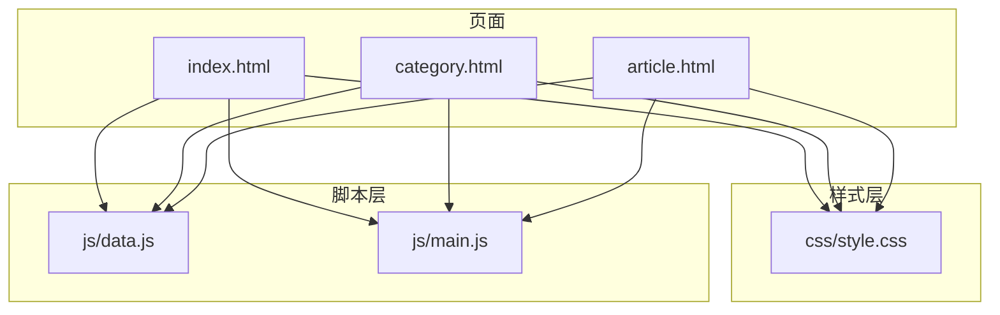
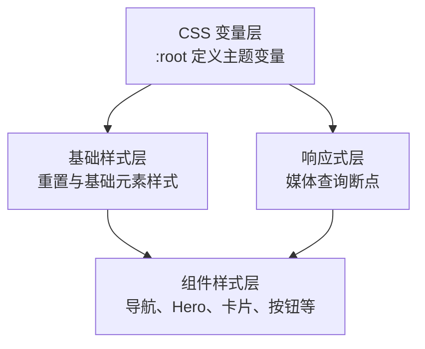
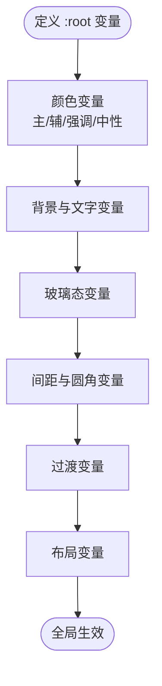
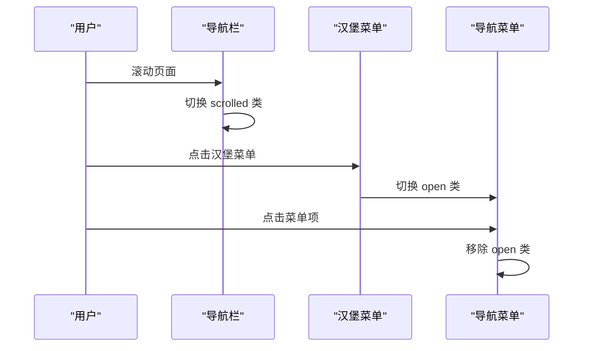
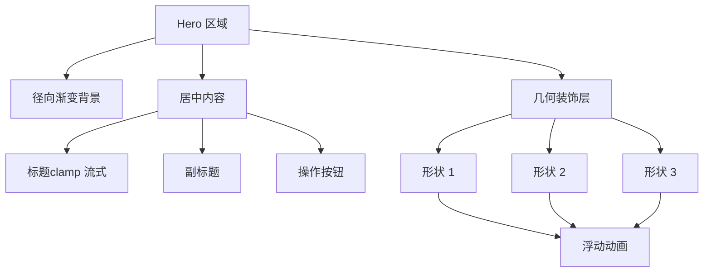
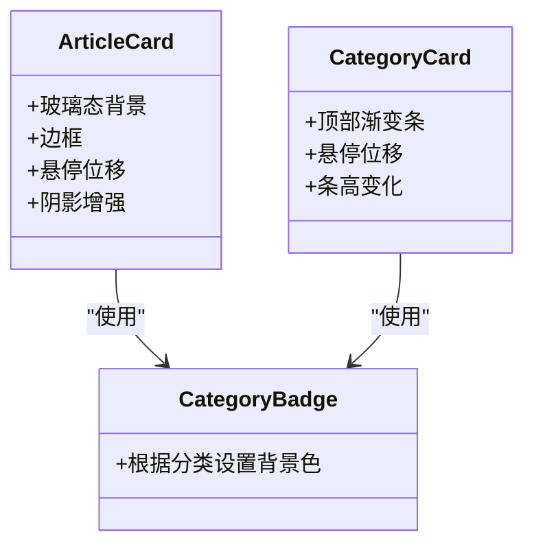
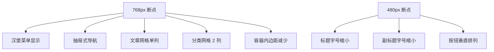
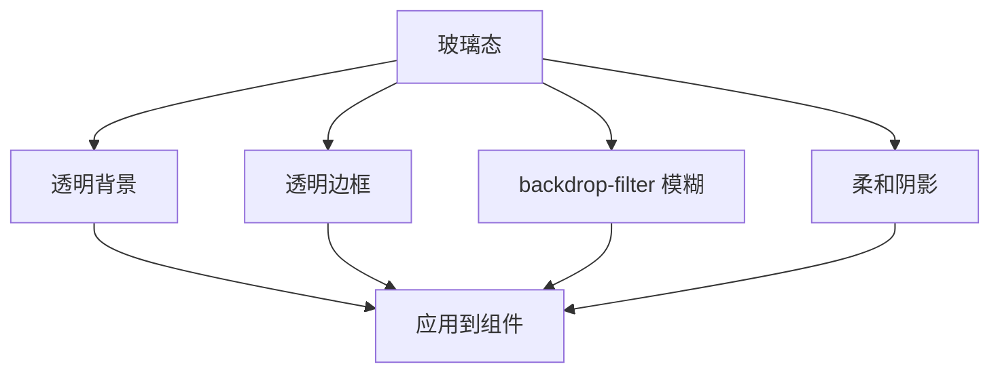
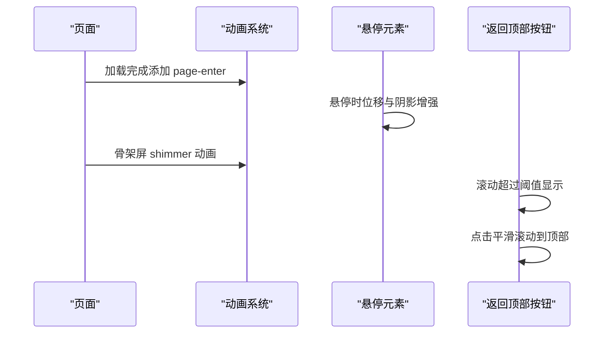
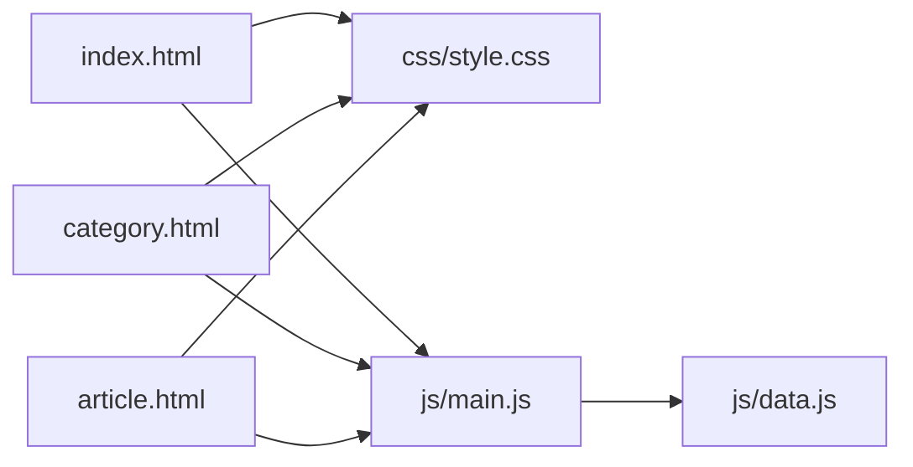

# 样式系统设计

<cite>
**本文档引用的文件**
- [css/style.css](file://css/style.css)
- [index.html](file://index.html)
- [category.html](file://category.html)
- [article.html](file://article.html)
- [js/main.js](file://js/main.js)
- [js/data.js](file://js/data.js)
</cite>

## 目录
1. [简介](#简介)
2. [项目结构](#项目结构)
3. [核心组件](#核心组件)
4. [架构总览](#架构总览)
5. [详细组件分析](#详细组件分析)
6. [依赖关系分析](#依赖关系分析)
7. [性能考量](#性能考量)
8. [故障排除指南](#故障排除指南)
9. [结论](#结论)
10. [附录](#附录)

## 简介
本设计文档围绕 Hot-Site 项目的样式系统展开，重点阐释基于 CSS 自定义属性的主题系统架构、响应式设计策略、玻璃拟态效果实现、动画与过渡设计原则，以及样式组织最佳实践。文档同时提供主题定制指南与品牌色彩应用方法，帮助开发者在不修改 HTML 结构的前提下，实现一致且可维护的视觉体验。

## 项目结构
Hot-Site 采用“HTML + 单一 CSS + 轻量 JavaScript”的极简架构：
- HTML 页面负责语义化结构与可访问性属性
- CSS 通过自定义属性集中管理主题变量，覆盖全局重置、基础样式、组件样式与响应式断点
- JavaScript 负责导航交互、页面切换、文章渲染与轻量动画控制

图表来源
- [index.html:1-190](file://index.html#L1-L190)
- [category.html:1-103](file://category.html#L1-L103)
- [article.html:1-107](file://article.html#L1-L107)
- [css/style.css:1-1166](file://css/style.css#L1-L1166)
- [js/data.js:1-158](file://js/data.js#L1-L158)
- [js/main.js:1-461](file://js/main.js#L1-L461)

章节来源
- [index.html:1-190](file://index.html#L1-L190)
- [category.html:1-103](file://category.html#L1-L103)
- [article.html:1-107](file://article.html#L1-L107)
- [css/style.css:1-1166](file://css/style.css#L1-L1166)

## 核心组件
- 主题变量系统：以 CSS 自定义属性为核心，统一管理主色、辅色、强调色、中性色、背景、文字、玻璃态、间距、圆角、过渡与布局参数
- 基础样式与重置：统一字体、行高、颜色、链接、图片与列表样式
- 组件样式：导航栏、Hero 区域、按钮、区块、文章卡片网格、分类卡片网格、文章详情、页脚等
- 响应式断点：针对移动端与小屏设备的布局调整
- 动画与过渡：页面入场动画、元素 hover 效果、骨架屏加载、滚动回到顶部等

章节来源
- [css/style.css:7-78](file://css/style.css#L7-L78)
- [css/style.css:80-139](file://css/style.css#L80-L139)
- [css/style.css:140-1028](file://css/style.css#L140-L1028)
- [css/style.css:1029-1166](file://css/style.css#L1029-L1166)

## 架构总览
样式系统采用“变量驱动 + 组件化 + 响应式”的三层架构：
- 变量层：集中定义主题变量，确保全局一致性
- 组件层：以类名组织样式，遵循语义化命名，便于复用与维护
- 响应式层：在关键断点处覆盖变量与布局，保证移动端体验

图表来源
- [css/style.css:7-78](file://css/style.css#L7-L78)
- [css/style.css:80-139](file://css/style.css#L80-L139)
- [css/style.css:140-1028](file://css/style.css#L140-L1028)
- [css/style.css:1029-1166](file://css/style.css#L1029-L1166)

## 详细组件分析

### 主题变量系统
- 颜色体系：主色（Indigo）、辅色（Cyan）、强调色（Amber）、中性色（Gray 50-900）与品牌渐变色
- 背景与文字：主背景、次背景、深色背景与主/次/柔和文字色
- 玻璃态：背景透明度、边框透明度与阴影组合
- 间距与圆角：从极小到极大的多级间距与圆角半径
- 过渡：快、中、慢三档过渡时间与缓动函数
- 布局：容器最大宽度、导航栏高度

图表来源
- [css/style.css:7-78](file://css/style.css#L7-L78)

章节来源
- [css/style.css:7-78](file://css/style.css#L7-L78)

### 基础样式与重置
- 全局重置：统一 margin/padding，box-sizing
- 基础排版：字体族、字号、行高、滚动行为与抗锯齿
- 链接与图片：继承颜色、无下划线、自适应宽高
- 列表：去除默认样式

章节来源
- [css/style.css:80-129](file://css/style.css#L80-L129)

### 导航栏与汉堡菜单
- 固定定位与玻璃态背景，支持滚动时浅色背景与阴影
- 汉堡菜单在移动端显示，点击切换菜单开合
- 导航链接悬停与激活态的颜色与背景变化

图表来源
- [css/style.css:147-165](file://css/style.css#L147-L165)
- [css/style.css:229-257](file://css/style.css#L229-L257)
- [js/main.js:44-77](file://js/main.js#L44-L77)

章节来源
- [css/style.css:147-165](file://css/style.css#L147-L165)
- [css/style.css:229-257](file://css/style.css#L229-L257)
- [js/main.js:44-77](file://js/main.js#L44-L77)

### Hero 区域与几何装饰
- Hero 背景使用径向渐变营造发光效果
- 标题与副标题使用 clamp 实现流式字体大小
- 几何装饰形状使用动画实现浮动效果

图表来源
- [css/style.css:259-366](file://css/style.css#L259-L366)

章节来源
- [css/style.css:259-366](file://css/style.css#L259-L366)

### 按钮系统
- 主按钮：渐变背景与发光阴影
- 次按钮：玻璃态背景与 backdrop-filter，悬停时提升层级与边框色
- 统一圆角与过渡时长

章节来源
- [css/style.css:368-405](file://css/style.css#L368-L405)

### 文章卡片网格与分类卡片网格
- 文章卡片：玻璃态背景、边框、悬停位移与阴影增强
- 分类卡片：顶部渐变条、悬停位移与条高变化
- 分类徽章：根据分类动态应用背景色

图表来源
- [css/style.css:431-548](file://css/style.css#L431-L548)
- [css/style.css:550-627](file://css/style.css#L550-L627)
- [css/style.css:475-511](file://css/style.css#L475-L511)

章节来源
- [css/style.css:431-548](file://css/style.css#L431-L548)
- [css/style.css:550-627](file://css/style.css#L550-L627)
- [css/style.css:475-511](file://css/style.css#L475-L511)

### 文章详情页
- 头部元信息：分类徽章与日期
- 封面图：宽高比与溢出处理
- 文章内容：标题、段落、列表、引用、代码块、表格、图片等样式

章节来源
- [css/style.css:697-880](file://css/style.css#L697-L880)

### 页脚
- 深色背景与浅色文字
- 品牌标识与描述
- 底部链接与版权信息

章节来源
- [css/style.css:969-1027](file://css/style.css#L969-L1027)

### 响应式设计策略
- 断点设置：768px 与 480px
- 移动端汉堡菜单与抽屉式导航
- 网格布局在小屏时降级为单列
- Hero 区域最小高度与按钮排列调整
- 分类网格在更小屏幕时两列展示

图表来源
- [css/style.css:1029-1106](file://css/style.css#L1029-L1106)

章节来源
- [css/style.css:1029-1106](file://css/style.css#L1029-L1106)

### 玻璃拟态效果实现
- 背景透明度与 backdrop-filter 模糊
- 边框透明度与阴影组合
- 组件级应用：导航栏、按钮、卡片、分类徽章、Lightbox 背景

图表来源
- [css/style.css:48-51](file://css/style.css#L48-L51)
- [css/style.css:155-165](file://css/style.css#L155-L165)
- [css/style.css:395-405](file://css/style.css#L395-L405)
- [css/style.css:439-455](file://css/style.css#L439-L455)
- [css/style.css:558-567](file://css/style.css#L558-L567)
- [css/style.css:880-912](file://css/style.css#L880-L912)

章节来源
- [css/style.css:48-51](file://css/style.css#L48-L51)
- [css/style.css:155-165](file://css/style.css#L155-L165)
- [css/style.css:395-405](file://css/style.css#L395-L405)
- [css/style.css:439-455](file://css/style.css#L439-L455)
- [css/style.css:558-567](file://css/style.css#L558-L567)
- [css/style.css:880-912](file://css/style.css#L880-L912)

### 动画与过渡效果设计
- 页面入场动画：淡入与轻微位移动画
- 元素 hover 效果：位移、阴影与边框变化
- 骨架屏：渐变扫描动画
- 返回顶部：显隐与位移动画
- 打字机动画：省略号闪烁

图表来源
- [css/style.css:130-139](file://css/style.css#L130-L139)
- [css/style.css:449-455](file://css/style.css#L449-L455)
- [css/style.css:1108-1119](file://css/style.css#L1108-L1119)
- [css/style.css:1121-1153](file://css/style.css#L1121-L1153)
- [css/style.css:1155-1165](file://css/style.css#L1155-L1165)

章节来源
- [css/style.css:130-139](file://css/style.css#L130-L139)
- [css/style.css:449-455](file://css/style.css#L449-L455)
- [css/style.css:1108-1119](file://css/style.css#L1108-L1119)
- [css/style.css:1121-1153](file://css/style.css#L1121-L1153)
- [css/style.css:1155-1165](file://css/style.css#L1155-L1165)

### 样式组织最佳实践
- 变量优先：所有颜色、间距、圆角、过渡均来自 :root 变量
- 组件化：每个组件独立样式块，避免全局污染
- 响应式分离：断点样式单独覆盖，保持主样式简洁
- 可访问性：为导航与交互元素提供 ARIA 属性与键盘支持
- 可维护性：语义化类名，避免过度嵌套与特殊性竞争

章节来源
- [css/style.css:7-78](file://css/style.css#L7-L78)
- [css/style.css:140-1028](file://css/style.css#L140-L1028)
- [index.html:30-53](file://index.html#L30-L53)
- [category.html:28-51](file://category.html#L28-L51)
- [article.html:28-51](file://article.html#L28-L51)

### 主题定制指南与品牌色彩应用
- 主色与辅色：用于导航、按钮、卡片边框与徽章
- 强调色：用于特定内容或高亮元素
- 中性色：用于背景、文字与边框
- 玻璃态：用于需要层次感但不过分厚重的区域
- 品牌色彩应用：导航徽标、分类徽章、按钮与卡片顶部条纹

章节来源
- [css/style.css:10-25](file://css/style.css#L10-L25)
- [css/style.css:26-47](file://css/style.css#L26-L47)
- [css/style.css:48-51](file://css/style.css#L48-L51)
- [css/style.css:191-205](file://css/style.css#L191-L205)
- [css/style.css:488-511](file://css/style.css#L488-L511)
- [css/style.css:589-593](file://css/style.css#L589-L593)

## 依赖关系分析
样式系统与页面结构的耦合关系：
- HTML 页面通过类名引用 CSS 组件样式
- JavaScript 控制导航状态、页面切换与交互反馈
- 数据模块提供文章与分类信息，驱动页面内容渲染

图表来源
- [index.html:1-190](file://index.html#L1-L190)
- [category.html:1-103](file://category.html#L1-L103)
- [article.html:1-107](file://article.html#L1-L107)
- [css/style.css:1-1166](file://css/style.css#L1-L1166)
- [js/main.js:1-461](file://js/main.js#L1-L461)
- [js/data.js:1-158](file://js/data.js#L1-L158)

章节来源
- [index.html:1-190](file://index.html#L1-L190)
- [category.html:1-103](file://category.html#L1-L103)
- [article.html:1-107](file://article.html#L1-L107)
- [css/style.css:1-1166](file://css/style.css#L1-L1166)
- [js/main.js:1-461](file://js/main.js#L1-L461)
- [js/data.js:1-158](file://js/data.js#L1-L158)

## 性能考量
- CSS 变量集中管理，减少重复声明与计算
- 响应式断点精简，避免过多媒体查询
- 图片懒加载与骨架屏优化首屏体验
- 过渡与动画使用 transform 与 opacity，避免强制重排
- Lightbox 使用固定定位与缩放过渡，降低复杂度

## 故障排除指南
- 导航栏不随滚动变化：检查滚动事件与类名切换逻辑
- 移动端菜单无法关闭：确认 open 类切换与 body 溢出控制
- 文章卡片点击无反应：检查卡片点击事件与跳转逻辑
- Lightbox 无法打开：确认图片点击事件与 overlay DOM 创建
- 返回顶部按钮不出现：检查滚动阈值与可见类切换

章节来源
- [js/main.js:44-77](file://js/main.js#L44-L77)
- [js/main.js:101-116](file://js/main.js#L101-L116)
- [js/main.js:318-371](file://js/main.js#L318-L371)
- [js/main.js:375-403](file://js/main.js#L375-L403)

## 结论
Hot-Site 的样式系统以 CSS 自定义属性为核心，结合组件化与响应式设计，实现了统一、灵活且高性能的视觉体验。通过玻璃拟态、流式排版与细腻的过渡动画，项目在桌面与移动端均具备良好的可用性与品牌一致性。建议在后续迭代中进一步拆分样式模块、引入工具化构建与测试，以提升可维护性与扩展性。

## 附录
- 变量清单与使用位置可参考 :root 定义与各组件样式块
- 响应式断点与覆盖规则集中在媒体查询部分
- 交互行为由 JavaScript 控制，样式与逻辑解耦，便于维护