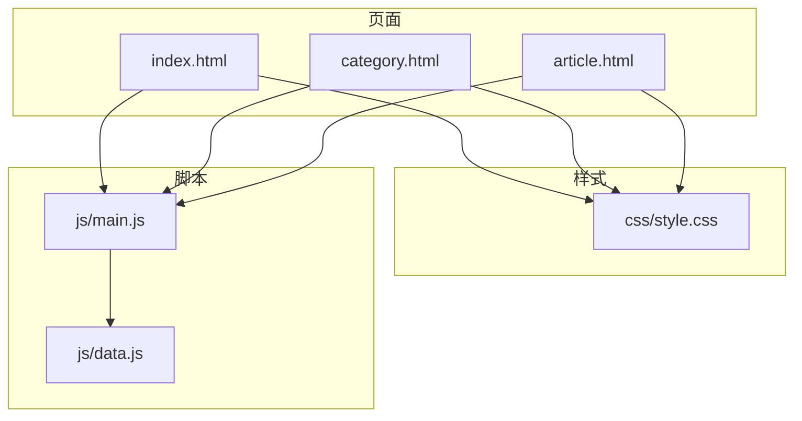
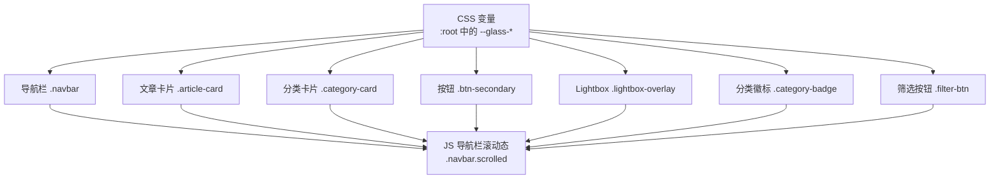
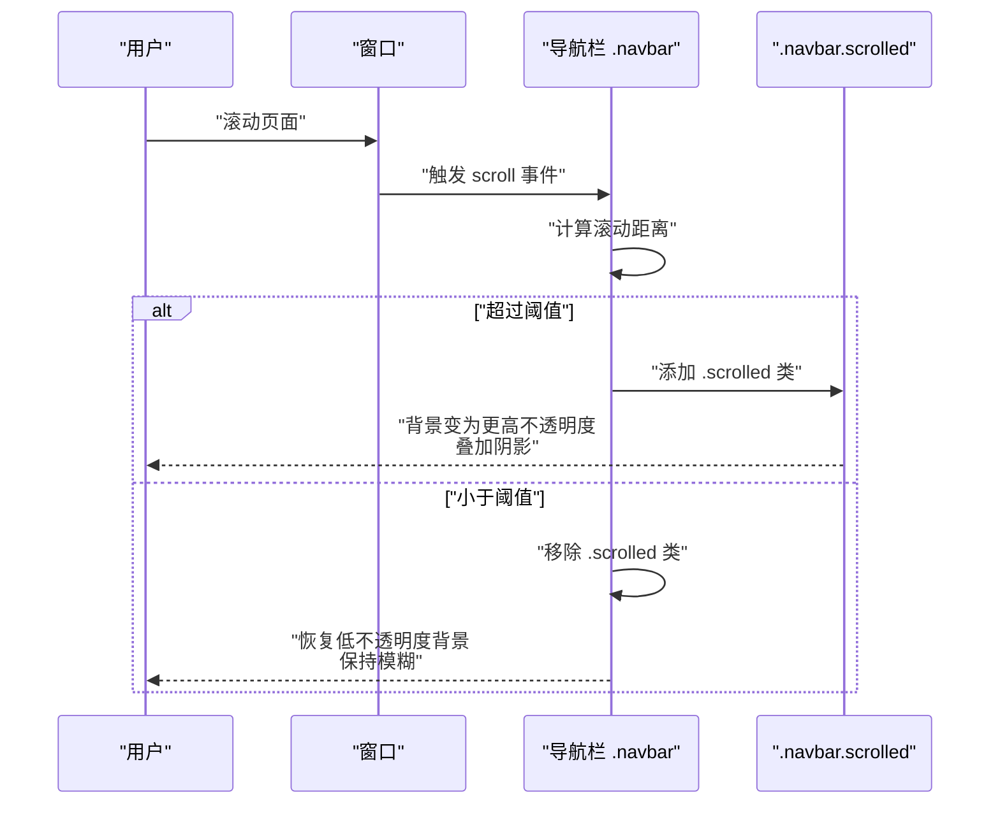
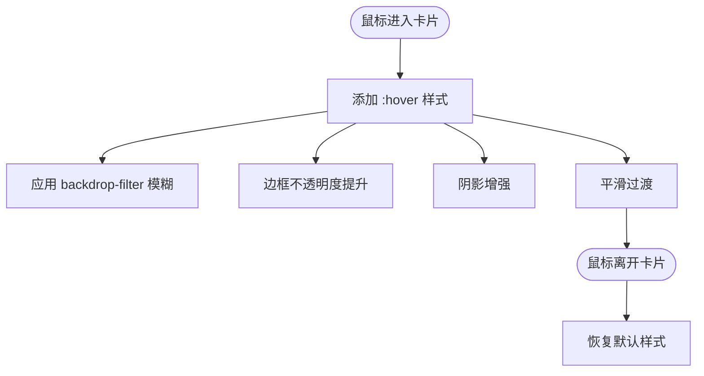
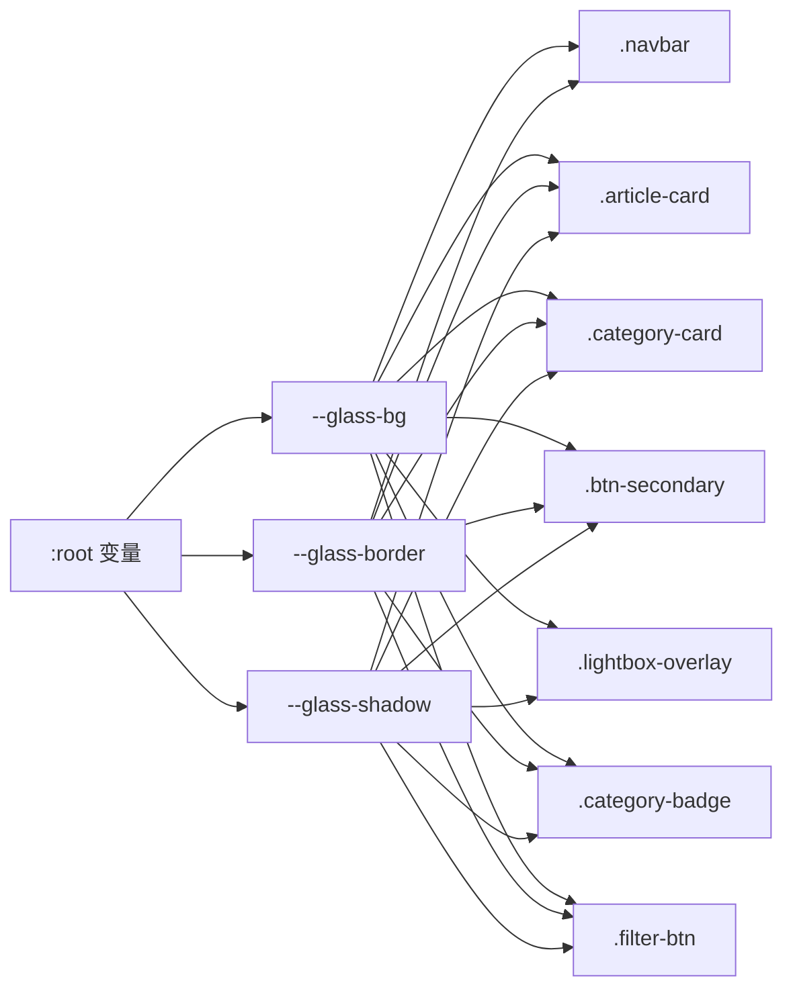

# 玻璃拟态效果

<cite>
**本文引用的文件**
- [style.css](file://css/style.css)
- [index.html](file://index.html)
- [category.html](file://category.html)
- [article.html](file://article.html)
- [main.js](file://js/main.js)
- [data.js](file://js/data.js)
</cite>

## 目录
1. [简介](#简介)
2. [项目结构](#项目结构)
3. [核心组件](#核心组件)
4. [架构总览](#架构总览)
5. [详细组件分析](#详细组件分析)
6. [依赖关系分析](#依赖关系分析)
7. [性能考量](#性能考量)
8. [故障排查指南](#故障排查指南)
9. [结论](#结论)
10. [附录](#附录)

## 简介
本文件聚焦于 Hot-Site 项目中玻璃拟态（Glassmorphism）效果的实现与应用，系统性解释以下主题：
- backdrop-filter 属性的使用，包括 blur() 滤镜在导航栏、文章卡片、分类卡片、按钮与 Lightbox 等组件中的应用
- 透明度与边框的组合使用，如 --glass-bg、--glass-border 变量的定义与视觉效果
- 阴影系统的多层次设计，包括 --glass-shadow 的 rgba 值配置与视觉层次
- 现代浏览器兼容性处理，特别是 -webkit-backdrop-filter 前缀的使用
- 不同组件中的玻璃拟态应用实例与最佳实践
- 性能优化建议与参数选择建议（模糊半径、透明度）

## 项目结构
Hot-Site 采用静态站点结构，核心样式集中在 css/style.css，HTML 页面分别承载首页、分类页与文章详情页，JavaScript 负责导航交互、页面切换与内容渲染。

图表来源
- [index.html](file://index.html)
- [category.html](file://category.html)
- [article.html](file://article.html)
- [style.css](file://css/style.css)
- [main.js](file://js/main.js)
- [data.js](file://js/data.js)

章节来源
- [index.html](file://index.html)
- [category.html](file://category.html)
- [article.html](file://article.html)
- [style.css](file://css/style.css)

## 核心组件
本项目中与玻璃拟态直接相关的核心组件与样式类包括：
- 导航栏：.navbar，包含固定定位、背景、backdrop-filter 模糊、边框与滚动态样式
- 文章卡片：.article-card，包含背景、模糊、边框、悬停阴影与过渡
- 分类卡片：.category-card，包含背景、模糊、边框、悬停阴影与渐变顶条
- 按钮：.btn-secondary，包含背景、模糊、边框与悬停态
- Lightbox：.lightbox-overlay，包含背景与 backdrop-filter 模糊
- 分类徽标：.category-badge，包含背景与 backdrop-filter 模糊
- 筛选按钮：.filter-btn，包含背景与边框
- 页脚：.footer，作为玻璃容器的背景对比参考

章节来源
- [style.css](file://css/style.css)

## 架构总览
玻璃拟态效果在本项目中的实现遵循“变量驱动 + 组件化样式 + 交互增强”的架构模式：
- 变量层：在 :root 中集中定义 --glass-bg、--glass-border、--glass-shadow 等变量，统一控制透明度、边框与阴影
- 组件层：各组件类名直接使用上述变量，确保视觉一致性
- 交互层：通过 JavaScript 控制导航栏滚动态样式切换，配合 CSS 过渡实现平滑动画
- 兼容层：对支持 -webkit-backdrop-filter 的浏览器提供前缀，保证跨浏览器可用性

图表来源
- [style.css](file://css/style.css)
- [main.js](file://js/main.js)

章节来源
- [style.css](file://css/style.css)
- [main.js](file://js/main.js)

## 详细组件分析

### 导航栏玻璃拟态
- 背景与模糊：使用 --glass-bg 作为背景色，并通过 backdrop-filter: blur() 实现背景虚化；同时提供 -webkit-backdrop-filter 前缀以兼容旧版 WebKit 浏览器
- 边框：使用 --glass-border 作为半透明边框，提升边缘清晰度
- 滚动态：当用户滚动超过阈值时，导航栏添加 .scrolled 类，切换为更高不透明度背景与阴影，保持可读性与层级感
- 过渡：整体使用 CSS 过渡，使滚动态切换顺滑自然

图表来源
- [style.css](file://css/style.css)
- [main.js](file://js/main.js)

章节来源
- [style.css](file://css/style.css)
- [main.js](file://js/main.js)

### 文章卡片玻璃拟态
- 背景与模糊：使用 --glass-bg 与 backdrop-filter: blur()，结合 --glass-border 形成半透明边框
- 悬停态：hover 时增加阴影与边框不透明度，形成“浮起”与“聚焦”的视觉反馈
- 过渡：统一使用 CSS 过渡，确保动画流畅

图表来源
- [style.css](file://css/style.css)

章节来源
- [style.css](file://css/style.css)

### 分类卡片玻璃拟态
- 背景与模糊：与文章卡片一致，使用 --glass-bg 与 backdrop-filter: blur()
- 顶部渐变条：通过伪元素 ::before 添加高度变化的渐变条，hover 时拉高以强调层级
- 悬停态：hover 时增加阴影，提升交互反馈

章节来源
- [style.css](file://css/style.css)

### 按钮玻璃拟态
- .btn-secondary 使用 --glass-bg 与 backdrop-filter: blur()，并在 hover 时提升背景与边框不透明度，实现“按下”反馈
- 该按钮常用于首页的“浏览全部”等次要操作，保持与整体玻璃风格一致

章节来源
- [style.css](file://css/style.css)

### Lightbox 玻璃拟态
- .lightbox-overlay 使用半透明深色背景与 backdrop-filter: blur()，在全屏展示图片时提供柔和的背景虚化
- 支持点击遮罩或按 ESC 键关闭，关闭时通过过渡动画隐藏

章节来源
- [style.css](file://css/style.css)
- [main.js](file://js/main.js)

### 分类徽标玻璃拟态
- .category-badge 在文章卡片封面与详情页中使用，背景为半透明色，配合 backdrop-filter: blur() 提升可读性
- 不同分类使用不同的半透明底色，便于识别

章节来源
- [style.css](file://css/style.css)

### 筛选按钮玻璃拟态
- .filter-btn 使用 --glass-bg 与边框，hover 时改变边框颜色与文字颜色，active 时切换为主色调，保持与导航栏一致的玻璃风格

章节来源
- [style.css](file://css/style.css)

## 依赖关系分析
- 样式依赖：所有玻璃拟态组件均依赖 :root 中的 --glass-* 变量，确保全局一致性
- 交互依赖：导航栏滚动态切换依赖 JavaScript 对 .navbar.scrolled 的增删
- 组件耦合：文章卡片、分类卡片、按钮、Lightbox、分类徽标、筛选按钮共享相同的变量与模糊策略，耦合度低、内聚性强
- 兼容性依赖：-webkit-backdrop-filter 与 backdrop-filter 并用，避免部分浏览器不支持导致的回退问题

图表来源
- [style.css](file://css/style.css)

章节来源
- [style.css](file://css/style.css)

## 性能考量
- 模糊半径选择
  - 导航栏：blur(20px)，在保持背景虚化的前提下尽量降低 GPU 压力
  - 文章卡片：blur(12px)，兼顾可读性与性能
  - 分类徽标：blur(8px)，用于小面积覆盖物，避免过度模糊
  - Lightbox：blur(8px)，在全屏图片展示时保持背景虚化但不过度消耗资源
- 透明度与边框
  - --glass-bg 与 --glass-border 均采用半透明值，既能维持通透感，又能减少重绘成本
- 过渡与动画
  - 统一使用 CSS 过渡，避免 JavaScript 动画带来的掉帧风险
- 兼容性
  - 同时提供 -webkit-backdrop-filter 与 backdrop-filter，确保在较老版本 Safari/Chrome 上也能正常工作
- 图片与布局
  - 卡片中的图片使用 object-fit: cover 与懒加载，减少重排与重绘
- 建议
  - 在低端设备上适当提高模糊半径阈值或减少模糊区域数量
  - 对于长列表，优先考虑虚拟滚动与占位骨架，减少一次性渲染的模糊元素数量

章节来源
- [style.css](file://css/style.css)
- [main.js](file://js/main.js)

## 故障排查指南
- 模糊效果不生效
  - 检查是否正确引入 -webkit-backdrop-filter 前缀
  - 确认父容器存在足够高的 z-index 与可见背景，否则模糊可能不可见
- 边框不清晰
  - 检查 --glass-border 是否为半透明白色，必要时调整透明度
- 滚动时导航栏样式异常
  - 确认滚动监听是否正确触发，检查 .navbar.scrolled 类的切换逻辑
- Lightbox 无法关闭
  - 检查点击遮罩与 ESC 事件绑定是否正常，确认 active 类的切换

章节来源
- [style.css](file://css/style.css)
- [main.js](file://js/main.js)

## 结论
Hot-Site 项目通过统一的 CSS 变量体系与组件化样式，成功实现了跨组件的一致玻璃拟态效果。backdrop-filter 与半透明边框、阴影的组合，既保证了视觉层次，又兼顾了可读性与性能。配合 JavaScript 的滚动态切换与交互增强，整体用户体验流畅自然。建议在后续迭代中持续关注性能表现，并根据设备能力动态调整模糊半径与透明度参数。

## 附录
- 变量定义位置：:root 中的 --glass-bg、--glass-border、--glass-shadow
- 应用范围：导航栏、文章卡片、分类卡片、按钮、Lightbox、分类徽标、筛选按钮
- 兼容性：同时提供 -webkit-backdrop-filter 与 backdrop-filter