# 组件样式架构

<cite>
**本文档引用的文件**
- [css/style.css](file://css/style.css)
- [index.html](file://index.html)
- [category.html](file://category.html)
- [article.html](file://article.html)
- [js/main.js](file://js/main.js)
- [js/data.js](file://js/data.js)
</cite>

## 目录
1. [简介](#简介)
2. [项目结构](#项目结构)
3. [核心组件](#核心组件)
4. [架构概览](#架构概览)
5. [详细组件分析](#详细组件分析)
6. [依赖关系分析](#依赖关系分析)
7. [性能考虑](#性能考虑)
8. [故障排除指南](#故障排除指南)
9. [结论](#结论)

## 简介

Hot-Site 是一个现代化的静态网站项目，采用模块化样式架构设计。该项目实现了完整的组件样式系统，包括导航栏、文章卡片、分类卡片、按钮等核心UI组件。通过CSS变量、BEM命名规范和响应式设计，构建了一个具有良好可维护性和可扩展性的样式体系。

## 项目结构

项目采用清晰的文件组织结构，样式与功能分离，便于维护和扩展：

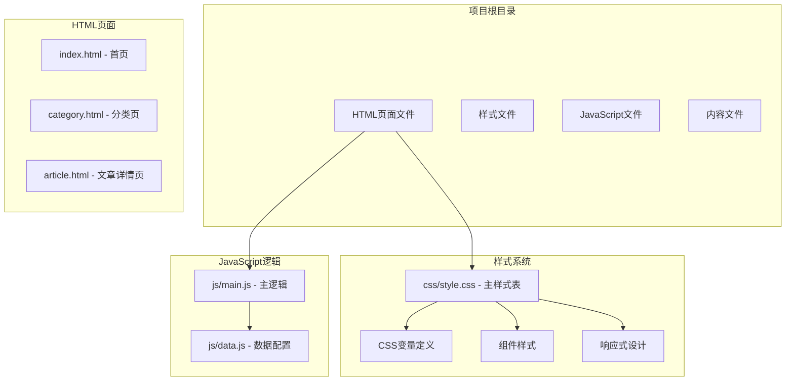

**图表来源**
- [index.html:1-190](file://index.html#L1-L190)
- [css/style.css:1-1166](file://css/style.css#L1-L1166)
- [js/main.js:1-461](file://js/main.js#L1-L461)

**章节来源**
- [index.html:1-190](file://index.html#L1-L190)
- [category.html:1-103](file://category.html#L1-L103)
- [article.html:1-107](file://article.html#L1-L107)

## 核心组件

### CSS变量系统

项目采用全局CSS变量系统，统一管理颜色、间距、圆角等设计令牌：

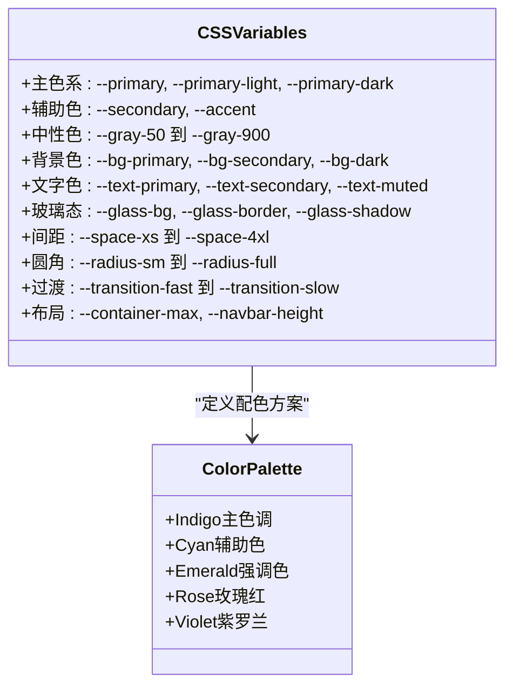

**图表来源**
- [css/style.css:8-78](file://css/style.css#L8-L78)

### 导航栏组件 (.navbar)

导航栏是项目的核心组件，实现了动态状态管理和响应式设计：

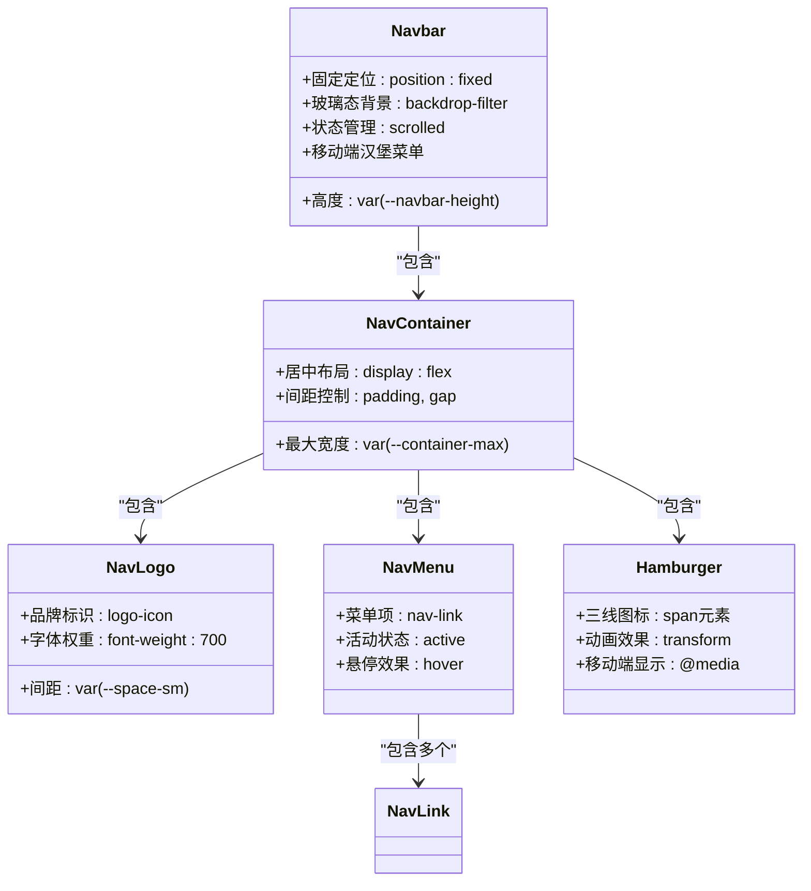

**图表来源**
- [css/style.css:147-257](file://css/style.css#L147-L257)
- [index.html:30-53](file://index.html#L30-L53)

### 文章卡片组件 (.article-card)

文章卡片采用卡片式设计，支持悬停动画和分类徽章：

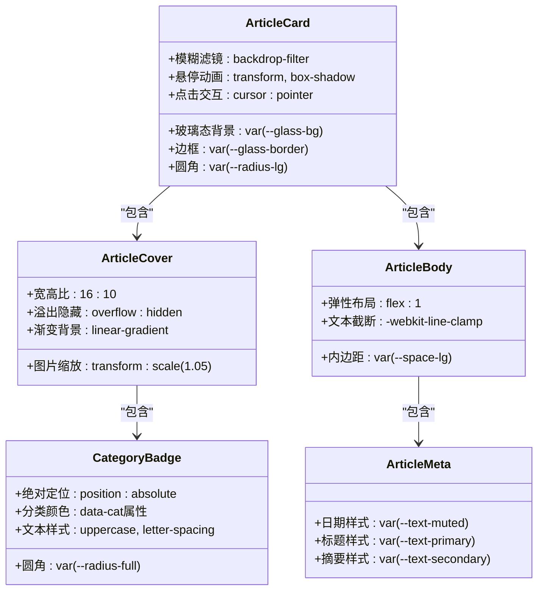

**图表来源**
- [css/style.css:438-548](file://css/style.css#L438-L548)
- [index.html:86-110](file://index.html#L86-L110)

### 分类卡片组件 (.category-card)

分类卡片提供分类浏览功能，支持悬停动画和分类标识：

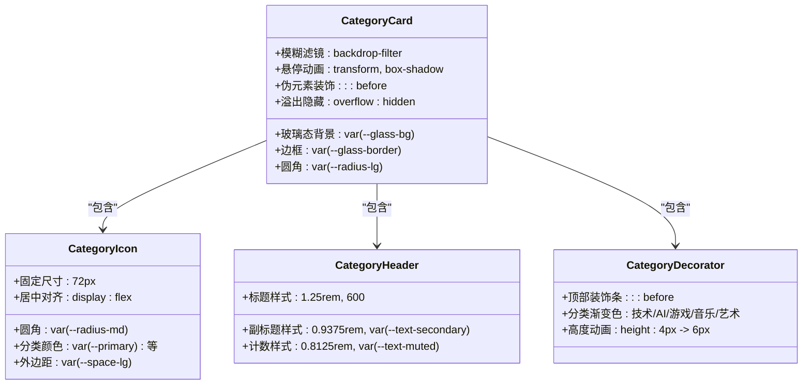

**图表来源**
- [css/style.css:557-627](file://css/style.css#L557-L627)
- [index.html:100-160](file://index.html#L100-L160)

### 按钮组件 (.btn)

按钮组件提供多种样式变体，支持悬停动画和主题适配：

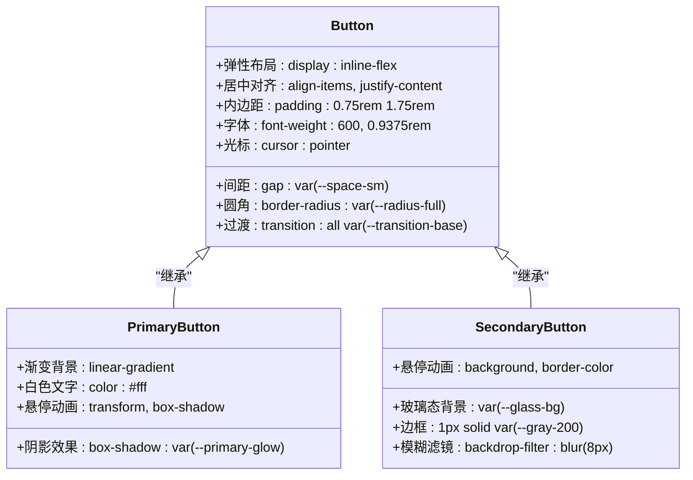

**图表来源**
- [css/style.css:368-405](file://css/style.css#L368-L405)

**章节来源**
- [css/style.css:8-78](file://css/style.css#L8-L78)
- [css/style.css:147-257](file://css/style.css#L147-L257)
- [css/style.css:438-548](file://css/style.css#L438-L548)
- [css/style.css:557-627](file://css/style.css#L557-L627)
- [css/style.css:368-405](file://css/style.css#L368-L405)

## 架构概览

项目采用模块化的样式架构，通过CSS变量实现主题统一，通过BEM命名规范确保样式可维护性：

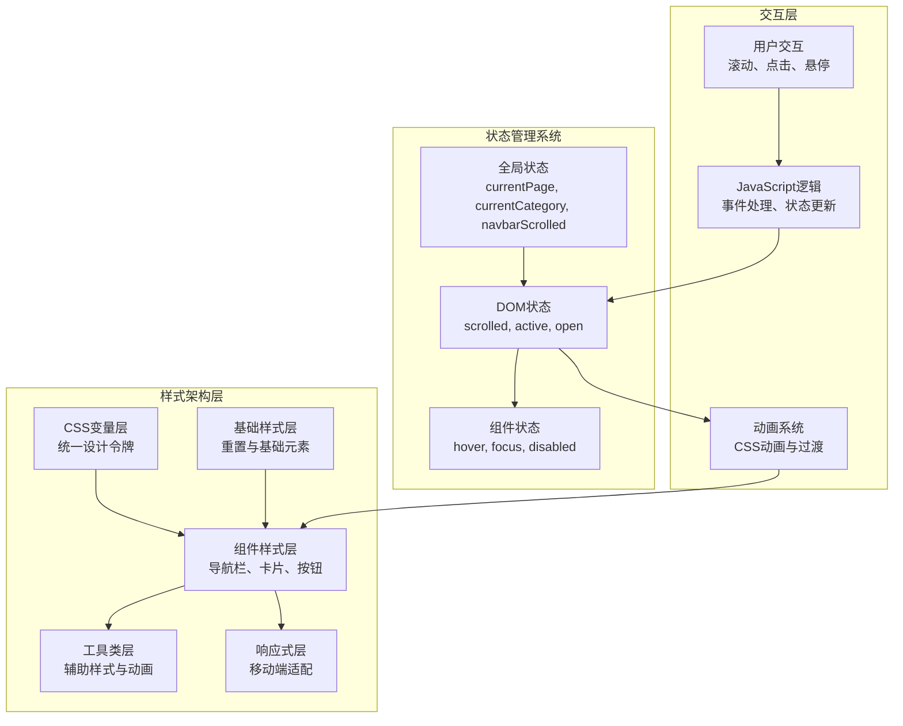

**图表来源**
- [css/style.css:1-1166](file://css/style.css#L1-L1166)
- [js/main.js:6-11](file://js/main.js#L6-L11)

## 详细组件分析

### 导航栏状态管理

导航栏实现了动态状态管理，通过JavaScript监听滚动事件来切换样式状态：

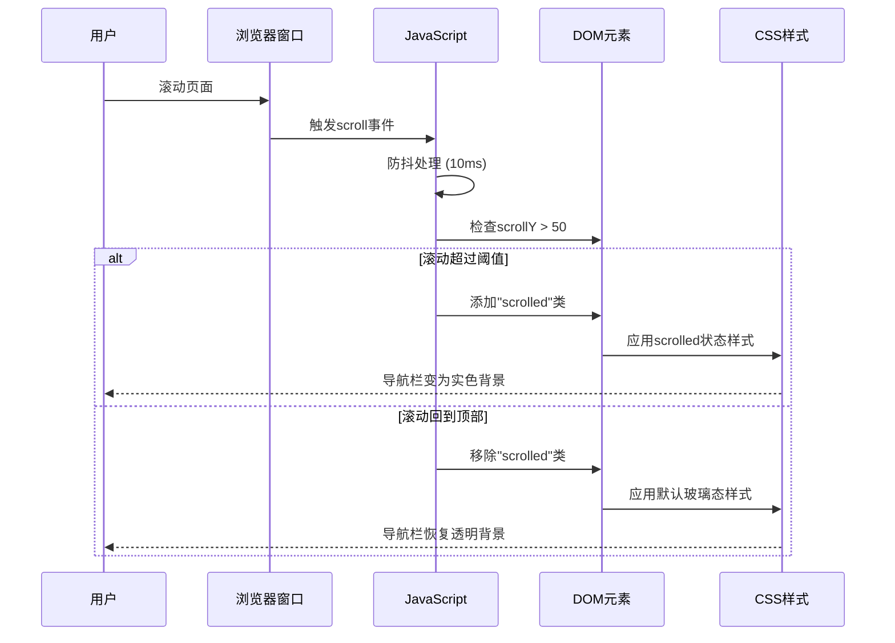

**图表来源**
- [js/main.js:49-58](file://js/main.js#L49-L58)
- [css/style.css:162-165](file://css/style.css#L162-L165)

### 文章卡片交互流程

文章卡片实现了完整的交互体验，包括点击跳转和键盘访问：

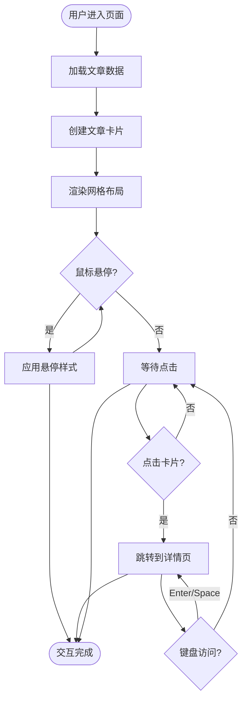

**图表来源**
- [js/main.js:81-116](file://js/main.js#L81-L116)
- [css/style.css:451-455](file://css/style.css#L451-L455)

### 分类筛选机制

分类筛选功能实现了动态内容更新和URL状态同步：

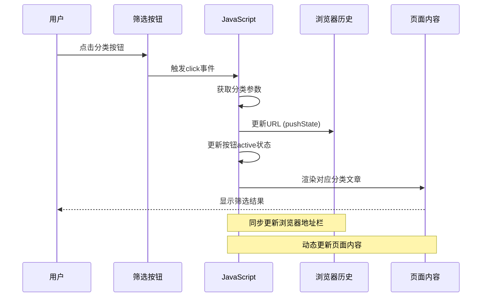

**图表来源**
- [js/main.js:194-217](file://js/main.js#L194-L217)
- [css/style.css:691-695](file://css/style.css#L691-L695)

**章节来源**
- [js/main.js:49-58](file://js/main.js#L49-L58)
- [js/main.js:81-116](file://js/main.js#L81-L116)
- [js/main.js:194-217](file://js/main.js#L194-L217)

## 依赖关系分析

项目中的样式依赖关系体现了清晰的层次结构：

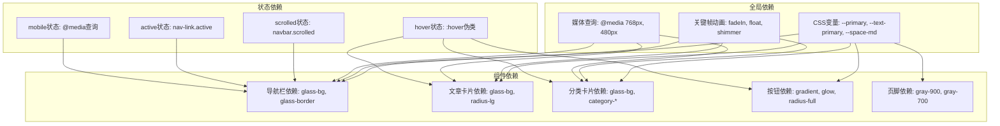

**图表来源**
- [css/style.css:8-78](file://css/style.css#L8-L78)
- [css/style.css:131-138](file://css/style.css#L131-L138)
- [css/style.css:363-366](file://css/style.css#L363-L366)
- [css/style.css:1029-1106](file://css/style.css#L1029-L1106)

**章节来源**
- [css/style.css:8-78](file://css/style.css#L8-L78)
- [css/style.css:131-138](file://css/style.css#L131-L138)
- [css/style.css:363-366](file://css/style.css#L363-L366)
- [css/style.css:1029-1106](file://css/style.css#L1029-L1106)

## 性能考虑

项目在性能方面采用了多项优化措施：

### 样式性能优化

1. **CSS变量缓存**: 使用CSS变量减少重复计算
2. **硬件加速**: 利用transform和opacity触发GPU加速
3. **防抖优化**: 滚动事件使用10ms防抖
4. **选择器优化**: 避免深层嵌套选择器

### JavaScript性能优化

1. **事件委托**: 使用事件委托减少事件处理器数量
2. **虚拟DOM**: 通过innerHTML操作DOM
3. **懒加载**: 图片使用loading="lazy"
4. **内存管理**: 及时清理事件监听器

### 响应式性能

1. **媒体查询优化**: 使用@media减少样式计算
2. **CSS Grid**: 使用现代布局减少JavaScript计算
3. **Flexbox**: 灵活布局减少复杂计算

## 故障排除指南

### 常见问题及解决方案

#### 导航栏样式不生效
- **问题**: 导航栏在滚动时没有变化
- **原因**: JavaScript未正确绑定滚动事件
- **解决**: 检查`initNavbar()`函数中的事件绑定

#### 文章卡片点击无效
- **问题**: 点击文章卡片无法跳转
- **原因**: 事件监听器未正确绑定
- **解决**: 检查`createArticleCard()`中的事件处理

#### 分类筛选不工作
- **问题**: 点击分类按钮无反应
- **原因**: 事件委托未正确设置
- **解决**: 检查`initFilterButtons()`中的事件处理

#### 响应式样式异常
- **问题**: 移动端样式显示不正确
- **原因**: 媒体查询优先级问题
- **解决**: 检查CSS文件中的媒体查询顺序

**章节来源**
- [js/main.js:436-460](file://js/main.js#L436-L460)
- [css/style.css:1029-1106](file://css/style.css#L1029-L1106)

## 结论

Hot-Site项目展现了优秀的组件样式架构设计，通过以下关键特性实现了高质量的样式系统：

### 设计优势

1. **模块化架构**: 清晰的组件分离和职责划分
2. **状态管理**: 完善的JavaScript状态控制系统
3. **主题统一**: 基于CSS变量的统一设计令牌
4. **响应式设计**: 全面的移动端适配方案
5. **性能优化**: 多层次的性能优化策略

### 最佳实践总结

1. **样式复用**: 通过CSS变量和组件化实现样式复用
2. **避免冲突**: 严格的BEM命名规范防止样式冲突
3. **可维护性**: 模块化设计便于维护和扩展
4. **性能优化**: 硬件加速和防抖技术提升用户体验
5. **可访问性**: 完善的ARIA标签和键盘导航支持

该项目为静态网站开发提供了优秀的样式架构范例，值得在类似项目中借鉴和参考。