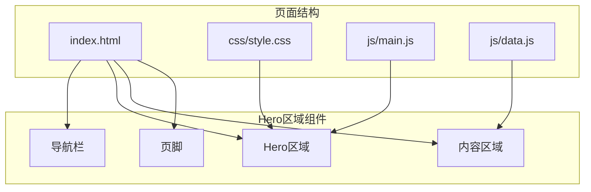
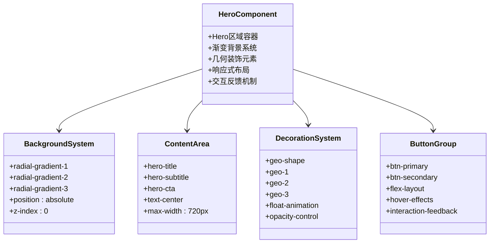
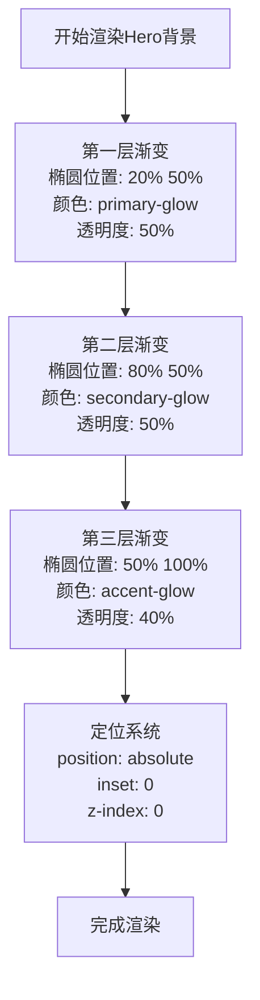
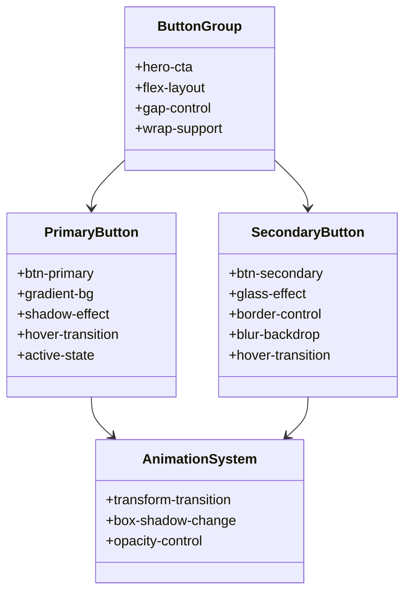
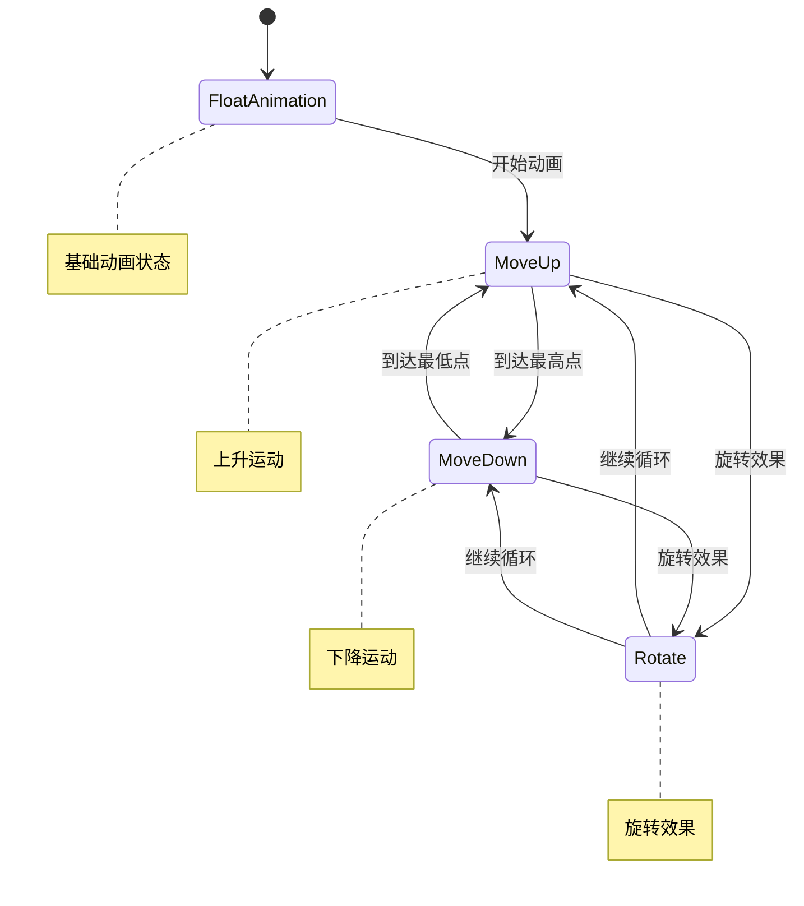
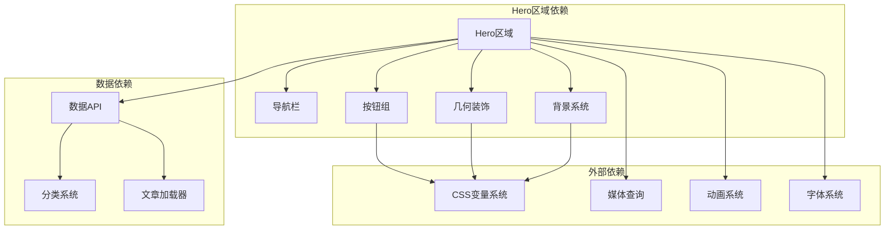

# Hero区域组件

<cite>
**本文档引用的文件**
- [index.html](file://index.html)
- [style.css](file://css/style.css)
- [main.js](file://js/main.js)
- [data.js](file://js/data.js)
- [article.html](file://article.html)
</cite>

## 目录
1. [简介](#简介)
2. [项目结构](#项目结构)
3. [核心组件](#核心组件)
4. [架构概览](#架构概览)
5. [详细组件分析](#详细组件分析)
6. [依赖关系分析](#依赖关系分析)
7. [性能考虑](#性能考虑)
8. [故障排除指南](#故障排除指南)
9. [结论](#结论)

## 简介

Hot-Site项目的Hero区域组件是网站的视觉焦点，负责向访客展示品牌价值主张和引导用户进行下一步操作。该组件采用现代化的设计理念，结合渐变背景、几何装饰元素和响应式布局，创造出引人注目的首屏体验。

Hero区域组件的核心特色包括：
- **渐变背景系统**：使用多层径向渐变创造深度和层次感
- **动态几何装饰**：浮动的几何图形增强视觉动感
- **响应式标题系统**：基于clamp()函数的自适应字体大小
- **渐变文本效果**：创新的渐变文字样式实现
- **智能CTA按钮组**：主次按钮的协调布局和交互反馈

## 项目结构

Hero区域组件位于网站的主页(index.html)，作为整个页面的视觉中心。组件采用模块化设计，与导航栏、内容区域和其他页面元素协同工作。



**图表来源**
- [index.html:55-75](file://index.html#L55-L75)
- [style.css:259-366](file://css/style.css#L259-L366)

**章节来源**
- [index.html:1-190](file://index.html#L1-L190)
- [style.css:1-1166](file://css/style.css#L1-L1166)

## 核心组件

Hero区域组件由四个主要部分组成，每个部分都有特定的功能和设计目标：

### 1. 渐变背景系统
采用三层径向渐变组合，创造丰富的视觉层次和深度感。背景使用CSS变量定义的颜色方案，确保主题一致性。

### 2. 主标题区域
包含主要标题和副标题，使用响应式字体大小系统，确保在各种设备上的最佳可读性。

### 3. CTA按钮组
提供两个主要的行动号召按钮，分别用于不同的用户路径和转化目标。

### 4. 几何装饰系统
三个浮动的几何图形，每个都有独特的颜色、形状和动画效果，增强视觉动感。

**章节来源**
- [index.html:56-75](file://index.html#L56-L75)
- [style.css:260-366](file://css/style.css#L260-L366)

## 架构概览

Hero区域组件采用分层架构设计，确保各个元素之间的协调性和可维护性。



**图表来源**
- [style.css:260-366](file://css/style.css#L260-L366)
- [index.html:56-75](file://index.html#L56-L75)

## 详细组件分析

### 渐变背景系统

Hero区域的背景系统是其视觉吸引力的核心。采用三层径向渐变组合，每层都有特定的位置、颜色和透明度设置。



**图表来源**
- [style.css:270-278](file://css/style.css#L270-L278)

#### 背景颜色方案
- **主色调**: indigo (var(--primary))
- **辅助色**: cyan (var(--secondary))
- **强调色**: amber (var(--accent))
- **透明度控制**: 通过rgba值实现渐变效果

**章节来源**
- [style.css:270-278](file://css/style.css#L270-L278)
- [style.css:8-78](file://css/style.css#L8-L78)

### 主标题系统

Hero标题采用创新的渐变文本效果，结合响应式字体大小系统，确保在各种设备上的最佳视觉效果。

```mermaid
sequenceDiagram
participant User as 用户
participant Hero as Hero区域
participant Title as 标题元素
participant Gradient as 渐变效果
participant Responsive as 响应式系统
User->>Hero : 访问页面
Hero->>Title : 渲染主标题
Title->>Gradient : 应用渐变文本样式
Gradient->>Title : 设置背景渐变
Title->>Responsive : 启用响应式字体
Responsive->>Title : 计算字体大小(clamp)
Title-->>User : 显示渐变标题
Note over User,Responsive : 字体大小范围 : 2.5rem 到 4rem
Note over User,Responsive : 基准 : 6vw 视口宽度
```

**图表来源**
- [index.html:59-61](file://index.html#L59-L61)
- [style.css:287-301](file://css/style.css#L287-L301)

#### 渐变文本实现
- **渐变方向**: 135度对角线
- **颜色过渡**: primary → secondary
- **文本处理**: -webkit-background-clip: text
- **透明度控制**: -webkit-text-fill-color: transparent

#### 响应式字体系统
使用CSS clamp()函数实现流式字体大小：
- **最小值**: 2.5rem (小屏幕)
- **首选值**: 6vw (视口宽度)
- **最大值**: 4rem (大屏幕)

**章节来源**
- [index.html:59-61](file://index.html#L59-L61)
- [style.css:287-301](file://css/style.css#L287-L301)
- [style.css:1085-1092](file://css/style.css#L1085-L1092)

### CTA按钮组设计

Hero区域的CTA按钮组采用双按钮设计，提供清晰的行动路径选择。



**图表来源**
- [index.html:65-68](file://index.html#L65-L68)
- [style.css:311-316](file://css/style.css#L311-L316)
- [style.css:369-405](file://css/style.css#L369-L405)

#### 主按钮设计
- **样式**: 纯色背景 + 渐变效果
- **阴影**: 主色调发光效果
- **交互**: 悬停时提升和阴影增强
- **尺寸**: 0.75rem 1.75rem 内边距

#### 次按钮设计
- **样式**: 玻璃态背景 + 模糊效果
- **边框**: 浅色边框
- **交互**: 悬停时边框颜色变化
- **透明度**: 保持视觉轻盈感

**章节来源**
- [index.html:65-68](file://index.html#L65-L68)
- [style.css:369-405](file://css/style.css#L369-L405)

### 几何装饰系统

Hero区域包含三个独特的几何装饰元素，每个都有特定的动画效果和视觉特征。



**图表来源**
- [style.css:363-366](file://css/style.css#L363-L366)

#### 几何图形配置

| 图形编号 | 形状 | 大小 | 位置 | 颜色 | 动画周期 | 特殊效果 |
|---------|------|------|------|------|----------|----------|
| geo-1 | 方形 | 180×180px | 顶部8%左侧15% | 主色调渐变 | 8秒 | 25°旋转 |
| geo-2 | 圆形 | 120×120px | 底部20%右侧12% | 辅助色渐变 | 6秒 | -15°旋转 |
| geo-3 | 方形 | 80×80px | 顶部30%右侧20% | 强调色渐变 | 10秒 | 45°旋转 |

#### 动画实现细节
- **动画名称**: float
- **关键帧**: 上升(-20px)和下降(0px)的垂直位移
- **旋转效果**: 保持几何图形的动态感
- **透明度**: 15%的低透明度确保不干扰主要内容

**章节来源**
- [style.css:319-366](file://css/style.css#L319-L366)

## 依赖关系分析

Hero区域组件与其他页面元素存在紧密的依赖关系，形成了一个协调统一的用户体验。



**图表来源**
- [index.html:29-53](file://index.html#L29-L53)
- [style.css:259-366](file://css/style.css#L259-L366)
- [main.js:44-77](file://js/main.js#L44-L77)

### 样式依赖关系

Hero区域组件依赖于全局CSS变量系统，确保主题一致性和易于维护性。

**章节来源**
- [style.css:8-78](file://css/style.css#L8-L78)
- [index.html:21-27](file://index.html#L21-L27)

## 性能考虑

Hero区域组件在设计时充分考虑了性能优化，采用了多种策略来确保最佳的用户体验。

### 1. 渐变背景优化
- 使用CSS原生渐变而非复杂图像
- 通过CSS变量减少重复计算
- 合理的z-index层级避免过度重绘

### 2. 动画性能优化
- 使用transform属性而非改变布局属性
- CSS动画优于JavaScript动画
- 合理的动画持续时间和缓动函数

### 3. 响应式性能
- 使用CSS媒体查询而非JavaScript检测
- clamp()函数提供高效的流式布局
- 避免复杂的JavaScript计算

### 4. 资源加载优化
- 字体预加载减少FOIT时间
- SVG图标内联减少HTTP请求
- 图片懒加载和适当的尺寸设置

**章节来源**
- [style.css:363-366](file://css/style.css#L363-L366)
- [index.html:21-27](file://index.html#L21-L27)

## 故障排除指南

### 常见问题及解决方案

#### 1. 渐变文本不显示
**症状**: 标题文本显示为普通黑色
**原因**: 浏览器不支持-webkit-background-clip
**解决方案**: 检查浏览器兼容性或使用替代方案

#### 2. 几何装饰动画异常
**症状**: 图形不移动或移动异常
**原因**: CSS动画被禁用或性能设置过高
**解决方案**: 检查浏览器动画设置或降低动画复杂度

#### 3. 响应式字体显示问题
**症状**: 字体大小在某些设备上异常
**原因**: 视口设置或媒体查询冲突
**解决方案**: 验证meta viewport设置和媒体查询优先级

#### 4. 按钮交互无响应
**症状**: 按钮悬停效果不显示
**原因**: CSS伪类选择器优先级问题
**解决方案**: 检查CSS加载顺序和选择器特异性

**章节来源**
- [style.css:287-301](file://css/style.css#L287-L301)
- [style.css:363-366](file://css/style.css#L363-L366)

## 结论

Hot-Site项目的Hero区域组件展现了现代Web设计的最佳实践。通过精心设计的渐变背景系统、创新的渐变文本效果、智能的几何装饰元素和响应式的布局策略，成功创建了一个既美观又实用的视觉焦点。

组件的主要优势包括：
- **视觉层次清晰**: 渐变背景和几何装饰创造丰富的视觉深度
- **响应式设计完善**: 在各种设备上提供一致的用户体验
- **性能优化到位**: 采用多种策略确保快速加载和流畅动画
- **可维护性强**: 基于CSS变量和模块化设计，便于后续更新

该组件为Hot-Site项目奠定了坚实的视觉基础，为用户提供了引人注目的首屏体验，有效提升了品牌形象和用户参与度。