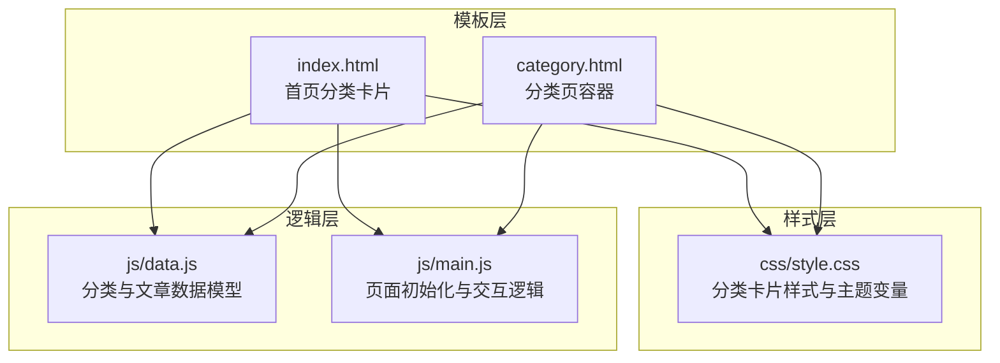
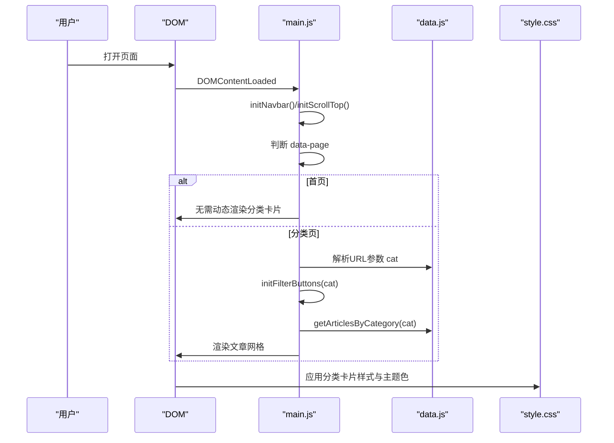
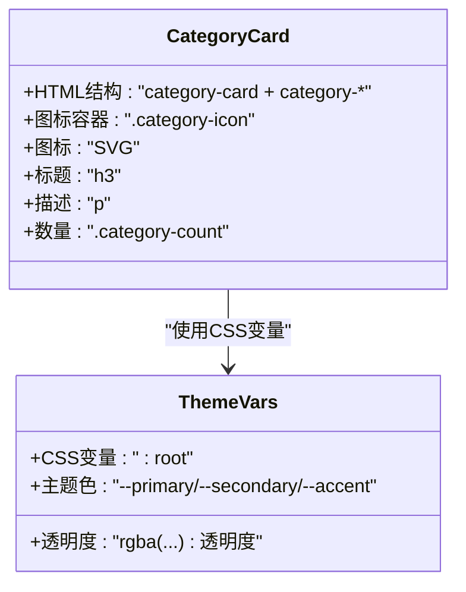
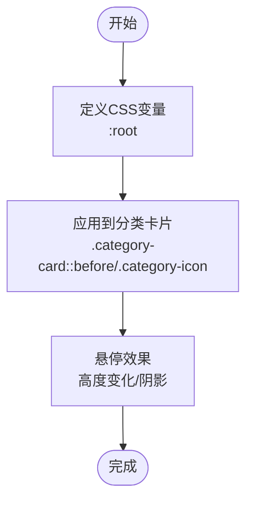
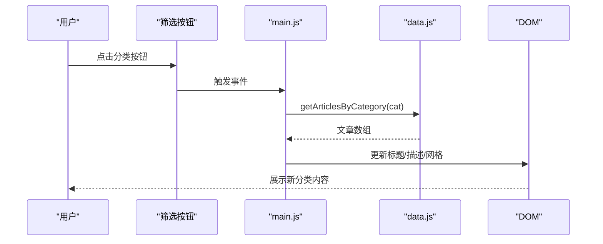
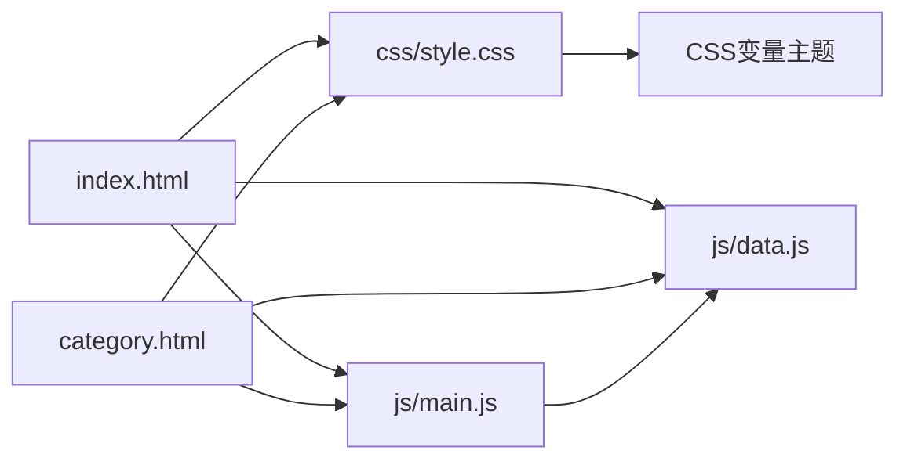

# 分类卡片组件

<cite>
**本文档引用的文件**
- [index.html](file://index.html)
- [category.html](file://category.html)
- [css/style.css](file://css/style.css)
- [js/data.js](file://js/data.js)
- [js/main.js](file://js/main.js)
</cite>

## 目录
1. [简介](#简介)
2. [项目结构](#项目结构)
3. [核心组件](#核心组件)
4. [架构总览](#架构总览)
5. [详细组件分析](#详细组件分析)
6. [依赖关系分析](#依赖关系分析)
7. [性能考量](#性能考量)
8. [故障排查指南](#故障排查指南)
9. [结论](#结论)

## 简介
本文件面向Hot-Site项目的“分类卡片组件”，系统性阐述其设计理念、图标体系、颜色编码、视觉层级、数量统计、交互反馈与响应式布局。该组件在首页以静态HTML形式呈现，在分类页通过JavaScript动态渲染，统一采用CSS自定义属性与主题色，确保跨页面一致的视觉体验与可维护性。

## 项目结构
分类卡片组件横跨HTML模板、样式表与数据/逻辑脚本三部分：
- HTML模板：首页与分类页分别提供静态或动态的分类卡片容器与占位结构
- CSS样式：定义网格布局、颜色系统、悬停与过渡效果、响应式断点
- JavaScript数据与逻辑：提供分类配置、文章数据、URL参数解析、页面初始化与事件绑定

图表来源
- [index.html:100-160](file://index.html#L100-L160)
- [category.html:62-76](file://category.html#L62-L76)
- [css/style.css:550-627](file://css/style.css#L550-L627)
- [js/data.js:6-37](file://js/data.js#L6-L37)
- [js/main.js:158-177](file://js/main.js#L158-L177)

章节来源
- [index.html:100-160](file://index.html#L100-L160)
- [category.html:62-76](file://category.html#L62-L76)
- [css/style.css:550-627](file://css/style.css#L550-L627)
- [js/data.js:6-37](file://js/data.js#L6-L37)
- [js/main.js:158-177](file://js/main.js#L158-L177)

## 核心组件
- 分类卡片容器：首页的静态网格与分类页的动态网格
- 图标系统：每个分类对应的SVG图标，统一尺寸与描边
- 颜色系统：基于CSS自定义属性的主题色，配合渐变条与图标背景
- 数量统计：显示该分类下的文章数量
- 交互反馈：悬停提升、阴影与渐变条高度变化；点击跳转
- 响应式布局：网格列数随屏幕宽度自适应

章节来源
- [index.html:100-160](file://index.html#L100-L160)
- [css/style.css:550-627](file://css/style.css#L550-L627)
- [js/data.js:6-37](file://js/data.js#L6-L37)
- [js/main.js:158-177](file://js/main.js#L158-L177)

## 架构总览
分类卡片组件的运行时流程如下：页面加载后根据data-page决定初始化逻辑；首页直接渲染静态卡片；分类页解析URL参数，初始化筛选按钮，再渲染对应分类的文章网格。分类卡片本身由HTML结构与CSS样式共同构成，数据来源于js/data.js的CATEGORIES常量。

图表来源
- [js/main.js:436-460](file://js/main.js#L436-L460)
- [js/main.js:158-177](file://js/main.js#L158-L177)
- [js/data.js:120-126](file://js/data.js#L120-L126)
- [css/style.css:550-627](file://css/style.css#L550-L627)

## 详细组件分析

### 设计理念与视觉层次
- 视觉层次通过卡片圆角、玻璃态背景、边框与阴影体现，强调内容密度与层级感
- 渐变条（位于卡片顶部）作为分类标识，悬停时高度增加，强化交互反馈
- 文字层级：标题字号大于副标题，强调分类名称与描述的可读性

章节来源
- [css/style.css:550-587](file://css/style.css#L550-L587)
- [css/style.css:611-621](file://css/style.css#L611-L621)

### 图标系统与统一规范
- 每个分类拥有专属SVG图标，尺寸统一为48×48像素，居中显示
- 图标采用描边线条风格，stroke-width统一，保持视觉一致性
- 图标容器具备圆角背景与主题色浅色背景，确保在不同主题下清晰可辨

图表来源
- [index.html:100-160](file://index.html#L100-L160)
- [css/style.css:595-609](file://css/style.css#L595-L609)
- [css/style.css:8-78](file://css/style.css#L8-L78)

章节来源
- [index.html:100-160](file://index.html#L100-L160)
- [css/style.css:595-609](file://css/style.css#L595-L609)

### 颜色系统与CSS变量管理
- 主题色：主色、次色、强调色均通过CSS自定义属性集中管理，便于全局替换
- 分类主题：每个分类卡片使用独立的渐变条与图标背景色，与主色系保持协调
- 玻璃态：卡片背景与边框采用半透明与模糊效果，增强空间层次

图表来源
- [css/style.css:8-78](file://css/style.css#L8-L78)
- [css/style.css:569-593](file://css/style.css#L569-L593)
- [css/style.css:595-609](file://css/style.css#L595-L609)

章节来源
- [css/style.css:8-78](file://css/style.css#L8-L78)
- [css/style.css:569-593](file://css/style.css#L569-L593)
- [css/style.css:595-609](file://css/style.css#L595-L609)

### 数量统计功能与动态更新机制
- 静态展示：首页分类卡片中的数量文本为静态占位，便于快速预览
- 动态计算：分类页通过数据模型统计各分类下的文章数量，并实时更新UI
- 更新流程：切换筛选按钮时，重新计算并更新页面标题、描述与文章网格

图表来源
- [js/main.js:180-218](file://js/main.js#L180-L218)
- [js/data.js:120-126](file://js/data.js#L120-L126)

章节来源
- [js/main.js:180-218](file://js/main.js#L180-L218)
- [js/data.js:120-126](file://js/data.js#L120-L126)

### 交互反馈与加载动画
- 悬停效果：卡片提升、阴影加深、渐变条高度增加，提供明确的交互反馈
- 点击状态：卡片可点击跳转至分类页或文章详情页
- 加载状态：文章详情页加载Markdown内容时显示加载提示，失败时提供错误占位

章节来源
- [css/style.css:580-587](file://css/style.css#L580-L587)
- [js/main.js:102-113](file://js/main.js#L102-L113)
- [js/main.js:272-314](file://js/main.js#L272-L314)

### 响应式布局与断点策略
- 网格布局：使用CSS Grid与minmax，列宽随容器宽度自适应
- 断点：通过clamp与媒体查询实现流畅的字体与间距缩放
- 移动端：导航栏采用汉堡菜单，卡片在窄屏下自动换行，保证可读性与可用性

章节来源
- [css/style.css:550-555](file://css/style.css#L550-L555)
- [css/style.css:260-366](file://css/style.css#L260-L366)
- [index.html:38-51](file://index.html#L38-L51)

## 依赖关系分析
- 模板依赖样式：分类卡片的视觉表现完全依赖css/style.css中的类名与变量
- 逻辑依赖数据：分类页的筛选与渲染依赖js/data.js提供的分类与文章数据
- 事件依赖：分类页的筛选按钮事件绑定在js/main.js中，负责更新URL与内容

图表来源
- [index.html:100-160](file://index.html#L100-L160)
- [category.html:62-76](file://category.html#L62-L76)
- [css/style.css:550-627](file://css/style.css#L550-L627)
- [js/data.js:6-37](file://js/data.js#L6-L37)
- [js/main.js:158-177](file://js/main.js#L158-L177)

章节来源
- [index.html:100-160](file://index.html#L100-L160)
- [category.html:62-76](file://category.html#L62-L76)
- [css/style.css:550-627](file://css/style.css#L550-L627)
- [js/data.js:6-37](file://js/data.js#L6-L37)
- [js/main.js:158-177](file://js/main.js#L158-L177)

## 性能考量
- 静态卡片优先：首页使用静态HTML减少首屏JS执行压力
- 懒加载与过渡：文章卡片图片采用懒加载，过渡动画使用CSS变量控制，避免频繁重排
- 事件防抖：滚动与窗口事件使用防抖，降低高频事件对主线程的影响
- 资源优化：图标为内联SVG，减少HTTP请求；字体预加载提升首屏渲染

章节来源
- [index.html:100-160](file://index.html#L100-L160)
- [css/style.css:550-555](file://css/style.css#L550-L555)
- [js/main.js:28-39](file://js/main.js#L28-L39)

## 故障排查指南
- 分类页无内容：确认URL参数cat是否正确传递，检查getArticlesByCategory返回值
- 筛选按钮无效：检查initFilterButtons事件绑定是否成功，确认按钮类名与data-category属性
- 图标不显示：核对SVG路径与stroke-width，确保容器尺寸与颜色设置正确
- 样式异常：检查CSS变量是否被覆盖，确认分类卡片类名与主题类名匹配

章节来源
- [js/main.js:180-218](file://js/main.js#L180-L218)
- [js/data.js:120-126](file://js/data.js#L120-L126)
- [css/style.css:595-609](file://css/style.css#L595-L609)

## 结论
分类卡片组件通过统一的图标系统、主题色与网格布局，实现了跨页面一致的视觉体验。结合静态与动态两种渲染方式，既保证了首页的快速加载，又满足了分类页的交互需求。建议在新增分类时同步更新数据模型与样式主题，确保颜色与图标的一致性与可维护性。