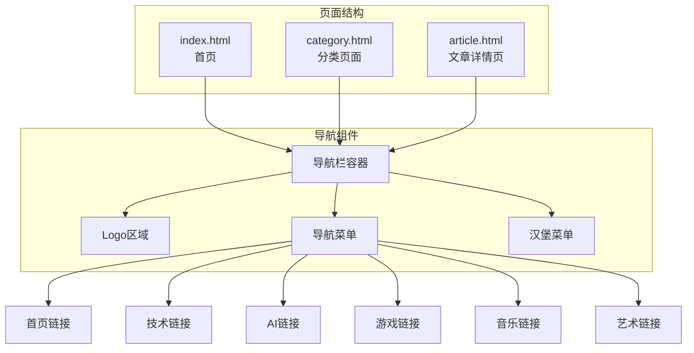
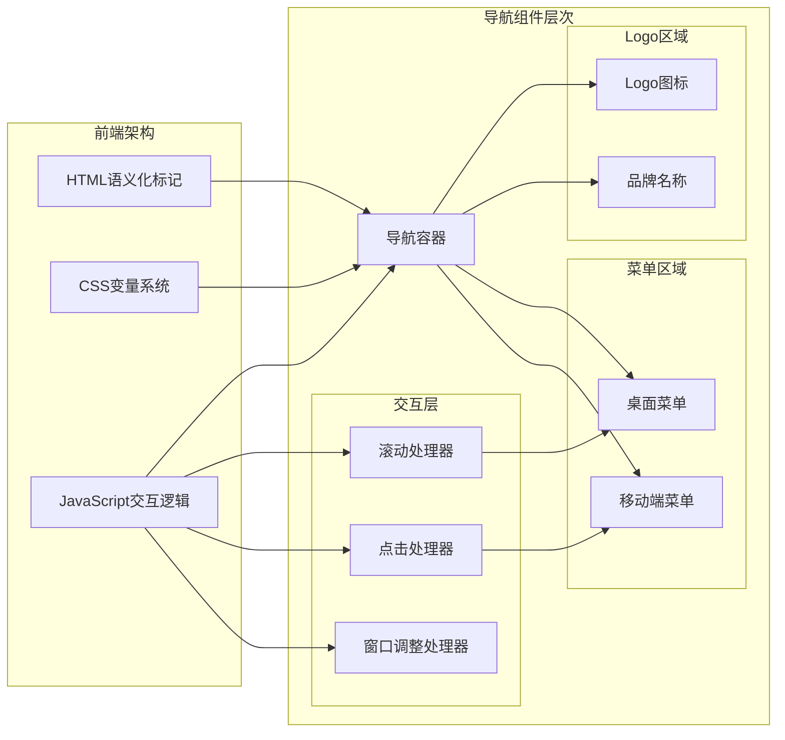
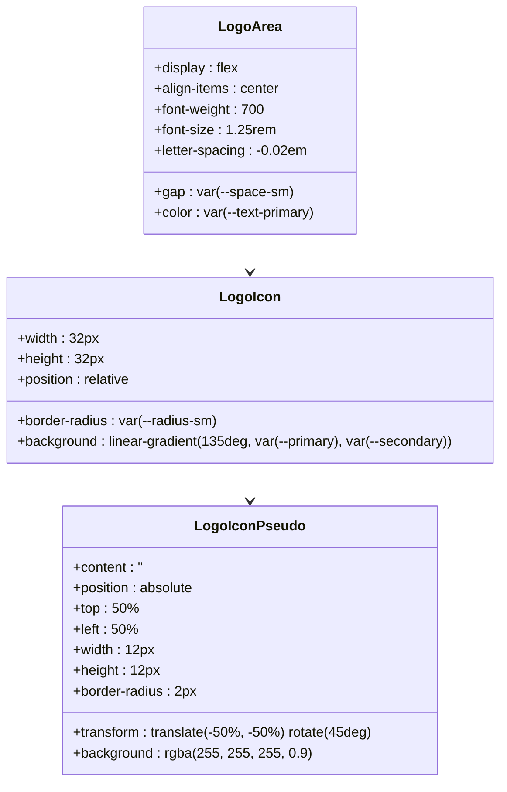
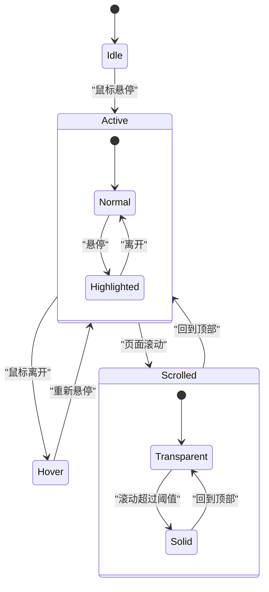
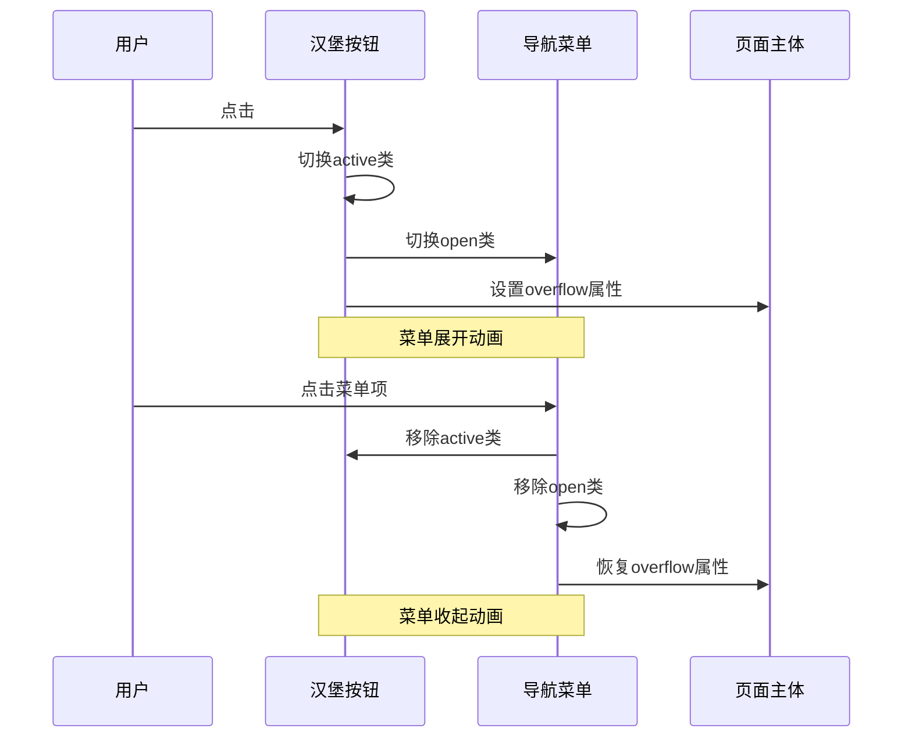
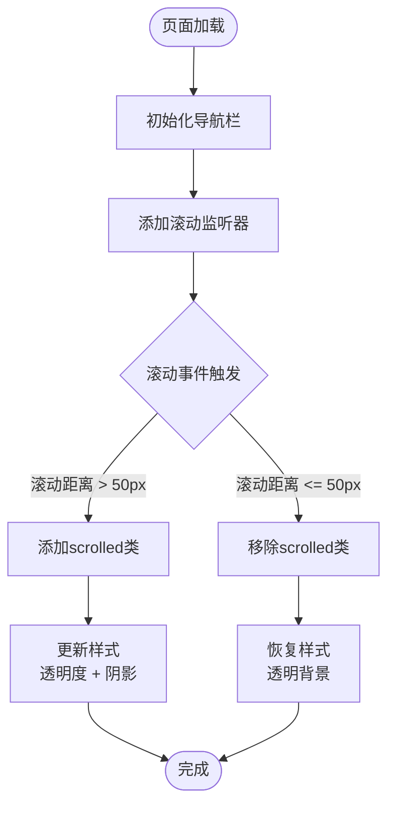
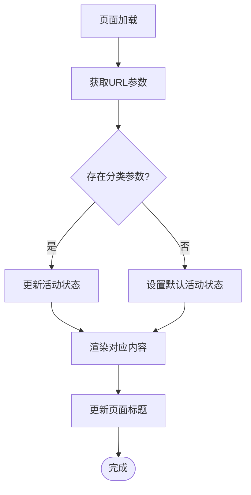
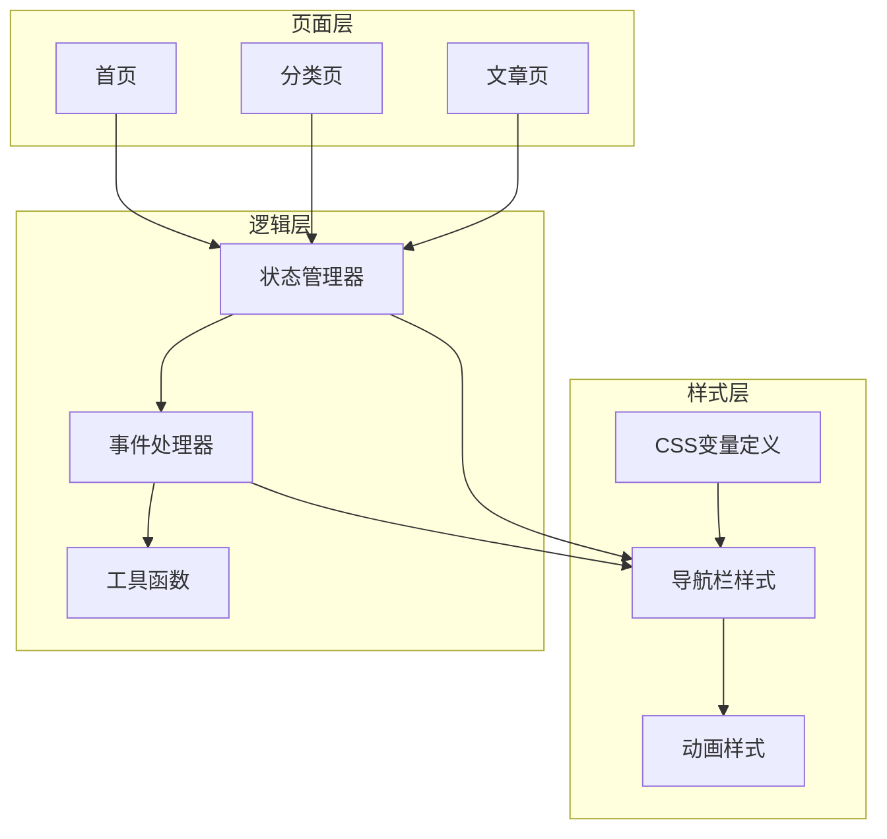

# 导航栏组件

<cite>
**本文档引用的文件**
- [index.html](file://index.html)
- [category.html](file://category.html)
- [article.html](file://article.html)
- [css/style.css](file://css/style.css)
- [js/main.js](file://js/main.js)
- [js/data.js](file://js/data.js)
</cite>

## 目录
1. [简介](#简介)
2. [项目结构](#项目结构)
3. [核心组件](#核心组件)
4. [架构概览](#架构概览)
5. [详细组件分析](#详细组件分析)
6. [依赖关系分析](#依赖关系分析)
7. [性能考虑](#性能考虑)
8. [故障排除指南](#故障排除指南)
9. [结论](#结论)

## 简介

Hot-Site项目的导航栏组件是一个现代化、响应式的导航系统，集成了Logo区域、导航菜单和汉堡菜单功能。该组件采用玻璃拟态设计，具备平滑的滚动效果和完整的无障碍访问支持。导航栏不仅提供了美观的视觉体验，还实现了智能的状态管理和交互逻辑。

## 项目结构

导航栏组件分布在多个HTML页面中，每个页面都包含了完整的导航结构：

**图表来源**
- [index.html:31-53](file://index.html#L31-L53)
- [category.html:29-51](file://category.html#L29-L51)
- [article.html:29-51](file://article.html#L29-L51)

**章节来源**
- [index.html:29-53](file://index.html#L29-L53)
- [category.html:27-51](file://category.html#L27-L51)
- [article.html:27-51](file://article.html#L27-L51)

## 核心组件

导航栏组件由三个主要部分组成：

### 1. Logo区域
- **Logo图标**：使用渐变背景的几何图形设计
- **品牌名称**：显示"Hot-Site"文本
- **无障碍支持**：包含aria-label属性

### 2. 导航菜单
- **菜单项**：包含首页、技术、AI、游戏、音乐、艺术六个分类
- **活动状态**：通过CSS类名控制当前页面的高亮显示
- **URL参数**：支持分类过滤功能

### 3. 汉堡菜单
- **响应式设计**：在移动设备上自动显示
- **动画效果**：三线段变形为X形
- **交互控制**：点击展开/收起菜单

**章节来源**
- [index.html:33-51](file://index.html#L33-L51)
- [css/style.css:148-257](file://css/style.css#L148-L257)

## 架构概览

导航栏组件采用了模块化的架构设计，结合了HTML语义化标记、CSS变量系统和JavaScript交互逻辑：

**图表来源**
- [css/style.css:7-78](file://css/style.css#L7-L78)
- [js/main.js:44-77](file://js/main.js#L44-L77)

## 详细组件分析

### Logo区域设计

Logo区域采用了简洁而富有辨识度的设计：

**图表来源**
- [css/style.css:177-205](file://css/style.css#L177-L205)

### 导航菜单状态管理

导航菜单实现了智能的状态管理机制：

**图表来源**
- [css/style.css:213-227](file://css/style.css#L213-L227)
- [css/style.css:162-165](file://css/style.css#L162-L165)

### 汉堡菜单交互逻辑

汉堡菜单实现了完整的移动端交互体验：

**图表来源**
- [js/main.js:60-77](file://js/main.js#L60-L77)
- [css/style.css:247-257](file://css/style.css#L247-L257)

### 滚动效果实现

导航栏的滚动效果通过CSS过渡和JavaScript事件监听实现：

**图表来源**
- [js/main.js:49-58](file://js/main.js#L49-L58)
- [css/style.css:162-165](file://css/style.css#L162-L165)

### URL参数处理机制

导航栏支持URL参数处理，实现分类导航的动态更新：

**图表来源**
- [js/main.js:15-19](file://js/main.js#L15-L19)
- [js/main.js:158-177](file://js/main.js#L158-L177)

**章节来源**
- [css/style.css:148-257](file://css/style.css#L148-L257)
- [js/main.js:44-77](file://js/main.js#L44-L77)

## 依赖关系分析

导航栏组件的依赖关系体现了清晰的分层架构：

**图表来源**
- [css/style.css:7-78](file://css/style.css#L7-L78)
- [js/main.js:6-11](file://js/main.js#L6-L11)
- [js/main.js:15-39](file://js/main.js#L15-L39)

**章节来源**
- [js/data.js:6-37](file://js/data.js#L6-L37)
- [js/main.js:436-460](file://js/main.js#L436-L460)

## 性能考虑

导航栏组件在性能方面采用了多项优化策略：

### 1. 滚动事件防抖
- 使用debounce函数减少滚动事件触发频率
- 默认延迟10ms，确保流畅的用户体验

### 2. CSS硬件加速
- 使用transform属性触发动画
- 避免布局重排和重绘

### 3. 条件渲染
- 汉堡菜单仅在移动端显示
- 减少不必要的DOM元素

### 4. 样式缓存
- CSS变量统一管理颜色和尺寸
- 减少重复计算

**章节来源**
- [js/main.js:28-39](file://js/main.js#L28-L39)
- [css/style.css:156-159](file://css/style.css#L156-L159)

## 故障排除指南

### 常见问题及解决方案

#### 1. 汉堡菜单不响应点击
**症状**：移动端无法展开菜单
**原因**：
- JavaScript未正确加载
- 事件监听器未绑定
- CSS类名不匹配

**解决方案**：
- 检查main.js文件是否正确加载
- 确认DOM元素选择器正确
- 验证CSS类名一致性

#### 2. 滚动效果不生效
**症状**：导航栏不会随滚动变化
**原因**：
- 滚动事件监听器缺失
- CSS类名未正确添加
- 视口高度计算错误

**解决方案**：
- 确认initNavbar函数执行
- 检查scrolled类定义
- 验证滚动阈值设置

#### 3. 活动状态不正确
**症状**：当前页面链接未高亮
**原因**：
- URL参数解析错误
- 状态管理器未更新
- CSS选择器匹配失败

**解决方案**：
- 检查URL参数获取逻辑
- 验证状态同步机制
- 确认CSS优先级设置

**章节来源**
- [js/main.js:44-77](file://js/main.js#L44-L77)
- [js/main.js:158-177](file://js/main.js#L158-L177)

## 结论

Hot-Site项目的导航栏组件展现了现代Web开发的最佳实践。通过精心设计的架构、完善的无障碍访问支持和优秀的性能优化，该组件为用户提供了流畅、直观的导航体验。

### 主要优势

1. **响应式设计**：完美适配各种设备尺寸
2. **无障碍访问**：完整的ARIA标签和键盘导航支持
3. **性能优化**：高效的事件处理和动画实现
4. **主题适配**：灵活的CSS变量系统
5. **状态管理**：智能的URL参数处理

### 技术亮点

- **玻璃拟态设计**：营造现代感的视觉效果
- **平滑动画过渡**：提升用户体验
- **模块化架构**：便于维护和扩展
- **跨页面一致性**：统一的导航体验

该导航栏组件为Hot-Site项目奠定了坚实的基础，为后续的功能扩展和主题定制提供了良好的框架。