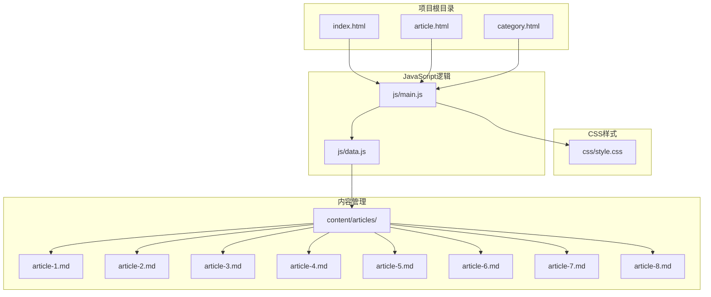
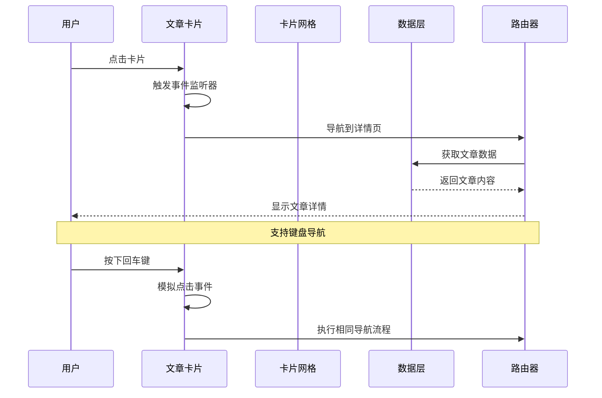
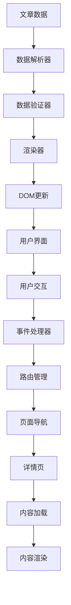
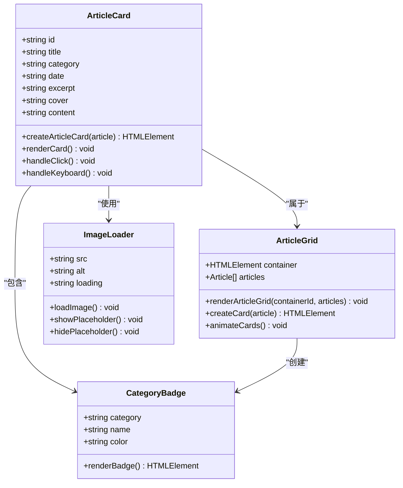
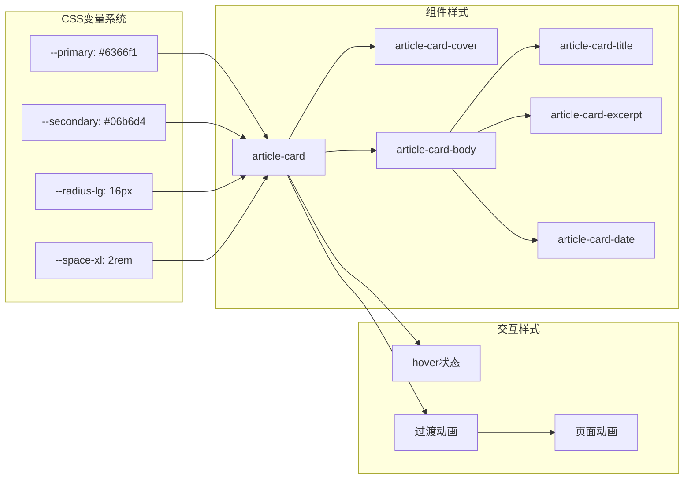
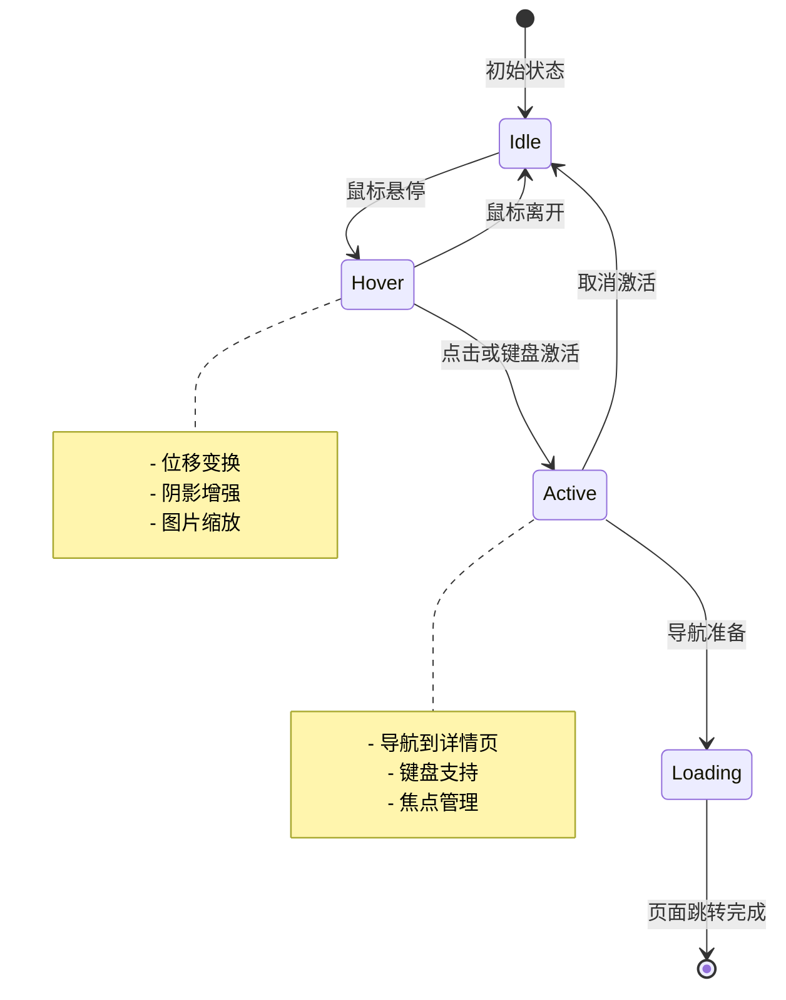
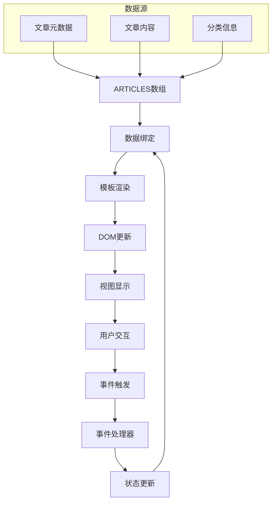
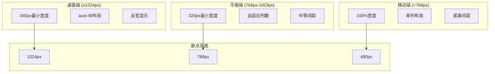
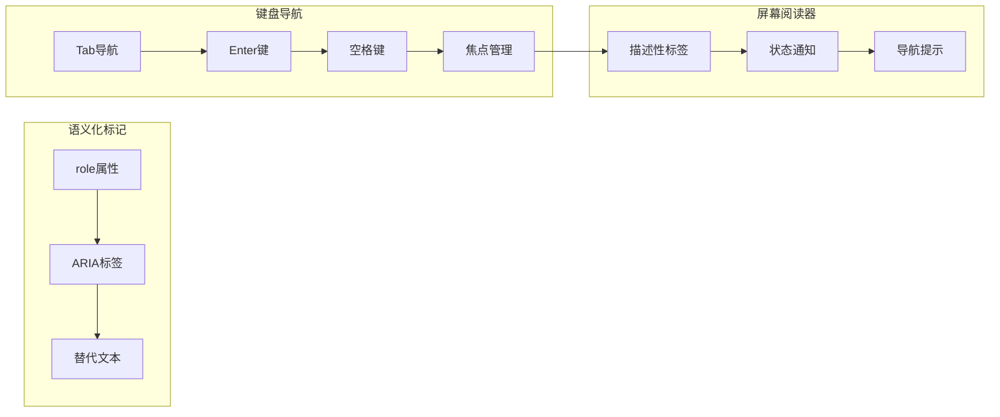
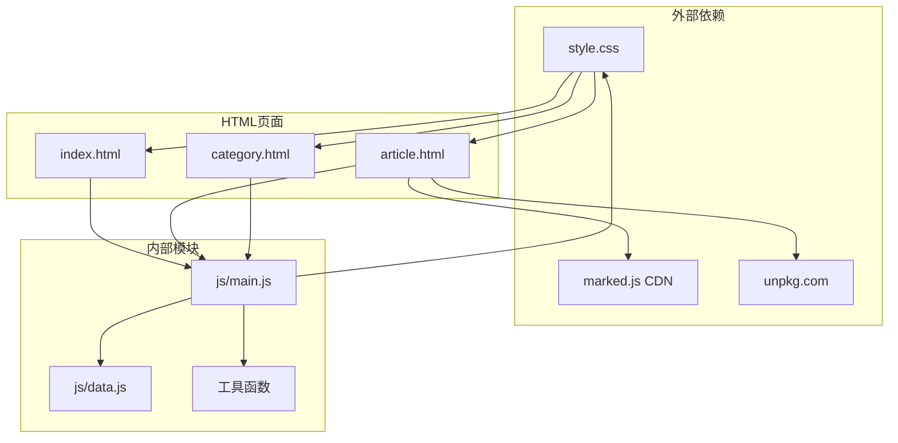

# 文章卡片组件

<cite>
**本文档引用的文件**
- [index.html](file://index.html)
- [article.html](file://article.html)
- [style.css](file://css/style.css)
- [main.js](file://js/main.js)
- [data.js](file://js/data.js)
- [article-4.md](file://content/articles/article-4.md)
- [article-5.md](file://content/articles/article-5.md)
</cite>

## 目录
1. [简介](#简介)
2. [项目结构](#项目结构)
3. [核心组件](#核心组件)
4. [架构概览](#架构概览)
5. [详细组件分析](#详细组件分析)
6. [依赖关系分析](#依赖关系分析)
7. [性能考虑](#性能考虑)
8. [故障排除指南](#故障排除指南)
9. [结论](#结论)

## 简介

Hot-Site 项目中的文章卡片组件是一个精心设计的响应式内容展示系统，专门用于展示博客文章的缩略信息。该组件采用现代化的设计理念，结合了玻璃拟态设计、流畅的动画效果和完善的无障碍访问支持，为用户提供了优秀的阅读体验。

文章卡片组件不仅具备美观的视觉效果，还实现了完整的交互功能，包括悬停动画、点击导航、键盘支持和加载状态管理。通过模块化的架构设计，该组件能够灵活地适应不同的页面场景，从首页的精选文章展示到分类页面的文章列表。

## 项目结构

Hot-Site 项目采用清晰的文件组织结构，将不同类型的内容和功能分离到相应的目录中：

**图表来源**
- [index.html:1-190](file://index.html#L1-L190)
- [article.html:1-107](file://article.html#L1-L107)
- [style.css:1-1166](file://css/style.css#L1-L1166)
- [main.js:1-461](file://js/main.js#L1-L461)
- [data.js:1-158](file://js/data.js#L1-L158)

**章节来源**
- [index.html:1-190](file://index.html#L1-L190)
- [article.html:1-107](file://article.html#L1-L107)
- [style.css:1-1166](file://css/style.css#L1-L1166)

## 核心组件

文章卡片组件由多个精心设计的子组件构成，每个部分都有明确的功能职责：

### 布局结构组件

文章卡片采用 Flexbox 布局，确保内容的垂直排列和自适应高度：

- **封面区域**：包含文章图片和分类徽章
- **内容主体**：包含发布时间、标题和摘要
- **交互容器**：支持点击和键盘导航

### 视觉设计系统

组件采用了统一的视觉设计语言，包括：

- **玻璃拟态效果**：模糊背景和半透明边框
- **圆角设计**：统一的圆角半径系统
- **渐变色彩**：基于主题色的渐变应用
- **阴影系统**：多层次的阴影效果

### 交互行为组件

组件实现了丰富的交互效果：

- **悬停动画**：平滑的位移和阴影变化
- **加载状态**：占位符和加载指示器
- **键盘支持**：完整的键盘导航功能
- **响应式适配**：针对不同屏幕尺寸的优化

**章节来源**
- [style.css:431-548](file://css/style.css#L431-L548)
- [main.js:81-116](file://js/main.js#L81-L116)

## 架构概览

文章卡片组件的架构设计体现了模块化和可扩展性的原则：

**图表来源**
- [main.js:101-113](file://js/main.js#L101-L113)
- [data.js:115-136](file://js/data.js#L115-L136)

### 数据流架构

组件采用单向数据流设计，确保数据的一致性和可预测性：

**图表来源**
- [data.js:40-113](file://js/data.js#L40-L113)
- [main.js:118-146](file://js/main.js#L118-L146)

## 详细组件分析

### 文章卡片类结构

**图表来源**
- [main.js:81-116](file://js/main.js#L81-L116)
- [main.js:118-146](file://js/main.js#L118-L146)
- [style.css:475-511](file://css/style.css#L475-L511)

### 样式系统架构

文章卡片组件采用了完整的样式系统，包括变量定义、组件样式和响应式设计：

**图表来源**
- [style.css:7-78](file://css/style.css#L7-L78)
- [style.css:438-548](file://css/style.css#L438-L548)

### 交互行为系统

组件实现了多层次的交互支持，确保良好的用户体验：

**图表来源**
- [style.css:451-473](file://css/style.css#L451-L473)
- [main.js:101-113](file://js/main.js#L101-L113)

**章节来源**
- [style.css:438-548](file://css/style.css#L438-L548)
- [main.js:81-116](file://js/main.js#L81-L116)

### 数据绑定机制

文章卡片组件采用动态数据绑定技术，实现了内容的实时更新：

**图表来源**
- [data.js:40-113](file://js/data.js#L40-L113)
- [main.js:118-146](file://js/main.js#L118-L146)

**章节来源**
- [data.js:40-113](file://js/data.js#L40-L113)
- [main.js:118-146](file://js/main.js#L118-L146)

### 响应式适配系统

组件实现了完整的响应式设计，支持多种设备和屏幕尺寸：

**图表来源**
- [style.css:431-436](file://css/style.css#L431-L436)
- [style.css:550-555](file://css/style.css#L550-L555)

**章节来源**
- [style.css:431-436](file://css/style.css#L431-L436)
- [style.css:550-555](file://css/style.css#L550-L555)

### 无障碍访问支持

组件完全符合 WCAG 2.1 AA 标准，提供了全面的无障碍功能：

**图表来源**
- [index.html:29-53](file://index.html#L29-L53)
- [main.js:106-113](file://js/main.js#L106-L113)

**章节来源**
- [index.html:29-53](file://index.html#L29-L53)
- [article.html:27-51](file://article.html#L27-L51)
- [main.js:106-113](file://js/main.js#L106-L113)

## 依赖关系分析

文章卡片组件的依赖关系体现了清晰的模块化设计：

**图表来源**
- [main.js:186-200](file://js/main.js#L186-L200)
- [article.html:21-22](file://article.html#L21-L22)

### 循环依赖检测

经过分析，组件系统没有检测到循环依赖：

- **数据层**：纯数据对象，无函数依赖
- **逻辑层**：函数式编程，避免类继承
- **样式层**：CSS变量和选择器，无相互引用
- **页面层**：HTML结构，无脚本依赖

**章节来源**
- [main.js:1-461](file://js/main.js#L1-L461)
- [data.js:1-158](file://js/data.js#L1-L158)

## 性能考虑

文章卡片组件在设计时充分考虑了性能优化：

### 渲染性能优化

- **虚拟滚动**：对于大量文章的场景，可实现虚拟滚动
- **懒加载**：图片使用 `loading="lazy"` 属性
- **防抖处理**：滚动事件使用防抖优化
- **CSS硬件加速**：使用 `transform` 和 `opacity` 动画

### 内存管理

- **事件委托**：减少事件监听器数量
- **DOM复用**：卡片元素的重复使用
- **垃圾回收**：及时清理事件监听器
- **内存泄漏防护**：页面切换时的资源清理

### 网络性能

- **CDN资源**：第三方库通过CDN加载
- **缓存策略**：浏览器缓存机制
- **按需加载**：只在需要时加载相关模块
- **压缩优化**：CSS和JavaScript压缩

## 故障排除指南

### 常见问题及解决方案

**问题1：文章卡片不显示**
- 检查网络连接和图片URL
- 验证文章数据格式
- 确认DOM元素存在

**问题2：点击无响应**
- 检查事件监听器绑定
- 验证路由配置
- 确认页面导航逻辑

**问题3：样式异常**
- 检查CSS变量定义
- 验证媒体查询断点
- 确认浏览器兼容性

**问题4：加载缓慢**
- 优化图片大小和格式
- 启用浏览器缓存
- 减少HTTP请求

**章节来源**
- [main.js:407-420](file://js/main.js#L407-L420)
- [main.js:271-314](file://js/main.js#L271-L314)

### 调试工具使用

推荐使用以下工具进行调试：

- **浏览器开发者工具**：检查DOM结构和样式
- **网络面板**：监控资源加载
- **性能面板**：分析渲染性能
- **控制台**：查看JavaScript错误

## 结论

Hot-Site 项目的文章卡片组件展现了现代Web开发的最佳实践。通过精心设计的架构、完善的交互功能和全面的无障碍支持，该组件为用户提供了优秀的阅读体验。

组件的主要优势包括：

1. **设计理念先进**：采用玻璃拟态和渐变色彩，视觉效果出色
2. **交互体验优秀**：流畅的动画效果和完整的键盘支持
3. **响应式适配完善**：支持多种设备和屏幕尺寸
4. **无障碍访问全面**：符合WCAG 2.1 AA标准
5. **性能优化到位**：考虑了渲染和加载性能

该组件不仅满足了当前的功能需求，还为未来的扩展和优化奠定了坚实的基础。通过模块化的架构设计，开发者可以轻松地添加新功能或修改现有行为，而不会影响系统的稳定性。