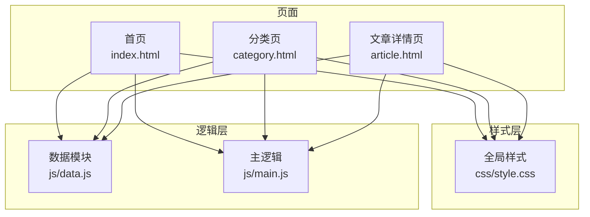
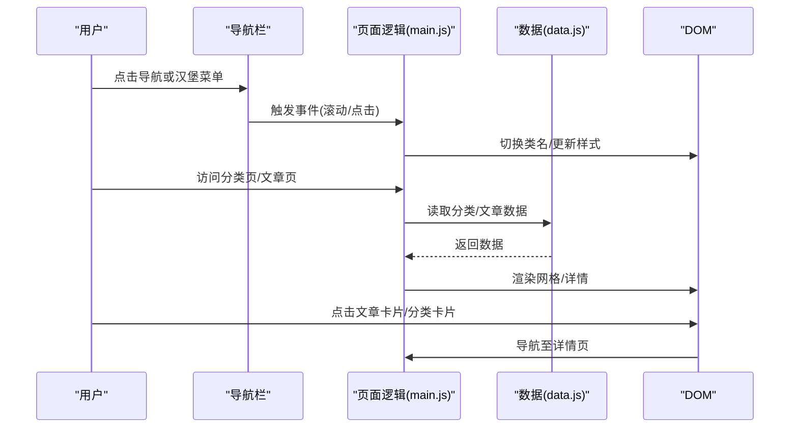
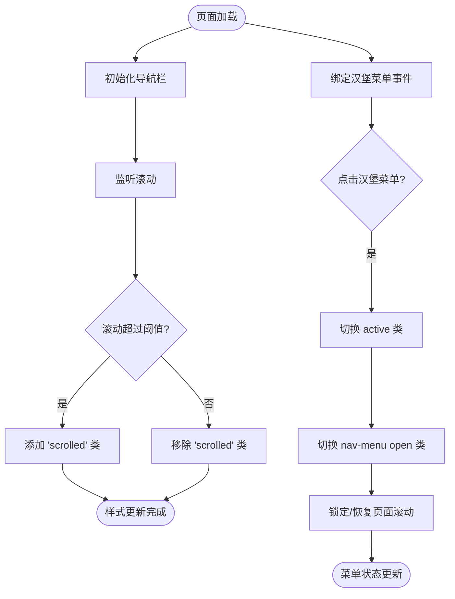
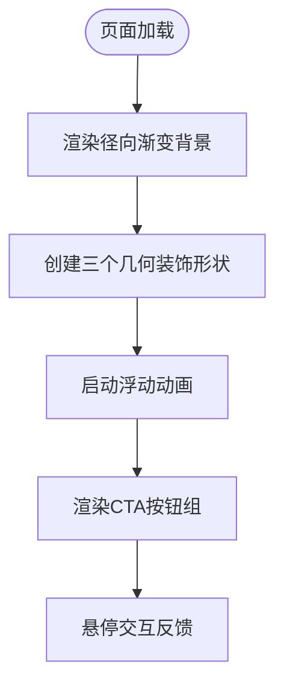
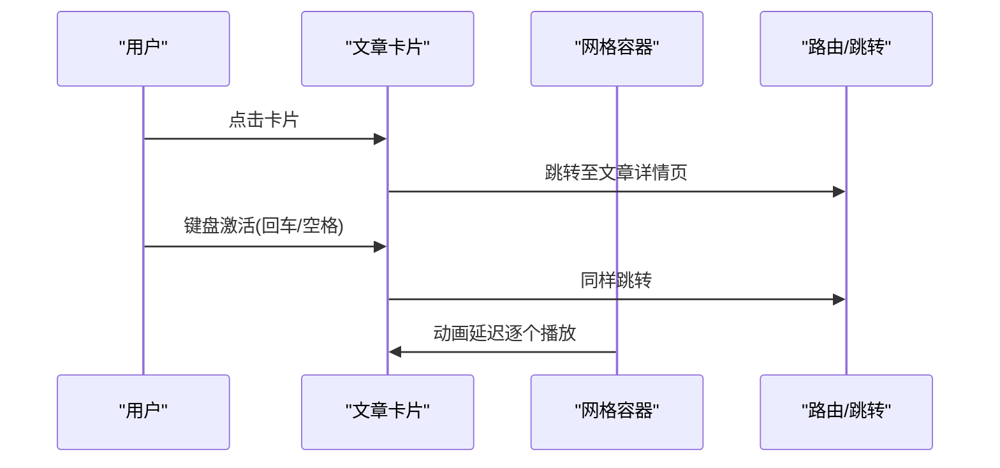
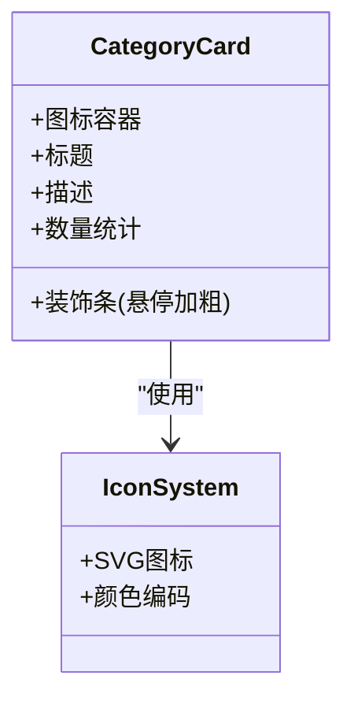
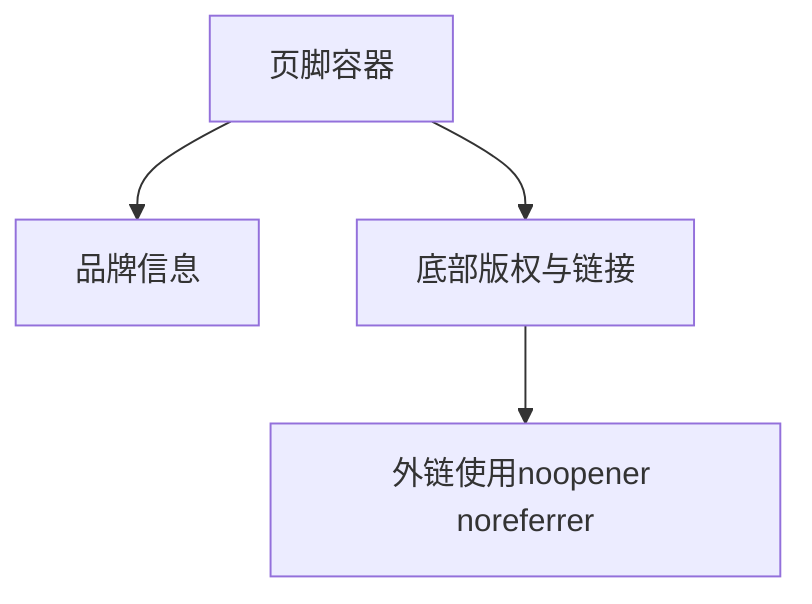
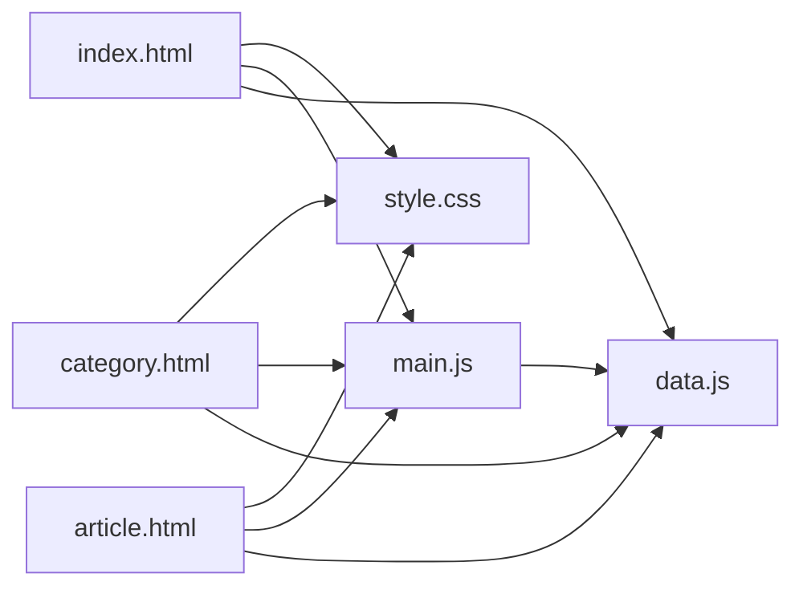

# 用户界面组件

<cite>
**本文引用的文件**
- [index.html](file://index.html)
- [category.html](file://category.html)
- [article.html](file://article.html)
- [style.css](file://css/style.css)
- [main.js](file://js/main.js)
- [data.js](file://js/data.js)
</cite>

## 目录
1. [简介](#简介)
2. [项目结构](#项目结构)
3. [核心组件](#核心组件)
4. [架构总览](#架构总览)
5. [组件详解](#组件详解)
6. [依赖关系分析](#依赖关系分析)
7. [性能考量](#性能考量)
8. [故障排查指南](#故障排查指南)
9. [结论](#结论)
10. [附录](#附录)

## 简介
本文件面向Hot-Site项目的UI组件，围绕导航栏、Hero区域、文章卡片、分类卡片、页脚等核心组件，系统梳理其设计与实现，覆盖响应式布局、活动状态管理、无障碍支持、交互行为、视觉效果、动画与性能优化策略，并提供CSS变量体系与自定义方法，帮助开发者快速理解与扩展组件。

## 项目结构
Hot-Site采用静态站点结构，HTML页面通过统一的CSS样式与JavaScript逻辑驱动，数据由独立的JS模块提供。页面包含首页、分类页、文章详情页三类，分别承载不同的组件组合与交互。

图表来源
- [index.html](file://index.html)
- [category.html](file://category.html)
- [article.html](file://article.html)
- [style.css](file://css/style.css)
- [main.js](file://js/main.js)
- [data.js](file://js/data.js)

章节来源
- [index.html:1-190](file://index.html#L1-L190)
- [category.html:1-103](file://category.html#L1-L103)
- [article.html:1-107](file://article.html#L1-L107)
- [style.css:1-1166](file://css/style.css#L1-L1166)
- [main.js:1-461](file://js/main.js#L1-L461)
- [data.js:1-158](file://js/data.js#L1-L158)

## 核心组件
- 导航栏：固定定位、玻璃态背景、响应式汉堡菜单、滚动样式切换、活动状态管理、键盘可达性。
- Hero区域：渐变背景、几何装饰动画、主副标题、CTA按钮组。
- 文章卡片：封面图缩放、分类徽章、日期、标题与摘要、点击跳转、键盘激活。
- 分类卡片：图标系统、颜色编码、数量统计占位、悬停装饰条。
- 页脚：品牌信息、描述、底部链接区。
- 组件间协作：通过URL参数与状态管理实现跨页面导航与筛选；Markdown渲染与图片Lightbox增强阅读体验。

章节来源
- [index.html:30-53](file://index.html#L30-L53)
- [index.html:55-75](file://index.html#L55-L75)
- [index.html:86-89](file://index.html#L86-L89)
- [index.html:100-160](file://index.html#L100-L160)
- [index.html:165-184](file://index.html#L165-L184)
- [style.css:147-258](file://css/style.css#L147-L258)
- [style.css:259-406](file://css/style.css#L259-L406)
- [style.css:431-555](file://css/style.css#L431-L555)
- [style.css:550-628](file://css/style.css#L550-L628)
- [style.css:969-1028](file://css/style.css#L969-L1028)

## 架构总览
组件架构遵循“HTML结构 + CSS样式 + JavaScript逻辑 + 数据模块”的分层设计。页面通过data-page属性识别当前页面，主逻辑根据页面类型初始化对应功能；数据模块提供分类与文章元数据，供渲染与筛选使用。

图表来源
- [main.js:436-460](file://js/main.js#L436-L460)
- [data.js:115-136](file://js/data.js#L115-L136)
- [index.html:29](file://index.html#L29)
- [category.html:27](file://category.html#L27)
- [article.html:27](file://article.html#L27)

## 组件详解

### 导航栏组件
- 结构与角色
  - 固定定位容器，包含Logo、汉堡菜单、导航菜单。
  - 菜单项具备ARIA角色与标签，支持键盘导航。
- 活动状态管理
  - 首页导航项默认为活动状态，其他页面通过URL参数或点击切换。
  - 滚动超过阈值时添加“scrolled”类，切换玻璃态背景与阴影。
- 响应式与汉堡菜单
  - 移动端显示汉堡菜单，点击展开全屏侧边菜单，点击菜单项自动收起。
  - 展开时锁定页面滚动，收起时恢复滚动。
- 无障碍支持
  - 汉堡按钮提供aria-label与aria-expanded，菜单项使用menubar/menuitem角色。
  - Logo与装饰图标设置aria-hidden，避免重复读屏。
- 交互与动画
  - 汉堡菜单的三条线在active状态下执行旋转与透明度变化。
  - 导航链接悬停与活动态有颜色与背景过渡。

图表来源
- [main.js:44-77](file://js/main.js#L44-L77)
- [style.css:147-258](file://css/style.css#L147-L258)
- [index.html:31-51](file://index.html#L31-L51)

章节来源
- [index.html:30-53](file://index.html#L30-L53)
- [style.css:147-258](file://css/style.css#L147-L258)
- [main.js:44-77](file://js/main.js#L44-L77)

### Hero区域
- 视觉设计
  - 径向渐变背景叠加多处发光椭圆，营造科技感氛围。
  - 几何装饰形状（geo-1/2/3）使用不同颜色与动画，实现漂浮效果。
- 文本与CTA
  - 主标题使用可缩放字体大小，副标题强调段落间距与行高。
  - CTA按钮组包含主次两种样式，支持悬停动画与阴影变化。
- 动画与性能
  - 装饰形状使用CSS动画，配合backdrop-filter与transform，保证流畅度。

图表来源
- [index.html:55-75](file://index.html#L55-L75)
- [style.css:259-406](file://css/style.css#L259-L406)

章节来源
- [index.html:55-75](file://index.html#L55-L75)
- [style.css:259-406](file://css/style.css#L259-L406)

### 文章卡片组件
- 布局结构
  - 封面图容器（16:10比例），内嵌分类徽章与缩放图片。
  - 卡片主体包含日期、标题（限制行数）、摘要（限制行数）。
- 交互行为
  - 整体可点击，点击跳转至文章详情页。
  - 支持键盘激活（回车/空格），提升可访问性。
- 视觉效果
  - 玻璃态背景与边框，悬停时提升、阴影与边框颜色变化。
  - 图片在悬停时轻微放大，增强层次感。
- 性能优化
  - 图片懒加载与缩略图加载策略，减少首屏压力。
  - 动画延迟逐个触发，形成有序入场动画。

图表来源
- [main.js:81-116](file://js/main.js#L81-L116)
- [style.css:431-555](file://css/style.css#L431-L555)

章节来源
- [main.js:81-116](file://js/main.js#L81-L116)
- [style.css:431-555](file://css/style.css#L431-L555)

### 分类卡片组件
- 设计理念
  - 每个分类卡片包含图标、标题、描述与数量统计占位。
  - 悬停时顶部装饰条加粗，体现动态反馈。
- 图标系统与颜色编码
  - 使用SVG图标，图标容器背景与主题色一致，保持视觉统一。
  - 分类徽章与卡片装饰条使用线性渐变，区分不同类别。
- 数量统计
  - 卡片底部展示“X 篇文章”，当前HTML中为占位文本，可结合数据模块动态填充。
- 响应式适配
  - 在小屏设备下网格列数调整，确保可读性与触控友好。

图表来源
- [index.html:100-160](file://index.html#L100-L160)
- [style.css:550-628](file://css/style.css#L550-L628)

章节来源
- [index.html:100-160](file://index.html#L100-L160)
- [style.css:550-628](file://css/style.css#L550-L628)

### 页脚组件
- 信息架构
  - 顶部包含品牌标识与简短描述，底部包含版权信息与链接区。
- 链接管理
  - 外链使用noopener noreferrer，避免安全风险。
- 视觉风格
  - 深色背景与浅色文字，强调对比度与可读性。
  - 链接悬停时颜色变化，提供明确交互反馈。

图表来源
- [index.html:165-184](file://index.html#L165-L184)
- [style.css:969-1028](file://css/style.css#L969-L1028)

章节来源
- [index.html:165-184](file://index.html#L165-L184)
- [style.css:969-1028](file://css/style.css#L969-L1028)

### CSS变量系统与自定义
- 变量体系
  - 主题色、辅助色、强调色、中性色、背景、文字、玻璃态、间距、圆角、过渡、布局等。
- 自定义方法
  - 在根元素覆盖变量值即可实现主题切换。
  - 通过媒体查询在小屏设备调整布局变量，如导航高度、容器间距等。
- 组件复用
  - 组件样式广泛使用var(--xxx)变量，便于统一风格与快速定制。

章节来源
- [style.css:7-78](file://css/style.css#L7-L78)
- [style.css:1029-1106](file://css/style.css#L1029-L1106)

## 依赖关系分析
- HTML页面依赖全局样式与脚本，主逻辑根据data-page识别页面类型并初始化相应功能。
- 主逻辑依赖数据模块提供的分类与文章数据，用于渲染网格与详情。
- 分类页通过URL参数cat控制筛选，使用pushState更新地址栏并同步UI状态。
- 文章详情页通过URL参数id加载对应Markdown内容，使用marked.js渲染。

图表来源
- [index.html:29](file://index.html#L29)
- [category.html:27](file://category.html#L27)
- [article.html:27](file://article.html#L27)
- [main.js:436-460](file://js/main.js#L436-L460)
- [data.js:115-136](file://js/data.js#L115-L136)

章节来源
- [index.html:29](file://index.html#L29)
- [category.html:27](file://category.html#L27)
- [article.html:27](file://article.html#L27)
- [main.js:436-460](file://js/main.js#L436-L460)
- [data.js:115-136](file://js/data.js#L115-L136)

## 性能考量
- 渲染优化
  - 文章卡片逐个设置animation-delay，形成有序入场，避免同时大量动画造成卡顿。
  - 图片懒加载与缩略图策略降低首屏资源消耗。
- 交互优化
  - 防抖函数用于滚动事件，减少频繁计算。
  - 汉堡菜单展开时锁定滚动，避免滚动抖动。
- 动画与过渡
  - 使用transform与opacity等可合成属性，优先GPU加速。
  - 控制动画时长与缓动，保证流畅度与可感知性。
- 可访问性
  - ARIA角色与标签确保屏幕阅读器可用。
  - 键盘可达性完善，支持Tab顺序与激活键。

章节来源
- [main.js:28-39](file://js/main.js#L28-L39)
- [main.js:60-76](file://js/main.js#L60-L76)
- [style.css:130-138](file://css/style.css#L130-L138)
- [style.css:468-473](file://css/style.css#L468-L473)

## 故障排查指南
- 文章详情页空白
  - 检查URL参数id是否存在，确认数据模块存在对应文章。
  - 确认Markdown文件路径正确且可访问。
- 分类筛选无效
  - 检查筛选按钮是否正确绑定事件，确认pushState更新成功。
  - 确认getArticlesByCategory返回结果符合预期。
- 导航栏不响应
  - 检查滚动事件防抖是否生效，确认scrolled类切换逻辑。
  - 确认汉堡菜单事件绑定与open类切换正常。
- 图片Lightbox无法关闭
  - 检查ESC事件监听与overlay类切换。
  - 确认点击遮罩层关闭逻辑。

章节来源
- [main.js:220-243](file://js/main.js#L220-L243)
- [main.js:156-177](file://js/main.js#L156-L177)
- [main.js:44-77](file://js/main.js#L44-L77)
- [main.js:316-371](file://js/main.js#L316-L371)

## 结论
Hot-Site的UI组件以统一的CSS变量体系为基础，结合清晰的HTML结构与健壮的JavaScript逻辑，实现了良好的响应式体验与无障碍支持。导航栏、Hero区域、文章卡片、分类卡片与页脚均体现了设计一致性与交互细节的关注。通过合理的动画与性能策略，整体用户体验流畅自然。建议后续可进一步完善分类卡片的数量统计动态填充与更多可访问性细节优化。

## 附录
- 组件状态与事件映射
  - 导航栏：滚动事件 -> 切换scrolled类；汉堡菜单点击 -> 切换active/open类；菜单项点击 -> 收起菜单。
  - 分类页：筛选按钮点击 -> pushState更新URL -> 刷新文章网格。
  - 文章详情页：Markdown加载失败 -> 显示错误状态。
- 可扩展点
  - 分类卡片数量统计：结合数据模块动态渲染。
  - 主题切换：通过覆盖CSS变量实现。
  - 动画增强：为更多交互增加过渡与反馈。