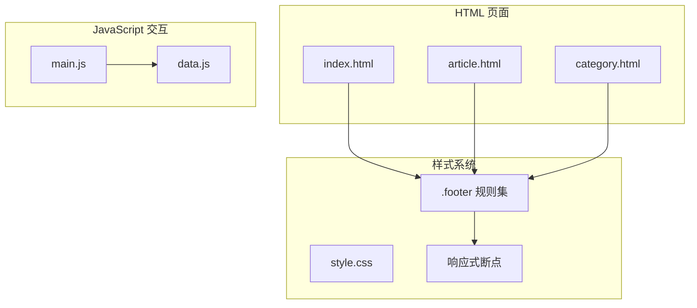
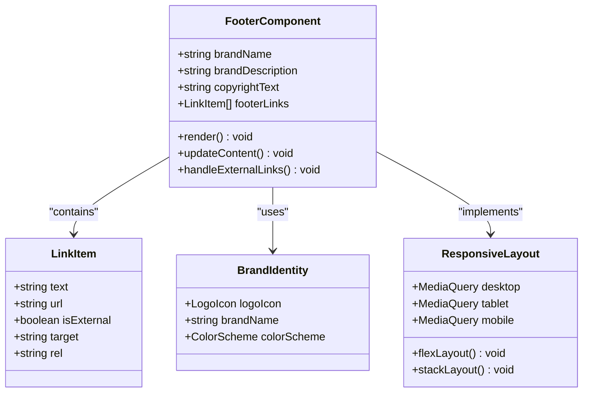
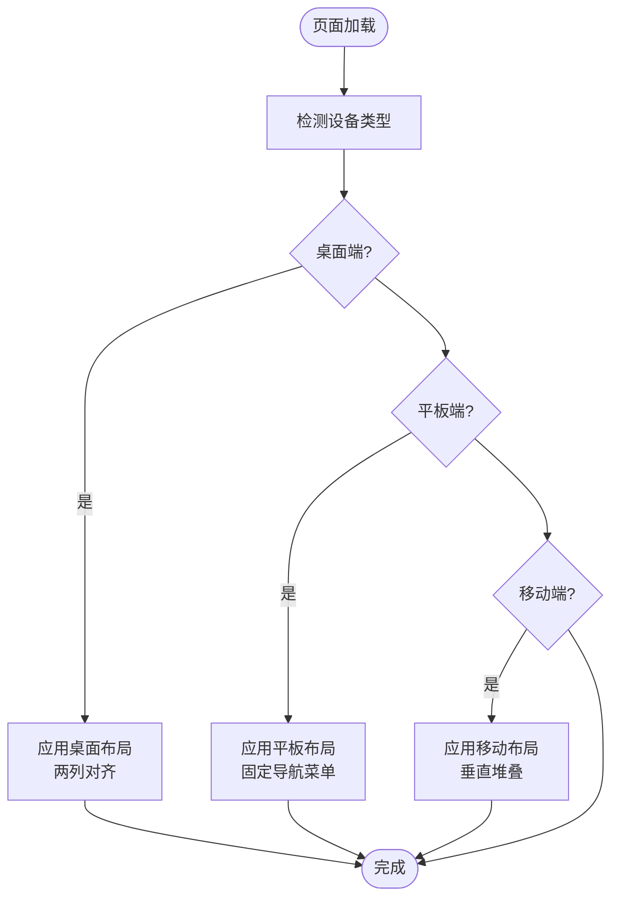
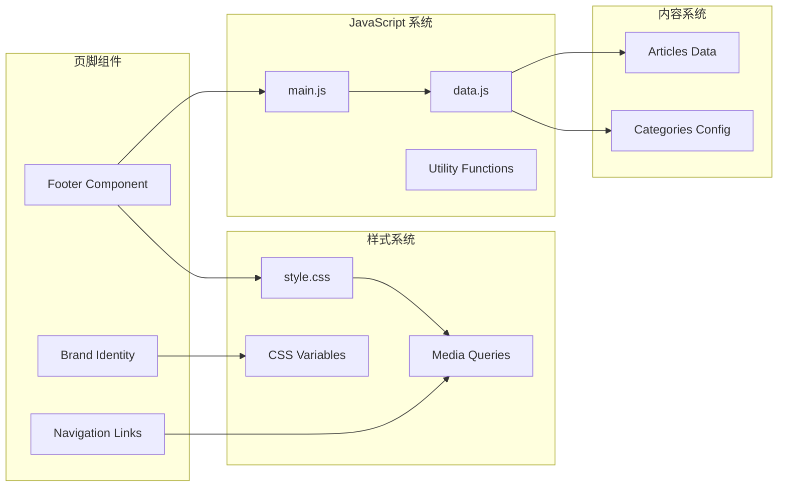

# 页脚组件

<cite>
**本文档引用的文件**
- [index.html](file://index.html)
- [article.html](file://article.html)
- [category.html](file://category.html)
- [style.css](file://css/style.css)
- [main.js](file://js/main.js)
- [data.js](file://js/data.js)
</cite>

## 目录
1. [简介](#简介)
2. [项目结构](#项目结构)
3. [核心组件](#核心组件)
4. [架构概览](#架构概览)
5. [详细组件分析](#详细组件分析)
6. [依赖关系分析](#依赖关系分析)
7. [性能考虑](#性能考虑)
8. [故障排除指南](#故障排除指南)
9. [结论](#结论)

## 简介

Hot-Site 项目的页脚组件是一个精心设计的响应式布局系统，负责展示品牌标识、描述信息和版权信息。该组件采用现代化的设计理念，结合了无障碍访问支持和跨设备兼容性，为用户提供一致的品牌体验。

页脚组件的核心特点包括：
- 统一的品牌视觉识别系统
- 清晰的信息层次结构
- 完善的响应式设计
- 无障碍访问支持
- 外部链接安全处理

## 项目结构

Hot-Site 项目采用静态网站架构，页脚组件在三个主要页面中都有实现：首页、文章详情页和分类页面。每个页面都包含相同的页脚结构，确保品牌一致性。

**图表来源**
- [index.html:165-184](file://index.html#L165-L184)
- [style.css:969-1028](file://css/style.css#L969-L1028)

**章节来源**
- [index.html:165-184](file://index.html#L165-L184)
- [article.html:82-101](file://article.html#L82-L101)
- [category.html:78-97](file://category.html#L78-L97)

## 核心组件

页脚组件由三个主要部分组成：

### 品牌区域
- **品牌标识**：包含自定义 SVG 图标和品牌名称
- **品牌描述**：简短的品牌使命或价值声明
- **视觉设计**：统一的配色方案和字体规范

### 底部区域
- **版权信息**：年份和版权声明
- **导航链接**：外部链接和内部导航
- **链接安全**：外部链接的安全处理机制

### 响应式布局
- **桌面端**：两列布局，内容居中对齐
- **平板端**：适配中间断点的布局调整
- **移动端**：单列堆叠布局，优化触摸交互

**章节来源**
- [index.html:166-183](file://index.html#L166-L183)
- [style.css:969-1028](file://css/style.css#L969-L1028)

## 架构概览

页脚组件采用模块化设计，通过 CSS 变量实现主题一致性，通过 JavaScript 实现动态内容更新。

**图表来源**
- [style.css:969-1028](file://css/style.css#L969-L1028)
- [data.js:7-37](file://js/data.js#L7-L37)

## 详细组件分析

### 品牌设计元素

页脚组件采用统一的品牌视觉系统，确保在所有页面中保持一致的品牌识别。

#### Logo 图标设计
Logo 采用几何图形组合，体现现代科技感：
- **主形状**：旋转 45 度的正方形
- **装饰元素**：中心白色小方块
- **渐变色彩**：紫色到青色的渐变效果
- **尺寸规格**：品牌区域使用 28px × 28px

#### 品牌名称展示
品牌名称 "Hot-Site" 采用：
- **字体权重**：700 粗体
- **字号设置**：1.125rem
- **颜色方案**：白色主色调
- **间距控制**：与图标保持 0.25rem 间距

#### 品牌描述信息
描述文本提供品牌价值主张：
- **字号**：0.9375rem
- **颜色**：灰度 500 (#94a3b8)
- **行高**：1.7 倍行距
- **最大宽度**：提升可读性

**章节来源**
- [index.html:169-173](file://index.html#L169-L173)
- [style.css:986-1004](file://css/style.css#L986-L1004)

### 链接系统管理

页脚组件包含两个主要的链接区域：版权信息和导航链接。

#### 版权信息
版权文本包含：
- **年份**：动态年份显示（2026）
- **品牌名称**：Hot-Site
- **技术声明**：基于静态站点技术构建
- **样式**：0.875rem 字号，灰色调

#### 导航链接
导航链接采用分组设计：
- **GitHub 链接**：外部链接，使用 rel="noopener noreferrer"
- **关于页面**：内部导航占位符
- **联系页面**：内部导航占位符
- **间距控制**：1.5rem 间距

#### 外部链接安全处理
所有外部链接都经过安全处理：
- **target="_blank"**：在新标签页中打开
- **rel="noopener noreferrer"**：防止安全漏洞
- **无障碍支持**：为屏幕阅读器提供额外上下文

**章节来源**
- [index.html:175-182](file://index.html#L175-L182)
- [style.css:1015-1027](file://css/style.css#L1015-L1027)

### 响应式设计实现

页脚组件采用移动优先的设计原则，通过媒体查询实现多设备适配。

#### 桌面端布局
- **布局模式**：两列布局
- **对齐方式**：品牌信息左对齐，版权信息右对齐
- **间距**：品牌区域与描述之间 1.5rem 间距
- **边框**：底部 1px 分隔线

#### 平板端适配
- **断点**：768px
- **布局调整**：导航菜单改为固定定位
- **容器缩小**：左右内边距减少到 0.5rem
- **网格系统**：文章网格调整为单列

#### 移动端优化
- **断点**：480px
- **字体调整**：标题字号减小
- **布局堆叠**：底部区域垂直堆叠
- **触摸友好**：增加点击区域大小

**图表来源**
- [style.css:1029-1106](file://css/style.css#L1029-L1106)

**章节来源**
- [style.css:1029-1106](file://css/style.css#L1029-L1106)

### 无障碍访问支持

页脚组件实现了完整的无障碍访问支持，确保所有用户都能有效使用。

#### 语义化标记
- **角色属性**：使用 role="contentinfo" 标识页脚
- **标签关联**：为重要元素提供适当的 aria-label
- **结构清晰**：使用语义化的 HTML 结构

#### 屏幕阅读器支持
- **品牌区域**：包含品牌图标和名称的完整描述
- **链接列表**：使用适当的列表结构
- **版权信息**：清晰的文本描述

#### 键盘导航支持
- **焦点管理**：确保所有可交互元素可以键盘访问
- **焦点可见性**：提供清晰的焦点指示器
- **导航顺序**：合理的 Tab 键顺序

**章节来源**
- [index.html:166](file://index.html#L166)
- [style.css:969-1028](file://css/style.css#L969-L1028)

## 依赖关系分析

页脚组件与其他系统组件存在以下依赖关系：

**图表来源**
- [style.css:969-1028](file://css/style.css#L969-L1028)
- [main.js:6-11](file://js/main.js#L6-L11)
- [data.js:6-37](file://js/data.js#L6-L37)

**章节来源**
- [main.js:6-11](file://js/main.js#L6-L11)
- [data.js:6-37](file://js/data.js#L6-L37)

## 性能考虑

页脚组件在设计时充分考虑了性能优化：

### 样式优化
- **CSS 变量**：减少重复的颜色值定义
- **媒体查询**：仅在必要时应用复杂的布局规则
- **硬件加速**：利用 CSS3 变换和过渡效果

### 内容优化
- **懒加载**：图片内容采用懒加载机制
- **缓存策略**：静态资源具备良好的缓存控制
- **压缩优化**：CSS 和 JavaScript 文件经过压缩

### 交互优化
- **事件委托**：减少事件监听器的数量
- **防抖处理**：滚动事件使用防抖优化
- **内存管理**：及时清理事件监听器和定时器

## 故障排除指南

### 常见问题及解决方案

#### 页脚不显示
**症状**：页脚在某些页面中不显示
**原因**：HTML 结构错误或 CSS 样式冲突
**解决方法**：检查 HTML 结构是否正确，确认 CSS 类名匹配

#### 链接无法点击
**症状**：页脚链接无法正常工作
**原因**：JavaScript 事件绑定失败或 CSS z-index 问题
**解决方法**：检查 JavaScript 控制台错误，验证 CSS 层级关系

#### 响应式布局异常
**症状**：在移动设备上布局错乱
**原因**：媒体查询断点设置不当或 CSS 优先级问题
**解决方法**：检查媒体查询语法，验证 CSS 优先级顺序

#### 无障碍功能失效
**症状**：屏幕阅读器无法正确读取页脚内容
**原因**：语义化标记缺失或 ARIA 属性配置错误
**解决方法**：添加适当的 role 属性和 aria-label 描述

**章节来源**
- [style.css:969-1028](file://css/style.css#L969-L1028)
- [main.js:436-460](file://js/main.js#L436-L460)

## 结论

Hot-Site 项目的页脚组件展现了现代 Web 开发的最佳实践。通过精心设计的品牌识别系统、完善的响应式布局和全面的无障碍访问支持，该组件为用户提供了优秀的用户体验。

组件的主要优势包括：
- **一致性**：在所有页面中保持统一的品牌形象
- **可用性**：简洁明了的信息架构和导航设计
- **可访问性**：完整的无障碍支持和键盘导航
- **性能**：优化的代码结构和资源加载策略
- **可维护性**：模块化的代码组织和清晰的文档

未来可以考虑的改进方向：
- 添加更多品牌元素的自定义选项
- 增强动态内容的更新机制
- 扩展多语言支持功能
- 集成更多的社交媒体平台链接