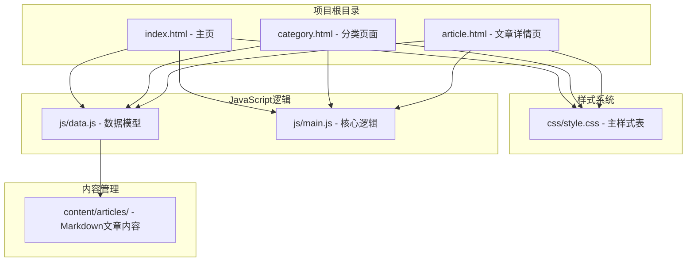
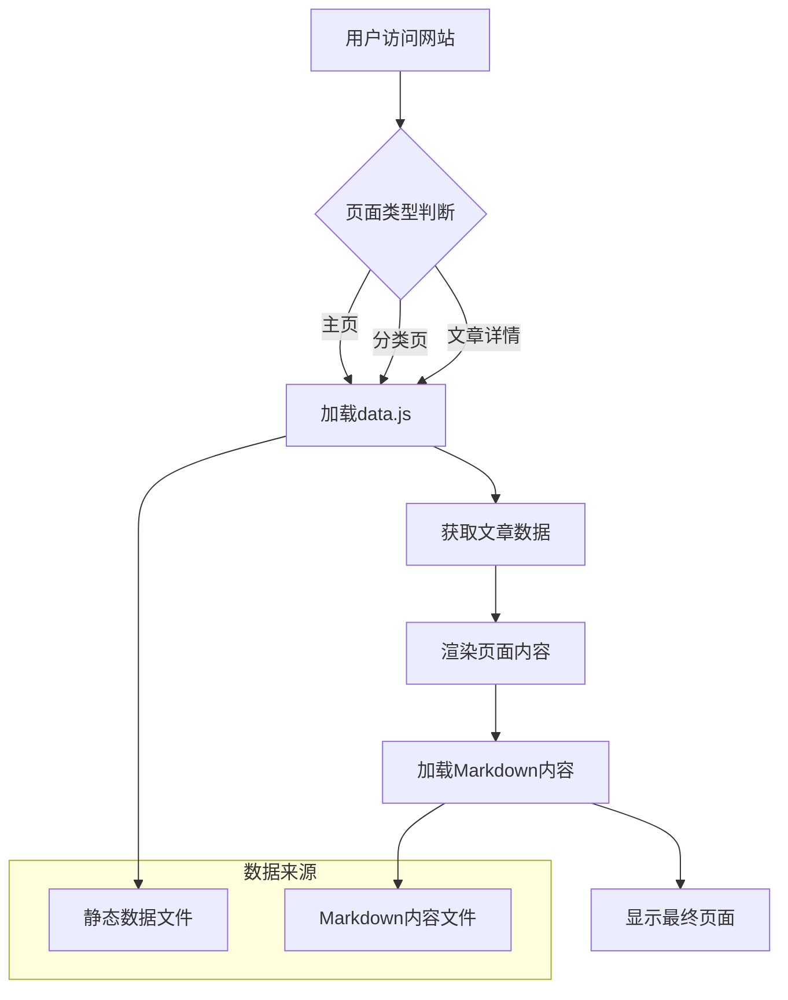
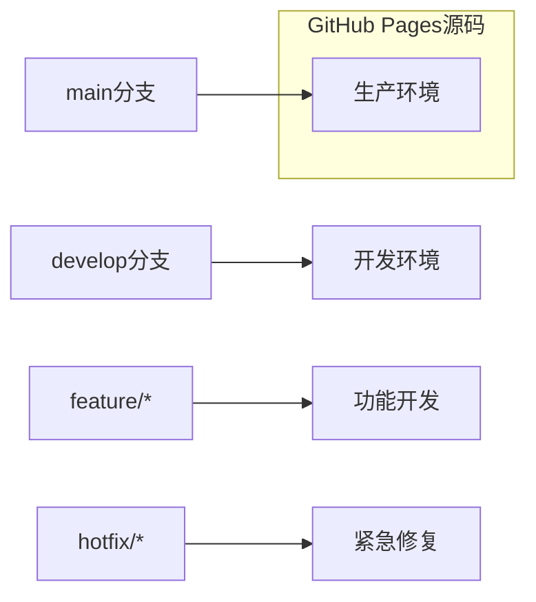
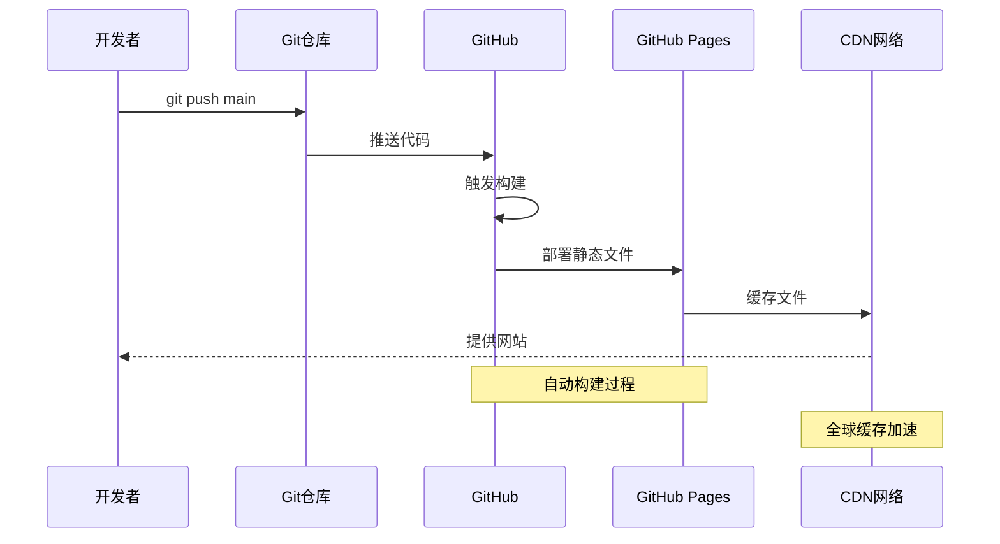
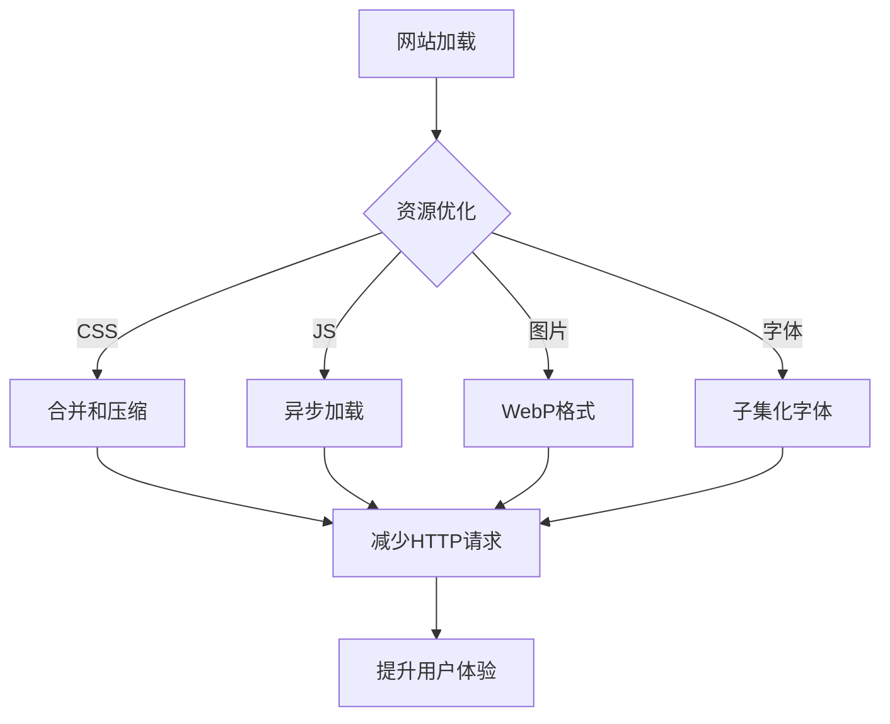
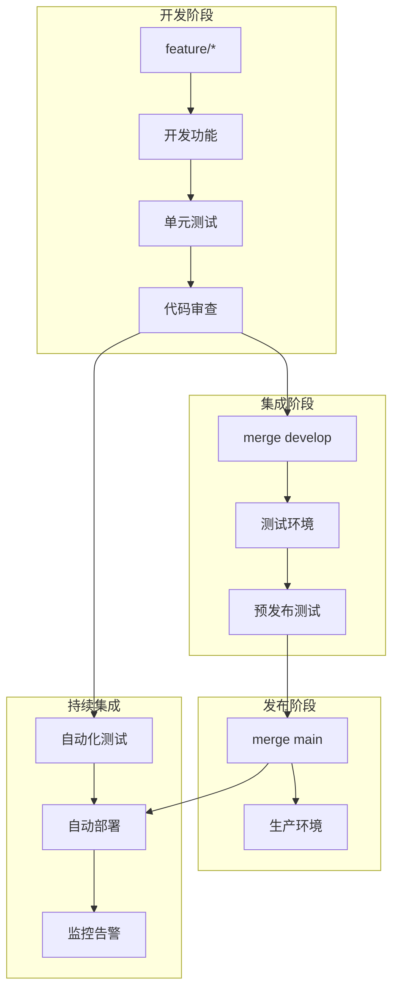
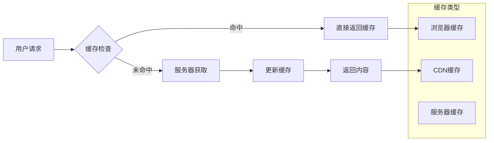

# GitHub Pages 部署配置

<cite>
**本文档引用的文件**
- [index.html](file://index.html)
- [category.html](file://category.html)
- [article.html](file://article.html)
- [style.css](file://css/style.css)
- [main.js](file://js/main.js)
- [data.js](file://js/data.js)
- [article-4.md](file://content/articles/article-4.md)
- [CLAUDE.md](file://CLAUDE.md)
</cite>

## 目录
1. [简介](#简介)
2. [项目结构概览](#项目结构概览)
3. [GitHub Pages部署准备](#github-pages部署准备)
4. [仓库设置配置](#仓库设置配置)
5. [分支和源码配置](#分支和源码配置)
6. [完整的部署流程](#完整的部署流程)
7. [自定义域名配置](#自定义域名配置)
8. [构建过程和缓存策略](#构建过程和缓存策略)
9. [版本控制最佳实践](#版本控制最佳实践)
10. [常见问题排查](#常见问题排查)
11. [性能优化建议](#性能优化建议)
12. [总结](#总结)

## 简介

Hot-Site是一个基于纯静态HTML、CSS和JavaScript的现代化个人博客/知识库网站。该项目完全依赖客户端JavaScript进行内容渲染，不需要任何服务器端处理或构建工具。本文档将详细介绍如何将Hot-Site项目成功部署到GitHub Pages，包括完整的配置步骤、最佳实践和故障排除方法。

## 项目结构概览

Hot-Site项目采用简洁的静态网站架构，主要由以下核心文件组成：



**图表来源**
- [index.html:1-190](file://index.html#L1-L190)
- [category.html:1-103](file://category.html#L1-L103)
- [article.html:1-107](file://article.html#L1-L107)

**章节来源**
- [index.html:1-190](file://index.html#L1-L190)
- [category.html:1-103](file://category.html#L1-L103)
- [article.html:1-107](file://article.html#L1-L107)
- [style.css:1-800](file://css/style.css#L1-L800)
- [main.js:1-461](file://js/main.js#L1-L461)
- [data.js:1-158](file://js/data.js#L1-L158)

## GitHub Pages部署准备

### 环境要求

Hot-Site项目具有以下部署特性：

- **纯静态文件**：无需服务器端语言或构建工具
- **客户端渲染**：所有内容通过JavaScript动态加载
- **CDN依赖**：部分外部资源通过CDN加载
- **本地开发友好**：支持Python内置HTTP服务器

### 项目特性分析



**图表来源**
- [main.js:220-243](file://js/main.js#L220-L243)
- [data.js:40-113](file://js/data.js#L40-L113)

**章节来源**
- [CLAUDE.md:35-57](file://CLAUDE.md#L35-L57)
- [main.js:272-314](file://js/main.js#L272-L314)
- [data.js:115-136](file://js/data.js#L115-L136)

## 仓库设置配置

### 仓库创建和初始化

1. **创建GitHub仓库**
   - 访问GitHub并创建新的仓库
   - 仓库名称建议使用 `username.github.io` 格式
   - 选择公开仓库（免费）

2. **本地仓库初始化**
   ```bash
   git init
   git remote add origin https://github.com/username/username.github.io.git
   ```

3. **推送初始代码**
   ```bash
   git add .
   git commit -m "Initial commit"
   git push -u origin main
   ```

### 仓库权限设置

- **管理员权限**：确保拥有仓库的管理员权限
- **Pages权限**：确认有权限访问仓库设置中的GitHub Pages功能
- **分支保护**：根据需要设置分支保护规则

## 分支和源码配置

### 分支策略

Hot-Site项目推荐使用以下分支策略：



### 源码选择配置

GitHub Pages支持多种源码配置方式：

| 源码选项 | 说明 | 适用场景 |
|---------|------|----------|
| `/ (根目录)` | 从根目录提供文件 | 简单静态网站 |
| `/docs` | 从docs目录提供文件 | 文档专用 |
| `/ (gh-pages分支)` | 从gh-pages分支提供 | 复杂项目结构 |

对于Hot-Site项目，推荐使用 `/ (根目录)` 配置。

**章节来源**
- [CLAUDE.md:35-39](file://CLAUDE.md#L35-L39)

## 完整的部署流程

### 第一步：本地开发环境搭建

1. **启动本地服务器**
   ```bash
   python -m http.server 8080
   # 或者使用 npx serve .
   ```

2. **验证网站功能**
   - 打开浏览器访问 `http://localhost:8080`
   - 验证所有页面正常加载
   - 测试文章分类和搜索功能

### 第二步：代码提交和推送

1. **添加所有文件**
   ```bash
   git add .
   ```

2. **创建提交**
   ```bash
   git commit -m "feat: 完成Hot-Site部署配置"
   ```

3. **推送到GitHub**
   ```bash
   git push origin main
   ```

### 第三步：启用GitHub Pages服务

1. **进入仓库设置**
   - 点击仓库页面的 "Settings" 标签
   - 在左侧菜单中选择 "Pages"

2. **配置Pages服务**
   - **选择分支**：选择 `main` 分支
   - **选择源码**：选择 `/ (root)`
   - **保存设置**

3. **等待部署完成**
   - GitHub会自动开始构建过程
   - 等待几分钟直到部署完成

### 第四步：验证部署结果

1. **访问网站**
   - 部署完成后，GitHub会显示URL
   - 访问 `https://username.github.io/` 验证网站

2. **功能测试**
   - 测试所有页面导航
   - 验证文章内容加载
   - 检查样式和响应式设计

**章节来源**
- [CLAUDE.md:26-34](file://CLAUDE.md#L26-L34)
- [CLAUDE.md:35-39](file://CLAUDE.md#L35-L39)

## 自定义域名配置

### 域名准备

1. **购买域名**
   - 选择合适的域名提供商
   - 确保域名解析到GitHub Pages

2. **DNS配置**
   - 添加CNAME记录指向 `username.github.io`
   - 配置HTTPS证书（GitHub Pages自动提供）

### CNAME文件设置

1. **创建CNAME文件**
   ```bash
   echo "yourdomain.com" > CNAME
   ```

2. **提交到仓库**
   ```bash
   git add CNAME
   git commit -m "Add custom domain"
   git push origin main
   ```

### HTTPS配置

GitHub Pages自动为自定义域名提供HTTPS支持：

- **Let's Encrypt证书**：自动签发和续期
- **HTTP/2支持**：提升加载速度
- **CDN加速**：全球节点分发

**章节来源**
- [CLAUDE.md:40-46](file://CLAUDE.md#L40-L46)

## 构建过程和缓存策略

### GitHub Pages构建机制



### 缓存策略配置

1. **浏览器缓存**
   - CSS文件：长期缓存（1年）
   - JavaScript文件：短期缓存（1个月）
   - HTML文件：短时间缓存（5分钟）

2. **CDN缓存**
   - 静态资源：1-7天缓存
   - 动态内容：短时间缓存
   - 版本化文件名：避免缓存问题

### 性能优化建议



**章节来源**
- [style.css:1-800](file://css/style.css#L1-L800)
- [main.js:28-39](file://js/main.js#L28-L39)

## 版本控制最佳实践

### Git工作流程



### 提交规范

1. **提交消息格式**
   ```
   feat: 添加新功能
   fix: 修复bug
   docs: 更新文档
   style: 样式调整
   refactor: 代码重构
   test: 添加测试
   chore: 构建配置
   ```

2. **分支命名规范**
   - `feature/功能名称`
   - `fix/问题描述`
   - `docs/文档更新`
   - `chore/维护任务`

### 发布管理

1. **版本标签**
   ```bash
   git tag v1.0.0
   git push origin v1.0.0
   ```

2. **发布说明**
   - 记录重大变更
   - 列出已知问题
   - 提供升级指导

**章节来源**
- [CLAUDE.md:52-57](file://CLAUDE.md#L52-L57)

## 常见问题排查

### 部署失败问题

#### 1. 构建错误

**症状**：Pages服务显示构建失败

**解决方案**：
- 检查HTML语法错误
- 验证CSS文件完整性
- 确认JavaScript文件无语法错误

#### 2. 资源加载失败

**症状**：页面空白或部分内容缺失

**解决方案**：
- 检查相对路径是否正确
- 验证CDN资源可用性
- 确认跨域资源共享设置

#### 3. 自定义域名问题

**症状**：自定义域名无法访问

**解决方案**：
- 检查DNS记录配置
- 验证CNAME文件存在
- 确认SSL证书状态

### 性能问题

#### 1. 加载缓慢

**症状**：页面加载时间过长

**解决方案**：
- 启用Gzip压缩
- 优化图片大小
- 使用CDN加速

#### 2. 移动端适配问题

**症状**：移动端显示异常

**解决方案**：
- 检查响应式设计
- 验证触摸交互
- 测试不同屏幕尺寸

### 功能异常

#### 1. 文章内容不显示

**症状**：文章详情页空白

**解决方案**：
- 检查Markdown文件路径
- 验证文章数据配置
- 确认fetch请求权限

#### 2. 导航菜单失效

**症状**：移动端菜单无法打开

**解决方案**：
- 检查JavaScript文件加载
- 验证事件监听器
- 确认CSS样式冲突

**章节来源**
- [main.js:407-420](file://js/main.js#L407-L420)
- [main.js:272-314](file://js/main.js#L272-L314)

## 性能优化建议

### 代码优化

1. **JavaScript优化**
   - 使用防抖函数优化滚动事件
   - 实现懒加载机制
   - 减少DOM操作次数

2. **CSS优化**
   - 使用CSS变量统一管理样式
   - 实现媒体查询优化
   - 减少重绘和回流

3. **图片优化**
   - 使用现代图片格式（WebP）
   - 实现响应式图片
   - 添加适当的alt属性

### 缓存策略



### 监控和分析

1. **性能监控**
   - 使用Web Vitals指标
   - 监控加载时间
   - 跟踪用户行为

2. **错误追踪**
   - 设置JavaScript错误监控
   - 记录用户反馈
   - 快速响应问题

## 总结

Hot-Site项目基于纯静态技术栈，非常适合部署到GitHub Pages。通过遵循本文档的部署指南，您可以顺利完成从本地开发到生产部署的整个流程。

### 关键要点回顾

1. **部署简单性**：Hot-Site无需构建工具，直接部署即可
2. **配置简便**：GitHub Pages提供直观的配置界面
3. **成本效益**：完全免费的托管服务
4. **全球加速**：借助GitHub和CDN的全球网络
5. **维护简单**：基于Git的版本控制和部署流程

### 最佳实践建议

- 定期备份重要数据
- 使用版本控制管理变更
- 监控网站性能和可用性
- 及时更新依赖资源
- 保持代码质量和文档完整性

通过以上配置和优化，您的Hot-Site项目将能够稳定地运行在GitHub Pages上，为用户提供优质的阅读体验。