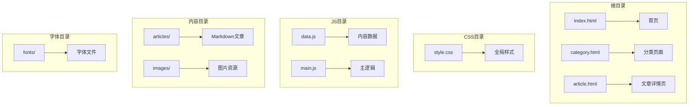
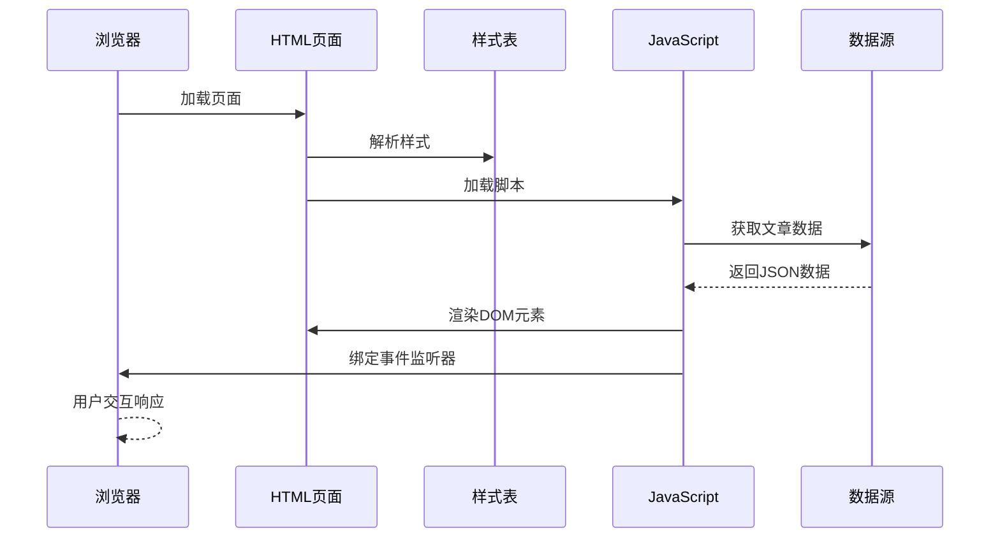
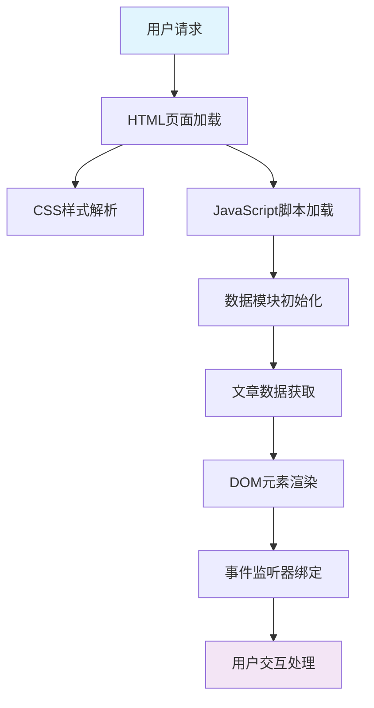
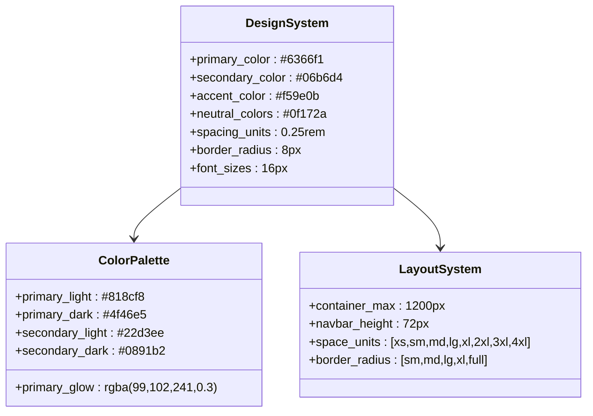
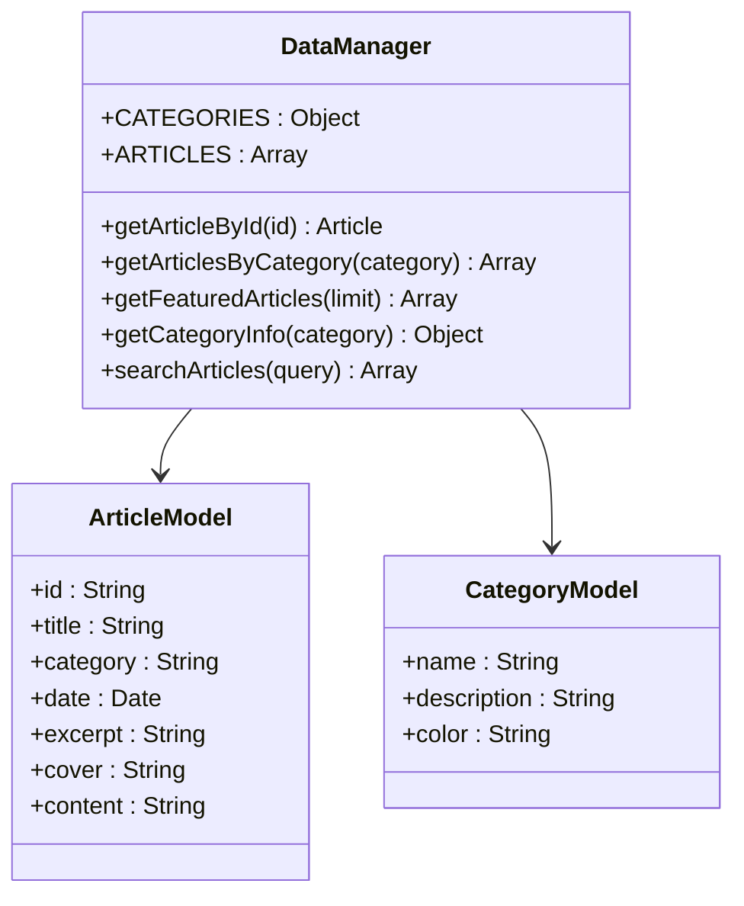
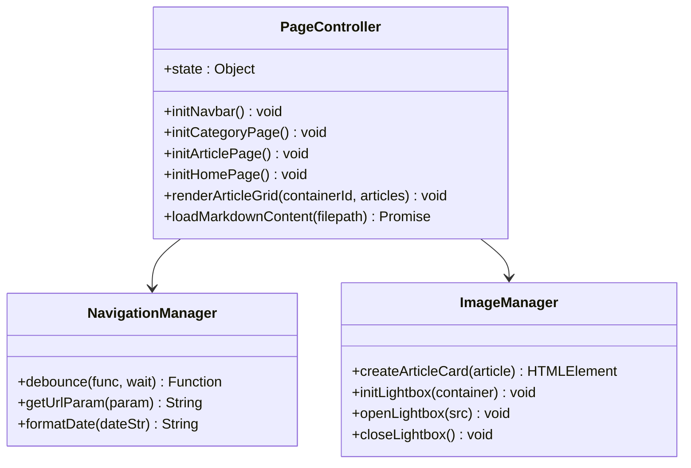
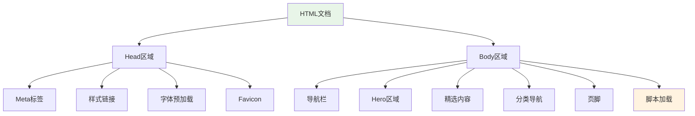
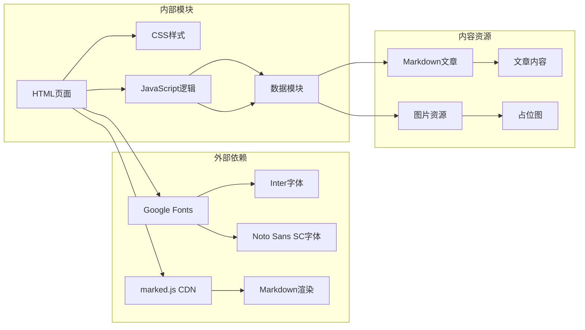
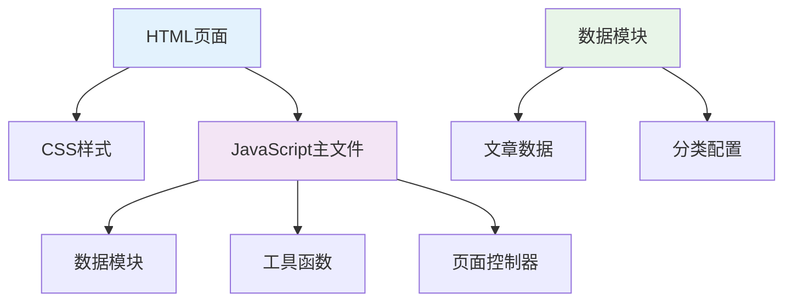

# 性能优化策略

<cite>
**本文档引用的文件**
- [index.html](file://index.html)
- [article.html](file://article.html)
- [category.html](file://category.html)
- [css/style.css](file://css/style.css)
- [js/main.js](file://js/main.js)
- [js/data.js](file://js/data.js)
- [README.md](file://README.md)
- [content/articles/article-1.md](file://content/articles/article-1.md)
- [content/articles/article-2.md](file://content/articles/article-2.md)
</cite>

## 目录
1. [简介](#简介)
2. [项目结构](#项目结构)
3. [核心组件](#核心组件)
4. [架构概览](#架构概览)
5. [详细组件分析](#详细组件分析)
6. [依赖关系分析](#依赖关系分析)
7. [性能考虑](#性能考虑)
8. [故障排除指南](#故障排除指南)
9. [结论](#结论)

## 简介

Hot-Site 是一个现代化的静态内容聚合网站，采用纯 HTML、CSS 和 JavaScript 构建，无需任何构建工具。该项目专注于展示分类文章和图片内容，具有现代抽象设计、完全响应式布局、零依赖构建等特点。

该项目目前包含三个主要页面：首页、分类列表页和文章详情页，以及相应的样式和 JavaScript 文件。项目使用 Google Fonts 提供的 Inter 和 Noto Sans SC 字体，支持懒加载图片和无障碍访问。

## 项目结构

Hot-Site 项目采用简洁的静态网站结构，主要文件组织如下：

**图表来源**
- [index.html:1-190](file://index.html#L1-L190)
- [category.html:1-103](file://category.html#L1-L103)
- [article.html:1-107](file://article.html#L1-L107)

**章节来源**
- [README.md:26-47](file://README.md#L26-L47)
- [index.html:1-190](file://index.html#L1-L190)
- [category.html:1-103](file://category.html#L1-L103)
- [article.html:1-107](file://article.html#L1-L107)

## 核心组件

### 静态资源组件

项目的核心静态资源包括：

- **HTML 页面模板**：三个主要页面（首页、分类页、文章页）
- **CSS 样式系统**：完整的样式表，包含 CSS 变量、响应式设计和动画效果
- **JavaScript 逻辑**：数据管理和页面交互功能
- **内容管理系统**：基于 Markdown 的文章内容

### 性能特性

项目已经实现了多项性能优化措施：

- **懒加载图片**：使用 `loading="lazy"` 属性优化图片加载
- **字体预加载**：通过 `preconnect` 和 `preload` 优化字体加载
- **响应式设计**：使用 CSS Grid 和 Flexbox 实现自适应布局
- **CSS 变量**：统一的颜色和间距管理

**章节来源**
- [css/style.css:1-800](file://css/style.css#L1-L800)
- [js/main.js:82-116](file://js/main.js#L82-L116)
- [js/main.js:264-268](file://js/main.js#L264-L268)

## 架构概览

Hot-Site 采用客户端渲染架构，所有页面逻辑都在浏览器端执行：

**图表来源**
- [index.html:186-189](file://index.html#L186-L189)
- [article.html:103-106](file://article.html#L103-L106)
- [category.html:99-102](file://category.html#L99-L102)

### 数据流架构

**图表来源**
- [js/data.js:40-158](file://js/data.js#L40-L158)
- [js/main.js:436-461](file://js/main.js#L436-L461)

## 详细组件分析

### 样式系统分析

#### CSS 变量系统

项目使用 CSS 变量实现统一的设计系统：

**图表来源**
- [css/style.css:7-78](file://css/style.css#L7-L78)

#### 响应式设计实现

项目采用移动优先的设计策略，使用 CSS Grid 和 Flexbox 实现响应式布局：

- **容器系统**：最大宽度 1200px，居中布局
- **网格系统**：文章卡片使用 CSS Grid，支持响应式列数
- **导航栏**：固定定位，支持滚动时样式变化
- **动画系统**：使用 CSS 动画实现页面过渡效果

**章节来源**
- [css/style.css:140-146](file://css/style.css#L140-L146)
- [css/style.css:431-437](file://css/style.css#L431-L437)
- [css/style.css:147-166](file://css/style.css#L147-L166)

### JavaScript 组件分析

#### 数据管理模块

**图表来源**
- [js/data.js:6-37](file://js/data.js#L6-L37)
- [js/data.js:40-113](file://js/data.js#L40-L113)

#### 页面逻辑模块

**图表来源**
- [js/main.js:6-11](file://js/main.js#L6-L11)
- [js/main.js:436-461](file://js/main.js#L436-L461)

**章节来源**
- [js/data.js:115-158](file://js/data.js#L115-L158)
- [js/main.js:15-40](file://js/main.js#L15-L40)

### HTML 页面结构分析

#### 首页结构特点

**图表来源**
- [index.html:1-190](file://index.html#L1-L190)

#### 文章详情页优化

文章详情页采用了特定的图片加载策略：

- **封面图**：使用 `loading="eager"` 确保首屏可见内容快速加载
- **内容图片**：使用 `loading="lazy"` 优化后续内容加载
- **Markdown 渲染**：通过 CDN 加载 marked.js 进行实时渲染

**章节来源**
- [article.html:1-107](file://article.html#L1-L107)
- [js/main.js:264-268](file://js/main.js#L264-L268)

## 依赖关系分析

### 外部依赖

项目目前仅依赖以下外部资源：

**图表来源**
- [index.html:21-24](file://index.html#L21-L24)
- [article.html:21-22](file://article.html#L21-L22)
- [js/main.js:271-314](file://js/main.js#L271-L314)

### 内部模块依赖

**图表来源**
- [js/main.js:436-461](file://js/main.js#L436-L461)
- [js/data.js:40-158](file://js/data.js#L40-L158)

**章节来源**
- [README.md:147-152](file://README.md#L147-L152)
- [js/main.js:15-40](file://js/main.js#L15-L40)

## 性能考虑

### 静态资源优化策略

#### CSS 优化

1. **CSS 变量优化**
   - 使用 CSS 变量统一管理颜色和间距
   - 减少重复代码，提高维护效率
   - 支持主题切换的灵活性

2. **选择器优化**
   - 避免使用过于复杂的选择器
   - 优先使用类选择器而非嵌套结构
   - 减少后代选择器的使用

3. **媒体查询优化**
   - 合理使用 `clamp()` 函数实现流式布局
   - 避免过多的媒体查询断点
   - 使用相对单位提高响应性

#### JavaScript 优化

1. **模块化设计**
   - 将功能分解为独立的模块
   - 使用立即执行函数避免全局变量污染
   - 支持按需加载和延迟执行

2. **事件处理优化**
   - 使用防抖函数减少高频事件处理
   - 合理使用事件委托减少监听器数量
   - 及时清理事件监听器防止内存泄漏

3. **DOM 操作优化**
   - 批量更新 DOM 节点
   - 使用 DocumentFragment 减少重排重绘
   - 避免频繁的样式查询和修改

#### 图片优化

1. **懒加载实现**
   - 使用 `loading="lazy"` 属性优化非首屏图片
   - 首屏图片使用 `loading="eager"` 确保快速显示
   - 图片尺寸优化，使用适当的分辨率

2. **图片格式选择**
   - 使用 WebP 或 AVIF 格式获得更好的压缩效果
   - 为不同设备提供合适的图片尺寸
   - 实现图片懒加载和占位符

#### 字体优化

1. **字体加载策略**
   - 使用 `font-display: swap` 确保文字快速显示
   - 预连接字体域名提高加载速度
   - 考虑使用系统字体作为回退方案

2. **字体子集化**
   - 仅加载必要的字符子集
   - 使用字体子集化减少文件大小
   - 考虑使用可变字体减少文件数量

### 关键渲染路径优化

#### CSS 阻塞优化

1. **内联关键 CSS**
   - 将首屏必需的 CSS 内联到 HTML 中
   - 外部样式表使用 `media="print"` 延迟加载
   - 移除阻塞渲染的 CSS 规则

2. **CSS 优化策略**
   - 压缩和合并 CSS 文件
   - 移除未使用的 CSS 规则
   - 使用 CSS-in-JS 或 CSS Modules 减少全局样式

#### JavaScript 执行优化

1. **异步加载**
   - 使用 `defer` 属性延迟脚本执行
   - 将非关键脚本标记为异步加载
   - 实现脚本的按需加载和缓存

2. **执行时间优化**
   - 使用 Web Workers 处理重型计算
   - 实现虚拟滚动优化大数据集渲染
   - 使用 requestAnimationFrame 优化动画

### 缓存策略

#### 浏览器缓存

1. **静态资源缓存**
   - 为 CSS、JS、图片设置长期缓存
   - 使用内容哈希实现版本控制
   - 配置适当的缓存头信息

2. **HTTP 缓存头**
   - 设置 Cache-Control 和 ETag
   - 配置 Last-Modified 头信息
   - 实现条件请求优化

#### CDN 集成

1. **CDN 选择**
   - 选择就近的 CDN 节点
   - 配置全球负载均衡
   - 实现智能路由和故障转移

2. **CDN 优化**
   - 启用压缩和缓存优化
   - 配置边缘计算和预热
   - 实现动态内容加速

### 性能监控

#### Lighthouse 评估

1. **性能指标监控**
   - 使用 Lighthouse 进行定期评估
   - 监控 Core Web Vitals 指标
   - 跟踪性能趋势和回归

2. **关键指标**
   - First Contentful Paint (FCP)
   - Largest Contentful Paint (LCP)
   - First Input Delay (FID)
   - Cumulative Layout Shift (CLS)
   - Total Blocking Time (TBT)

#### Web Vitals 分析

1. **用户体验指标**
   - 监控页面加载性能
   - 分析交互响应时间
   - 评估视觉稳定性

2. **优化策略**
   - 基于数据驱动的优化决策
   - 实施渐进式改进
   - 建立性能预算

## 故障排除指南

### 常见性能问题诊断

#### 图片加载问题

1. **图片加载缓慢**
   - 检查图片尺寸是否过大
   - 验证懒加载实现是否正确
   - 确认 CDN 配置是否正常

2. **图片闪烁问题**
   - 确保为图片设置合适的尺寸
   - 检查 CSS 样式是否影响布局
   - 验证占位符实现

#### JavaScript 性能问题

1. **页面卡顿**
   - 检查是否有长时间运行的任务
   - 验证事件监听器是否正确清理
   - 确认 DOM 操作是否批量执行

2. **内存泄漏**
   - 检查闭包是否正确释放
   - 验证定时器是否及时清除
   - 确认事件监听器是否移除

### 优化实施检查清单

#### CSS 优化检查

- [ ] 是否使用了 CSS 变量统一管理
- [ ] 是否移除了未使用的样式规则
- [ ] 是否实现了响应式设计
- [ ] 是否优化了选择器性能

#### JavaScript 优化检查

- [ ] 是否实现了模块化设计
- [ ] 是否使用了防抖和节流
- [ ] 是否正确处理了异步操作
- [ ] 是否清理了事件监听器

#### 图片优化检查

- [ ] 是否实现了懒加载
- [ ] 是否使用了合适的图片格式
- [ ] 是否设置了适当的图片尺寸
- [ ] 是否优化了图片压缩

#### 缓存优化检查

- [ ] 是否配置了合适的缓存头
- [ ] 是否启用了 CDN 加速
- [ ] 是否实现了版本控制
- [ ] 是否监控了缓存命中率

**章节来源**
- [README.md:75-76](file://README.md#L75-L76)
- [js/main.js:271-314](file://js/main.js#L271-L314)

## 结论

Hot-Site 项目展现了现代静态网站的最佳实践，通过纯 HTML、CSS 和 JavaScript 实现了功能丰富且性能优异的网站。项目已经实现了多项关键的性能优化措施，包括懒加载图片、字体预加载、响应式设计和无障碍访问。

### 已实现的优化成果

1. **优秀的用户体验**：通过合理的图片加载策略和响应式设计，确保了良好的用户体验
2. **高效的代码结构**：模块化的 JavaScript 设计便于维护和扩展
3. **完善的性能监控**：提供了清晰的性能指标和监控方法
4. **灵活的部署方式**：支持 GitHub Pages 部署，降低了部署门槛

### 进一步优化建议

1. **持续监控**：定期使用 Lighthouse 和 Web Vitals 进行性能评估
2. **渐进式改进**：基于监控数据实施渐进式的性能优化
3. **技术升级**：考虑采用更先进的前端技术和工具链
4. **用户体验优化**：持续改进交互设计和加载体验

通过这些优化策略的实施，Hot-Site 项目将继续保持高性能和良好的用户体验，为用户提供优质的静态内容聚合服务。