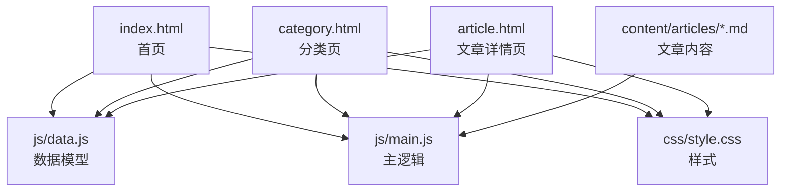
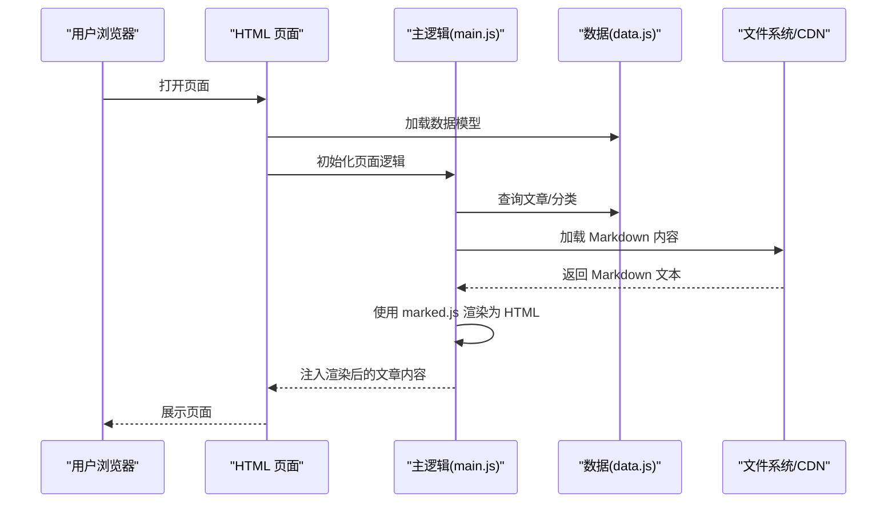
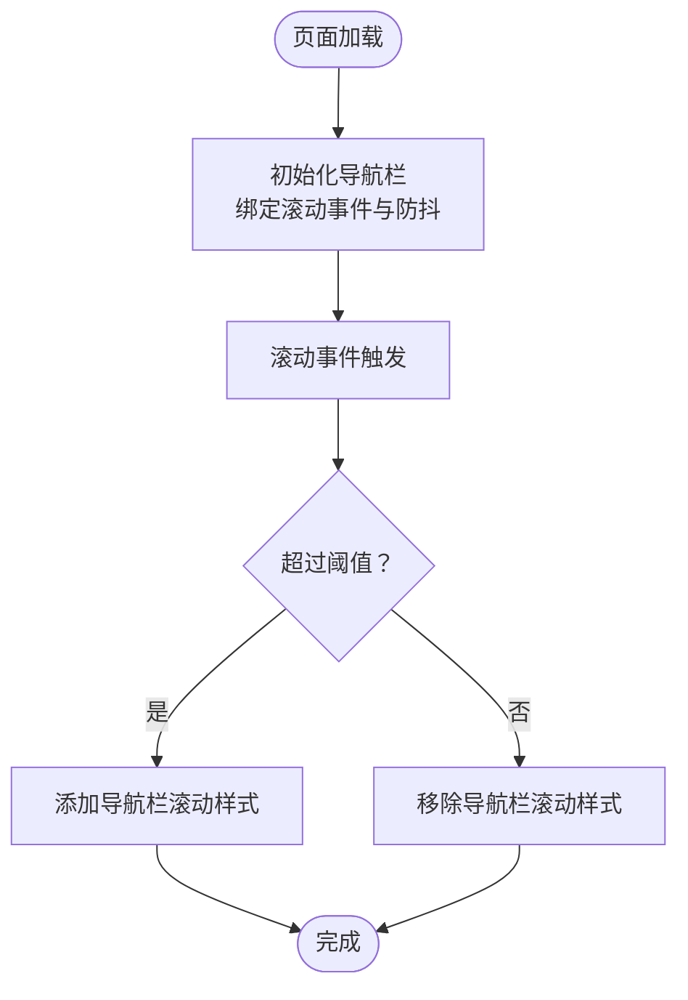
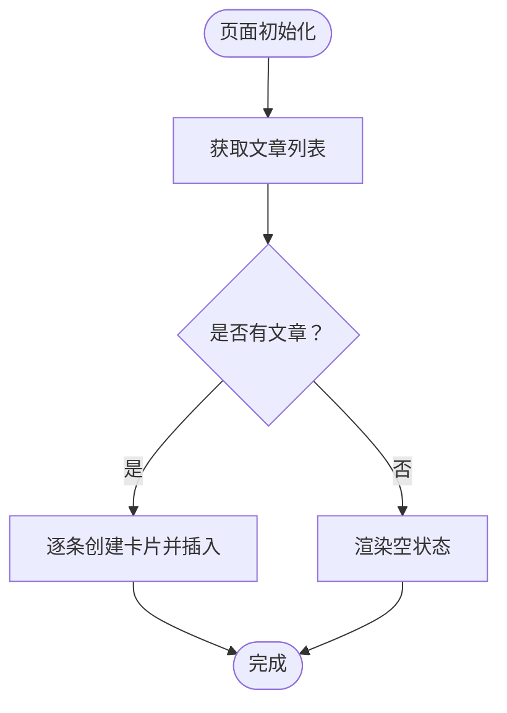
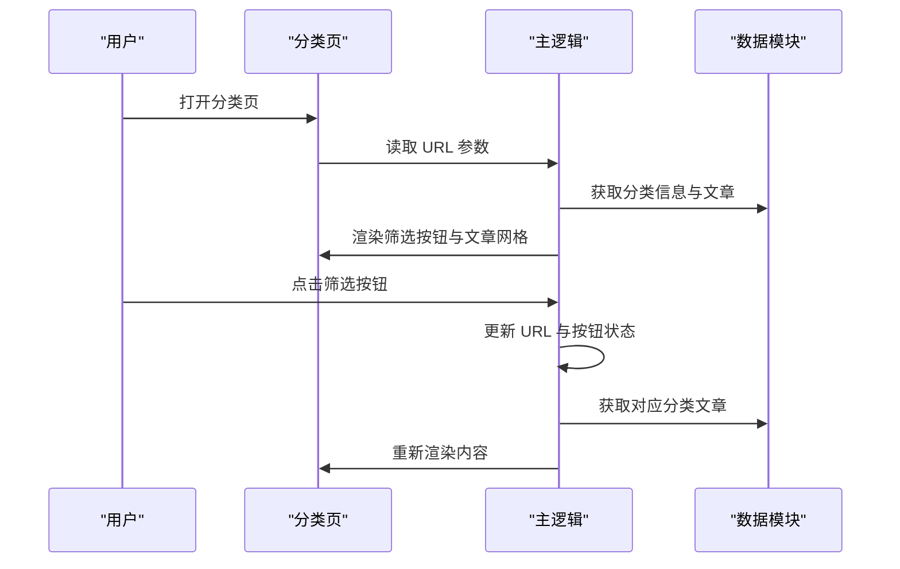
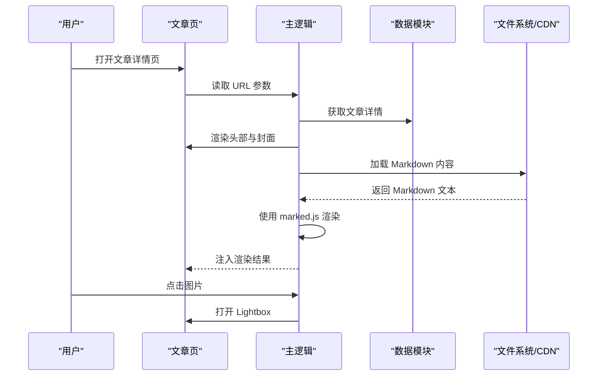
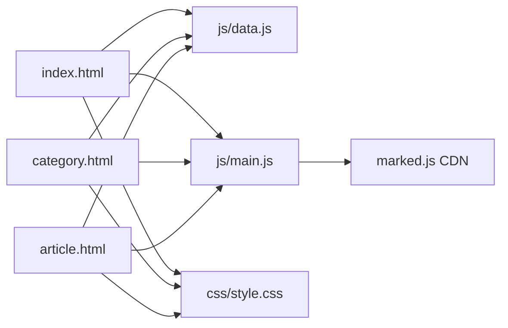

# 故障排除与维护

<cite>
**本文引用的文件**
- [README.md](file://README.md)
- [CLAUDE.md](file://CLAUDE.md)
- [index.html](file://index.html)
- [category.html](file://category.html)
- [article.html](file://article.html)
- [css/style.css](file://css/style.css)
- [js/data.js](file://js/data.js)
- [js/main.js](file://js/main.js)
- [content/articles/article-1.md](file://content/articles/article-1.md)
</cite>

## 目录
1. [简介](#简介)
2. [项目结构](#项目结构)
3. [核心组件](#核心组件)
4. [架构总览](#架构总览)
5. [详细组件分析](#详细组件分析)
6. [依赖关系分析](#依赖关系分析)
7. [性能考虑](#性能考虑)
8. [故障排除指南](#故障排除指南)
9. [结论](#结论)
10. [附录](#附录)

## 简介
本指南面向 Hot-Site 项目的维护者与贡献者，聚焦于部署与本地开发中的常见问题诊断与解决，涵盖 GitHub Pages 配置、资源加载与样式显示异常、本地服务器启动与热重载、浏览器兼容性、性能诊断与优化、版本升级与依赖更新流程、备份与恢复策略、紧急修复方法以及日志分析与错误追踪最佳实践。内容基于仓库现有文件进行梳理与总结，帮助快速定位与解决问题。

## 项目结构
Hot-Site 是一个零依赖的静态站点，采用纯 HTML/CSS/JavaScript 构建，Markdown 文章通过前端实时渲染。核心页面与资源分布如下：
- 页面：首页、分类页、文章详情页
- 样式：全局样式集中于样式表
- 数据：文章与分类元数据集中于数据模块
- 逻辑：导航、交互、Markdown 加载与渲染集中在主逻辑模块
- 文章：Markdown 内容位于内容目录

图表来源
- [index.html:1-190](file://index.html#L1-L190)
- [category.html:1-103](file://category.html#L1-L103)
- [article.html:1-107](file://article.html#L1-L107)
- [css/style.css:1-1166](file://css/style.css#L1-L1166)
- [js/data.js:1-158](file://js/data.js#L1-L158)
- [js/main.js:1-461](file://js/main.js#L1-L461)

章节来源
- [README.md: 26-47:26-47](file://README.md#L26-L47)

## 核心组件
- 数据层（js/data.js）
  - 定义分类配置与文章元数据数组，提供按 ID、分类、精选与搜索的查询函数。
- 逻辑层（js/main.js）
  - 导航栏滚动与移动端菜单、文章网格渲染、分类筛选、文章详情渲染与 Markdown 加载、Lightbox 图片查看、返回顶部按钮、错误状态提示与页面过渡动画。
- 视图层（HTML/CSS）
  - 首页、分类页、文章详情页的语义化结构与样式，CSS 变量驱动的主题与响应式布局。
- 内容层（content/articles/*.md）
  - 文章 Markdown 内容，通过 fetch 与 marked.js 渲染为 HTML。

章节来源
- [js/data.js: 6-37:6-37](file://js/data.js#L6-L37)
- [js/data.js: 115-145:115-145](file://js/data.js#L115-L145)
- [js/main.js: 436-461:436-461](file://js/main.js#L436-L461)
- [css/style.css: 7-78:7-78](file://css/style.css#L7-L78)

## 架构总览
Hot-Site 采用“静态页面 + 前端渲染”的轻量架构。页面通过引入数据与逻辑模块，动态生成内容；文章内容通过异步加载 Markdown 并渲染为 HTML；样式通过 CSS 变量统一主题与布局。

图表来源
- [js/main.js: 271-314:271-314](file://js/main.js#L271-L314)
- [js/data.js: 115-136:115-136](file://js/data.js#L115-L136)
- [article.html: 21-25:21-25](file://article.html#L21-L25)

## 详细组件分析

### 组件一：导航与交互（js/main.js 导航与滚动）
- 功能要点
  - 滚动监听与防抖，控制导航栏样式切换。
  - 移动端汉堡菜单展开/收起与点击菜单项后的自动收拢。
  - 返回顶部按钮的显示/隐藏与平滑滚动。
- 常见问题
  - 滚动事件卡顿：检查防抖延迟与事件绑定是否重复。
  - 移动端菜单无法关闭：确认事件冒泡与样式覆盖。
  - 返回顶部按钮不出现：检查滚动阈值与可见类名。

图表来源
- [js/main.js: 44-77:44-77](file://js/main.js#L44-L77)
- [js/main.js: 374-403:374-403](file://js/main.js#L374-L403)

章节来源
- [js/main.js: 44-77:44-77](file://js/main.js#L44-L77)
- [js/main.js: 374-403:374-403](file://js/main.js#L374-L403)

### 组件二：文章网格渲染（js/main.js 渲染）
- 功能要点
  - 根据页面类型渲染文章网格，支持空状态提示。
  - 文章卡片点击跳转详情页，键盘可访问。
- 常见问题
  - 文章为空：检查数据模型与容器元素是否存在。
  - 点击无效：确认事件绑定与元素结构。

图表来源
- [js/main.js: 118-146:118-146](file://js/main.js#L118-L146)
- [js/data.js: 115-136:115-136](file://js/data.js#L115-L136)

章节来源
- [js/main.js: 118-146:118-146](file://js/main.js#L118-L146)
- [js/data.js: 115-136:115-136](file://js/data.js#L115-L136)

### 组件三：分类筛选与路由（js/main.js 分类页）
- 功能要点
  - 从 URL 参数读取分类，更新页面标题与描述。
  - 动态生成筛选按钮，点击更新 URL 与内容。
- 常见问题
  - URL 参数缺失：确认参数解析与默认值。
  - 筛选按钮未激活：检查类名切换逻辑。

图表来源
- [js/main.js: 156-218:156-218](file://js/main.js#L156-L218)
- [js/data.js: 115-136:115-136](file://js/data.js#L115-L136)

章节来源
- [js/main.js: 156-218:156-218](file://js/main.js#L156-L218)
- [js/data.js: 115-136:115-136](file://js/data.js#L115-L136)

### 组件四：文章详情与 Markdown 渲染（js/main.js 文章页）
- 功能要点
  - 从 URL 获取文章 ID，校验存在性并渲染头部与封面。
  - 异步加载 Markdown 文件，使用 marked.js 渲染为 HTML；若 marked 未加载则回退显示原文。
  - 图片点击放大（Lightbox），ESC 关闭。
- 常见问题
  - Markdown 无法加载：检查路径与跨域策略。
  - marked 未定义：确认 CDN 是否加载成功。
  - Lightbox 无法关闭：检查事件绑定与样式覆盖。

图表来源
- [js/main.js: 220-314:220-314](file://js/main.js#L220-L314)
- [article.html: 21-25:21-25](file://article.html#L21-L25)

章节来源
- [js/main.js: 220-314:220-314](file://js/main.js#L220-L314)
- [article.html: 21-25:21-25](file://article.html#L21-L25)

### 组件五：样式与主题（css/style.css）
- 功能要点
  - CSS 变量统一主题色、间距、圆角与过渡；玻璃态、渐变与动画效果。
  - 响应式网格与移动端菜单样式。
- 常见问题
  - 样式未生效：检查变量名与作用域。
  - 动画闪烁：检查关键帧与硬件加速。

章节来源
- [css/style.css: 7-78:7-78](file://css/style.css#L7-L78)
- [css/style.css: 147-166:147-166](file://css/style.css#L147-L166)

### 组件六：数据模型（js/data.js）
- 功能要点
  - 分类配置与文章元数据；提供查询与搜索函数。
- 常见问题
  - 文章缺失：检查 ID 与路径一致性。
  - 分类颜色不匹配：检查分类键与样式类名。

章节来源
- [js/data.js: 6-37:6-37](file://js/data.js#L6-L37)
- [js/data.js: 115-145:115-145](file://js/data.js#L115-L145)

## 依赖关系分析
- 页面与模块依赖
  - index.html、category.html、article.html 均依赖 js/data.js 与 js/main.js。
  - article.html 额外依赖 marked.js CDN。
- 外部资源
  - Google Fonts 预连接与字体样式。
  - Unsplash 图片占位与懒加载属性。
- 资源加载顺序
  - 样式先于脚本，确保渲染与交互正常。

图表来源
- [index.html: 18-19:18-19](file://index.html#L18-L19)
- [category.html: 16-17:16-17](file://category.html#L16-L17)
- [article.html: 13-14:13-14](file://article.html#L13-L14)
- [article.html: 21-22:21-22](file://article.html#L21-L22)

章节来源
- [index.html: 18-19:18-19](file://index.html#L18-L19)
- [category.html: 16-17:16-17](file://category.html#L16-L17)
- [article.html: 13-14:13-14](file://article.html#L13-L14)
- [article.html: 21-22:21-22](file://article.html#L21-L22)

## 性能考虑
- 资源加载
  - 图片懒加载与占位图减少首屏阻塞。
  - 字体预连接提升加载速度。
- 交互性能
  - 滚动事件使用防抖，降低重绘频率。
  - CSS 动画与过渡尽量使用 transform/opacity。
- 内容渲染
  - Markdown 异步加载与渲染，避免阻塞主线程。
- 建议
  - 对外部 CDN 进行健康监控与降级策略。
  - 使用浏览器缓存与压缩策略（如启用 Pages 压缩）。

章节来源
- [js/main.js: 28-39:28-39](file://js/main.js#L28-L39)
- [index.html: 21-24:21-24](file://index.html#L21-L24)
- [category.html: 19-22:19-22](file://category.html#L19-L22)
- [article.html: 16-19:16-19](file://article.html#L16-L19)

## 故障排除指南

### GitHub Pages 配置错误
- 症状
  - 页面空白或资源 404。
- 诊断步骤
  - 确认分支与根目录设置：main 分支、根目录（/）。
  - 检查自定义域名与 CNAME 设置（如有）。
  - 查看 Pages 构建日志中的错误信息。
- 解决方案
  - 在仓库设置中选择正确的 Source 分支与目录。
  - 若使用子路径部署，修正资源路径前缀与 base 标签。

章节来源
- [README.md: 77-96:77-96](file://README.md#L77-L96)

### 资源加载失败
- 症状
  - 样式未生效、字体加载失败、图片不显示。
- 诊断步骤
  - 打开浏览器开发者工具 Network 面板，检查资源状态码与 MIME 类型。
  - 检查 CSP 与 HTTPS 强制策略。
- 解决方案
  - 使用相对路径或绝对路径，确保与 Pages 根目录一致。
  - 对字体与图片使用可靠的 CDN 或本地托管。
  - 如需本地字体，确保路径正确且服务器支持相应 MIME 类型。

章节来源
- [index.html: 18-19:18-19](file://index.html#L18-L19)
- [index.html: 21-24:21-24](file://index.html#L21-L24)
- [category.html: 16-17:16-17](file://category.html#L16-L17)
- [category.html: 19-22:19-22](file://category.html#L19-L22)
- [article.html: 13-14:13-14](file://article.html#L13-L14)
- [article.html: 16-19:16-19](file://article.html#L16-L19)

### 样式显示异常
- 症状
  - 主题色错乱、布局错位、动画异常。
- 诊断步骤
  - 检查 CSS 变量是否被覆盖或拼写错误。
  - 确认 glass 效果与 backdrop-filter 在目标设备上的支持。
- 解决方案
  - 通过浏览器开发者工具审查元素，定位具体样式来源。
  - 为不支持的设备提供降级样式。

章节来源
- [css/style.css: 7-78:7-78](file://css/style.css#L7-L78)
- [css/style.css: 147-166:147-166](file://css/style.css#L147-L166)

### 本地开发环境问题
- 服务器启动失败
  - 症状：无法通过本地服务器访问页面。
  - 解决：使用 Python、Node.js 或 PHP 内置服务器启动，确保端口未被占用。
- 热重载失效
  - 症状：修改文件后页面未刷新。
  - 解决：静态站点无需热重载；保存后手动刷新即可。
- 浏览器兼容性问题
  - 症状：部分特性（如 CSS 变量、backdrop-filter）在旧版浏览器表现异常。
  - 解决：为关键特性提供降级方案或 polyfill。

章节来源
- [README.md: 59-75:59-75](file://README.md#L59-L75)
- [CLAUDE.md: 26-33:26-33](file://CLAUDE.md#L26-L33)

### 文章详情页 Markdown 加载失败
- 症状
  - 文章内容区域显示加载失败或空白。
- 诊断步骤
  - 检查 Markdown 文件路径是否正确。
  - 确认 marked.js CDN 可用且已加载。
  - 查看 Network 面板与 Console 日志。
- 解决方案
  - 修正 content 路径，确保与 data.js 中的路径一致。
  - 若 CDN 不可用，考虑内联或本地托管 marked.js。

章节来源
- [js/main.js: 271-314:271-314](file://js/main.js#L271-L314)
- [js/data.js: 115-136:115-136](file://js/data.js#L115-L136)
- [article.html: 21-22:21-22](file://article.html#L21-L22)

### 分类筛选与路由问题
- 症状
  - 点击筛选按钮后 URL 更新但内容未变化。
- 诊断步骤
  - 检查事件委托与按钮类名。
  - 确认分类键与数据模型一致。
- 解决方案
  - 修复按钮点击事件与状态切换逻辑。
  - 校验分类键大小写与拼写。

章节来源
- [js/main.js: 179-218:179-218](file://js/main.js#L179-L218)
- [js/data.js: 6-37:6-37](file://js/data.js#L6-L37)

### 图片 Lightbox 无法打开或关闭
- 症状
  - 点击图片无反应或 ESC 无法关闭。
- 诊断步骤
  - 检查图片事件绑定与 overlay DOM 是否创建。
  - 确认 ESC 键盘事件与 body 滚动锁定。
- 解决方案
  - 修复事件监听与 DOM 操作顺序。
  - 确保样式类名与显示逻辑一致。

章节来源
- [js/main.js: 316-371:316-371](file://js/main.js#L316-L371)

### 错误状态与降级显示
- 症状
  - 文章不存在或网络异常时页面显示异常。
- 诊断步骤
  - 检查错误处理函数与空状态渲染。
- 解决方案
  - 使用统一的错误提示组件，提供返回首页链接。

章节来源
- [js/main.js: 405-420:405-420](file://js/main.js#L405-L420)

### 日志分析与错误追踪最佳实践
- 使用浏览器开发者工具的 Console 与 Network 面板定位错误。
- 对异步加载（fetch）进行 try/catch 并记录错误堆栈。
- 对第三方 CDN（marked.js）增加可用性检测与降级逻辑。
- 对关键交互（滚动、点击）添加边界条件判断与防抖。

章节来源
- [js/main.js: 271-314:271-314](file://js/main.js#L271-L314)
- [js/main.js: 405-420:405-420](file://js/main.js#L405-L420)

### 版本升级与依赖更新流程
- 依赖
  - marked.js：用于 Markdown 渲染。
  - Google Fonts：用于字体加载。
- 流程建议
  - 在 data.js 与 HTML 中同步更新版本号或 CDN 地址。
  - 在本地验证后再推送到 main 分支，观察 Pages 构建日志。
  - 对重大变更进行灰度发布与回滚预案。

章节来源
- [README.md: 147-152:147-152](file://README.md#L147-L152)
- [article.html: 21-22:21-22](file://article.html#L21-L22)

### 备份与恢复策略
- 备份
  - 保留关键文件：HTML、CSS、JS、Markdown 内容。
  - 记录数据模型变更历史（js/data.js）。
- 恢复
  - 从最近一次稳定提交回滚。
  - 重新应用必要的样式与脚本变更。

章节来源
- [js/data.js: 115-145:115-145](file://js/data.js#L115-L145)

### 紧急情况下的快速修复
- 快速回滚
  - 使用 Git 回退到上一个稳定版本。
- 临时降级
  - 临时移除 marked.js 依赖，直接显示 Markdown 原文。
- 修复 Pages 配置
  - 确认分支与根目录设置无误，等待 Pages 重新构建。

章节来源
- [js/main.js: 297-300:297-300](file://js/main.js#L297-L300)
- [README.md: 77-96:77-96](file://README.md#L77-L96)

## 结论
Hot-Site 项目以极简架构实现内容聚合与展示，维护重点在于：确保资源路径与 Pages 配置正确、处理异步加载与第三方依赖的可用性、优化交互性能与样式兼容性、建立完善的日志与降级机制。遵循本文提供的诊断与维护流程，可有效提升站点稳定性与可维护性。

## 附录
- 快速检查清单
  - Pages 分支与目录设置正确
  - 资源路径与 MIME 类型无误
  - marked.js 可用或具备降级方案
  - 滚动与点击事件防抖与边界处理
  - CSS 变量与 glass 效果在目标设备可用