# 监控与分析配置

<cite>
**本文档引用的文件**
- [index.html](file://index.html)
- [category.html](file://category.html)
- [article.html](file://article.html)
- [js/main.js](file://js/main.js)
- [js/data.js](file://js/data.js)
- [css/style.css](file://css/style.css)
- [README.md](file://README.md)
- [content/articles/article-1.md](file://content/articles/article-1.md)
</cite>

## 目录
1. [简介](#简介)
2. [项目结构](#项目结构)
3. [核心组件](#核心组件)
4. [架构概览](#架构概览)
5. [详细组件分析](#详细组件分析)
6. [依赖关系分析](#依赖关系分析)
7. [性能考虑](#性能考虑)
8. [故障排除指南](#故障排除指南)
9. [结论](#结论)
10. [附录](#附录)

## 简介

Hot-Site 是一个现代化的静态内容聚合站点，采用纯 HTML、CSS 和 JavaScript 构建，专注于展示分类文章和图片内容。该项目具有以下特点：
- 现代抽象设计：几何装饰、渐变背景、玻璃态卡片、微妙阴影
- 完全响应式：移动端、平板、桌面三端适配
- 零依赖构建：纯 HTML + CSS + JavaScript，无需任何构建工具
- Markdown 驱动：文章以 Markdown 格式存储，前端实时渲染
- SEO 友好：语义化 HTML、正确的 meta 标签、Open Graph 支持
- 无障碍支持：ARIA 标签、键盘导航、语义化结构

## 项目结构

Hot-Site 项目采用简洁明了的文件组织结构，主要包含以下核心文件：

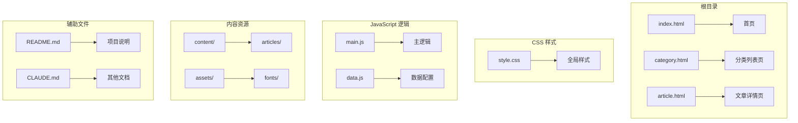

**图表来源**
- [index.html:1-190](file://index.html#L1-L190)
- [category.html:1-103](file://category.html#L1-L103)
- [article.html:1-107](file://article.html#L1-L107)
- [js/main.js:1-461](file://js/main.js#L1-L461)
- [js/data.js:1-158](file://js/data.js#L1-L158)

**章节来源**
- [README.md:26-47](file://README.md#L26-L47)
- [index.html:1-190](file://index.html#L1-L190)
- [category.html:1-103](file://category.html#L1-L103)
- [article.html:1-107](file://article.html#L1-L107)

## 核心组件

### 页面结构组件

Hot-Site 项目包含三个主要页面组件，每个都具有特定的功能和结构：

#### 首页 (index.html)
- **导航栏**：固定定位的玻璃态导航栏，支持移动端汉堡菜单
- **Hero 区域**：全屏背景，包含渐变装饰和几何形状动画
- **精选内容**：动态加载的文章网格展示
- **分类导航**：五个主题分类的卡片展示
- **页脚**：深色主题的页脚区域

#### 分类列表页 (category.html)
- **页面头部**：渐变背景的标题区域
- **筛选栏**：动态生成的分类筛选按钮
- **文章网格**：按分类过滤的文章列表
- **响应式设计**：针对不同屏幕尺寸的自适应布局

#### 文章详情页 (article.html)
- **面包屑导航**：返回上一页的链接
- **文章头部**：分类标签和发布信息
- **封面图**：全宽图片展示
- **文章内容**：Markdown 内容渲染区域

**章节来源**
- [index.html:29-189](file://index.html#L29-L189)
- [category.html:27-102](file://category.html#L27-L102)
- [article.html:27-106](file://article.html#L27-L106)

### JavaScript 逻辑组件

#### 主逻辑 (main.js)
- **全局状态管理**：currentPage、currentCategory、navbarScrolled
- **工具函数**：URL 参数获取、日期格式化、防抖函数
- **导航栏功能**：滚动效果、移动端菜单切换
- **文章渲染**：文章卡片创建和网格渲染
- **页面初始化**：根据页面类型执行相应的初始化逻辑
- **错误处理**：统一的错误显示机制
- **页面过渡**：淡入动画效果

#### 数据配置 (data.js)
- **分类配置**：五个主题分类的元数据
- **文章元数据**：完整的文章信息数组
- **查询函数**：按 ID、分类、搜索等条件获取文章
- **导出兼容**：支持 CommonJS 模块系统

**章节来源**
- [js/main.js:6-461](file://js/main.js#L6-L461)
- [js/data.js:6-158](file://js/data.js#L6-L158)

## 架构概览

Hot-Site 采用客户端渲染架构，所有页面逻辑都在浏览器端执行：

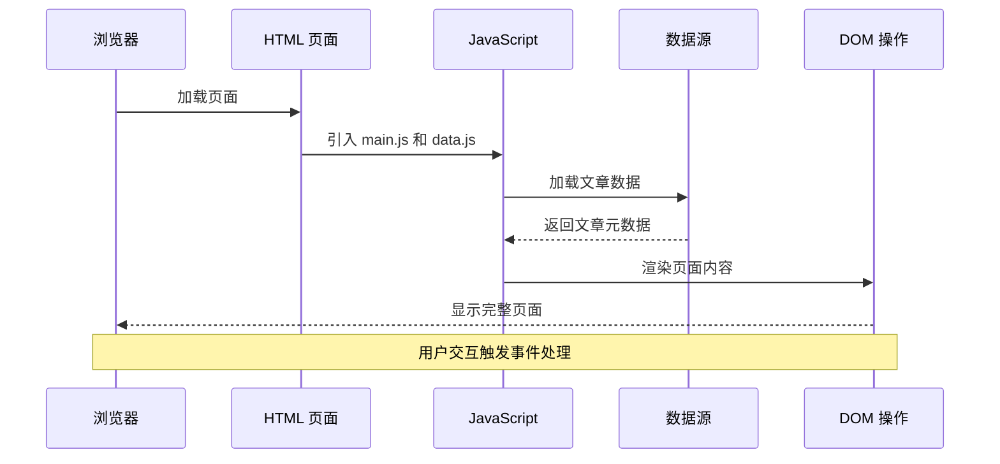

**图表来源**
- [js/main.js:436-461](file://js/main.js#L436-L461)
- [js/data.js:115-158](file://js/data.js#L115-L158)

## 详细组件分析

### 导航栏组件分析

导航栏是 Hot-Site 的核心交互组件，实现了响应式设计和多种交互功能：

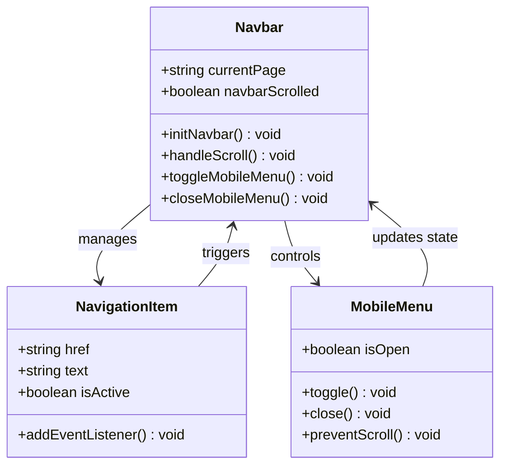

**图表来源**
- [js/main.js:44-77](file://js/main.js#L44-L77)
- [index.html:31-53](file://index.html#L31-L53)

导航栏的主要特性包括：
- **滚动效果**：滚动超过 50px 后改变样式
- **移动端适配**：汉堡菜单响应式设计
- **无障碍支持**：ARIA 标签和键盘导航
- **性能优化**：使用防抖函数优化滚动事件

**章节来源**
- [js/main.js:44-77](file://js/main.js#L44-L77)
- [index.html:31-53](file://index.html#L31-L53)

### 文章渲染组件分析

文章渲染系统是 Hot-Site 的核心功能模块，负责动态内容展示：

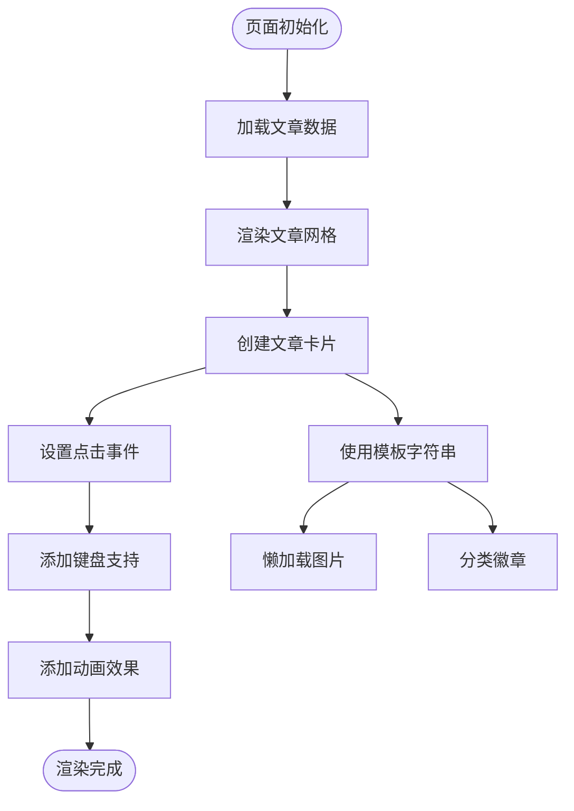

**图表来源**
- [js/main.js:82-116](file://js/main.js#L82-L116)
- [js/data.js:40-113](file://js/data.js#L40-L113)

文章渲染的关键功能：
- **动态卡片创建**：使用模板字符串生成 HTML 结构
- **懒加载支持**：图片使用 `loading="lazy"` 属性
- **键盘导航**：支持 Enter 和 Space 键操作
- **动画效果**：逐个卡片的淡入动画

**章节来源**
- [js/main.js:82-116](file://js/main.js#L82-L116)
- [js/data.js:40-113](file://js/data.js#L40-L113)

### 页面路由系统分析

Hot-Site 实现了一个基于 URL 参数的简单路由系统：

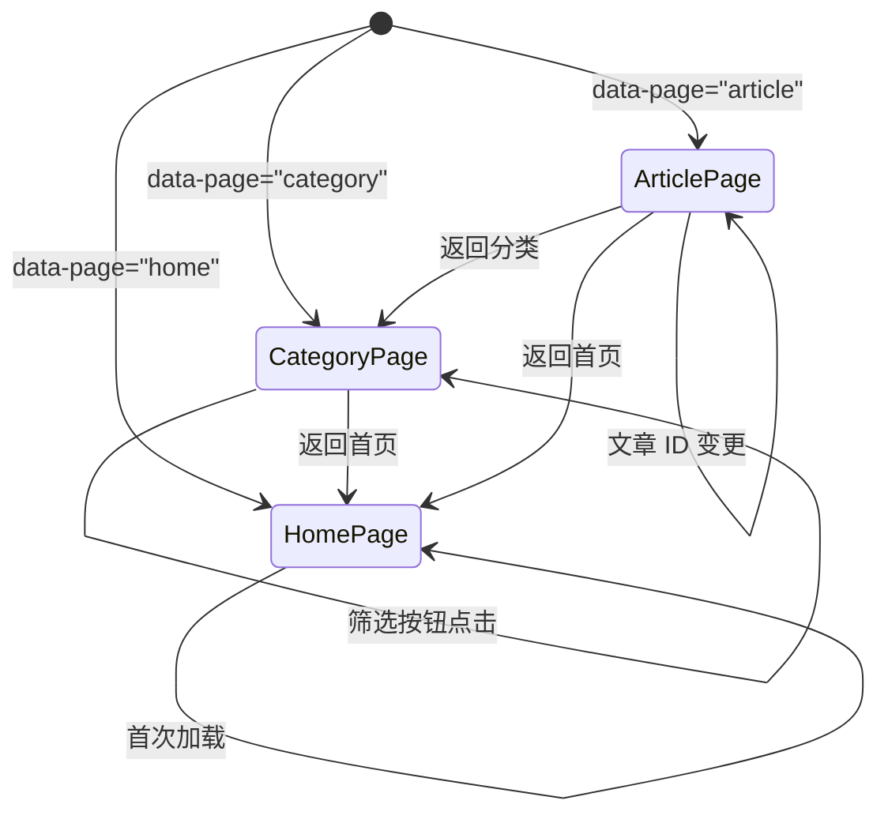

**图表来源**
- [js/main.js:444-461](file://js/main.js#L444-L461)
- [index.html](file://index.html#L29)
- [category.html](file://category.html#L27)
- [article.html](file://article.html#L27)

路由系统的特点：
- **基于属性**：通过 `data-page` 属性识别页面类型
- **URL 参数**：分类页面使用 `?cat=` 参数
- **历史记录**：使用 `history.pushState` 更新 URL
- **页面切换**：根据页面类型执行相应初始化

**章节来源**
- [js/main.js:444-461](file://js/main.js#L444-L461)
- [category.html:194-218](file://category.html#L194-L218)

### 错误处理机制分析

错误处理系统提供了统一的错误显示和降级处理：

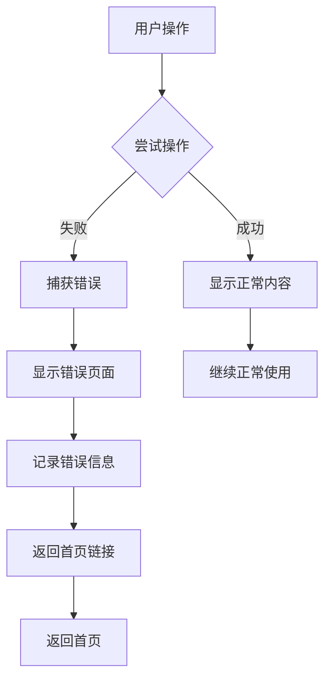

**图表来源**
- [js/main.js:407-421](file://js/main.js#L407-L421)
- [js/main.js:272-314](file://js/main.js#L272-L314)

错误处理的层次结构：
- **网络错误**：Markdown 文件加载失败
- **参数错误**：无效的文章 ID
- **渲染错误**：marked.js 未正确加载
- **降级处理**：显示友好的错误信息

**章节来源**
- [js/main.js:407-421](file://js/main.js#L407-L421)
- [js/main.js:272-314](file://js/main.js#L272-L314)

## 依赖关系分析

Hot-Site 项目采用松耦合的设计模式，各组件之间的依赖关系清晰：

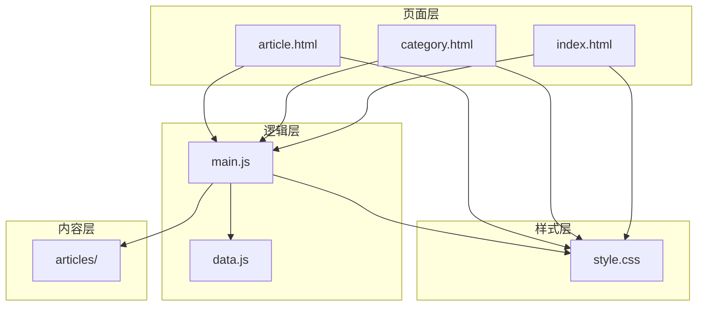

**图表来源**
- [index.html:187-189](file://index.html#L187-L189)
- [category.html:99-102](file://category.html#L99-L102)
- [article.html:103-106](file://article.html#L103-L106)
- [js/main.js:1-461](file://js/main.js#L1-L461)
- [js/data.js:1-158](file://js/data.js#L1-L158)

依赖关系特点：
- **单向依赖**：页面 → JavaScript → 数据
- **无循环依赖**：清晰的层次结构
- **低耦合**：组件间通信通过事件和回调
- **可测试性**：函数式设计便于单元测试

**章节来源**
- [js/main.js:1-461](file://js/main.js#L1-L461)
- [js/data.js:1-158](file://js/data.js#L1-L158)

## 性能考虑

Hot-Site 在性能方面采用了多项优化措施：

### 加载性能优化

1. **懒加载策略**：
   - 图片使用 `loading="lazy"` 属性
   - 骨架屏加载效果
   - Markdown 内容异步加载

2. **资源优化**：
   - CSS 变量减少重复定义
   - 响应式图片使用合适的尺寸
   - 字体预连接优化加载

3. **JavaScript 优化**：
   - 防抖函数优化滚动事件
   - 按需加载功能模块
   - 事件委托减少内存占用

### 运行时性能优化

1. **动画性能**：
   - 使用 CSS3 transform 和 opacity
   - 避免强制同步布局
   - 合理的动画持续时间

2. **内存管理**：
   - 事件监听器及时清理
   - DOM 元素复用
   - 大对象及时释放

3. **网络优化**：
   - CDN 加载第三方库
   - 缓存策略优化
   - 减少 HTTP 请求

## 故障排除指南

### 常见问题诊断

#### 页面加载问题
- **症状**：页面空白或加载缓慢
- **原因**：直接双击 HTML 文件导致的跨域限制
- **解决方案**：使用本地 HTTP 服务器启动

#### 文章内容加载失败
- **症状**：文章详情页显示加载错误
- **原因**：Markdown 文件路径不正确或 CORS 限制
- **解决方案**：检查文件路径和服务器配置

#### 导航栏功能异常
- **症状**：移动端菜单无法打开或滚动效果失效
- **原因**：JavaScript 加载顺序或语法错误
- **解决方案**：检查控制台错误和文件完整性

#### 样式显示异常
- **症状**：页面布局错乱或颜色不正确
- **原因**：CSS 文件加载失败或缓存问题
- **解决方案**：清除浏览器缓存重新加载

**章节来源**
- [README.md:75-76](file://README.md#L75-L76)
- [js/main.js:301-314](file://js/main.js#L301-L314)

### 调试工具使用

1. **浏览器开发者工具**：
   - Network 标签检查资源加载
   - Console 查看 JavaScript 错误
   - Elements 检查 DOM 结构
   - Performance 分析性能瓶颈

2. **移动设备调试**：
   - 设备模拟器测试响应式效果
   - Touch 事件调试
   - 性能监控

## 结论

Hot-Site 项目展现了现代静态网站开发的最佳实践，通过精心设计的架构和优化的用户体验，为内容创作者提供了一个强大而灵活的平台。项目的主要优势包括：

1. **架构简洁**：纯静态文件 + 客户端渲染的简单架构
2. **性能优秀**：多项性能优化措施确保快速加载
3. **用户体验**：丰富的交互效果和无障碍支持
4. **可扩展性**：模块化设计便于功能扩展
5. **SEO 友好**：完整的 SEO 元数据和结构化内容

对于监控与分析配置，Hot-Site 项目提供了良好的基础，可以通过集成外部分析工具来实现更全面的数据收集和分析。

## 附录

### 监控与分析配置建议

#### Google Analytics 集成

虽然项目当前未集成分析工具，但可以轻松添加 Google Analytics 支持：

1. **获取跟踪 ID**：在 Google Analytics 中创建属性获取跟踪 ID
2. **添加跟踪代码**：在所有 HTML 页面的 `<head>` 标签中添加 GA 代码
3. **配置事件跟踪**：为关键用户行为设置自定义事件
4. **隐私合规**：添加 Cookie 同意管理

#### 页面性能监控

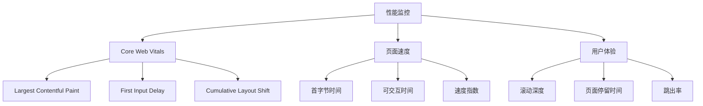

**图表来源**
- [js/main.js:436-461](file://js/main.js#L436-L461)

#### 错误监控和日志收集

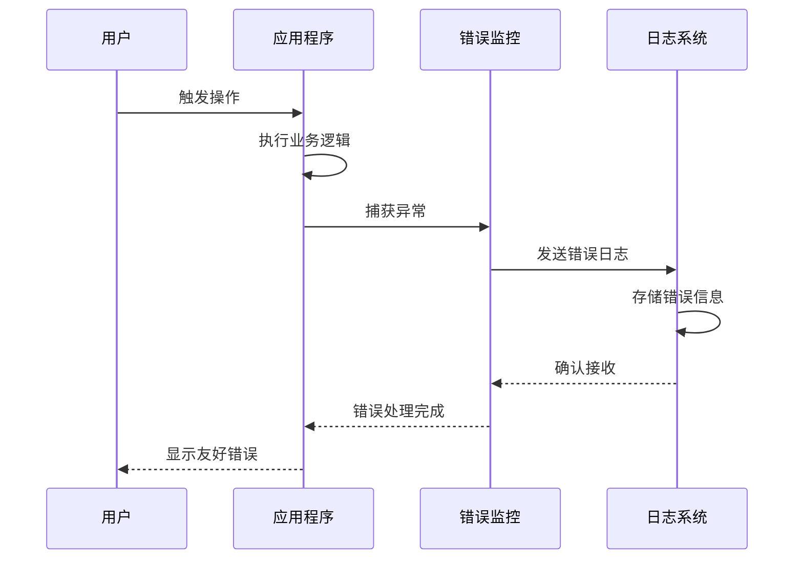

#### A/B 测试配置

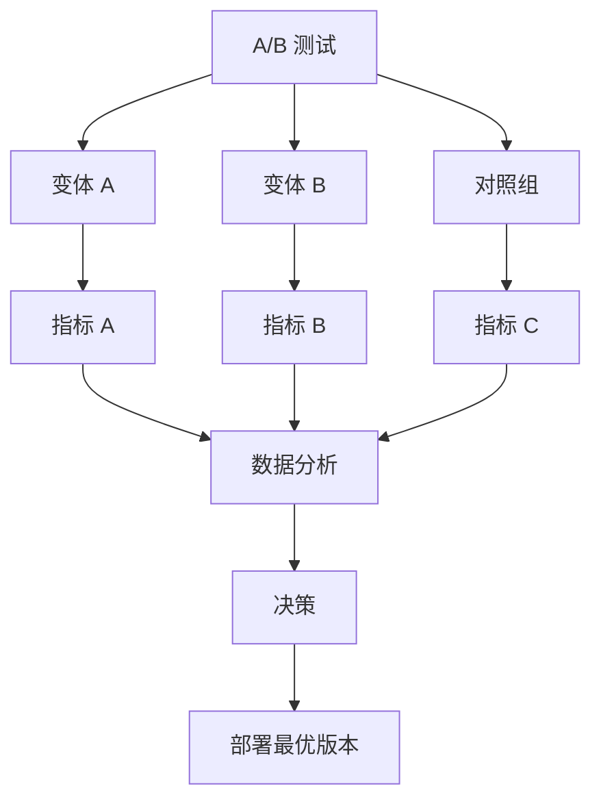

#### 转化跟踪和用户反馈

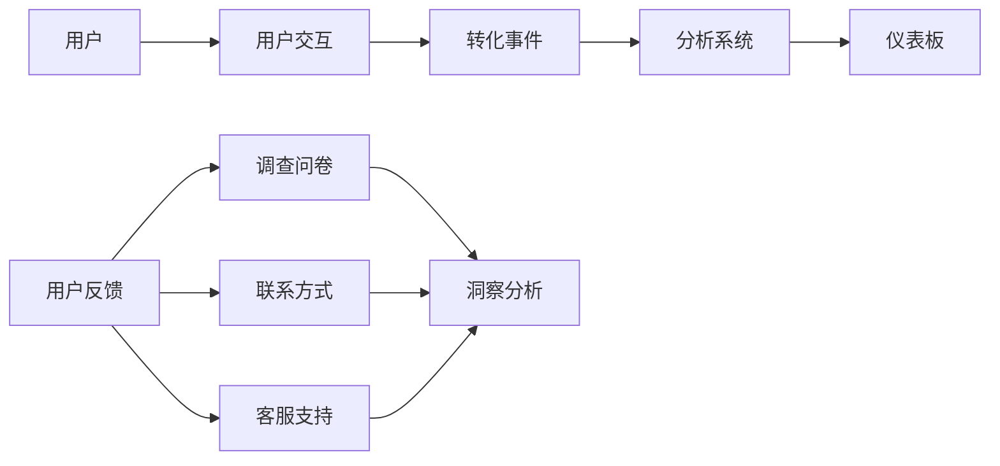

#### 隐私合规和数据保护

1. **Cookie 同意管理**：
   - 实施 Cookie 同意弹窗
   - 提供详细的 Cookie 说明
   - 允许用户选择性同意

2. **数据最小化原则**：
   - 仅收集必要的分析数据
   - 实施数据去标识化
   - 提供数据删除选项

3. **GDPR 合规**：
   - 数据处理协议
   - 用户权利保障
   - 数据安全措施

**章节来源**
- [README.md:1-156](file://README.md#L1-L156)
- [js/main.js:1-461](file://js/main.js#L1-L461)
- [css/style.css:1-1166](file://css/style.css#L1-L1166)