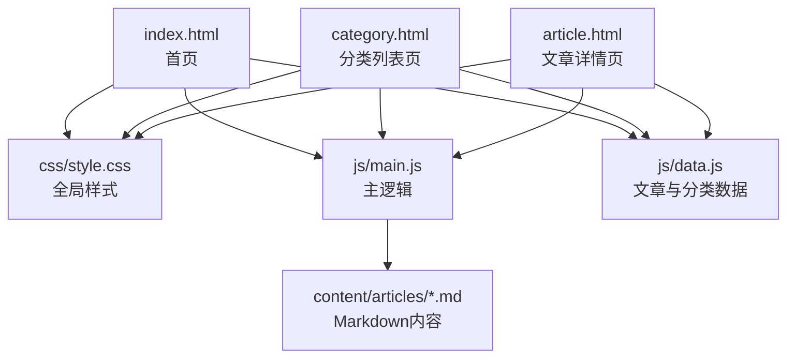
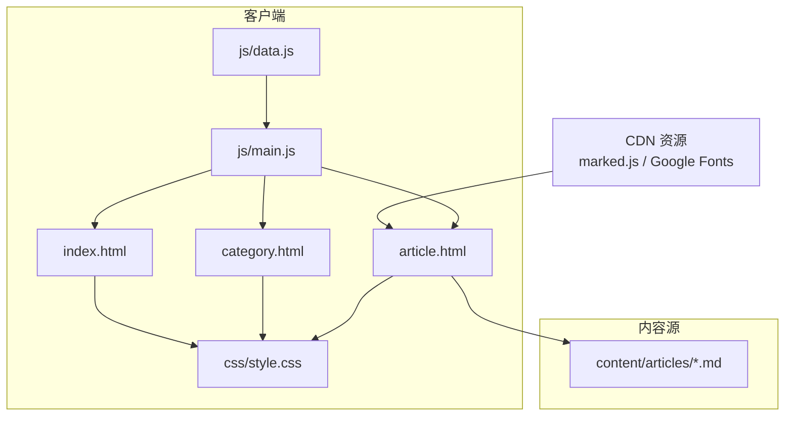
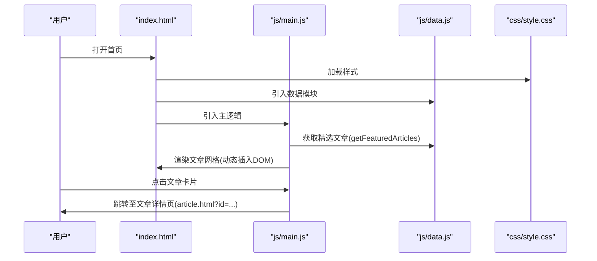
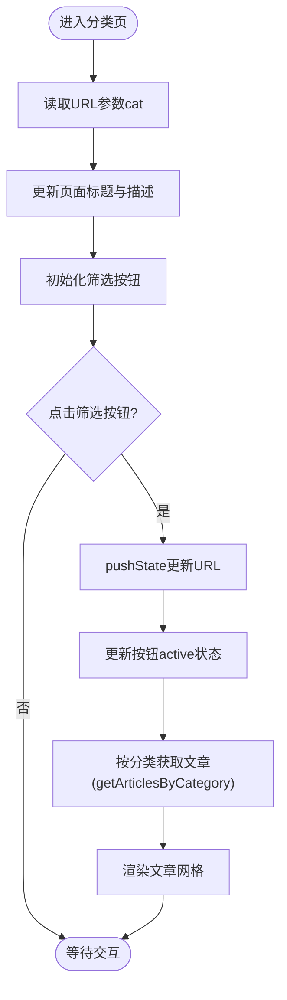
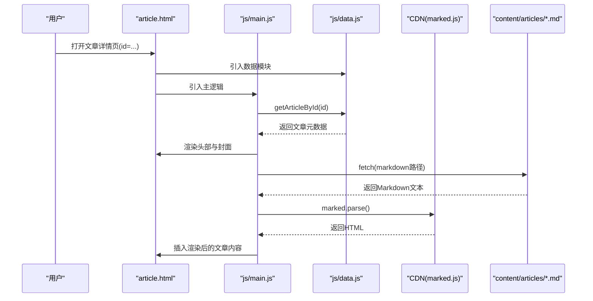
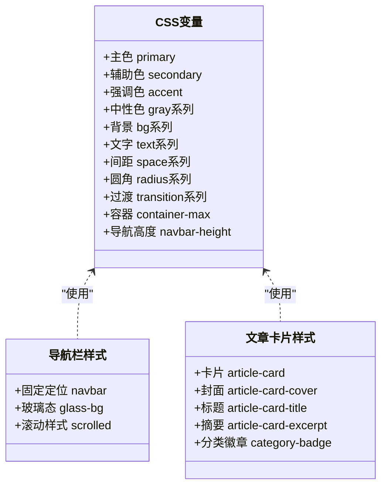
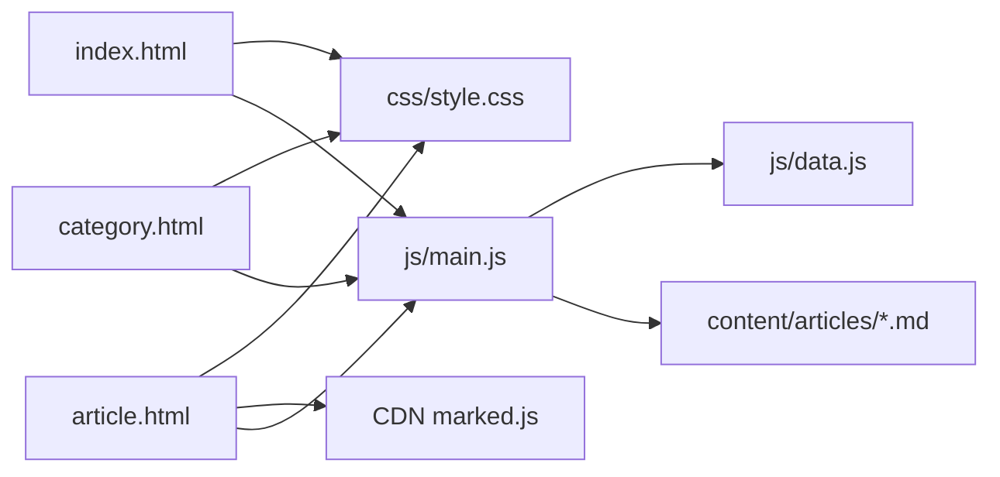

# 部署与运维

<cite>
**本文引用的文件**
- [README.md](file://README.md)
- [index.html](file://index.html)
- [category.html](file://category.html)
- [article.html](file://article.html)
- [css/style.css](file://css/style.css)
- [js/main.js](file://js/main.js)
- [js/data.js](file://js/data.js)
- [content/articles/article-1.md](file://content/articles/article-1.md)
- [content/articles/article-2.md](file://content/articles/article-2.md)
</cite>

## 目录
1. [简介](#简介)
2. [项目结构](#项目结构)
3. [核心组件](#核心组件)
4. [架构总览](#架构总览)
5. [详细组件分析](#详细组件分析)
6. [依赖关系分析](#依赖关系分析)
7. [性能优化建议](#性能优化建议)
8. [监控与分析集成](#监控与分析集成)
9. [版本控制与发布流程](#版本控制与发布流程)
10. [故障排除指南](#故障排除指南)
11. [安全配置与HTTPS](#安全配置与https)
12. [结论](#结论)

## 简介
本指南面向Hot-Site项目的部署与运维，聚焦于GitHub Pages配置、CDN资源集成、性能优化、监控分析、版本控制与发布流程、故障排除以及安全与HTTPS管理。文档基于仓库现有HTML/CSS/JS与Markdown内容，提供可操作的步骤与最佳实践，帮助你稳定、高效地运行该静态站点。

## 项目结构
Hot-Site采用纯静态站点结构，核心页面与资源分布如下：
- 页面：index.html、category.html、article.html
- 样式：css/style.css
- 逻辑：js/main.js、js/data.js
- 内容：content/articles/*.md
- 示例文章：content/articles/article-1.md、content/articles/article-2.md

图表来源
- [index.html:1-190](file://index.html#L1-L190)
- [category.html:1-103](file://category.html#L1-L103)
- [article.html:1-107](file://article.html#L1-L107)
- [css/style.css:1-1166](file://css/style.css#L1-L1166)
- [js/main.js:1-461](file://js/main.js#L1-L461)
- [js/data.js:1-158](file://js/data.js#L1-L158)

章节来源
- [README.md:26-47](file://README.md#L26-L47)

## 核心组件
- 页面与路由
  - 首页(index.html)：展示精选内容与分类入口，通过js/main.js动态渲染文章网格。
  - 分类页(category.html)：按分类筛选文章，支持URL参数cat切换。
  - 文章页(article.html)：根据URL参数id加载对应Markdown内容，使用CDN的marked进行渲染。
- 数据层
  - js/data.js：集中管理分类配置与文章元数据，提供查询与过滤函数。
- 样式层
  - css/style.css：全局CSS变量、布局、组件样式与响应式规则。
- 交互与渲染
  - js/main.js：导航栏、滚动、筛选、文章渲染、Markdown加载、Lightbox图片查看、错误处理与页面过渡。

章节来源
- [index.html:1-190](file://index.html#L1-L190)
- [category.html:1-103](file://category.html#L1-L103)
- [article.html:1-107](file://article.html#L1-L107)
- [js/data.js:1-158](file://js/data.js#L1-L158)
- [css/style.css:1-1166](file://css/style.css#L1-L1166)
- [js/main.js:1-461](file://js/main.js#L1-L461)

## 架构总览
Hot-Site采用“静态页面 + 前端渲染”的轻量架构。页面通过js/data.js注入数据，使用js/main.js驱动交互；文章内容以Markdown形式存放，文章页通过fetch异步加载并使用CDN的marked渲染。

图表来源
- [index.html:1-190](file://index.html#L1-L190)
- [category.html:1-103](file://category.html#L1-L103)
- [article.html:1-107](file://article.html#L1-L107)
- [js/main.js:1-461](file://js/main.js#L1-L461)
- [js/data.js:1-158](file://js/data.js#L1-L158)
- [css/style.css:1-1166](file://css/style.css#L1-L1166)

## 详细组件分析

### 首页渲染流程（序列图）

图表来源
- [index.html:1-190](file://index.html#L1-L190)
- [js/main.js:148-154](file://js/main.js#L148-L154)
- [js/data.js:128-131](file://js/data.js#L128-L131)

章节来源
- [index.html:1-190](file://index.html#L1-L190)
- [js/main.js:148-154](file://js/main.js#L148-L154)
- [js/data.js:128-131](file://js/data.js#L128-L131)

### 分类筛选与URL同步（流程图）

图表来源
- [category.html:1-103](file://category.html#L1-L103)
- [js/main.js:156-218](file://js/main.js#L156-L218)
- [js/data.js:120-126](file://js/data.js#L120-L126)

章节来源
- [category.html:1-103](file://category.html#L1-L103)
- [js/main.js:156-218](file://js/main.js#L156-L218)
- [js/data.js:120-126](file://js/data.js#L120-L126)

### 文章详情页加载与渲染（序列图）

图表来源
- [article.html:1-107](file://article.html#L1-L107)
- [js/main.js:220-314](file://js/main.js#L220-L314)
- [js/data.js:115-118](file://js/data.js#L115-L118)

章节来源
- [article.html:1-107](file://article.html#L1-L107)
- [js/main.js:220-314](file://js/main.js#L220-L314)
- [js/data.js:115-118](file://js/data.js#L115-L118)

### 样式与主题变量（类图）

图表来源
- [css/style.css:7-78](file://css/style.css#L7-L78)
- [css/style.css:147-227](file://css/style.css#L147-L227)
- [css/style.css:431-548](file://css/style.css#L431-L548)

章节来源
- [css/style.css:7-78](file://css/style.css#L7-L78)
- [css/style.css:147-227](file://css/style.css#L147-L227)
- [css/style.css:431-548](file://css/style.css#L431-L548)

## 依赖关系分析
- 页面依赖
  - index.html、category.html、article.html均依赖css/style.css与js/main.js。
  - article.html额外依赖CDN的marked.js进行Markdown渲染。
- 数据依赖
  - js/main.js通过js/data.js提供的查询函数获取文章与分类数据。
- 内容依赖
  - article.html通过fetch加载content/articles/*.md作为文章内容源。

图表来源
- [index.html:1-190](file://index.html#L1-L190)
- [category.html:1-103](file://category.html#L1-L103)
- [article.html:1-107](file://article.html#L1-L107)
- [js/main.js:1-461](file://js/main.js#L1-L461)
- [js/data.js:1-158](file://js/data.js#L1-L158)
- [css/style.css:1-1166](file://css/style.css#L1-L1166)

章节来源
- [index.html:1-190](file://index.html#L1-L190)
- [category.html:1-103](file://category.html#L1-L103)
- [article.html:1-107](file://article.html#L1-L107)
- [js/main.js:1-461](file://js/main.js#L1-L461)
- [js/data.js:1-158](file://js/data.js#L1-L158)
- [css/style.css:1-1166](file://css/style.css#L1-L1166)

## 性能优化建议
- 资源压缩与缓存
  - 使用CDN托管静态资源（如marked.js），减少本地体积与网络延迟。
  - 启用HTTP缓存策略，为CSS/JS设置较长max-age，为图片设置合理的ETag/Last-Modified。
- 加载优化
  - 为图片添加loading="lazy"（已在模板中使用），并考虑使用现代格式（如.webp）与合适的尺寸。
  - 将非关键CSS内联到HTML头部，关键JS尽量延迟加载，确保首屏渲染速度。
- 代码与数据
  - js/main.js中已使用防抖(debounce)处理滚动事件，建议对resize与滚动事件统一节流。
  - js/data.js中的文章列表可按需懒加载，或在大数据量时采用虚拟滚动。
- 缓存策略建议
  - HTML页面可设置较短缓存时间以便快速迭代；CSS/JS可设置较长缓存时间并配合文件名指纹。
  - 对CDN资源可利用其全球节点与缓存策略，减少回源压力。

章节来源
- [article.html:21-22](file://article.html#L21-L22)
- [js/main.js:28-39](file://js/main.js#L28-L39)
- [js/data.js:40-113](file://js/data.js#L40-L113)

## 监控与分析集成
- Google Analytics集成
  - 在各页面<head>中添加GA测量ID的脚本与初始化代码，确保在页面加载早期执行。
  - 配置事件追踪：页面浏览、按钮点击、文章访问、Lightbox打开等。
  - 设置用户属性：如来源渠道、设备类型、语言偏好等，便于分群分析。
- 其他分析工具
  - 可选集成百度统计、腾讯分析等国内分析平台，注意合规与隐私声明。
- 性能指标
  - 关注CLS、LCP、FID等Core Web Vitals，结合CDN与图片优化持续改善。
  - 通过浏览器开发者工具与Network面板观察资源加载与缓存命中率。

章节来源
- [index.html:6-16](file://index.html#L6-L16)
- [category.html:6-12](file://category.html#L6-L12)
- [article.html:6-11](file://article.html#L6-L11)

## 版本控制与发布流程
- 本地开发
  - 使用Python/Node.js/PHP等任意HTTP服务器启动本地预览，避免直接双击HTML导致跨域限制。
- 提交规范
  - 使用语义化提交信息，如feat: 新增文章、fix: 修复渲染问题、docs: 更新部署说明。
- 发布流程（GitHub Pages）
  - 推送至GitHub仓库的main分支，进入仓库Settings → Pages，Source选择Deploy from a branch，Branch选择main，目录选根目录/，保存后等待部署完成。
  - 部署完成后访问 https://用户名.github.io/仓库名/，如需自定义域名，可在Pages设置中配置。
- 自动化建议
  - 可结合GitHub Actions在推送时自动校验HTML/CSS语法与链接有效性，减少线上问题。

章节来源
- [README.md:77-96](file://README.md#L77-L96)
- [README.md:49-76](file://README.md#L49-L76)

## 故障排除指南
- 文章详情页无法加载Markdown
  - 症状：文章内容区域显示“加载失败”或空白。
  - 排查：确认article.html中CDN的marked.js已正确加载；检查content/articles/*.md路径是否与data.js中content字段一致；确认服务器支持跨域或使用同源部署。
- 图片懒加载无效
  - 症状：图片未按预期延迟加载。
  - 排查：确认HTML中img标签包含loading="lazy"；检查浏览器兼容性与CDN资源可用性。
- 分类筛选不生效
  - 症状：点击筛选按钮后URL更新但内容未变化。
  - 排查：检查js/main.js中initFilterButtons与renderArticleGrid的调用顺序；确认URL参数解析与pushState使用正确。
- 导航栏滚动样式异常
  - 症状：滚动后导航栏样式未变化。
  - 排查：确认js/main.js中滚动事件监听与debounce逻辑；检查CSS中.scrolled类是否存在。
- SEO与Open Graph
  - 症状：社交媒体分享卡片不正确。
  - 排查：核对index.html与category.html中的og:title、og:description、og:url等meta标签；确保URL指向正确。

章节来源
- [article.html:21-22](file://article.html#L21-L22)
- [js/main.js:156-218](file://js/main.js#L156-L218)
- [js/main.js:44-77](file://js/main.js#L44-L77)
- [index.html:10-16](file://index.html#L10-L16)
- [category.html:9-12](file://category.html#L9-L12)

## 安全配置与HTTPS
- HTTPS与证书
  - GitHub Pages默认支持HTTPS，访问地址为 https://用户名.github.io/仓库名/。
  - 如使用自定义域名，需在GitHub Pages设置中配置CNAME并确保DNS记录正确；在DNS提供商处为自定义域名配置A/AAAA记录或CNAME。
- 内容安全策略（CSP）
  - 建议在服务器或CDN层面配置CSP，限制脚本来源与内联脚本，降低XSS风险。
- 第三方CDN
  - 使用CDN托管marked.js与Google Fonts时，注意其隐私政策与数据收集范围；如需更严格的隐私控制，可将字体与库下载至本地托管。
- 隐私与Cookie
  - 若集成分析工具，需遵守GDPR/CCPA等法规，提供清晰的隐私声明与用户同意机制。

章节来源
- [README.md:77-96](file://README.md#L77-L96)
- [article.html:21-22](file://article.html#L21-L22)
- [index.html:21-24](file://index.html#L21-L24)

## 结论
Hot-Site采用轻量、可维护的静态站点架构，结合CDN与前端渲染实现高性能与良好的用户体验。通过规范的GitHub Pages部署流程、合理的CDN资源集成、完善的性能优化与监控分析，以及严谨的安全与HTTPS配置，你可以稳定地运营该站点并持续迭代内容与功能。