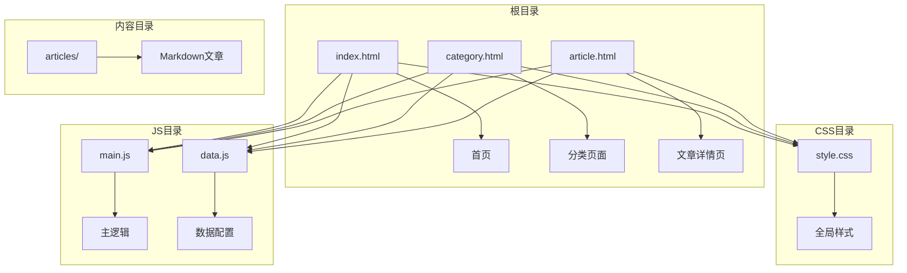
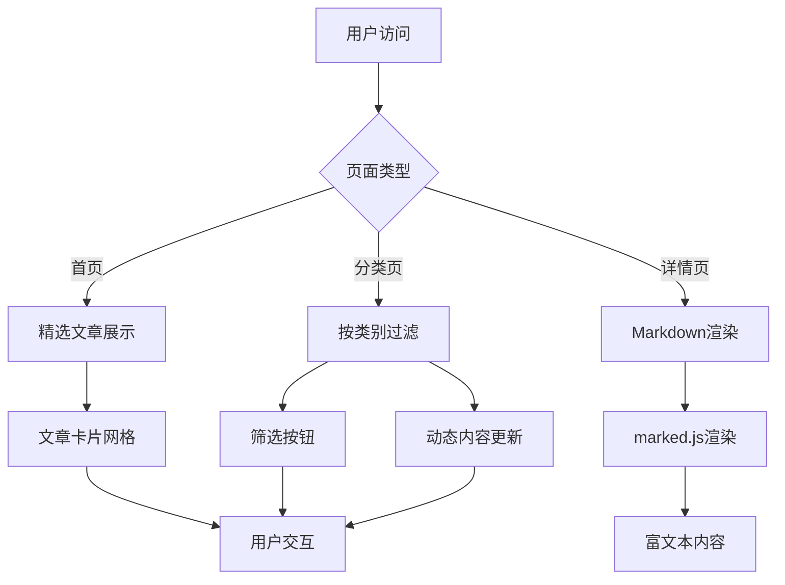
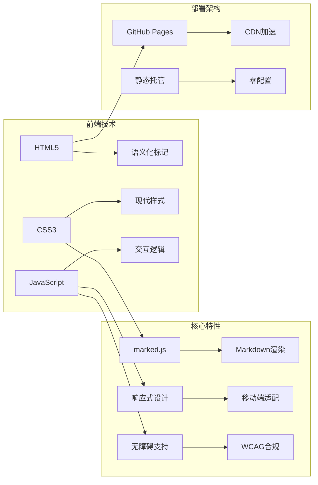
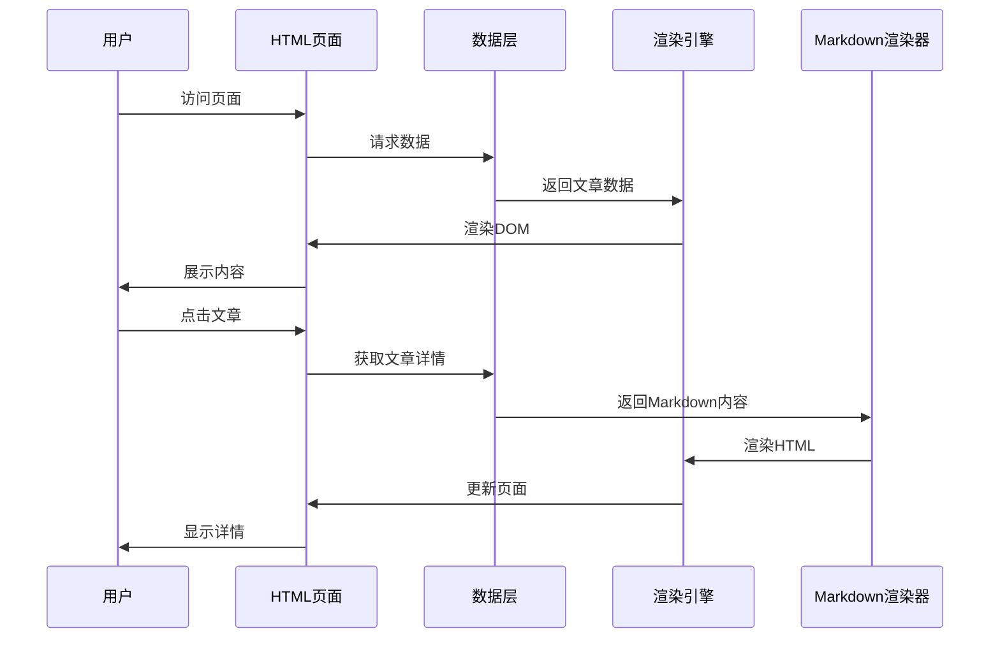
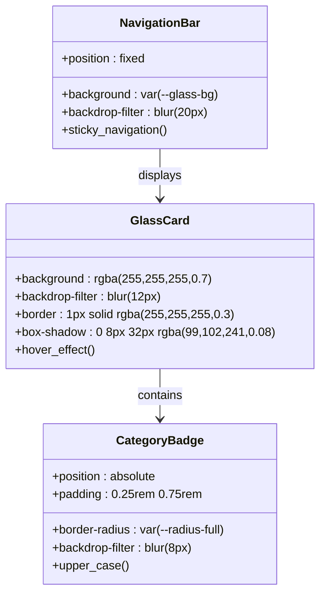
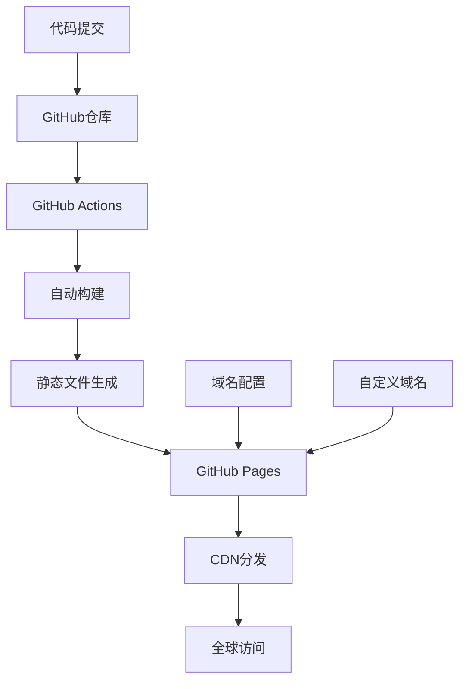
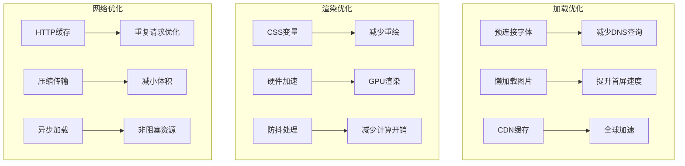
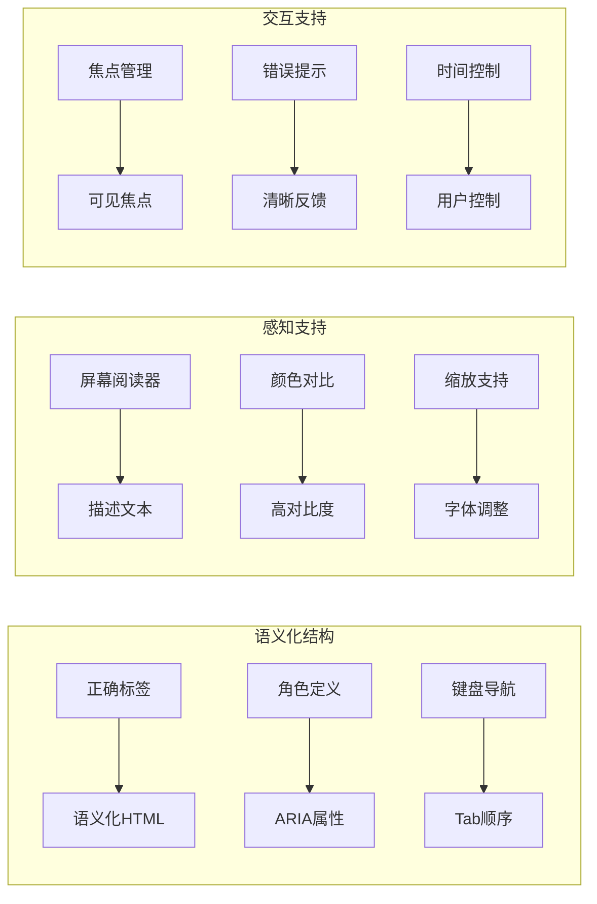
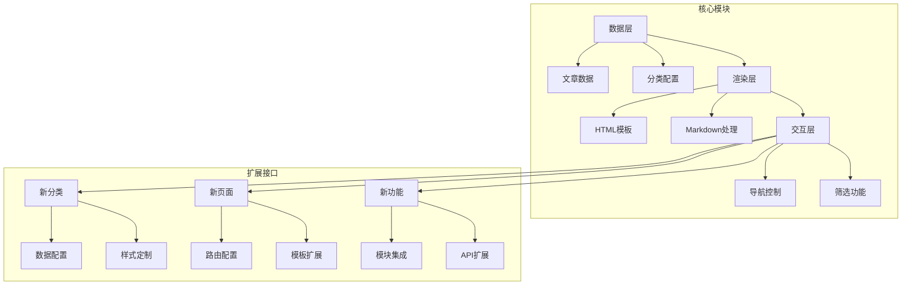

# 项目概述

<cite>
**本文档引用的文件**
- [index.html](file://index.html)
- [category.html](file://category.html)
- [article.html](file://article.html)
- [style.css](file://css/style.css)
- [main.js](file://js/main.js)
- [data.js](file://js/data.js)
- [README.md](file://README.md)
- [CLAUDE.md](file://CLAUDE.md)
- [article-4.md](file://content/articles/article-4.md)
</cite>

## 目录
1. [简介](#简介)
2. [项目结构](#项目结构)
3. [核心功能](#核心功能)
4. [技术架构](#技术架构)
5. [设计特色](#设计特色)
6. [部署方式](#部署方式)
7. [性能优化](#性能优化)
8. [无障碍访问](#无障碍访问)
9. [扩展性考虑](#扩展性考虑)
10. [总结](#总结)

## 简介

Hot-Site是一个基于GitHub Pages的静态博客平台，专注于技术、AI、游戏、音乐与艺术五大领域的文章分享。该项目采用现代化设计理念，结合响应式设计、无障碍访问和玻璃拟态视觉效果，为用户提供优质的阅读体验。

### 项目目标

- **内容聚合**：为技术、AI、游戏、音乐与艺术爱好者提供高质量内容聚合平台
- **现代化体验**：通过先进的Web技术栈提供流畅的用户体验
- **易于维护**：采用静态站点生成方式，降低维护成本
- **全球可达**：利用GitHub Pages的CDN优势，确保全球用户访问速度

## 项目结构

项目采用简洁而清晰的文件组织结构，遵循静态网站的最佳实践：

**图表来源**
- [index.html:1-190](file://index.html#L1-L190)
- [category.html:1-103](file://category.html#L1-L103)
- [article.html:1-107](file://article.html#L1-L107)

### 文件组织说明

- **HTML页面**：三个核心页面分别处理不同的内容展示需求
- **CSS样式**：单一的样式文件管理所有视觉效果
- **JavaScript模块**：分离的数据配置和业务逻辑
- **内容存储**：Markdown格式的文章内容

**章节来源**
- [README.md:26-47](file://README.md#L26-L47)

## 核心功能

### 内容管理系统

Hot-Site实现了完整的静态博客功能，包括文章展示、分类管理和搜索功能：

**图表来源**
- [main.js:148-177](file://js/main.js#L148-L177)
- [main.js:220-243](file://js/main.js#L220-L243)

### 文章展示机制

系统采用响应式网格布局展示文章内容，支持多种设备访问：

- **首页**：展示精选文章，采用瀑布流布局
- **分类页**：按主题分类展示文章，支持实时筛选
- **详情页**：Markdown内容渲染，支持图片缩放

**章节来源**
- [main.js:81-146](file://js/main.js#L81-L146)
- [data.js:40-113](file://js/data.js#L40-L113)

## 技术架构

### 前端技术栈

Hot-Site采用了极简但高效的技术组合：

**图表来源**
- [README.md:149-152](file://README.md#L149-L152)
- [CLAUDE.md:13-23](file://CLAUDE.md#L13-L23)

### 数据流架构

系统采用单向数据流设计，确保数据的一致性和可预测性：

**图表来源**
- [main.js:436-460](file://js/main.js#L436-L460)
- [data.js:115-136](file://js/data.js#L115-L136)

**章节来源**
- [main.js:6-11](file://js/main.js#L6-L11)
- [data.js:6-37](file://js/data.js#L6-L37)

## 设计特色

### 玻璃拟态设计

Hot-Site采用了创新的玻璃拟态设计风格，营造出轻盈透明的视觉效果：

**图表来源**
- [style.css:438-455](file://css/style.css#L438-L455)
- [style.css:475-486](file://css/style.css#L475-L486)
- [style.css:148-165](file://css/style.css#L148-L165)

### 响应式设计

系统实现了完整的响应式设计，适配从手机到桌面的各种设备：

- **移动端优先**：针对小屏幕设备优化
- **弹性布局**：使用CSS Grid和Flexbox
- **断点设计**：768px和480px两个主要断点
- **触摸友好**：合理的点击区域和手势支持

**章节来源**
- [style.css:1029-1106](file://css/style.css#L1029-L1106)

## 部署方式

### GitHub Pages集成

Hot-Site专为GitHub Pages优化，实现了零配置部署：

**图表来源**
- [CLAUDE.md:35-39](file://CLAUDE.md#L35-L39)
- [README.md:77-96](file://README.md#L77-L96)

### 部署流程

1. **代码推送**：将项目推送到GitHub仓库的main分支
2. **Pages启用**：在仓库设置中启用GitHub Pages功能
3. **源码配置**：选择main分支和根目录作为源码
4. **等待构建**：GitHub自动构建并部署
5. **访问验证**：通过`https://username.github.io/repository/`访问

**章节来源**
- [CLAUDE.md:11](file://CLAUDE.md#L11)
- [README.md:77-96](file://README.md#L77-L96)

## 性能优化

### 静态资源优化

Hot-Site在性能方面采用了多项优化策略：

**图表来源**
- [index.html:21-24](file://index.html#L21-L24)
- [main.js:28-39](file://js/main.js#L28-L39)

### 关键优化措施

- **字体预加载**：使用`preconnect`减少字体加载延迟
- **图片懒加载**：`loading="lazy"`属性优化滚动性能
- **CSS变量缓存**：统一的颜色和尺寸管理
- **防抖处理**：滚动事件防抖减少重绘次数
- **CDN加速**：利用GitHub Pages的全球CDN网络

**章节来源**
- [main.js:28-39](file://js/main.js#L28-L39)
- [style.css:8-78](file://css/style.css#L8-L78)

## 无障碍访问

### WCAG 2.1 AA合规

Hot-Site严格遵循无障碍访问标准，确保所有用户都能享受内容：

**图表来源**
- [index.html:31-51](file://index.html#L31-L51)
- [article.html:29-51](file://article.html#L29-L51)

### 无障碍特性实现

- **语义化HTML**：使用正确的HTML标签和结构
- **ARIA支持**：为交互元素添加适当的ARIA属性
- **键盘导航**：完整的键盘操作支持
- **屏幕阅读器**：优化的屏幕阅读器兼容性
- **颜色对比**：符合WCAG 2.1 AA标准的颜色对比度

**章节来源**
- [README.md:13](file://README.md#L13)
- [index.html:31-51](file://index.html#L31-L51)

## 扩展性考虑

### 模块化设计

Hot-Site采用了高度模块化的架构，便于功能扩展和维护：

**图表来源**
- [data.js:6-37](file://js/data.js#L6-L37)
- [main.js:436-460](file://js/main.js#L436-L460)

### 可扩展性特性

- **分类系统**：支持动态添加新的内容分类
- **主题系统**：CSS变量驱动的主题定制
- **内容管理**：Markdown格式的易用内容编辑
- **插件架构**：预留的扩展点和钩子
- **国际化支持**：多语言内容的扩展基础

**章节来源**
- [CLAUDE.md:40-46](file://CLAUDE.md#L40-L46)
- [data.js:6-37](file://js/data.js#L6-L37)

## 总结

Hot-Site静态博客项目展现了现代Web开发的最佳实践，通过精心设计的技术架构和用户体验，在GitHub Pages平台上实现了高性能、易维护、可扩展的内容发布解决方案。

### 核心优势

1. **技术先进性**：采用最新的Web标准和最佳实践
2. **用户体验优秀**：响应式设计、无障碍访问、流畅交互
3. **部署简单**：零配置、零成本的GitHub Pages部署
4. **维护成本低**：静态内容、模块化架构、清晰的扩展机制
5. **性能优异**：CDN加速、资源优化、加载性能

### 适用场景

- 个人技术博客
- 专业内容聚合平台
- 企业技术分享网站
- 教育资源展示平台
- 创意作品集展示

Hot-Site为开发者提供了一个开箱即用的现代化静态博客解决方案，既适合初学者快速上手，也为有经验的开发者提供了充分的定制和扩展空间。